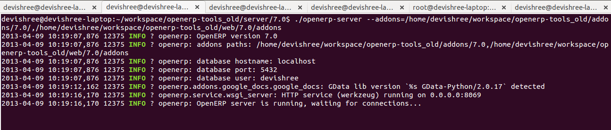
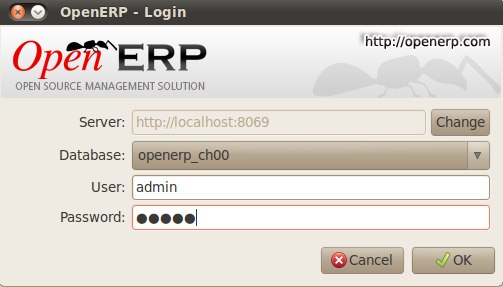
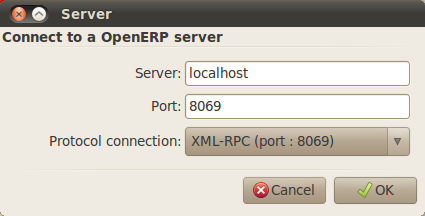
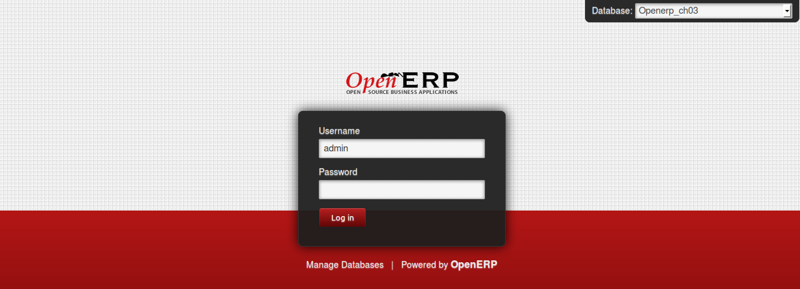

The installation of Open ERP
============================

Whether you're from a small company investigating how Open ERP works, or on the IT staff of a
larger organization and have been asked to assess Open ERP's capabilities, your first requirement
is to install it or to find a working installation.

The table below summarizes the various installation methods that will be described in the following
sections.

.. csv-table:: Comparison of the different methods of installation on Windows or Linux
   :header: "Method","Average Time","Level of Complexity","Notes"
   :widths: 20,15,15,30

   "All-in-one Windows Installer","A few minutes","Simple","Very useful for quick evaluations because it installs all of the components pre-configured on one computer (using the GTK client)."
   "Independent installation on Windows","Half an hour","Medium","Enables you to install the components on different computers. Can be put into production use."
   "Ubuntu Linux packages","A few minutes","Simple","Simple and quick but the Ubuntu packages aren't always up to date."
   "From source, for all Linux systems","More than half an hour","Medium to slightly difficult","This is the method recommended for production environments because it's easy to keep it up to date."

Each time a new release of Open ERP is made, Tiny supplies a complete Windows auto-installer for
it. This contains all of the components you need – the PostgreSQL database server, the Open ERP
application server and the GTK application client.

This auto-installer enables you to install the whole system in just a few mouse-clicks. The initial
configuration is set up during installation, making it possible to start using it very quickly as
long as you don't want to change the underlying code. It's aimed at the installation of everything
on a single PC, but you can later connect GTK clients from other PCs, Macs and Linux boxes to it as
well.

The first step is to download the Open ERP installer. At this stage you must choose which version
to install – the stable version or the development version. If you're planning to put it straight
into production you're strongly advised to choose the stable version.

.. index::
   single: stable versions

.. note::  Stable versions and development versions

	Open ERP development proceeds on two parallel tracks: stable versions and development versions.

	New functionality is integrated into the development branch. This branch is more advanced than the
	stable branch, but it can contain undiscovered and unfixed faults. A new development release is
	made every month or so, and Tiny have made the code repository available so you can download the
	very latest revisions if you want.

	The stable branch is designed for production environments. Releases of new functionality there are
	made only about once a year after a long period of testing and validation. Only fault fixes are
	released through the year on the stable branch.

.. index::
   single: installation; Windows (all-in-one)

To download the version of Open ERP for Windows, follow these steps:

#. Navigate to the site http://openerp.com.

#. Click :menuselection:`Downloads` on the menu at the left then, under :guilabel:`Windows Installers`,
   :menuselection:`All in One`.

#. This brings up the demonstration version Windows installer, 
   currently :program:`openerp-allinone-setup-5.0.0-3`.

#. Save the file on your PC - it's quite a substantial size because it downloads everything including
   the PostgreSQL database system, so will take some time.

.. index::
   single:  installation; administrator

To install Open ERP and its database you must be signed in as an Administrator on your PC. Double-
click the installer file to install it and accept the default parameters on each dialog box as you go. 

If you had previously tried to install the all-in-one version of Open ERP, you have to uninstall
that first because various elements of a previous installation could interfere with your new installation.
Make sure that all Tiny ERP, Open ERP and PostgreSQL applications are removed:
you're likely to have to restart your PC to finish removing all traces of them.

The Open ERP client can be opened, ready to use the Open ERP system, once you have completed 
the all--in-one installation. The next step consists
of setting up the database, and is covered in the final section of this chapter :ref:`sect-creatingdb`.

.. index::
   single: installation; Windows (independent)

Independent installation on Windows
-----------------------------------

System administrators can have very good reasons for wanting to install the various components of a
Windows installation separately. For example, your company may not support the version of PostgreSQL
or Python that's installed automatically, or you may already have PostgreSQL installed on the server
you're using, or you may want to install the database server, application server and web server on
separate hardware units.

For this situation you can get separate installers for the Open ERP server and client from the same
location as the all-in-one auto-installer. You'll also have to download and install a suitable
version of PostgreSQL independently.

You must install PostgreSQL before the Open ERP server, and you must also set it up with a user
and password so that the Open ERP server can connect to it. Tiny's web-based documentation gives
full and current details.

Connecting users on other PCs to the Open ERP server
^^^^^^^^^^^^^^^^^^^^^^^^^^^^^^^^^^^^^^^^^^^^^^^^^^^^

To connect other computers to the Open ERP server you must set the server up so that it's
visible to the other PCs, and install a GTK client on each of the those PCs:

#. Make your Open ERP server visible to other PCs by opening the Windows Firewall in the Control
   Panel, then asking the firewall to make an exception of the Open ERP server. In the
   :guilabel:`Exceptions` tab of Windows Firewall click on :guilabel:`Add a program...` and choose
   :guilabel:`Open ERP Server` in the list provided. This step enables other computers to see the
   Open ERP application on this server.

#. Install the Open ERP client (:program:`openerp-client-5.X.exe`), which you can download in the
   same way as you downloaded the other Open ERP software, onto the other PCs.

.. tip:: Version matching

	You must make sure that the version of the client matches that of the server. The version number is
	given as part of the name of the downloaded file. Although it's possible that some different
	revisions of client and server will function together, there's no certainty about that.

.. index::
   single:  administrator

To run the client installer on every other PC you'll need to have administrator rights there. The
installation is automated, so you just need to guide it through its different installation steps.

To test your installation, start by connecting through the Open ERP client on the server machine
while you're still logged in as administrator.

.. note:: Why sign in as a PC Administrator?

	You'd not usually be signed on as a PC administrator when you're just running the Open ERP client,
	but if there have been problems in the installation it's easier to remain as an administrator after
	the installation so that you can make any necessary fixes than to switch user as you alternate
	between roles as a tester and a software installer.

Start the GTK client on the server through the Windows Start menu there. The main client window
appears, identifying the server you're connected to (which is \ ``localhost``\   – your own server
PC – by default). If the message :guilabel:`No database found, you must create one` appears then
you've **successfully connected** to an Open ERP server containing, as yet, no databases.

.. figure:: images/new_login_dlg.png
   :align: center
   :scale: 75

   *Dialog box on connecting a GTK client to a new Open ERP server*

.. index::
   single: protocol; XML-RPC
   single: protocol; NET-RPC
   single: XML-RPC
   single: NET-RPC

.. note:: Connection modes

	In its default configuration at the time of writing, 
	the Open ERP client connects to port 8069 on the server using the
	XML-RPC protocol (from Linux) or port 8070 using the NET-RPC protocol instead (from Windows).
	You can use either protocol from either operating system.
	NET-RPC is quite a bit quicker, although you may not notice that on the GTK client in normal use.
	Open ERP can run XML-RPC, but not NET-RPC, as a secure connection.
	
The all-in-one installer also provides a web server, but this was not yet working at the time
of writing.

Resolving errors with a Windows installation
^^^^^^^^^^^^^^^^^^^^^^^^^^^^^^^^^^^^^^^^^^^^

If you can't get Open ERP to work after installing your Windows system you'll find some ideas for
resolving this below:

#. Is the Open ERP application working? Signed in to the server as an administrator, stop and
   restart the service using :guilabel:`Stop Service` and :guilabel:`Start Service` from the menu
   :menuselection:`Start --> Programs --> OpenERP Server` .

#. Is the Open ERP application server set up correctly? Signed in to the server as
   Administrator, open the file \ ``openerp-server.conf``\  in \
   ``C:\Program Files\OpenERP AllInOne``\  and check its content. This file is generated during
   installation with information derived from the database. If you see something strange it's best to
   entirely reinstall the server from the demonstration installer rather than try to work out what's
   happening.

	.. figure:: images/terp_server_conf.png
	   :align: center
	   :scale: 80
	          
	   *Typical Open ERP configuration file*

#. Is your PostgreSQL server running? Signed in as administrator, select :guilabel:`Stop Service`
   from the menu :menuselection:`Start --> Programs --> PostgreSQL`.  If, after a couple of seconds,
   you can read :guilabel:`The PostgreSQL4OpenERP service has stopped` then you can be reasonably sure
   that the database server was working. Restart PostgreSQL.
	   
#. Does PostgreSQL work at all? Still in the PostgreSQL menu, start
   the pgAdmin III application which you can use to explore the database. Double-click on the \
   ``PostgreSQL4OpenERP``\  connection. 
   You can find the password in the Open ERP server configuration file.
   If the database server is working
   you'll be able to see some information about the empty database. If it's not then an error message
   will appear.

#. Are your client programs correctly installed? If your Open ERP GTK clients haven't started then
   the swiftest approach is to reinstall them.

#. Can remote client computers see the server computer at all? Check this by opening a command prompt
   window (enter \ ``cmd``\  in the window :menuselection:`Start --> Run...` ) and enter \ ``ping
   <address of server>``\  there (where \ ``<address of server>``\  represents the IP address of the
   server). The server should respond with a reply. 

#. Have you changed any of the server's parameters? At this point in the installation the port
   number of the server must be 8069 using the protocol XML-RPC.

#. Is there anything else in the server's history that can help you identify the problem? Open the file
   \ ``openerp-server.log``\  in \ ``C:\Program Files\OpenERP AllInOne``\  
   (which you can only do when the server is stopped) and scan through the
   history for ideas. If something looks strange there, contributors to the Open ERP forums can often
   help identify the reason.

.. index::
   single: installation; Linux (Ubuntu)

Installation on Linux (Ubuntu)
------------------------------

This section guides you through installing the Open ERP server and client on Ubuntu, one of the
most popular Linux distributions. It assumes that you're using a recent release of Desktop Ubuntu
with its graphical user interface on a desktop or laptop PC.

.. note:: Other Linux distributions

	Installation on other distributions of Linux is fairly similar to installation on Ubuntu. Read this
	section of the book so that you understand the principles, then use the online documentation and
	the forums for your specific needs on another distribution.

For information about installation on other distributions, visit the documentation section by
following :menuselection:`Product --> Documentation` on http://www.openerp.com. Detailed instructions
are given there for different distributions and releases, and you should also check if there are
more up to date instructions for the Ubuntu distribution as well.

Installation of Open ERP from packages
^^^^^^^^^^^^^^^^^^^^^^^^^^^^^^^^^^^^^^

At the time of writing this book, Ubuntu hadn't yet published packages for Open ERP, so this
section describes the installation of version 4.2 of Tiny ERP. This is very similar to Open ERP and
so can be used to test the software.

Here's a summary of the procedure:

#. Start Synaptic Package Manager, and enter your root password as required.

#. Check that the repositories \ ``main``\   \ ``universe``\  and \ ``restricted``\  are enabled.

#. Search for a recent version of PostgreSQL, for example \ ``postgresql-8.3``\ then select it for
   installation along with its dependencies.

#. Search for \ ``tinyerp``\  then select \ ``tinyerp-client``\  and \ ``tinyerp-server``\  for
   installation along with their dependencies. Click :guilabel:`Update Now` to install it all.

#. Close Synaptic Package Manager.

Installing PostgreSQL results in a database server that runs and restarts automatically when the PC
is turned on. If all goes as it should with the tinyerp-server package then tinyerp-server will also
install, and restart automatically when the PC is switched on.

Start the Tiny/Open ERP GTK client by clicking its icon in the :menuselection:`Applications`  menu,
or by opening a terminal window and typing \ ``tinyerp-client``\  . The Open ERP login dialog box
should open and show the message :guilabel:`No database found you must create one!`.

Although this installation method is simple and therefore an attractive option, it's better to
install Open ERP using a version downloaded from http://openerp.com. The downloaded revision is
likely to be far more up to date than that available from a Linux distribution.

.. note:: Package versions

	Maintaining packages is a process of development, testing and publication that takes time. The
	releases in Open ERP (or Tiny ERP) packages are therefore not always the latest available. Check
	the version number from the information on the website before installing a package. If only the
	third digit group differs (for example 5.0.1 instead of 5.0.2) then you may decide to install it because
	the differences may be minor – fault fixes rather than functionality changes between the package
	and the latest version.

Manual installation of the Open ERP server
^^^^^^^^^^^^^^^^^^^^^^^^^^^^^^^^^^^^^^^^^^

In this section you'll see how to install Open ERP by downloading it from the site
http://openerp.com, and how to install the libraries and packages that Open ERP depends on, onto a
desktop version of Ubuntu. Here's a summary of the procedure:

#. Navigate to the page http://openerp.com with your web browser,

#. Click :menuselection:`Downloads` on the left menu,

#. Download the client and server files from the *Sources (Linux)* section into your home directory
   (or some other location if you've defined a different download area).

To download the PostgreSQL database and all of the other dependencies for Open ERP from packages:

#. Start Synaptic Package Manager, and enter the root password as required.

#. Check that the repositories \ ``main``\   \ ``universe``\  and \ ``restricted``\  are enabled.

#. Search for a recent version of PostgreSQL (such as \ ``postgresql-8.3``\   then select it for
   installation along with its dependencies.

#. Select all of Open ERP's dependences, an up-to-date list of which should be
   found in the installation documents on Tiny's website,
   then click :guilabel:`Update Now` to install them.

.. index::
   single: Python

.. note::  Python programming language

	Python is the programming language that's been used to develop Open ERP. It's a dynamic, non-typed
	language that is object-oriented, procedural and functional. It comes with numerous libraries that
	provide interfaces to other languages and has the great advantage that it can be learnt in only a
	few days. It's the language of choice for large parts of NASA's, Google's and many other
	enterprises' code.

	For more information on Python, explore http://www.python.org.

Once all these dependencies and the database are installed, install the server itself using the
instructions on the website.

Open a terminal window to start the server with the command \ ``sudo -i -u postgres 
openerp-server``\  , which should result in a series of log messages as the server starts up. If the server
is correctly installed, the message :guilabel:`[...] waiting for connections...` should show within 30
seconds or so, which indicates that the server is waiting for a client to connect to it.

   
   *Open ERP startup log in the console*

.. index::
   single: client; GTK
   single: installation; GTK client

Manual installation of Open ERP GTK clients
^^^^^^^^^^^^^^^^^^^^^^^^^^^^^^^^^^^^^^^^^^^

To install an Open ERP GTK client, follow the steps outline on the website installation document for
your particular operating system.

.. tip:: Survey: Don't Cancel!

	When you start the GTK client for the first time, a dialog box appears asking for various details
	that are intended to help the Tiny company assess the prospective user base for its software.

	If you click the :guilabel:`Cancel` button, the window goes away – but Open ERP will ask the
	same questions again next time you start the client. It's best to click :guilabel:`OK`, even if you
	choose to enter no data, to prevent that window reappearing next time.

   
   *Open ERP client at startup*

Open a terminal window to start the client using the command openerp-client. When you start the
client on the same Linux PC as the server you'll find that the default connection parameters will
just work without needing any change. The message :guilabel:`No database found, you must create
one!`  shows you that the connection to the server has been successful and you need to create a
database on the server.

Creating the database
^^^^^^^^^^^^^^^^^^^^^

You can connect other GTK clients over the network to your Linux server. Before you leave your
server, make sure you know its network address – either by its name (such as \
``mycomputer.mycompany.net``\  ) or its IP address (such as \ ``192.168.0.123``\  ).

.. index::
   single: port (network)

.. note:: Different networks

	Communications between an Open ERP client and server are based on standard protocols. You can
	connect Windows clients to a Linux server, or vice versa, without problems. It's the same for Mac
	versions of Open ERP – you can connect Windows and Linux clients and servers to them.

To install an Open ERP client on a computer under Linux, repeat the procedure shown earlier in this
section. You can connect different clients to the Open ERP server by modifying the connection
parameters on each client. To do that, click the :guilabel:`Change` button on the connection dialog
and set the following field as needed:

*  :guilabel:`Server` : \ ``name``\   or  \ ``IP address``\   of the server over the network,

*  :guilabel:`Port` : the port, whose default is \ ``8069``\   or  \ ``8070``\ ,

*  :guilabel:`Connection protocol` : \ ``XML-RPC``\   or  \ ``NET-RPC``\  .

   *Dialog box for defining connection parameters to the server*

It's possible to connect the server to the client using a secure protocol to prevent other network
users from listening in, but the installation described here is for direct unencrypted connection.

If your Linux server is protected by a firewall you'll have to provide access to port 
 \ ``8069``\ or \ ``8070``\ for users on other computers with Open ERP GTK clients.

.. index::
   single: installation; eTiny web server
   single: installation; Open ERP client-web server

Installation of an Open ERP web server
^^^^^^^^^^^^^^^^^^^^^^^^^^^^^^^^^^^^^^

Just as you installed a GTK client on a Linux server, you can also install the Open ERP client-web
server.
You can install it from sources after installing its dependencies from packages as you did
with the Open ERP server,
but Tiny have provided a simpler way to do this for eTiny – using a system known as ez_setup.

Before proceeding, confirm that your Open ERP installation is functioning correctly with a GTK
client.
If it's not you'll need to go back now and fix it, because you need to be able to use it fully for
the next stages.

To install client-web follow the up-to-date instructions in the installation document on the website.

.. note:: Ez tool

	Ez is the packaging system used by Python. It enables the installation of programs as required just
	like the packages used by a Linux distribution. The software is downloaded across the network and
	installed on your computer by ez_install.

	:program:`ez_setup` is a small program that installs ez_install automatically.

The Open ERP Web server connects to the Open ERP server in the same way as an Open ERP client
using the NET-RPC protocol. Its default setup corresponds to that of the Open ERP server
you've just installed, so should connect directly at startup.

#.	At the same console as you've just been using, go to the Openerp web directory by typing
	:command:`cd openerp-web-5.X`.

#. At a terminal window type :command:`start-openerp-web` to start the Open ERP Web server.

.. _fig-webwel:

   *Open ERP web client at startup*
   
You can verify the installation by opening a web browser on the server and navigating to
http://localhost:8080 to connect to eTiny as shown in the figure :ref:`fig-webwel`. 
You can also test this from
another computer connected to the same network if you know the name or IP address of the server over
the network – your browser should be set to http://<server_address>:8080 for this.

Verifying your Linux installation
^^^^^^^^^^^^^^^^^^^^^^^^^^^^^^^^^

.. index::
   single: pgAdmin III

You've used default parameters so far during the installation of the various components.
If you've had problems, or you just want to set this up differently,
the following points provide some indicators about how you can set your installation up.

.. tip:: **psql** and **pgAdmin** tools

	psql is a simple client, executed from the command line, that's delivered with PostgreSQL. It
	enables you to execute SQL commands on your Open ERP database.

	If you prefer a graphical utility to manipulate your database directly you can install pgAdmin III
	(it is commonly installed automatically with PostgreSQL on a windowing system, but can also be
	found at \ ``http://www.pgadmin.org/`` \ ).

#.	The PostgreSQL database starts automatically and listens locally on port 5432 as standard: check
	this by entering \ ``sudo netstat -anpt``\  at a terminal to see if port 5432 is visible there.

#.	The database system has a default role of \ ``postgres``\   accessible by running under the Linux
	postgres user: check this by entering \ ``sudo su postgres -c psql``\  at a terminal to see the psql
	startup message – then type \ ``\q``\  to quit the program.

#.	Start the Open ERP server from the postgres user (which enables it to access the PostgreSQL
	database) by typing \ ``sudo su postgres -c tinyerp-server.``\

#.	If you try to start the Open ERP server from a terminal but get the message ``socket.error: (98,
	'Address already in use')`` then you might be trying to start Open ERP while an instance of
	Open ERP is already running and using the sockets that you've defined (by default 8069 and 8070).
	If that's a surprise to you then you may be coming up against a previous installation of Open ERP
	or Tiny ERP, or something else using one or both of those ports. 
	
	Type \ ``sudo netstat -anpt``\  to
	discover what is running there, and record the PID. You can check that the PID orresponds to a
	program you can dispense with by typing \ ``ps aux | grep <PID>``\   and you can then stop the
	program from running by typing \ ``sudo kill <PID>``\ .  You need additional measures to stop it from
	restarting when you restart the server.

#.	The Open ERP server has a large number of configuration options. You can see what they are by
	starting the server with the argument \ ``–help``\   By efault the server configuration is stored
	in the file \ ``.terp_serverrc``\  in the user's home directory (and for the postgres user that
	directory is \ ``/var/lib/postgresql``\  .

#.	You can delete the configuration file to be quite sure that the Open ERP server is starting with
	just the default options. It is quite common for an upgraded system to behave badly because a new
	version server cannot work with options from a previous version. When the server starts without a
	configuration file it will write a new one once there is something non-default to write to it – it
	will operate using defaults until then.

#.	To verify that the system works, without becoming entangled in firewall problems, you can start
	the Open ERP client from a second terminal window on the server computer (which doesn't pass
	through the firewall). Connect using the XML-RPC protocol on port 8069 or NET-RPC on port 8070. The
	server can use both ports simultaneously. The window displays the log file when the client is
	started this way.

#.	The client setup is stored in the file \ ``.terprc``\  in the user's home directory.
	Since a GTK client can be started by any user, each user would have their setup defined in a
	configuration file in their own home directory.

#.	You can delete the configuration file to be quite sure that the Open ERP client is starting with
	just the default options. When the client starts without a configuration file it will write a new
	one for itself.

#.	The web server uses the NET-RPC protocol. If a GTK client works but the web server doesn't then the
	problem is either with the NET-RPC port or with the web server itself, and not with the Open ERP server.

.. 	hint:: One server for several companies

	You can start several Open ERP application servers on one physical computer server by using
	different ports. If you have defined multiple database roles in PostgreSQL, each connected through
	an Open ERP instance to a different port, you can simultaneously serve many companies from one
	physical server at one time.

.. Copyright © Open Object Press. All rights reserved.

.. You may take electronic copy of this publication and distribute it if you don't
.. change the content. You can also print a copy to be read by yourself only.

.. We have contracts with different publishers in different countries to sell and
.. distribute paper or electronic based versions of this book (translated or not)
.. in bookstores. This helps to distribute and promote the Open ERP product. It
.. also helps us to create incentives to pay contributors and authors using author
.. rights of these sales.

.. Due to this, grants to translate, modify or sell this book are strictly
.. forbidden, unless Tiny SPRL (representing Open Object Press) gives you a
.. written authorisation for this.

.. Many of the designations used by manufacturers and suppliers to distinguish their
.. products are claimed as trademarks. Where those designations appear in this book,
.. and Open Object Press was aware of a trademark claim, the designations have been
.. printed in initial capitals.

.. While every precaution has been taken in the preparation of this book, the publisher
.. and the authors assume no responsibility for errors or omissions, or for damages
.. resulting from the use of the information contained herein.

.. Published by Open Object Press, Grand Rosière, Belgium

