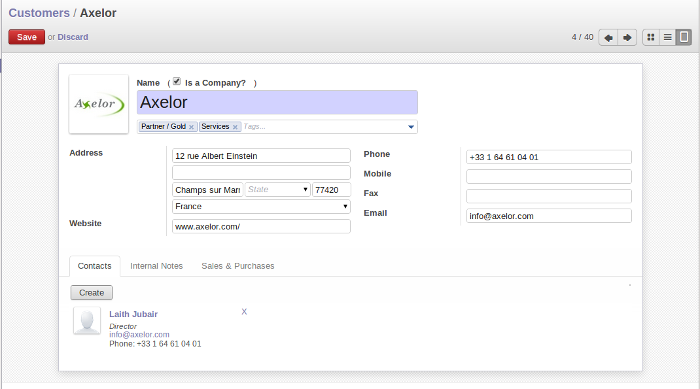

To Connect to OpenERP
=====================

Since this is the first time you have connected to OpenERP, you will be given the opportunity
to select openERP's featured application

You first screen show you different Apllications of openerp you can install any from it as per your requirement.
Hardly anything is installed, so this is a very simple process at the moment.

.. index::
   single:  administrator

Once you are displaying the main menu, you are able to see the following screen items, 
as shown in screenshot :ref:`fig-oech2-main`:

* The name of current user,

* the :guilabel:`Preferences` toolbar to the top right, showing the links to the :guilabel:`Change password` page,
  :guilabel:`Receiving Email from` for system, :guilabel:`EDIT PREFERENCES` page, :guilabel:`About OpenERP`, :guilabel:`Help`
  and :guilabel:`Logout` button,

* a collection of interesting and useful widgets are available on the left of the main page.

.. _fig-oech2-main:

   *The Main Menu of the openerp_ch02 database*

.. index::
   single: Preferences

Preferences Toolbar
-------------------

When you are connected to OpenERP, the topmost toolbar indicates which user you are connected as.
So it should currently be showing :guilabel:`Administrator` (unless you logged in as another
user and it is reflecting the name of that user instead).

You will find the Preferences  when you click on current user name, its containing a set of useful links.
First, you will find a field to the :guilabel:`Receive Messages by Email` page.

.. index::
   single: timezone

.. tip::  Multi-nationals and Time Zones

	If you have users in different countries, they can configure their own timezone. Timestamp displays
	are then adjusted by reference to the user's own localization setting.

	So if you have a team in India and a team in England, the times will automatically be converted. If
	an Indian employee sets her working hours from 9 to 6, that will be converted and saved in the
	server's timezone. When the English users want to set up a meeting with an Indian user, the Indian
	user's available time will be converted to English time.

The :guilabel:`Compose new Message` Icon is found beside the :guilabel:`User name` link. It is only visible if you are logged into
a database. You can click on that and compose a new mail at any time.

The next element in the toolbar is a link to :guilabel:`Timezone mismatch`. By clicking that Icon, you
get a dialog box where you find a link which forward on preference changes.

* The :guilabel:`Interface` field in the :guilabel:`Current Activity` tab allows the user to switch
  between the \ ``Simplified`` \ and \ ``Extended`` \ interfaces.

* The :guilabel:`Language` field enables the user's working language to be changed. But first, the
  system must be loaded with other languages for the user to be able to choose an alternative, which
  is described in the next subsection of this chapter. This is a mandatory field.

* The :guilabel:`Timezone` setting indicates the user's location to OpenERP. This can be different
  from that of the server. All of the dates in the system are converted to the user's timezone
  automatically.

* The :guilabel:`Menu Tips` checkbox gives the user the choice to have tips displayed on each menu action.

* The :guilabel:`Change Password` button gives users the opportunity to change their own password.
  It opens a new dialog box where users may change the password and must logout and login again after the change.
  You should take steps (perhaps written policies) to prevent users making these too trivial.

* The :guilabel:`Email` field is for storing the current user's default e-mail address.

* The :guilabel:`Signature` field gives the user a place for the signature attached to messages sent
  from within OpenERP. 

The :guilabel:`ABOUT` link gives information about the development of the OpenERP software and 
various links to other information.

The :guilabel:`HELP` link directs the user to the online documentation of OpenERP, where extensive help is available on a host of topics.

The :guilabel:`LOGOUT` link enables you to logout and return to the original login page. You can
then login to another database, or to the same database as another user. This page also gives you
access to the super-administrator functions for managing databases on this server.

.. index::
   single: installation; language

Installing a New Language
^^^^^^^^^^^^^^^^^^^^^^^^^

Each user of the system can work in his or her own language. More than twenty languages are
currently available besides English. Users select their working language using the Preferences link.
You can also assign a language to a partner (customer or supplier), in which case all the documents
sent to that partner will be automatically translated into that language.

.. attention:: More about Languages

	The base version of OpenERP is translated into the following languages: English, German, Chinese,
	Spanish, Italian, Hungarian, Dutch, Portuguese, Romanian, Swedish and Czech.

	But other languages are also available: Arabic, Afghan,
	Austrian, Bulgarian, Indonesian, Finnish, Thai, Turkish and Vietnamese..

As administrator, you can install a new main working language into the system.

	#. Select :menuselection:`Settings` in the Menu Toolbar and click
	   :menuselection:`Translations --> Load a Translation` in the main menu window,

	#. Select the language to install, \ ``French``\  for example, and click :guilabel:`Load`,

	#. The system will intimate you when the selected language has been successfully installed.
	   Click :guilabel:`Close` to return to the menu.

To see the effects of this installation, change the preferences of your user to change the working
language (you may first need to ensure that you have explicitly selected English as your language,
rather than keep the default, before you are given the French option). 
You may have to reload the page to see the effects. The main menu is immediately translated in
the selected language.

.. index:: requests

Messaging as a Mechanism for Internal Communication
^^^^^^^^^^^^^^^^^^^^^^^^^^^^^^^^^^^^^^^^^^^^^^^^^^

* Facilitates conversations with internal users or external ones (customers, suppliers,...), joining the power of instant messaging with standard emails ;

* Organize groups of discussions, an alternative to traditional mailing lists ;

* Extends the breadth of these conversations to incorporate discussions around and about business documents ;

* Incorporates a subscription system to any business event, generating notifications ;

* Displays all the messages and notifications in a threaded manner on the user’s unified feeds page.

.. index::
   single: user; configuration

Configuring Users
-----------------

The database you created contains minimal functionality but can be extended to include all of the
potential functionality available to OpenERP. About the only functions actually available in this
minimal database are Customers and Currencies – and these only because the definition of your main
company required this. And because you chose to include demonstration data, both Customers and
Currencies were installed with some samples.

.. index::
   single: administrator

Because you logged in as Administrator, you have all the access you need to configure users. Click
:menuselection:`Settings --> Users --> Users` to display the list of users defined in the
system. A second user, \ ``Demo User`` \, is also present in the system as part of the
demonstration data. Click the \ ``Demo User`` \ name to open a non-editable form on that user.

Click the :guilabel:`Access Rights`  tab to see that the demo user is a member of only the ``Employee`` group,
and is subject to no specialized rules.
The user \ ``Administrator`` \ is different, as you can see if you
follow the same sequence to review its definition. It is a member of the \ ``Administration / Settings`` \
and the \ ``Administration / Access Rights`` \ groups,
which gives it more advanced rights to configure new users.

.. index:: 
   single: user; access
   single: user; role
   single: user; group

.. tip::  Groups and Users

	Users and groups provide the structure for specifying access rights to different documents. Their
	setup answers the question “Who has access to what?”

Click :menuselection:`Settings --> Users --> Groups` to open the list of
groups defined in the system. If you open the form view of the \ ``Administration / Settings`` \
group by clicking its name in the list, the first tab :guilabel:`Users` gives you the list of
all the users who belong to this group.

You can also see in the :guilabel:`Menus` tab, the list of menus reserved for this group. By convention,
the \ ``Administration / Settings`` \ in OpenERP has rights of access to
the :menuselection:`Configuration` menu in each section. So \ ``Sales / Configuration`` \ is
found in the list of access rights but \ ``Sales`` \ is not found there because it is accessible
to all users. Click the :guilabel:`Access Rights` tab and it gives you details of the access rights
for that group. These are detailed later in :ref:`ch-config`. 

You can create some new users to integrate them into the system. Assign them to predefined groups to
grant them certain access rights. Then try their access rights when you login as these users.
Management defines these access rights as described in :ref:`ch-config`.

.. note::  Changes to Default Access Rights

	New versions of OpenERP differ from earlier versions of OpenERP and Tiny ERP in this area:
	many groups have been predefined and access to many of the menus and objects are keyed to these
	groups by default.
	This is quite a contrast to the rather liberal approach in 4.2.2 and before, where access rights
	could be defined but were not activated by default.

.. index::
   single: partner; managing

Managing Partners
-----------------

In OpenERP, a partner represents an entity that you do business with. That can be a prospect, a
customer, a supplier, or even an employee of your company.

List of Partners
^^^^^^^^^^^^^^^^

Click :menuselection:`Sales --> Sales --> Customers` in the main menu to open the list of partners who are customers. Then click the name of the first partner to get hold of the details – a form appears with 
information about the company, such as its corporate name, its primary language, its reference and whether it is a
\ ``Customer`` \ and/or a \ ``Supplier`` \. You will also find several other tabs on it:

* The Customer form contains information about different contacts at that partner, postal information,
  communication information and the categories it belongs to.

* the :guilabel:`Sales & Purchases` tab contains information that is slightly less immediate.

* the :menuselection:`History` tab (visible if you install other modules like :mod:`crm`)
  contains the history of all the events that the partner has
  been involved in. These events are created automatically by different system documents: invoices,
  orders, support requests and so on, from a list that can be configured in the system. 
  These give you a rapid view of the partner's history on a single
  screen.

* the :menuselection:`Internal Notes` is an area for free text notes.

To the Top of the form There is a button name `More` is a list of Actions, Links and related to a partner. Click some of 
them to get a feel for their use.The print button contain the list of report and the Attachment button for attachment (Attachement button visible if you install modules :mod:`Document`).

   *Partner form*

.. index::
   single: partner; category

.. tip::  Partner Categories

	Partner Categories enable you to segment different partners according to their relation with you
	(client, prospect, supplier, and so on). A partner can belong to several categories – for example
	it may be both a customer and supplier at the same time.
	
	But there are also Customer and Supplier checkboxes on the partner form, which are different.
	These checkboxes are designed to enable OpenERP to quickly select what should appear on some of the
	system drop-down selection boxes. They, too, need to be set correctly.

Partner Categories
^^^^^^^^^^^^^^^^^^

You can list your partners by category or you can say by tags using the menu :menuselection:`Sales --> Configuration -->
Address Book --> Partners Tags`. Click a tag to obtain a list of partners in that category.

   *Categories of partner*

The administrator can define new categories. So you will create a new category and link it to a
partner:

	#. Use :menuselection:`Sales --> Configuration --> Address Book --> Partners Categories`
	   to reach the list of categories in a list view.

	#. Click :guilabel:`Create` to open an empty form for creating a new category

	#. Enter \ ``Gold``\  in the field :guilabel:`Name`. Then click on the
	   :guilabel:`Search` icon to the right of the :guilabel:`Parent Category` field and select 
	   \ ``Partner``\  in the list that appears.

	#. Then save your new category using the :guilabel:`Save` button.

You may add exiting partners to this new category in the :guilabel:`Partners` section.

.. tip:: Required Fields

	Fields colored blue are required. If you try to save the form while any of these fields are empty,
	the field turns red to indicate that there is a problem. It is impossible to save the form until
	you have completed every required field.

You can review your new category structure using the list view. 
You should see the new structure of \ ``Partner / Gold``\   there.

   *Creating a new partner category*

.. tip:: Searching for Documents

	If you need to search through a long list of partners, it is best to use the available search
	criteria rather than scroll through the whole partner list. It is a habit that will save you a lot of
	time in the long run as you search for all kinds of documents.

.. note::  Example Categories of Partners

	A partner can be assigned to several categories. These enable you to create alternativen classifications as necessary, usually in a hierarchical form.

	Here are some structures that are often used:

	* geographical locations,

	* interest in certain product lines,

	* subscriptions to newsletters,

	* type of industry.

.. Copyright © Open Object Press. All rights reserved.

.. You may take electronic copy of this publication and distribute it if you don't
.. change the content. You can also print a copy to be read by yourself only.

.. We have contracts with different publishers in different countries to sell and
.. distribute paper or electronic based versions of this book (translated or not)
.. in bookstores. This helps to distribute and promote the OpenERP product. It
.. also helps us to create incentives to pay contributors and authors using author
.. rights of these sales.

.. Due to this, grants to translate, modify or sell this book are strictly
.. forbidden, unless Tiny SPRL (representing Open Object Press) gives you a
.. written authorisation for this.

.. Many of the designations used by manufacturers and suppliers to distinguish their
.. products are claimed as trademarks. Where those designations appear in this book,
.. and Open Object Press was aware of a trademark claim, the designations have been
.. printed in initial capitals.

.. While every precaution has been taken in the preparation of this book, the publisher
.. and the authors assume no responsibility for errors or omissions, or for damages
.. resulting from the use of the information contained herein.

.. Published by Open Object Press, Grand Rosière, Belgium

