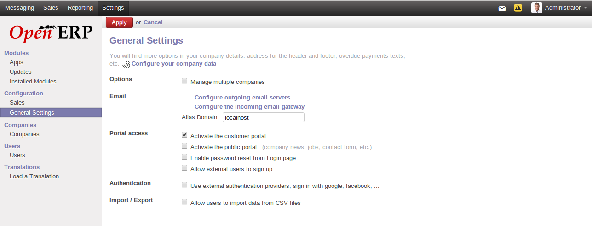
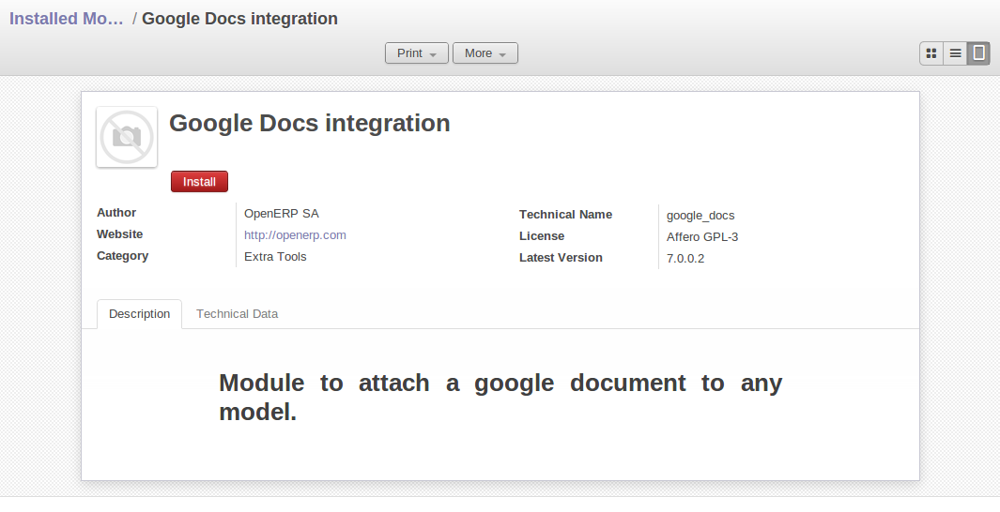

.. index::
  single: module; new functionality

Installing New Functionality
============================

All of OpenERP's functionality is contained in its many and various modules. Many of these, the
core modules, are automatically loaded during the initial installation of the system and can be
updated online later. Although they are mostly not installed in your database at the outset, they are
available on your computer for immediate installation. Additional modules can also be loaded online
from the official OpenERP site http://openerp.com. These modules are inactive when they are loaded
into the system, and can then be installed in a separate step.

You will start by checking if there are any updates available online that apply to your initial
installation. Then you will install a CRM module to complete your existing database.

.. index::
  single: module; upgrading

Updating the Modules list
-------------------------

Click :menuselection:`Settings --> Modules --> Update Modules List` to start the
updating tool. The :guilabel:`Module Update` window opens notifying the user that
OpenERP will look at the server side for adding new modules and updating
existing ones.

Click :guilabel:`Update` to start the update on the server side. When it is
complete, you will see a :guilabel:`Module update result` section indicating how many new modules were added
and how many existing modules were updated. Click :guilabel:`Open Modules` to return to the updated list.

.. note:: Modules

	All the modules available on your computer can be found in the addons directory of your OpenERP
	server. Each module there is represented by a directory carrying the name of the module or by a
	file with the module name and .zip appended to it. The file is in ZIP archive format and replicates
	the directory structure of unzipped modules.

.. index::
  single: module; installing

The Configuration
-----------------

One of the new features of OpenERP is the :guilabel:`Configuration`.
This provides an easy way to install modules, thanks to its user-friendly and easy-to-use interface.
After installing any featured openERP application you will find out the Configuration Menu.
The user may invoke this form at his own convenience using the menu :menuselection:`Settings --> Configuration --> ...`.

Why did we call it the :guilabel:`Configuration`? Indeed, because it allows the user to review installed applications and install related additional features or simply to install new applications on the fly.

When you go through the various steps in the Configuration, you will come across some options that are checked. These are applications already installed. In the \ ``openerp_ch02`` \ database configuration.
Install extra applications simply by checking the corresponding options and clicking :guilabel:`Apply`.

   *Configuration*

You may continue adding features this way, skip configuration steps or simply exit from this configuration. When you feel the need to
load your system with additional features, you may invoke at :guilabel:`Configure` again at any point.

Installing an Application / Module from the Modules list
--------------------------------------------------------

.. index::
   single: module; google maps

You will now install a module named :mod:`google_doc`, Google Docs integration: using spreadsheets and text files
In general, many users have a multitude of tools and files to conduct their daily business. Besides using your ERP, many amongst us still use separate text and spreadsheet files to cover specific business needs. We now offer you to integrate text and spreadsheet files with OpenERP 7.0. This offers to the end user the possibility to take these files into account whilst using OpenERP 7.0. Its purpose is to offer a quick fix solution for those users, where the creation of a custom module to cover that particular user need would take some more time to obtain.
Take a job opening in the Recruitment Process App as an example of an OpenERP object: you can attach an interview evaluation form you maintain in Google Docs, and dynamically link it to the said job application. Then, you can share this Google Docs file with the persons you wish. Taking this example a step further, you can link a document template, say your interview evaluation template, and link them to all your job openings.  And every time you have a need to hire, you can mobilize the Google Doc-based evaluation template.
Upon the one click installation of the Google Docs module, its configuration section allows you to specify models or templates. Prior to this, don’t forget to specify your personal Google Docs credentials in your User configuration menu.

Open the list of modules from :menuselection:`Settings --> Modules --> Modules`. Search for the module by entering the name :mod:`google_doc` in search text in the list that appears to open it. The form that describes the module gives you useful information such as its version number, its status and a review of its
functionality. Click :guilabel:`Install` and the status of the module changes to :guilabel:`Installed`.

.. tip:: From now you can schedule and install modules from kanban view using Install button.

   *Installation of the Google Docs module*

.. tip::  Technical Guide

	If you select a module in any of the module lists by clicking on a module line and then on
	:guilabel:`Technical Guide` from the top `Print` button, OpenERP produces a technical report
	on that module. It is helpful only if the module is installed.

	This report comprises a list of all the objects and all the fields along with their descriptions.
	The report adapts to your system and reflects any modifications you have made and all the other
	modules you have installed.

Then, either use the menu :menuselection:`Settings --> Modules --> Apply Scheduled Upgrades`, or from the :guilabel:`Actions` section click :guilabel:`Apply Scheduled Upgrades`, then :guilabel:`Start update` on the :guilabel:`Module Upgrade`
form that appears. Close the window when the operation has completed. Return to the :guilabel:`Sales` menu; you will
see the new menu :menuselection:`Products` has become available.

Installing a Module with its Dependencies
-----------------------------------------

.. index::
   single: module; stock

Now install the Warehouse Management module using the same process as before.
Start from :menuselection:`Settings --> Modules --> Modules`.

	#.  Get the Kanban view of modules, and search for the :mod:`stock` module in that view.
	
	#.  Schedule the module for installation by clicking :guilabel:`Install`.
	
	#.  Do the same for :mod:`account`. 
	
	#.  After a few seconds, installation is completed.
	
	#.  You will see details of all the features installed by the modules on a new
	    :guilabel:`Features` tab on the module form. 

When you return to the :menuselection:`Warehouse` menu, you will find the new menu items under it like
:menuselection:`Warehouse --> Warehouse Management --> Incoming Shipments`, :menuselection:`Warehouse --> Products Moves`,  which are a part of the Warehouse management system. You will also see all the accounting functions that are now available in the :menuselection:`Accounting` menu.

There is no particular relationship between the modules installed and the menus added. Most of the
core modules add complete menus but some also add sub-menus to menus already in the system. Other
modules add menus and sub-menus as they need. Modules can also add additional fields to existing
forms, or simply additional demonstration data or some settings specific to a given requirement.

.. index::
  single: module; dependencies
..

.. note::  Dependencies Between Modules

	The module form shows two tabs before it is installed. 
	The first tab gives basic information about the module, and the
	second gives a list of modules that this module depends on. So when you install a module, OpenERP
	automatically selects all the necessary dependencies to install this module.

	That is also how you develop the profile modules: they simply define a list of modules that you want
	in your profile as a set of dependencies.

Although you can install a module and all its dependencies at once, you cannot remove them in one
fell swoop – you would have to uninstall module by module. Uninstalling is more complex than
installing because you have to handle existing system data.

.. note::  Uninstalling Modules

	Although it works quite well, uninstalling modules is not perfect in OpenERP. It is not guaranteed
	to return the system exactly to the state it was in before installation.

	So it is recommended that you make a backup of the database before installing your new modules so
	that you can test the new modules and decide whether they are suitable or not. If they are not, then
	you can return to your backup. If they are, then you will probably still reinstall the modules on
	your backup so that you do not have to delete all your test data.

	If you wanted to uninstall, you would use the menu :menuselection:`Settings --> Modules
	--> Installed Modules` and then uninstall them in the inverse order of their
	dependencies: ``stock``, ``account`` from the form view's `Uninstall` button.

Installing Additional Functionality
-----------------------------------

To discover the full range of OpenERP's possibilities, you can install many additional modules.
Installing them with their demonstration data provides a convenient way of exploring the whole core
system. When you build on the \ ``openerp_ch02``\   database, you will automatically include
demonstration data because you checked the :guilabel:`Load Demonstration Data` checkbox when you originally
created the database.

.. index::
   single: module; importing
..

Click :menuselection:`Settings --> Modules --> Modules` to give you an
overview of all of the modules available for installation.

To test several modules, you will not have to install them all one by one. You can use the dependencies
between modules to load several at once.

.. Copyright © Open Object Press. All rights reserved.

.. You may take electronic copy of this publication and distribute it if you don't
.. change the content. You can also print a copy to be read by yourself only.

.. We have contracts with different publishers in different countries to sell and
.. distribute paper or electronic based versions of this book (translated or not)
.. in bookstores. This helps to distribute and promote the OpenERP product. It
.. also helps us to create incentives to pay contributors and authors using author
.. rights of these sales.

.. Due to this, grants to translate, modify or sell this book are strictly
.. forbidden, unless Tiny SPRL (representing Open Object Press) gives you a
.. written authorisation for this.

.. Many of the designations used by manufacturers and suppliers to distinguish their
.. products are claimed as trademarks. Where those designations appear in this book,
.. and Open Object Press was aware of a trademark claim, the designations have been
.. printed in initial capitals.

.. While every precaution has been taken in the preparation of this book, the publisher
.. and the authors assume no responsibility for errors or omissions, or for damages
.. resulting from the use of the information contained herein.

.. Published by Open Object Press, Grand Rosière, Belgium

