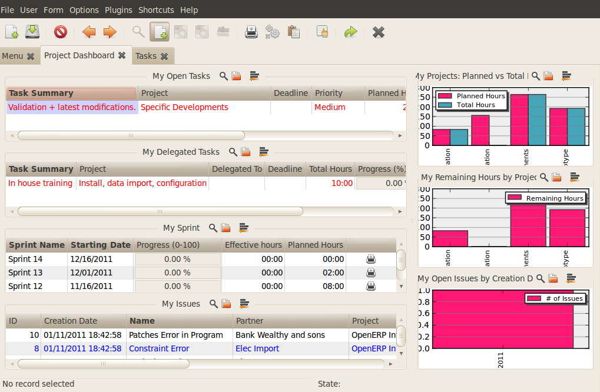
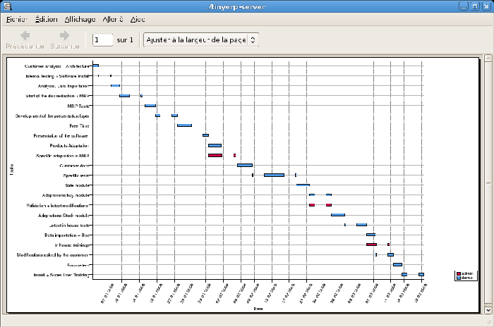
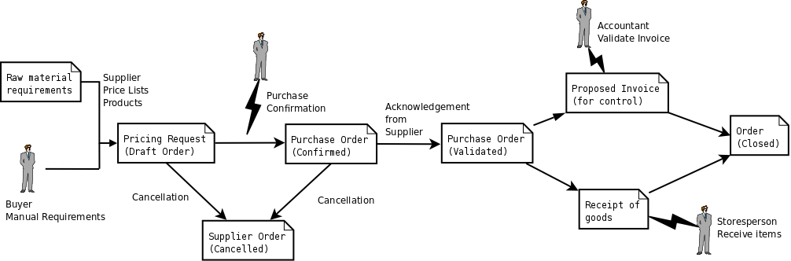

****************************
Getting started with OpenERP
****************************

You will now explore the database \ ``openerp_ch02``\   with these profile modules installed to give
you an insight into the coverage of the core Open ERP software.

.. tip:: Translating new modules

	When you have installed a new module and are using additional languages to English you have to reload
	the translation file. New terms introduced in these modules are not translated by default. To do
	this use :menuselection:`Administration --> Translations --> Load an Official Translation`.

Depending on the user you are connected as the page appears differently.
Using the installation sequence above, certain dashboards may be assigned as various
users' home pages. They show a summary of the information required to start the day effectively. A
project dashboard might contains:

* a list of the tasks to carry out,

* a list of the tasks which is assigned to current user,

* a list of sprints,

* a list of issue assigned to current user,

* a graph of Planned vs Total hour,

* a graph of Remaining hour by Project,

* a graph of Open Issues by Creation Date.

Each of the lists can be reordered by clicking on the heading of a column – first in ascending
then in descending order as you click repeatedly. To get more information about any particular entry
click on the name in the first column, or if you want to show a particular panel click :guilabel:`Zoom`
above it.

   *Project Dashboard*

Users' home pages are automatically reassigned during the creation or upgrading of a database. It is
usual to assign a dashboard to someone's home page but any Open ERP screen can be assigned to the
home page of any user.

.. index::
   single: shortcut

.. tip:: Creating shortcuts

	Each user has access to many menu items throughout all of the available menu hierarchy. But in
	general an employee uses only a small part of the system's functions.

	So you can define shortcuts for the most-used menus. These shortcuts are personal for each user. To
	create a new shortcut Just click on the '*' of the header of the view in web client.

	To remove shortcut just click on link and again click on '*' of the header of the view.

The following sections present an overview of the main functions of Open ERP. Some areas are
covered in more detail in the following chapters of this book and you will find many other functions
available in the optional modules. Functions are presented in the order that they appear on the main
menu.

Basic Concepts
==============

.. index::
   single: Partners

Partners & Contacts
-------------------

To familiarize yourself with OpenERP's interface, you will start work with information about
partners. Clicking :menuselection:`Sales --> Address Book --> Customers` brings up a list of partners that were
automatically loaded when you created the database with :guilabel:`Load Demonstration Data` checked.

.. index::
   single: partner; search

Search for a partner
^^^^^^^^^^^^^^^^^^^^

Above the partner list you will see a search form that enables you to quickly filter the partners.

The \ ``Customers`` \ filter is enabled by default showing partners who are customers.
If you have applied no filter, the list shows every partner in the system. For space reasons this list
shows only the first few partners. If you want to display other records you can search for them or
navigate through the whole list using the :guilabel:`First`, :guilabel:`Previous`, :guilabel:`Next`, :guilabel:`Last` arrows.

   *Standard partner search*

.. note:: List limits

	By default the list in the GTK client shows only the first 80 records, to avoid overloading the
	network and the server.

	But you can change that limit by clicking the selection widget (showing 80 by default) to the
	right of the search criteria.

	Similarly the list in the web client shows only the first 20, 50, 100, 500 or unlimited records.

	The actual number can be switched by clicking on the link between the PREVIOUS and NEXT buttons
	and selecting one of the other limits.

If you click on the name of a partner the form view corresponding to that partner opens in Read-Only
mode. In the list you could alternatively click the pencil icon to open the same form in Edit mode.
Once you have a form you can toggle between the two modes by clicking :guilabel:`Save` or :guilabel:`Cancel` when in
Edit mode and :guilabel:`Edit` when in Read-Only mode.

.. index::
   single: partner; view form

Partner form
^^^^^^^^^^^^

The partner form contains several tabs, all referring to the current record:

*  :guilabel:`General`,

*  :guilabel:`Sales & Purchases`,

*  :guilabel:`Accounting`,

*  :guilabel:`History`,

*  :guilabel:`Notes`.

The fields in a tab are not all of the same type – some (such as :guilabel:`Name`) contain free
text, some (such as the :guilabel:`Language`) enable you to select a value from a list of options,
others give you a view of another object (such as :guilabel:`Partner Contacts` – because a partner
can have several contacts) or a list of link to another object (such as :guilabel:`Partner Categories`).
There are checkboxes (such as the :guilabel:`Active` field in the :guilabel:`Sales & Purchases` tab),
numeric fields (such as :guilabel:`Credit Limit` in the :guilabel:`Accounting` tab) and date fields (such as :guilabel:`Date`).

The :guilabel:`History` tab gives a quick overview of things that have happened to the partner – an
overview of useful information such as Leads and Opportunities, Meetings, Phone Calls, Emails and Tasks.
Events are generated automatically by OpenERP from changes in other documents that refer to this partner.

It is possible to add events manually, such as a note recording a phone call. To add a new event
click :guilabel:`New` in the :guilabel:`Phone Calls` section. That
opens a new :guilabel:`Phone Call` pop-up form enabling a phone-call event to be created and added to the
current partner.

Actions possible on a partner
^^^^^^^^^^^^^^^^^^^^^^^^^^^^^

To the right of the partner form is a toolbar containing a list of possible :guilabel:`Reports` ,
:guilabel:`Actions`, and quick :guilabel:`Links` about the partner displayed in the form.

You can generate PDF documents about the selected object (or, in list view, about one or more
selected objects) using certain buttons in the :guilabel:`Reports` section of the toolbar:

*  :guilabel:`Labels` : print address labels for the selected partners,

*  :guilabel:`Overdue Payments` : print a mail notifying the selected partners about overdue payments,

Certain actions can be started by the following buttons in the :guilabel:`Actions` section of the
toolbar:

*  :guilabel:`SMS Send` : enables you to send an SMS to selected partners. This system uses the bulk
   SMS facilities of the Clickatell® company http://clickatell.com.

*  :guilabel:`Mass Mailing` : enables you to send an email to a selection of partners.

*  :guilabel:`Create Opportunity` : opens a window to create an opportunity for the partner,

.. index::
   single: buttons; reports, actions, links

.. tip:: Reports, Actions and Links in the GTK client

	When you are viewing a form in the GTK client, the buttons to the right of the form are shortcuts to
	the same Reports, Actions and Links as described in the text. When you are viewing a list (such as
	the partner list) those buttons are not available to you. Instead, you can reach Reports and Actions
	through two of the buttons in the toolbar at the top of the list – Print and Action.

Partners are used throughout the OpenERP system in other documents. For example, the menu
:menuselection:`Sales --> Sales Orders` brings up all the Sales
Orders in list view. Open an order in form view and click the name of a partner while the
form is still read-only. You will get the Partner form.

.. tip:: Right clicks and shortcuts

	In the GTK client you do not get hyperlinks to other document types. Instead, you can right-click in
	a list view to show the linked fields (that is fields having a link to other forms) on that line.

	In the web client you will see hyperlink shortcuts on several of the fields on a form that is in Read-
	Only mode, so that you can move onto the form for those entries. When the web form is in Edit mode,
	you can instead right-click with the mouse button
	in the field, to get all of the linked fields in a pop-up menu just as you would with the GTK
	client.

	You can quickly try this out by going to any one of the sales orders in :menuselection:`Sales
	--> Sales Orders` and seeing what you can reach from the
	:guilabel:`Customer` field on that sales order form using either the web client with the form in
	both read-only and in edit mode, or with the GTK client.

   *Links for a partner appear in an order form*

Before moving on to the next module, take a quick look into the :menuselection:`Sales -->
Configuration --> Address Book`  menu, particularly :menuselection:`Partner Categories`  and  :menuselection:`Localisation` menus.
They contain some of the demonstration data that you installed when you created the database.

Products
--------

In OpenERP, product means a raw material, a stockable product, a consumable or a service. You can
work with whole products or with templates that separate the definition of products and variants.

For example if you sell t-shirts in different sizes and colors:

* the product template is the “T-shirt” which contains information common to all sizes and all
  colors,

* the variants are “Size:S” and “Color:Red”, which define the parameters for that size and
  color,

* the final product is thus the combination of the two – t-shirt in size S and color Red.

The value of this approach for some sectors is that you can just define a template in detail and all
of its available variants briefly rather than every item as an entire product.

	.. note::  *Example Product templates and variants*

			A product can be defined as a whole or as a product template and several variants. The variants
			can be in one or several dimensions, depending on the installed modules.

			For example, if you work in textiles, the variants on the product template for “T-shirt” are:

			* Size (S, M, L, XL, XXL),

			* Colour (white, grey, black, red),

			* Quality of Cloth (125g/m2, 150g/m2, 160g/m2, 180g/m2),

			* Collar (V, Round).

			.. index::
			   single: module; product_variant_multi

			This separation of variant types requires the optional module :mod:`product_variant_multi`.
			Using it
			means that you can avoid an explosion in the number of products to manage in the database. If you
			take the example above it is easier to manage a template with 15 variants in four different types
			than 160 completely different products. This module is available in ``extra-addons``.

The :menuselection:`Sales --> Products` menu gives you access to the definition of products and their
constituent templates and variants.

.. index::
   single: Product; Consumable

.. tip::  Consumables

	In OpenERP a consumable is a physical product which is treated like a stockable product except
	that stock management is not taken into account by the system. You could buy it, deliver it or
	produce it but OpenERP will always assume that there is enough of it in stock. It never triggers a
	procurement exception.

Open a product form to see the information that describes it. Several different types of product can
be found in the demonstration data, giving quite a good overview of the possible options.

Price lists (:menuselection:`Sales --> Configuration --> Pricelists`) determine the purchase and selling prices and
adjustments derived from the use of different currencies. The :menuselection:`Default Purchase
Pricelist` uses the product's :guilabel:`Cost Price` field to base a Purchase price on. The
:menuselection:`Public Pricelist` uses the product's :guilabel:`Sale Price` field to base a
Sales price on when issuing a quote.

Price lists are extremely flexible and enable you to put a whole price management policy in place.
They are composed of simple rules that enable you to build up a rule set for most complex situations:
multiple discounts, selling prices based on purchase prices, price reductions, promotions on whole
product ranges and so on.

You can find many optional modules to extend product functionality,
such as:

.. index::
   single: module; membership

* :mod:`membership` : for managing the subscriptions of members of a company,

  .. index::
     single: module; product_electronic

* :mod:`product_electronic` : for managing electronic products,

  .. index::
     single: module; product_extended

* :mod:`product_extended` : for managing production costs,

  .. index::
     single: module; product_expiry

* :mod:`product_expiry` : for agro-food products where items must be retired after a certain
  period,

  .. index::
     single: module; product_lot_foundry

* :mod:`product_lot_foundry` : for managing forged metal products.

Except the :mod:`membership` module, the rest above are found in ``extra-addons``.

.. index::
   single: CRM
   single: Customer Relationship Management
   single: SRM
   single: Supplier Relationship Management
..

Boost your Sales
================

Open ERP provides many tools for managing relationships with partners. These are available through
the :menuselection:`Sales` menu.

.. tip::  :guilabel:`CRM & SRM`

	``CRM`` stands for Customer Relationship Management, a standard term for systems that manage client and
	customer relations. ``SRM`` stands for Supplier Relationship Management, and is commonly used for
	functions that manage your communications with your suppliers.

The concept of a “case” is used to handle arbitrary different types of relationship, each
derived from a generic method. OpenERP provide the following efficiently "Case" management system.

* Leads
* Opportunities
* Meetings
* Phone Calls
* Claims
* Helpdesk and Support
* Fund Raising

Open ERP ensures that each case is handled effectively by the system's users, customers and
suppliers. It can automatically reassign a case, track it for the new owner, send reminders by email
and raise other Open ERP documentation and processes.

All operations are archived, and an email gateway lets you update a case automatically from emails
sent and received. A system of rules enables you to set up actions that can automatically improve
your process quality by ensuring that open cases never escape attention.

As well as those functions, you have got tools to improve the productivity of all staff in their daily
work:

* a document editor that interfaces with OpenOffice.org,

* interfaces to synchronize your contacts and Outlook Calendar with Open ERP,

* an Outlook plugin enabling you to automatically store your emails and their attachments in a
  Document Management System integrated with Open ERP,

You can implement a continuous improvement policy for all of your services, by using some of the
statistical tools in Open ERP to analyze the different communications with your partners. With
these, you can execute a real improvement policy to manage your service quality.

The management of customer relationships is detailed in the second section of this book (see
:ref:`part2-crm`).

.. index::
   single: Purchase Management

.. index::
   single: Accounting and Finance
   single: Financial Management

Manage your Books
=================

The chapters in :ref:`part-genacct` in this book are dedicated to general and analytic accounting.
A brief overview of
the functions provided by these modules is given here as an introduction.

Accounting is totally integrated into all of the company's functions, whether it is general,
analytic, budgetary or auxiliary accounting. OpenERP's accounting function is double-entry and
supports multiple company divisions and multiple companies, as well as multiple currencies and
languages.

Accounting that is integrated throughout all of the company's processes greatly simplifies the work
of entering accounting data, because most of the entries are generated automatically while other
documents are being processed. You can avoid entering data twice in OpenERP, which is commonly a
source of errors and delays.

So OpenERP's accounting is not just for financial reporting – it is also the anchorpoint for many
of a company's management processes. For example if one of your accountants puts a customer on
credit hold then that will immediately block any other action related to that company's credit (such
as a sale or a delivery).

OpenERP also provides integrated analytical accounting, which enables management by business
activity or project and provides very detailed levels of analysis. You can control your operations
based on business management needs, rather than on the charts of accounts that generally meet only
statutory requirements.

  .. index::
     single: Human Resources
     single: HR

Lead & Inspire your People
==========================

OpenERP's Human Resources Management modules provide such functionality as:

* management of staff and the holiday calendar,

* management of employment contracts,

* management of holiday and sickness breaks,

* managing claims processes,

* management of staff performance,

* management of skills and competencies.

.. index::
   single: modules; hr_
   single: module; hr

Most of these functions are provided from optional modules whose name starts with \ ``hr_``\
rather than the core :mod:`hr` module, but they are all loaded into the main :menuselection:`Human
Resources` menu.

The different issues are handled in detail in the fourth part of this book :ref:`part-ops`, dedicated to internal
organization and to the management of a services business.

Drive your Projects
===================

Open ERP's project management tools enable you to handle the definition of tasks and the
specification of requirements for those tasks, efficient allocation of resources to the
requirements, project planning, scheduling and automatic communication with partners.

All projects are hierarchically structured. You can review all of the projects from the menu
:menuselection:`Project Management --> All Projects`. To view a project's plans, select a project
line and then click :guilabel:`Print`. Then select :guilabel:`Gantt diagram` to obtain a graphical
representation of the plan.

.. todo:: This isn't working. Gantt charts aren't displaying right.

   *Project Planning*

You can run projects related to Services or Support, Production or Development – it's a universal
module for all enterprise needs.

Project Management is described in :ref:`ch-projects`.

.. index::
   single: inventory control
   single: Stock Management
..

Manage your Business
====================

Driving your Sales
------------------

The :menuselection:`Sales` menu gives you roughly the same functionality as the
:menuselection:`Purchases` menu – the ability to create new orders and to review the
existing orders in their various states – but there are important differences in the workflows.

Confirmation of an order triggers the delivery of goods, and invoicing timing is defined by a
setting in each individual order.

Delivery charges can be managed using a grid of tariffs for different carriers.

Driving your Purchases
----------------------

:menuselection:`Purchases` enables you to track your suppliers' price quotations and convert them into
Purchase Orders as you require. OpenERP has several methods of monitoring invoices and tracking
the receipt of ordered goods.

You can handle partial deliveries in OpenERP, so you can keep track of items that are still to be
delivered on your orders, and you can issue reminders automatically.

OpenERP's replenishment management rules enable the system to generate draft purchase orders
automatically, or you can configure it to run a lean process, driven entirely by current production
needs.

Organise your Warehouse
-----------------------

The various sub-menus under :menuselection:`Warehouse` together provide operations you need to manage stock.
You can:

* define your warehouses and structure them around locations and layouts of your choosing,

* manage inventory rotation and stock levels,

* execute packing orders generated by the system,

* execute deliveries with delivery notes and calculate delivery charges,

* manage lots and serial numbers for traceability,

* calculate theoretical stock levels and automate stock valuation,

* create rules for automatic stock replenishment.

Packing orders and deliveries are usually defined automatically by calculating requirements based on
sales. Stores staff use picking lists generated by OpenERP, produced automatically in order of
priority.

Stock management is, like accounting, double-entry. So stocks do not appear and vanish magically
within a warehouse, they just get moved from place to place. And, just like accounting, such a
double-entry system gives you big advantages when you come to audit stock because each missing item
has a counterpart somewhere.

Most stock management software is limited to generating lists of products in warehouses. Because of
its double-entry system OpenERP automatically manages customer and suppliers stocks as well, which
has many advantages: complete traceability from supplier to customer, management of consigned stock,
and analysis of counterpart stock moves.

Furthermore, just like accounts, stock locations are hierarchical, so you can carry out analyses at
various levels of detail.

.. index::
   single: Production Management
   single: Manufacturing

Get Manufacturing done
======================

OpenERP's production management capabilities enable companies to plan, automate, and track
manufacturing and product assembly. OpenERP supports multi-level bills of materials and lets you
substitute subassemblies dynamically, at the time of sales ordering. You can create virtual sub-
assemblies for reuse on several products with phantom bills of materials.

.. index::
   single: bill of materials
   single: BoM

.. note:: BoMs, routing, workcenters

	These documents describe the materials that make up a larger assembly. They are commonly called
	Bills of Materials or BoMs.

	They are linked to routings which list the operations needed to carry out the manufacture or
	assembly of the product.

	Each operation is carried out at a workcenter, which can be a machine, a tool, or a person.

Production orders based on your company's requirements are scheduled automatically by the system,
but you can also run the schedulers manually whenever you want. Orders are worked out by calculating
the requirements from sales, through bills of materials, taking current inventory into account. The
production schedule is also generated from the various lead times defined throughout, using the same
route

The demonstration data contains a list of products and raw materials with various classifications
and ranges. You can test the system using this data.

Share your Knowledge
====================

Efficient Document Management
-----------------------------

OpenERP integrates a complete document management system that not only
carries out the functions of a standard DMS, but also integrates with all
of its system-generated documents such as Invoices and Quotations. Moreover, it
it keeps all of this synchronized.

Be Mobile
---------

OpenERP provides a support FTP Interface with document management system. Through this you would not only be able to access documents through OpenERP but you would also be able to connect with them through the file system using the FTP client.
FTP is just a way of getting access to files without needing to use an OpenERP client, thus also letting you access files from anywhere.

This system is also well-integrated with e-mail clients such as Thunderbird and Outlook.

.. index::
   single: Dashboards

Measure your Business Performance
=================================

To measure your business performance OpenERP provide two interesting features:

* Dashboards
* Statistical Reports

Dashboards give you an overview of all the information that is important to you on a single page.
In OpenERP each application has its own dashboard which opens by default when you select the specific application.
As for example `Administration Dashboard` will open when you click on the :menuselection:`Administration` menu.

.. note:: Dashboards

	Unlike most other ERP systems and classic statistically-based systems,
	Open ERP can provide dashboards to all of the system's users, and not just to a select few
	such as directors and accountants.

	Each user can have their own dashboard, adapted to their needs,
	to enable them to manage their own work effectively.
	For example a developer using the :guilabel:`Project Dashboard` can see such information
	as a list of the open tasks, task delegated to him and an analysis of the state of progress of
	the relevant projects.

Dashboards are dynamic, which lets you navigate easily around the whole information base.
Using the icons above a graph, for example, you can filter the data or zoom into the graph. You can
click on any element of the list to get detailed statistics on the selected element.

Dashboards are adaptable to the needs of each user and each company.

.. note:: Construction of dashboards

	OpenERP contains a dashboard editor. It lets you construct your own dashboard to fit your
	specific needs using only a few clicks. The :menuselection:`Administration --> Customization --> Reporting --> Dashboard Definition`
	menu gives you access to defined your own dashboard.

.. index::
   single: Products

The `Statistical Analysis` is one of the crucial thing for decision making process in any business. The OpenERP provides
Statistical Reports for each application. As for example you can access the statistical analysis of Sales releted information
from the menu :menuselection:`Sales --> Reporting --> Sales Analysis`. Also you can search and group by the data using this
`Statistical Report`.

Track your Process Flows
========================

Many documents have a workflow of their own, and also take part in cross-functional processes.
Take a document that could be expected to have a workflow, such as a Sales Order, and
then click the :guilabel:`?` button above its form to see the full process.

.. figure:: images/guided_tour_process.png
   :scale: 50
   :align: center

   *Process for a Sales Order*

You can see the position of that particular document in its process, if you have selected
a single document, by the solid bar on one of the process nodes. You also link
to documents and menus for each of the stages.

There is a clear distinction between a cross-functional process (that is currently only
shown in the web client) and the detailed document workflow (that is shown in both the
web client from a process node, and the GTK client from the
:menuselection:`Plugins > Execute a Plugin...` menu and clicking either
the :guilabel:`Print Workflow` or the the :guilabel:`Print Workflow (Complex)` option.

   *Workflow for a Purchase Order*

Alongside the document management system, the process visualization features make OpenERP
far better for documentation than similar systems.

Need more?
==========

You have been through a brisk, brief overview of many of the main functional areas of OpenERP.
Some of these – a large proportion of the core modules – are treated in more detail
in the following chapters.

You can use the menu :menuselection:`Administration --> Modules --> Modules`
to find the remaining modules that have been loaded into your installation but
not yet installed in your database. Some modules have only minor side-effects to OpenERP (such as
:mod:`base_iban`), some have quite extensive effects (such as the various charts of accounts), and
some make fundamental additions (such as :mod:`multi_company`).

But there are now more than hundred modules available. You can install as per you need.

A brief description is available for each module, but the most thorough way of understanding their
functionality is to install one and try it. So, pausing only to prepare another test database to try
it out on, just download and install the modules that appear interesting.

.. Copyright © Open Object Press. All rights reserved.

.. You may take electronic copy of this publication and distribute it if you don't
.. change the content. You can also print a copy to be read by yourself only.

.. We have contracts with different publishers in different countries to sell and
.. distribute paper or electronic based versions of this book (translated or not)
.. in bookstores. This helps to distribute and promote the Open ERP product. It
.. also helps us to create incentives to pay contributors and authors using author
.. rights of these sales.

.. Due to this, grants to translate, modify or sell this book are strictly
.. forbidden, unless Tiny SPRL (representing Open Object Press) gives you a
.. written authorisation for this.

.. Many of the designations used by manufacturers and suppliers to distinguish their
.. products are claimed as trademarks. Where those designations appear in this book,
.. and Open Object Press was aware of a trademark claim, the designations have been
.. printed in initial capitals.

.. While every precaution has been taken in the preparation of this book, the publisher
.. and the authors assume no responsibility for errors or omissions, or for damages
.. resulting from the use of the information contained herein.

.. Published by Open Object Press, Grand Rosière, Belgium

