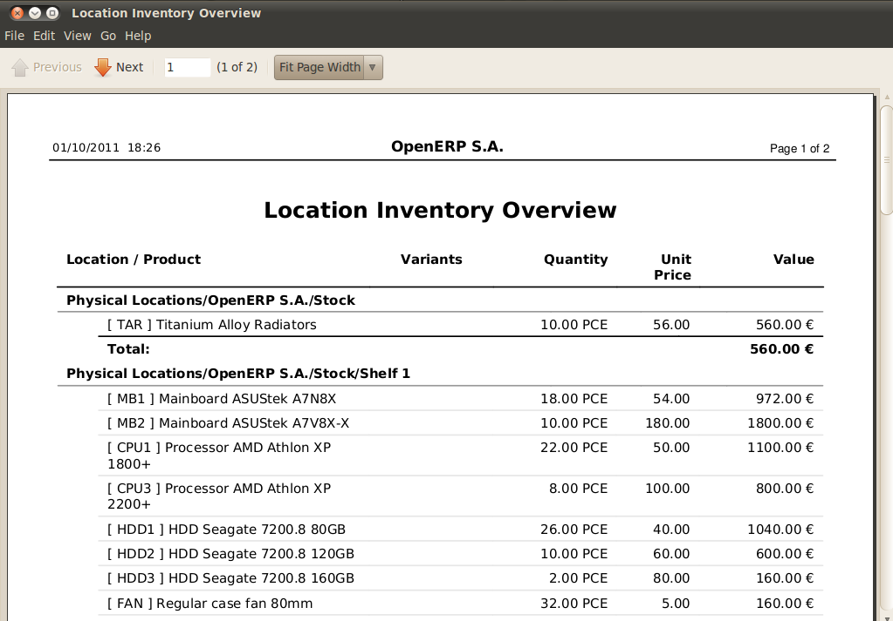
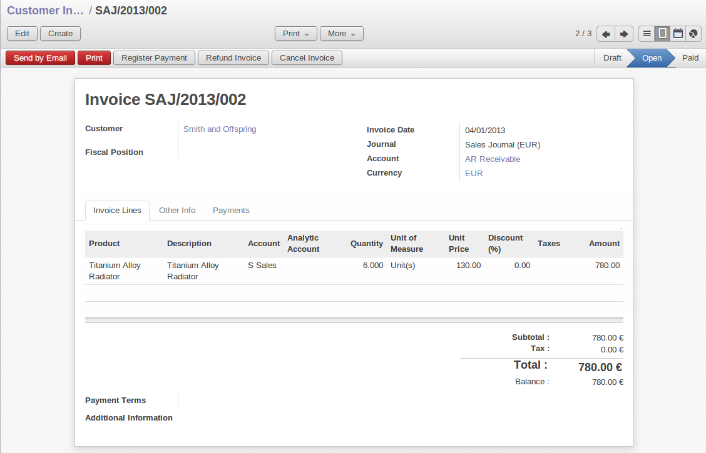

Testing a Purchase-Sale workflow
================================

To familiarize yourself with the system workflow you'll test a purchase-sale workflow in two phases.

The first consists of product purchase, which requires the following operations:

	#. Place a purchase order with Plumbing Component Suppliers for 10 Titanium Alloy Radiators at a
	   unit price of 56.00.

	#. Receive these products at your Goods In.

	#. Generate a purchase invoice.

	#. Pay your supplier.

Following this, you'll sell some of these products, using this sequence:

	#. Receive a sales order for 6 Titanium Alloy Radiators from Smith and Sons, sold at a unit price
	   of 130.00.

	#. Despatch the products.

	#. Invoice the customer.

	#. Receive the payment.

.. _sect-PO:

Purchase Order
--------------

To place a Purchase Order with your supplier, use the menu :menuselection:`Purchase Management -->
New Purchase Order` for a new Purchase Order form.

Complete the following field:

*  :guilabel:`Supplier` : \ ``Plumbing Component Suppliers``\  .

As you complete the :guilabel:`Supplier` field, Open ERP automatically completes the
:guilabel:`Address` field and the :guilabel:`Price List` field from information it takes out of the
Partner record. Then click on the :guilabel:`Save Parent Record.` icon to the right of
the :guilabel:`Order Line` field. This automatically saves the body of the :guilabel:`Purchase
Order`, and changes to a :guilabel:`Create New Record.` icon. Click that to open the
:guilabel:`Purchase Order Line` window.

Enter the following information

*  :guilabel:`Product` : \ ``Titanium Alloy Radiator``\   - type in part of this name then 
   press the tab key to complete it, or click the
   :guilabel:`Search` icon at the end of the line to bring a search box,

When you've selected a product on the product line, Open ERP automatically completes the following
fields from information it finds in the Product record:

* :guilabel:`Product UOM` : the unit of measure for this product,

* :guilabel:`Description` : the detailed description of the product,

* :guilabel:`Scheduled date` : based on the product lead time,

* :guilabel:`Unit price` : the unit price of the product,

* :guilabel:`Analytic account` : if any account is specified then it will appear on the order line (it's not in this example),

* :guilabel:`Taxes` : applicable taxes defined in the partner, if specified, otherwise in the
  product, if specified (there aren't any in this example).

You can edit any of these fields to suit the requirements of the purchase order at the time of
entry. Change the:

* :guilabel:`Quantity` : \ ``10``\ ,

* :guilabel:`Unit Price` to \ ``56.00``\ .

Save the order line and close the :guilabel:`Purchase Order Line` window by clicking the
:guilabel:`Close` button. You can then confirm the whole one-line order by clicking
:guilabel:`Save`, which makes the form non-editable. 

It's now in a state of \ ``Request for
Quotation``\ , so click :guilabel:`Confirm Purchase Order`, which corresponds to an approval from
a manager or from Accounts within your own company and moves the order into \ ``Confirmed``\
state. Finally click :guilabel:`Approved by Supplier` to indicate the supplier's acknowledgment of the
order. The order becomes \ ``Approved``\  . 

If you click the :guilabel:`Delivery & Invoices` tab
you'll see the delivery :guilabel:`Destination` is your own company's ``Stock`` location and that
the invoice was created from the order and is ``SI: PO001``.
It's not entirely obvious at this stage, but the invoice is in a draft state so it can be 
edited and, crucially, has no accounting impact yet: it's just ready for your accounting 
group to activate it.

Receiving Goods
---------------

After confirming the order you'd wait for the delivery of the products from your supplier. Typically
this would be somebody in Stores, who would:

	#. Open the menu :menuselection:`Stock Management --> Incoming Products --> Packings
	   to Process` using the expand/collapse icon. 
	   
	   .. note:: From the Purchase Order
	   
	      You could have clicked the :guilabel:`Packing` link to the right of the Purchase Order
	      to reach the same screen, but this would confuse the purchasing role with the 
	      stores role. That link is very useful during testing and training, however.

	#. When the :guilabel:`Packing` window appears, select the name of the entry in the list 
	   (\ ``PACK1``\)   to display the Packing List itself – you'd usually do a search for the supplier name
	   or order number in a list that was larger than this – then click :guilabel:`Products Received` to load the
	   :guilabel:`Make Packing` form.

	#. Click :guilabel:`Make Picking` to indicate that you're receiving the whole quantity of 10 units.

At this point you've accepted 10 units into your company, in a location that you've already seen.

To check actual stock levels, use the menu :menuselection:`Stock Management --> Stock Locations Structure`,
find \ ``Stock``\ in the hierarchy under :guilabel:`Physical Locations`,
using the expand/collapse controls to make your way through
the tree and click it. You'll next get a :guilabel:`View Stock of Products` screen, where you just
click :guilabel:`Open Products` to select everything that the system knows.

You'll see that :guilabel:`Products: Stock` shows everything in the \ ``Stock`` \ location (and below it) with
:guilabel:`Real stock` (the actual quantity recorded) and
:guilabel:`Future stock` (the quantities expected in future when all receipts and despatches have
been made) – both \ ``10``\   in this case.

Alternatively you could have clicked the \ ``Ambitious Plumbing Enterprises`` \ line to highlight it
(the line, not the \ ``Ambitious Plumbing Enterprises`` \ text itself), and then click the 
:guilabel:`Lots by Location` button in the :guilabel:`Reports` to the top right of the form. 
You'll see that you've now got \ ``10``\   pieces of \ ``Titanium Alloy Radiator``\ in the location
\ ``Stock``\ and also in the location \ ``Ambitious Plumbing Enterprises`` \ , its parent
as shown in the figure :ref:`fig-lotsbyloc`.
If you explore further you'll also see you have ``-10``\   pieces in the Partner Location \ ``Suppliers``\ .

.. _fig-lotsbyloc:

   *List of products and their stock levels*

.. tip:: Traceability in double-entry

   Open ERP operates a double-entry stock transfer scheme similar to double-entry accounting.
   Because of this you can carry out various analyses of stock levels in your warehouse,
   along with the corresponding levels in Partner Location at your Supplier.
   The double-entry system, analogous to that of accounting, enables you to keep track
   of stock movements quite easily, and to resolve any errors that occur.

Control of purchase invoices
----------------------------

When you've received an invoice from your supplier (which would usually be sent to your Accounts department)
go to the menu :menuselection:`Financial Management --> Invoices --> Supplier Invoices --> Draft
Supplier Invoices` to open a list of supplier invoices waiting for receipt. 
These invoices enable your Accounts Department to match the the price and quantities
ordered against the price and quantities on the supplier's invoice (and since it's not uncommon to receive
an invoice showing details more favourable to the supplier than those agreed at the time of
purchase, this is a useful function).

In this example, you created an invoice automatically when you confirmed the supplier's Purchase
Order. That's because the :guilabel:`Invoicing Control`  field on the order was set to \ ``From
Order``\ (the default option). Other options enable you to create invoices at the time of
receiving goods or manually. The initial state of an invoice is \ ``Draft``\  .

Now click the invoice for your order \ ``PO001``\  to display its contents. You can compare the
goods that you've recorded there with the invoice received from your supplier. If there's a
difference it's possible to change the order lines to, for example, add a delivery charge. Click
:guilabel:`Validate` to confirm the invoice and put it into the \ ``Open`` \   state.

Accounting entries are generated automatically once the invoice is validated. To see the effects on
your chart of accounts, use the menu :menuselection:`Financial Management --> Charts --> Chart of
Accounts` ,then click :guilabel:`Open Charts` at the :guilabel:`Account charts` page to see that you
have a debit of ``560.00`` in the ``Purchases`` account and a credit of ``560.00`` in 
the ``Payable`` account.

Paying the supplier
-------------------

Select the menu :menuselection:`Financial Management --> Invoices --> Supplier Invoices --> Unpaid
Supplier Invoices` for a list of supplier invoices that haven't yet been paid. Click the
``PO001`` text itself to open the invoice in read-only mode. 
In practice you'd search for the invoice by order number or,
more generally, for invoices nearing their payment date.

Click :guilabel:`Pay Invoice` in the toolbar to the right of the form, which opens a 
:guilabel:`Pay invoice` window with a description of the payment. 
Type ``Pay Supplier`` in the :guilabel:`Entry Name` field, and
select \ ``Bank Journal``\   in the :guilabel:`Journal/Payment Mode` field. Then
click :guilabel:`Full Payment` to the top left of the form, which carries out the payment action
within Open ERP and returns you to the invoice. Although this invoice is still in the 
:guilabel:`Unpaid Invoices` screen, you can see it is actually paid because the 
:guilabel:`Paid/Reconciled` box is now checked and the :guilabel:`State` is now ``Done`` .

.. index::
   single: module; account

.. note:: Payment of an invoice

	The method described here is for companies that don't use their accounting system to pay bills –
	just to record them.
	If you're using the :mod:`account` module fully other, more efficient, methods let you manage payments,
	such as entering account statements, reconciling paperwork, using tools for preparing payments,
	interfacing with banks.

You can monitor the accounting impact of paying the invoice through the chart of accounts available
from the menu :menuselection:`Financial Management --> Charts --> Chart of Accounts`. Open ERP
automatically creates accounting entries from the payment and can reconcile the payment to the
invoice. You now have a new transaction that has debited the ``Payable`` account with ``560.00`` and
credited the ``Cash`` account.

If you look in :menuselection:`Financial Management --> Reporting --> Journals` you'll see both
accounting transactions, one in each of the ``Purchase`` Journal and ``Bank`` Journal in 
``Draft`` state.

From Sales Proposal to Sales Order
----------------------------------

In Open ERP, sales proposals and sales orders are managed using documents that are based on the
same common functionality as purchase orders, so you'll recognize the following documents in general
but see changes to their detail and to their workflows. To create a new sales proposal, use the
menu :menuselection:`Sales Management --> Sales Orders --> New Quotation` which creates a new order in a state of \
``Quotation``\  , then:

	#. Select the :guilabel:`Customer` \ ``Smith and Offspring``\  . This has the effect of automatically
	   completing several other fields: :guilabel:`Ordering Contact`, :guilabel:`Invoice Address`,
	   :guilabel:`Shipping Address`, and the :guilabel:`Pricelist` \ ``Public Pricelist``\.  They're
	   all only defaults so these fields can be modified as you need.

	#. Click the :guilabel:`Save parent record.` icon to the right of the
	   :guilabel:`Sales Order Lines` field. It saves the main order form and becomes a new
	   :guilabel:`Create new record.` icon. Click that to open a :guilabel:`Sales Order Lines` window.

	#. Select the product \ ``Titanium Alloy Radiator``\   Although the :guilabel:`Product` field isn't
	   itself required, it's used by Open ERP to select the specific product so that several other fields
	   can be automatically completed on the order line of the proposal, such as :guilabel:`Description`,
	   :guilabel:`Product UoM`, :guilabel:`Unit Price`, :guilabel:`Procure Method`, 
	   :guilabel:`Delivery Delay`, and :guilabel:`Taxes`.

	#. Change the :guilabel:`Quantity` to \ ``6``\  and the :guilabel:`Unit Price` to \ ``130.00``\
	   Then click :guilabel:`Save` and the line appears on the quotation form. A blank order line form
	   reappears so that you can enter another line, but it's enough now just to click :guilabel:`Close`
	   to return to the order form.

	#. On the :guilabel:`Other data` tab of this Sales Order select a
	   :guilabel:`Packing Policy` of ``Complete Delivery`` and  
	   :guilabel:`Shipping Policy` of ``Invoice on Order After Delivery``  from their dropdown menu lists.

	#. Return to the first tab :guilabel:`Sale Order` and validate the document by clicking
	   :guilabel:`Confirm Order` which calculates prices and the changes the order's state from \
	   ``Quotation``\  to \ ``In Progress``\ as shown in screenshot :ref:`fig-ch03ord`.  
	   If you were in negotiation with the prospective customer
	   you'd keep clicking :guilabel:`Compute` and :guilabel:`Save` keeping the document in \
	   ``Quotation``\  state for as long as necessary.

	   .. _fig-ch03ord:

	   .. figure:: images/order.png
	      :scale: 75
	      :align: center

	      *Sales Order Form*

	#. In the last tab of the order, :guilabel:`History` you can see the :guilabel:`Packing List`
	   that's been created and you'll be able to see any invoices that relate to this order when they're
	   generated.

From the :guilabel:`Main Menu` click :menuselection:`Products --> Products` to display a list of
products: just the one, \ ``Titanium Alloy Radiator``\  , currently exists in this example. Its
:guilabel:`Real Stock` still shows \ ``10.00``\   but its :guilabel:`Virtual Stock` now shows \
``4.00``\  to reflect the new future requirement of 6 units for despatch.

Preparing goods for despatch to customers
-----------------------------------------

The stores manager selects the menu :menuselection:`Stock Management --> Outgoing Products --> 
Confirmed Packing Waiting Availability` to get a list of orders to despatch. In this
example there's only one, \ ``PACK2``\  , so click the text to open the 
:guilabel:`Confirmed Packing Waiting Availability` form.

.. index::
   single: module; mrp_jit

.. tip::  Running Schedulers

	At the moment your Sales Order is waiting for products to be reserved to fulfil it.
	A stock reservation activity takes place periodically to calculate the needs,
	which also takes customer priorities into account.
	The calculation can be started from the menu 
	:menuselection:`Manufacturing --> Compute All Schedulers`.
	Running this automatically reserves products.

	If you don't want to have to work out your stock needs but have a lean workflow you can install the
	:mod:`mrp_jit` (Just In Time) module.

Although Open ERP has automatically been made aware that items on this order will need to be
despatched, it has not yet assigned any specific items from any location to fulfil it. It's ready to
move \ ``6.00``\  \ ``Titanium Alloy Radiators``\   from the :guilabel:`Stock` location to the :guilabel:`Customers`
location, so start this process by clicking
:guilabel:`Check Availability`. The :guilabel:`Move` line has now changed from the \ ``Confirmed``\   state to
the \ ``Available``\   state.

Then click the :guilabel:`Packing Done` button to reach the :guilabel:`Make Packing` window, where
you click the :guilabel:`Make Picking` button to transfer the 6 radiators to the customer.

To analyze stock movements that you've made during these operations use
:menuselection:`Stock Management --> Stock Locations Structure` to see that your stocks have reduced to
4 radiators and the generic ``Customers`` location has a level of 6 radiators.

Invoicing Goods
---------------

Use the menu :menuselection:`Financial Management --> Invoices --> Customer Invoices --> Draft
Customer Invoices` to open a list of Sales invoices generated by Open ERP. These are in the \ ``Draft``\
state, which means that they don't yet have any presence in the accounting system. You'll find a
draft invoice has been created for the order \ ``SO001``\   once you have despatched the goods
because you'd selected \ ``Invoice on Order After Delivery``\  .

Once you confirm an invoice, Open ERP assigns it a unique number, and all of the corresponding
accounting entries are generated. So open the invoice and click :guilabel:`Create` to do that and
move the invoice into an \ ``Open``\   state with a number of ``2009/001``.

You can send your customer the invoice for payment at this stage. Click :guilabel:`Invoices` from
the :guilabel:`Reports` section of the toolbar at the right of the form to get a PDF document that
can be printed or emailed to the customer.

You can also attach the PDF document to the Open ERP invoice record. Save the PDF somewhere
convenient on your PC (such as on your desktop). Then click the :guilabel:`Add an attachment to this
resource` button to the top right of the invoice form (it looks like a clipboard). Browse to the
file you just saved (\ ``record.pdf``\   if you didn't change its name) from the
:guilabel:`Attachments` dialog box that pops up, and :guilabel:`Close` the dialog box. This gives you a
permanent non-editable record of your invoice on the Open ERP system.

Review your chart of accounts to check the impact of these activities on your accounting. You'll see
the new revenue line from the invoice.

Customer Payment
----------------

Registering an invoice payment by a customer is essentially the same as the process of paying a
supplier. From the menu :menuselection:`Financial Management --> Invoices --> Customer Invoices -->
Unpaid Customer Invoices`, click the name of the invoice that you want to mark as paid, or just
check its checkbox in the list:

	#. Use the :guilabel:`Pay Invoice` button in the :guilabel:`Action` section of the toolbar at the
	   right to open a window that enables you to register the payment.

	#. Select the :guilabel:`Entry Name` and type ``Got paid by customer`` and 
	   select the :guilabel:`Journal` to be ``Bank Journal`` . 

	#. Click :guilabel:`Full Payment`. The
	   invoice is then marked as paid, with its :guilabel:`Paid/Reconciled` box checked
	   as you can see if you select it again :ref:`fig_ch03faminv`.

.. _fig_ch03faminv:

   *Invoice Form*

Check your Chart of Accounts as before to see that you now have a healthy bank balance in the \
``Cash``\   account.

.. Copyright © Open Object Press. All rights reserved.

.. You may take electronic copy of this publication and distribute it if you don't
.. change the content. You can also print a copy to be read by yourself only.

.. We have contracts with different publishers in different countries to sell and
.. distribute paper or electronic based versions of this book (translated or not)
.. in bookstores. This helps to distribute and promote the Open ERP product. It
.. also helps us to create incentives to pay contributors and authors using author
.. rights of these sales.

.. Due to this, grants to translate, modify or sell this book are strictly
.. forbidden, unless Tiny SPRL (representing Open Object Press) gives you a
.. written authorisation for this.

.. Many of the designations used by manufacturers and suppliers to distinguish their
.. products are claimed as trademarks. Where those designations appear in this book,
.. and Open Object Press was aware of a trademark claim, the designations have been
.. printed in initial capitals.

.. While every precaution has been taken in the preparation of this book, the publisher
.. and the authors assume no responsibility for errors or omissions, or for damages
.. resulting from the use of the information contained herein.

.. Published by Open Object Press, Grand Rosière, Belgium

