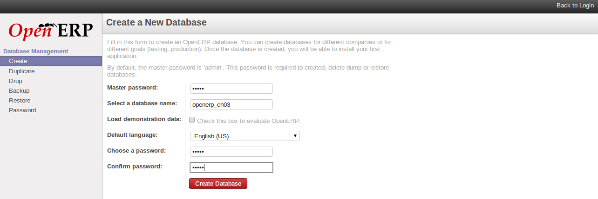
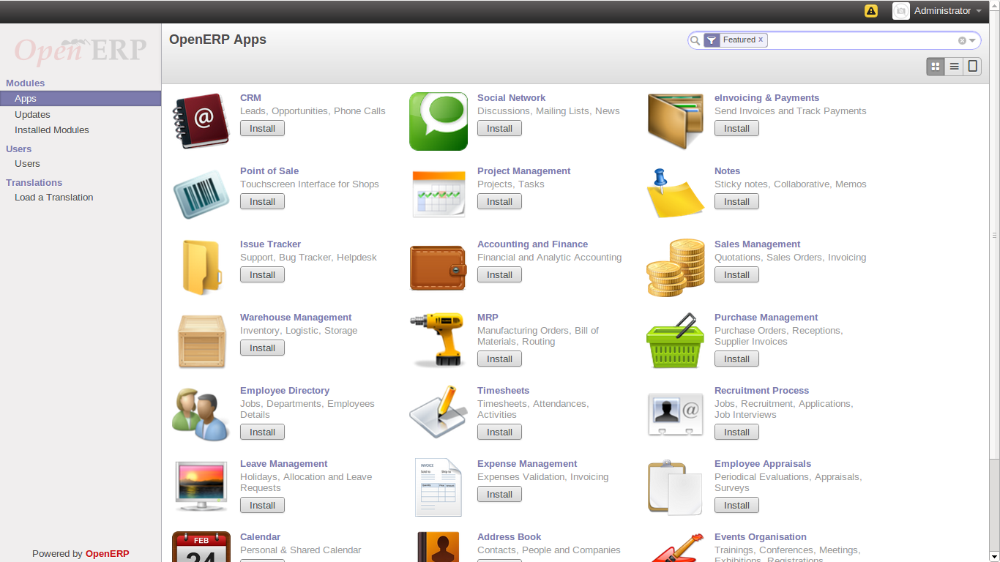
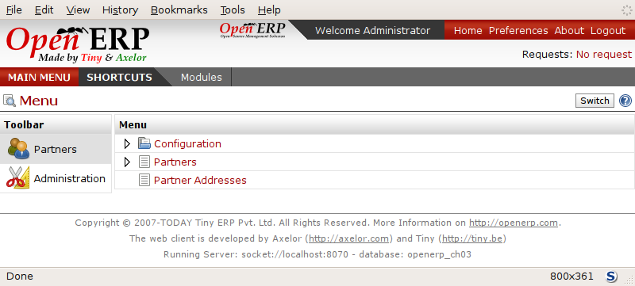
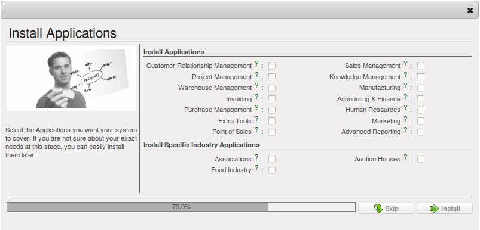
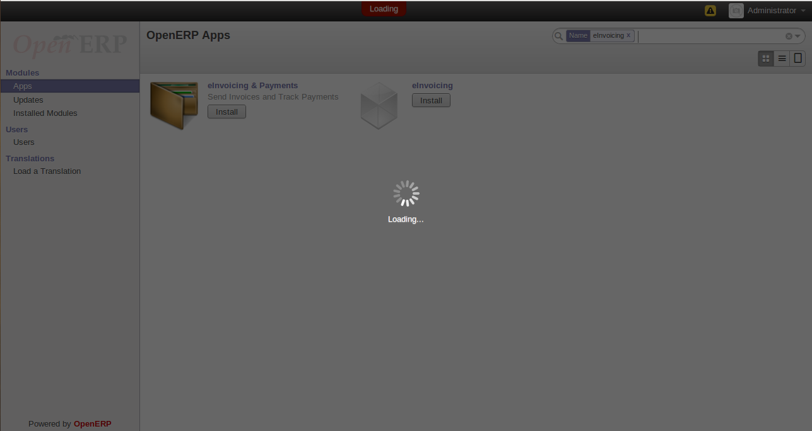
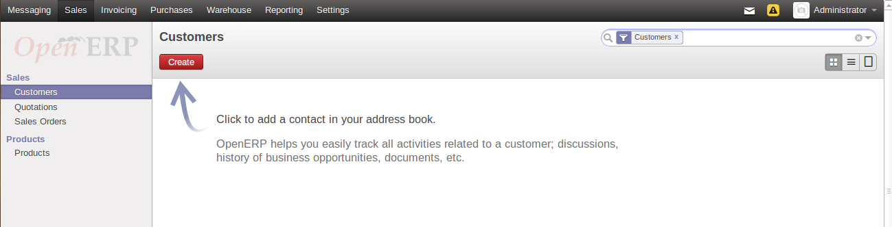

Business Example
================

Configure a system that enables you to:

* buy products from a supplier,

* stock the products in a warehouse,

* sell these products to a customer.

The system should support all aspects of invoicing, payments to suppliers and receipts from
customers.

Basic Settings
==============

For working out the business case you will have to model:

* the suppliers,

* the customers,

* some products,

* inventory for despatch,

* a purchase order,

* a sale order,

* invoices,

* payments.

To test the system you will need at least one supplier, one customer, one product, a warehouse, a
minimal chart of accounts and a bank account.

Get your Database Up and Running with Demo Data
===============================================

Use the technique outlined in :ref:`sect-dbcreate` to create a new database, \ ``openerp_ch03``\  . This
database will be free of data and contain the least possible amount of functionality as a starting
point. You will need to know your super administrator password for this – or you will have to find
somebody who does have it to create this seed database. You will not be able to use the \
``openerp_ch1``\   or \ ``openerp_ch2``\   databases that you might have created so far in this book
because they both contain demonstration data.

Start the database creation process from the :guilabel:`Welcome` page by clicking
:guilabel:`Databases` and then completing the following fields on the :guilabel:`Create new database` form, as shown in :ref:`fig-oech03`:

*  :guilabel:`Super admin password` : by default it's \ ``admin``\  , if you or your system
   administrator have not changed it,

*  :guilabel:`New database name` : \ ``openerp_ch03``\  ,

*  :guilabel:`Load Demonstration data` checkbox: \ ``not checked``\  (**this step is very important, but catches out many people**),

*  :guilabel:`Default Language` : \ ``English``\  ,

*  :guilabel:`Administrator password` : \ ``admin``\  (because it is easiest to remember at this stage, but obviously completely insecure),

*  :guilabel:`Confirm password` : \ ``admin``\  .

.. _fig-oech03:

   *Creating a blank database*

Then click :guilabel:`Create` to create the database and move to the setup screen :ref:`fig-oech03s1`.

.. _fig-oech03s1:

   *Setting up a blank database - first screen*

After a short delay you are connected to the new \ ``openerp_ch03``\   database as user \ ``admin``\
with the password you gave it. You will have to go through the Setup wizard in steps:

When you click on the button `Skip Configuration Wizard`, you can have the following screen. Then you
can start working with this minimal database.

.. _fig-oech03st:

   *Starting the minimal database*

If you click on the `Start Configuration` button then OpenERP helps you to install various applications
with different functionality through the following wizard.

.. _fig-oech03cfg:

   *Configuring a database with other applications and functionality when you select Extended view option*

Fit your Needs
==============

All of the functional needs are provided by core modules from Open ERP. You need to just decide which functionality
you want in your system. Click on the `Check Box` of corresponding application in the wizard :ref:`fig-oech03cfsimp`.

.. index::
   single: module; product
   single: module; stock
   single: module; account
   single: module; purchase
   single: module; sale

For the instance, we need following application.

* product management (the :mod:`product` module),

* inventory control (the :mod:`stock` module),

* accounting and finance (the :mod:`account` module),

* purchase management (the :mod:`purchase` module),

* sales management (the :mod:`sale` module).

For that the configuration wizard should be like this.

.. _fig-oech03cfsimp:

   *Configuration wizard used to install the required applications when you select the Simplified view option*

After the follow through the complete wizard you can have the system that can perform all required functionality.

.. _fig-oech03cfgexample:

   *Database with all required functionality for this example*

If you want to reconfigure your system then click on the `Reconfigure` link appeared in the header of :ref:`fig-oech03cfgexample`.

.. Copyright © Open Object Press. All rights reserved.

.. You may take electronic copy of this publication and distribute it if you don't
.. change the content. You can also print a copy to be read by yourself only.

.. We have contracts with different publishers in different countries to sell and
.. distribute paper or electronic based versions of this book (translated or not)
.. in bookstores. This helps to distribute and promote the Open ERP product. It
.. also helps us to create incentives to pay contributors and authors using author
.. rights of these sales.

.. Due to this, grants to translate, modify or sell this book are strictly
.. forbidden, unless Tiny SPRL (representing Open Object Press) gives you a
.. written authorisation for this.

.. Many of the designations used by manufacturers and suppliers to distinguish their
.. products are claimed as trademarks. Where those designations appear in this book,
.. and Open Object Press was aware of a trademark claim, the designations have been
.. printed in initial capitals.

.. While every precaution has been taken in the preparation of this book, the publisher
.. and the authors assume no responsibility for errors or omissions, or for damages
.. resulting from the use of the information contained herein.

.. Published by Open Object Press, Grand Rosière, Belgium

