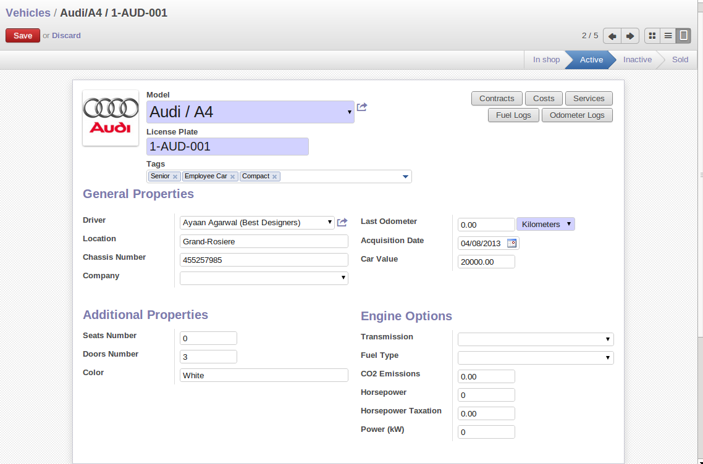
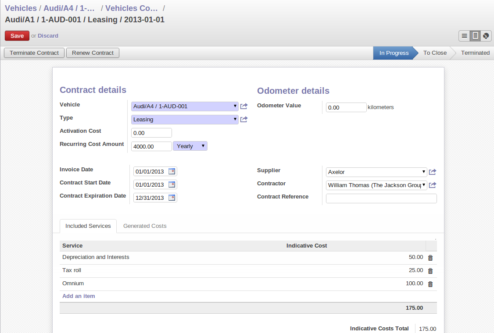

################
Fleet Management
################

 *Fleet management. To manage all your vehicles, the contracts associated to those vehicle as well as services, fuel log entries, costs and many other features necessary to the management of your fleet of vehicle(s).*

You can manage your vehicles, vehical's contracts using fleet module.

The main Features of fleet Module is you can add vehicles to your fleet, Manage contracts for vehicles, Reminder when a contract reach its expiration date, Add services, fuel log entry, odometer values for all vehicles and show all costs associated to a vehicle or to a type of service with help of Analysis graph for costs.

You can create and modify a vehicle using the menu *Fleet ‣ Vehicle ‣ Vehicle,* You can select the model of vehicle from `Model` and need to define the license number in `License Plate`. ``Contract`` button define list of contract releted to vehicle same way the ``cost`` button list out the vehicle related cost.
``Service`` Button define the vehicle related service list. ``Fuel log`` shows the fuel logs for this vehicle and the ``odometer logs`` show the related odometers list. This form provide the all other importatnt details related to vehicle like seat number, door number, Car value, Last Odometer. If you provide vehicle to any employee then you can tag it as emplyee car in `tag` field.

   *Vehicle*

Contract details
================
You can create or modify vehicle's contract using the menu *Fleet ‣ Vehicle ‣ Vehicle Contrcat,*
Contract is based on it's type. In openerp there are three type of contrcat Leasing, Omnium, Repairing for vehicle. In `Included Services` you add different type of services related to contrct and it's price. 

   *Vehicle contract*
  
You can terminate current contract by clicking the `Terminate Contract` button.
If you want to renew the contract then renew it by clicking `Renew contract` button.

.. Copyright © Open Object Press. All rights reserved.

.. You may take electronic copy of this publication and distribute it if you don't
.. change the content. You can also print a copy to be read by yourself only.

.. We have contracts with different publishers in different countries to sell and
.. distribute paper or electronic based versions of this book (translated or not)
.. in bookstores. This helps to distribute and promote the OpenERP product. It
.. also helps us to create incentives to pay contributors and authors using author
.. rights of these sales.

.. Due to this, grants to translate, modify or sell this book are strictly
.. forbidden, unless Tiny SPRL (representing Open Object Press) gives you a
.. written authorisation for this.

.. Many of the designations used by manufacturers and suppliers to distinguish their
.. products are claimed as trademarks. Where those designations appear in this book,
.. and Open Object Press was aware of a trademark claim, the designations have been
.. printed in initial capitals.

.. While every precaution has been taken in the preparation of this book, the publisher
.. and the authors assume no responsibility for errors or omissions, or for damages
.. resulting from the use of the information contained herein.

.. Published by Open Object Press, Grand Rosière, Belgium

