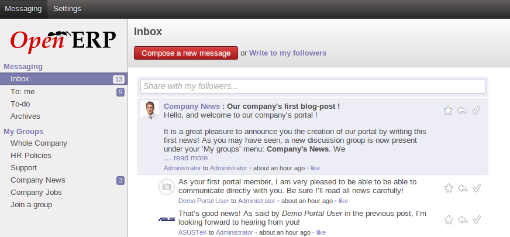
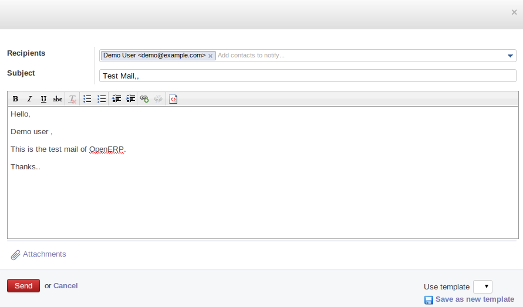
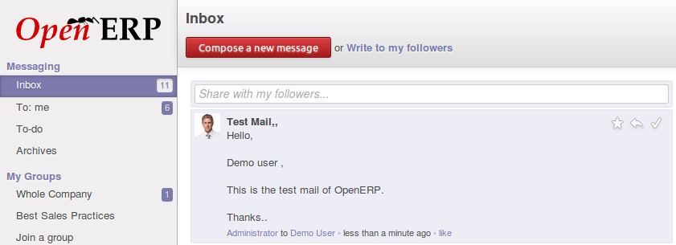
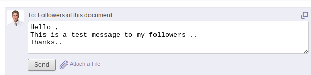
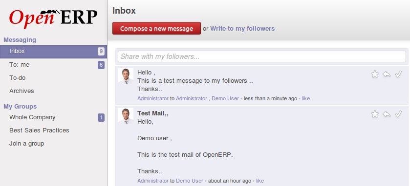
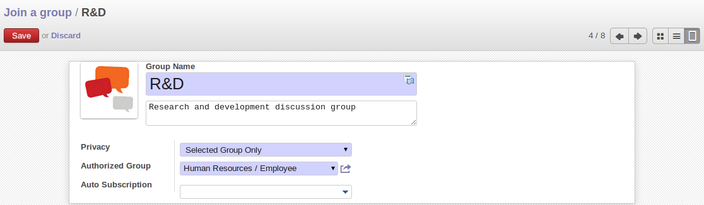
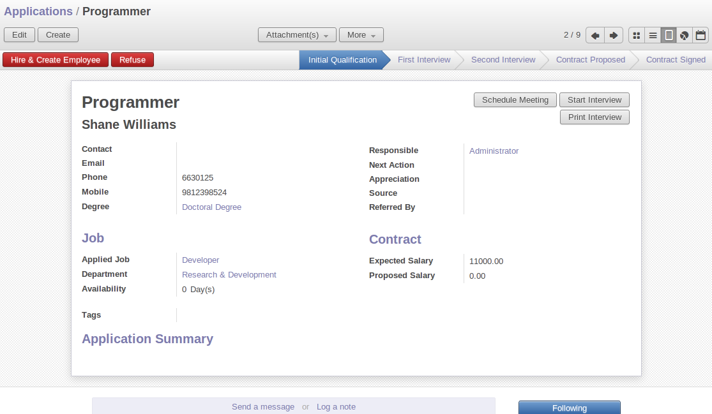
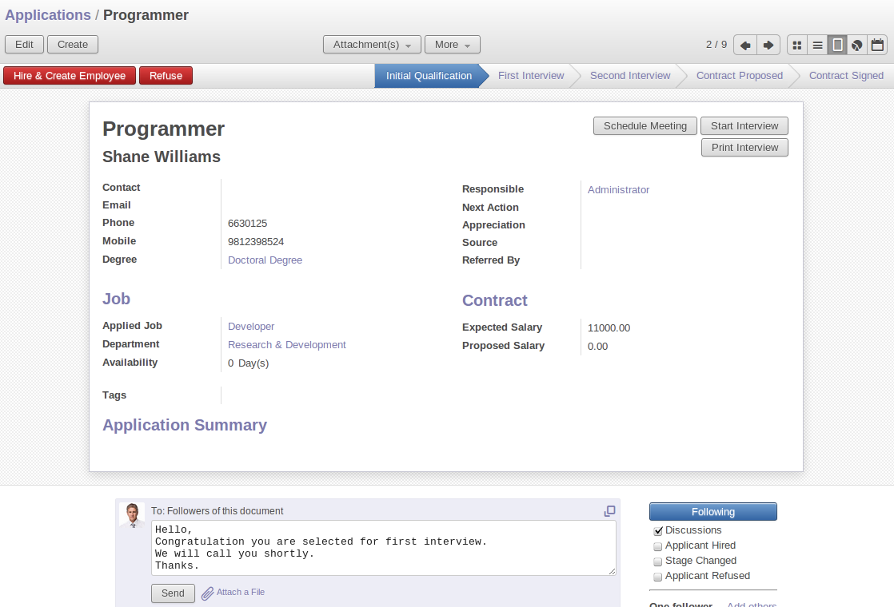

################
Social Network
################

 `The Social Networking module provides unified social network abstraction layers allowing allowing applications to display a complete communication history on documents with a fully-integrated email and message management system. It enables the user to read and send a message as well as e-mails , it also provides a feeds page combine to a subscription mechanism that allows to follow documents and to be constantly updated about recent news.`

Recent research shows that we spend 61 % of our professional time either reading and answering email, searching and gathering information or communicating and collaborating internally.   

Tools that focalize on these activities and integrate them into the regular business processes enrich and enhance users’ productivity. That is exactly why we brought the Business Apps and social networking together.

The Social Network App is based on the OpenChatter engine and has the following main characteristics:

- facilitates conversations with internal users or external ones (customers, suppliers,etc), joining the power of instant messaging with standard emails ,
- organise groups of discussions, an alternative to traditional mailing lists,
- extends the breadth of these conversations to incorporate discussions around and about business documents,
- incorporates a subscription system to any business event, generating notifications,
- displays all the messages and notifications in a threaded manner on the user’s unified feeds page.

Start with the fresh demo database and install ``mail`` module. You will find the Messaging menu like following figure:

   *Main Messaging menu*  

The conversation feature
========================

OpenChatter provides a simple communication tool to discuss amongst colleagues or external contacts, either with an individual or with a group. 
Two mechanisms are provided to discuss or exchange documents, a real time chat or an asynchronous messaging that provides an alternative to e-mails.

You can send messages to internal users or external contacts like customers and suppliers. The email gateway converts automatically incoming e-mails to clean messages in your wall and messages you write to an external contact to an outgoing mail.

You can see 2 options on the main page , :guilabel:`Compose a new message` or :guilabel:`Write to my followers`.

:guilabel:`Compose a new message`

This button helps for sending an e-mail ,to the customer,supplier etc..
For example admin user send an e-mail to demo user , figure of compose a new message in OpenERP seems like following,

   *Compose a new e-mail*   

You can also attach files that you want to send.

Now after sending an e-mail to demo user , when demo user login, he can see that mail on his wall, it seems like following figure.

   *Receive mail from Admin user*   

:guilabel:`Write to my followers`

From this option, you can send messages to internal users or external contacts like customers and suppliers. This is possible by adding followers.

For that, first you have to install ``contacts`` module from :menuselection:`Settings --> Modules`. This module gives you a quick view of your address book, accessible from your home page. You can track your suppliers, customers and other contacts. 

Here are the different mechanisms to become a follower in OpenERP v7:

1. The Follow button on documents.
   Go to :menuselection:`Messaging --> Organiser --> Contacts` , open the Demo user from, at the right side below the form , you can see the button :guilabel:`Following`. If you click on it , Administrator will add in to follower list of Demo User. The figure seems like following :
    
    .. figure:: images/follow_btn.png
       :scale: 75
       :align: center
    
       *Following button*       
     
    
2. you can invite partners to become followers of a document by clicking on the :guilabel:`Add Others` link below the Following button. If you click on that , you will see the invitation message like following figure:
    
    .. figure:: images/invite_other.png
       :scale: 75
       :align: center
    
       *Invite to a Partner*  
         
3. the creator of a document is automatically added in the followers.
    

Now go to the Messaging menu , and now click on link `Write to my followers`. you will find the figure like following:

   *Message sending to followers* 

Now when you login as Demo user , you will find the above message in the wall of demo user. It seems like following figure:

   *Demo user receive message* 

You can also attache file with this message.

Join a Group
============

Discussions can be organised into groups. You can create groups of discussions for any purpose. You can create a group from menu :menuselection:`Messaging --> My Groups --> Join a Group` and click on :guilabel:`Create`.

   *Create a new group* 

You can configure the privacy of each group as :

- :guilabel:`Public`: everyone can see messages related to this group, including your customers and/or suppliers through their portal, e.g Company News, Jobs , Next Events , etc.
- :guilabel:`Private`: only followers of this group can see the messages. In order to become a follower, you need to be invited by an existing follower , e.g Board Members, HR , Private Customer Project , etc.             
- :guilabel:`Selected Groups Only`: allows to select groups of users (like the groups used in access rights) that can access related messages, e.g All Employees , Sales Only , Customers Only , Car Policy, for employees having a company car only , etc.

You can also create groups on which users are automatically subscribed according to their access rights. 
As an example, when you install OpenERP, a group called  `Whole Company`  is automatically created with all your employees.
This allows to easily send a message to all employees.

Once group created ,users can write messages to a group, attach documents to their messages, answer previous threads, vote on others messages and search in the history of all conversations.
Users can join or be invited on groups. If they do so, they will receive every discussion concerning these groups into their inbox.
Depending on the privacy of the group, you can also read the archives of the group, even if you decided to not follow this group.

Use of Messaging
================

In OpenERP this OpenChatter(`mail` module) used in following areas:

- :guilabel:`CRM` : For scheduling meeting with partners , information needed to partner etc.
- :guilabel:`Sales/Purchase` : For sending a Quotation to customer , discussion , product quantity/quality.
- :guilabel:`Manufacturing` : For Waiting for raw material , production started etc notification, work orders , repair orders , planning of order, Bill of materials. 
- :guilabel:`Human Resources` : Schedule interview with an Applicant , Leave Request , Appraisal , Expense etc.
- :guilabel:`Project` : For Sending Documents , discussion on issues etc.
- :guilabel:`Warehouse` : Incoming Shipment Receive or waiting availability , Delivery Order etc.
- :guilabel:`Accounting` : Invoice of customer/supplier , customer/supplier Payment , Payment follow-up.
- :guilabel:`Other` : In Event module ,for sending registration details results etc ,In association module for members discussion.

OpenChatter is available as 2 links, below the form of all above listed module.
And those 2 links are , :guilabel:`Send a message` or :guilabel:`Log a note`. Also :guilabel:`Following` button available at right side of the form.  
Functionality of these things are same as explained above.

   *Link and following button in application*
   
For Example in HR , applicant select for next round , you can inform via this chatter, also you can attach a result of test. (Menu :menuselection:`Human Resources --> Recruitment --> Applications`)

   *Send a message to applicant* 

.. Copyright © Open Object Press. All rights reserved.

.. You may take electronic copy of this publication and distribute it if you don't
.. change the content. You can also print a copy to be read by yourself only.

.. We have contracts with different publishers in different countries to sell and
.. distribute paper or electronic based versions of this book (translated or not)
.. in bookstores. This helps to distribute and promote the OpenERP product. It
.. also helps us to create incentives to pay contributors and authors using author
.. rights of these sales.

.. Due to this, grants to translate, modify or sell this book are strictly
.. forbidden, unless Tiny SPRL (representing Open Object Press) gives you a
.. written authorisation for this.

.. Many of the designations used by manufacturers and suppliers to distinguish their
.. products are claimed as trademarks. Where those designations appear in this book,
.. and Open Object Press was aware of a trademark claim, the designations have been
.. printed in initial capitals.

.. While every precaution has been taken in the preparation of this book, the publisher
.. and the authors assume no responsibility for errors or omissions, or for damages
.. resulting from the use of the information contained herein.

.. Published by Open Object Press, Grand Rosière, Belgium
