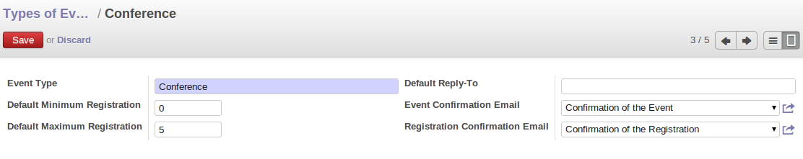
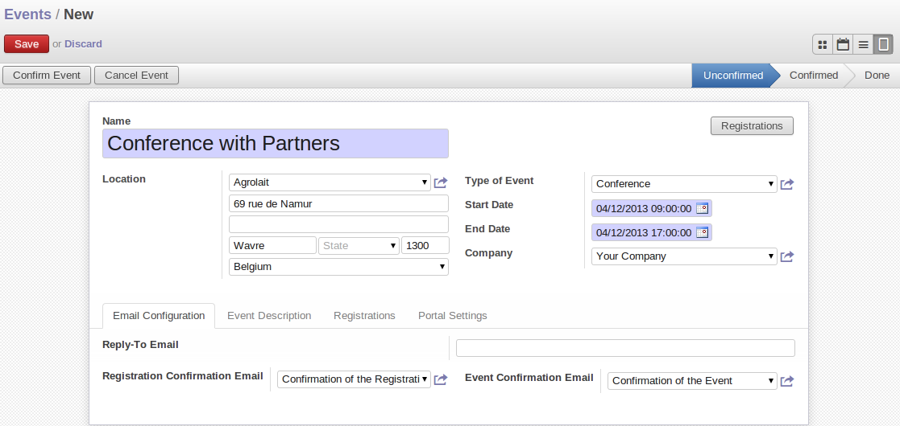
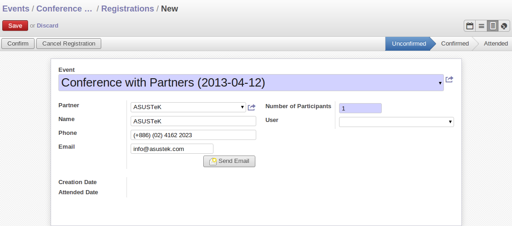
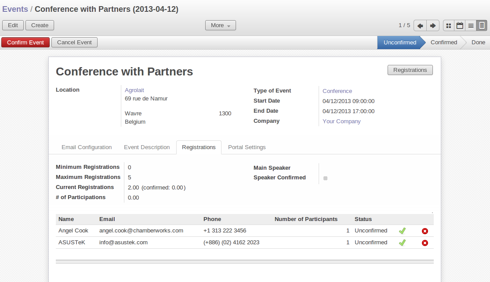
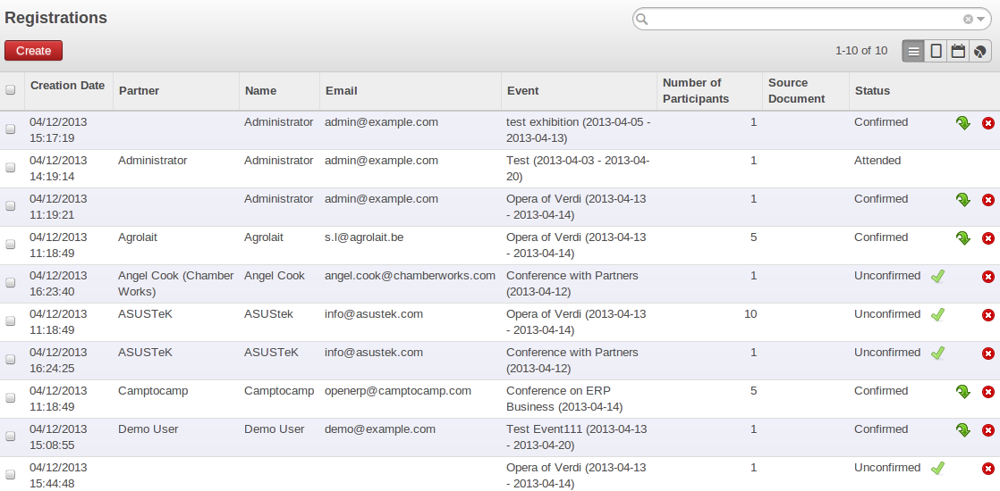

##################
Event Organization
##################
 `The event module allows you to efficiently organise events and all related tasks: planification, registration tracking, attendances, etc. Preparing and managing internal and external events becomes straight-forward with this new App.`
 
It covers the life cycle of a typical event:

- definition/description of the event, 
- the planning,
- sending invitations and subscription confirmations,
- registering event attendance,
- automated verification of required min/max seat registrations.

Start with fresh demo database and install ``event`` module. Also give access rights of Technical features to user , from menu :menuselection:`Settings --> Users --> Users`.

Event Type
==========

There are many types of events in business like Seminar, Exhibition, Conference, Training etc. You can create these type of event from menu :menuselection:`Events --> Configuration --> Type of Events` and click on :guilabel:`Create`.

   *Create an Event Type*  

The fields of this form are :

- :guilabel:`Default Reply-To`: The email address of the organizer which is put in the 'Reply-To' of all emails sent automatically at event or registrations confirmation. You can also put your email address of your mail gateway if you use one.   
- :guilabel:`Default Minimum registration`: It will select this default minimum value when you choose this event.     
- :guilabel:`Default Maximum registration`: It will select this default maximum value when you choose this event.
- :guilabel:`Event Confirmation mail`: It will select this default confirmation event mail value when you choose this event.
- :guilabel:`Registration Confirmation Email`: It will select this default confirmation registration mail value when you choose this event.

Event and Registration
======================

You can start your event creation from menu :menuselection:`Events --> Events Organization --> Events`, and click on :guilabel:`Create`.

   *Create an Event*  

Give the name of an Event , select location when you want to create event , select event type if you want,
For example you select conference event , Registration Confirmation Email and Event Confirmation Email automatically filled in :guilabel:`Email Configuration` tab , if it is already defined in its type of event, but you can change it as per your need.

The second tab of Event form is :guilabel:`Event Description`, you can define the Description of the event.

The Last tab :guilabel:`Portal Settings`, you can define this event either Public or Private. If you select public all user can see this event and if you select private only participations user of that event can see this.

After complete the form you can save it. It will in ``Unconfirmed`` state. After click on :guilabel:`Confirm Event` button, the state will be in ``Confirmed``.

You can create its Registration by clicking button :guilabel:`Registration` on the right side of the form.

   *Create a Registration*

You have to enter the Partner name, Number of Participants , Phone number and email. Once you complete the form, save it. 
This Participate automatically comes in the third tab :guilabel:`Registration` of Event form.   
  

   *Registration tab*
   
You can see the all Registration list from :menuselection:`Events --> Event Organization --> Registrations`.

   *Registration list*
   
You can see the different status of Registration , when you create Registration for an event , it is in ``Unconfirmed`` state , after clicking on :guilabel:`Confirm` button , it will be in ``Confirmed`` state. 

Once Event is start, you can click on :guilabel:`Attended the Event` procees button from the third tab :guilabel:`Registrations` of Event form, after attending an event, Registration state will go in ``Attended`` state. 

      
   
   
   
   
   