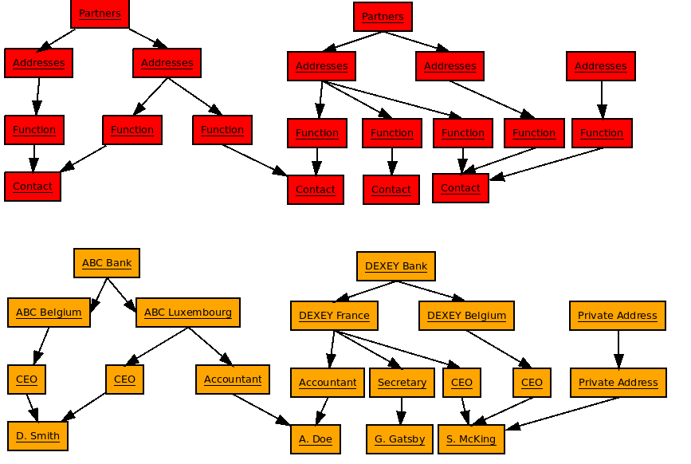
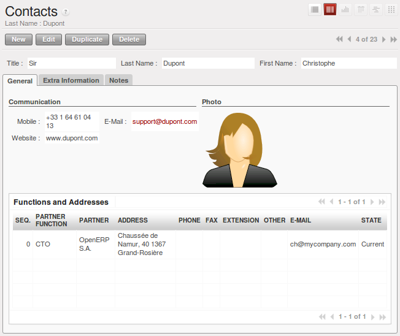
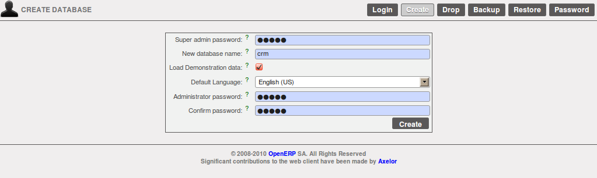

Managing your Potential Customer Contacts
=========================================

.. index::
   single: module; base_contact

The standard way of representing partners and contacts throughout OpenERP
and many other enterprise systems (such as phone contact applications)
is a partner with multiple contacts.
*Partner* is the word for any entity that you do business with - a supplier, a customer, a prospect, ...
In some cases, the standard way of linking contacts to partners may not be flexible enough for you. Of course, OpenERP provides
an alternative, the :mod:`base_contact` module.

The two figures :ref:`fig-crmcono` and :ref:`fig-crmconw` show
the structure of partners and contacts in the form of UML classes both
without and with the :mod:`base_contact` module.
This is a clear way to illustrate the complexities that may be accomplished.

.. _fig-crmcono:

   *UML class diagram with base_contact module not installed*

.. _fig-crmconw:

   *UML class diagram with base_contact module installed*

The concrete example may even better illustrate the concept of multiple relationships between contacts and
partners (companies). The figure :ref:`fig-crmconw` shows two companies having several addresses (places of
business) and several contacts attached to these addresses.

In this example you will find the following elements:

* The ABC bank has two places of business, represented by the addresses of ABC Belgium and ABC
  Luxembourg,

* The addresses of Dexey France and Dexey Belgium belong to the Dexey company,

* At the office of ABC Luxembourg, you have the contacts of the director (D. Smith) and the
  accountant (A. Doe),

* Mr Doe holds the post of accountant for ABC Luxembourg and Dexey France,

* Mr D. Smith is director of Dexey France and Dexey Belgium and we also have his private address
  which is not attached to a partner.

Depending on your needs, OpenERP provides three menus to access the same information:

* List of partners: :menuselection:`Sales --> Address Book --> Customers`,

* List of contacts: :menuselection:`Sales --> Address Book --> Contacts`,

If you correct a contact name on the contact form, this will be modified on all the posts occupied in the different companies.

The screen above represents a partner form. You can see several possible addresses there and a list of
contacts above each address. For each contact you see a name, a function, a phone number and an
email.

   *A partner form with the base_contact module installed*

If you click on the line you can get more detail about the function (such as start date, end date,
and fax) or enter into the contact form (such as personal phone, different posts occupied, and
personal blog).

   *Detail of a job post occupied by a contact at a partner*

   *Detail of a contact form for someone employed in several job posts*

Partner management is found in the OpenERP base modules. To manage partner relations you have to
install the CRM module. Then configure the system to meet your needs.

For this chapter you should create a new database with demo data through the Configuration Wizard. Select Customer Relationship Management and configure the CRM according to your needs by selecting the appropriate modules.
OpenERP's modularity enables you to install only the CRM module if your requirements are limited to customer relationships.

   *Creating a new database*

When creating the new database, OpenERP suggests that you configure it using a series of questions:

* Simplified or Extended mode: select simplified and click :guilabel:`OK`,

* Select the Customer Relationship Management functionality to install.

.. figure:: images/ crm_db_select.png
   :scale: 50
   :align: center

   *Selecting the CRM functionality to install*

OpenERP proposes a selection from preconfigured functions for CRM:

* managing a prospect database,

* managing and tracking opportunities,

* managing meetings and the company calendar,

* managing presales,

* managing phone calls,

* managing after-sales service,

* managing technical service,

* tracking bugs and new functional requests.

You see that OpenERP's CRM module is not limited just to Customer Relationships but is designed to
generate all types of relations with a partner: such as suppliers, employees, customers, prospects.
This book will describe just customer relationships. The other CRM functions are similar to use, so
you should not have huge problems with understanding those functions.

The following cases will be looked at in this chapter:

* Prospect Management,

* Opportunity Management,

* Management of the Company Calendar,

* Management of Phone Calls.

The figure :ref:`fig-crmconwiz` shows the CRM module configuration screen that appears when you selected the CRM to be installed.

.. _fig-crmconwiz:

.. figure:: images/crm_configuration_wizard.png
   :scale: 50
   :align: center

   *Selecting parameters for CRM modules for the reader of this chapter*

If you have installed the management of prospects and opportunities, OpenERP implements the
following workflow for the *qualification of prospects* and future opportunities.

.. figure:: images/crm_flux.png
   :scale: 50
   :align: center

   *Process of converting a prospect into a customer or opportunity*

.. Copyright © Open Object Press. All rights reserved.

.. You may take electronic copy of this publication and distribute it if you don't
.. change the content. You can also print a copy to be read by yourself only.

.. We have contracts with different publishers in different countries to sell and
.. distribute paper or electronic based versions of this book (translated or not)
.. in bookstores. This helps to distribute and promote the Open ERP product. It
.. also helps us to create incentives to pay contributors and authors using author
.. rights of these sales.

.. Due to this, grants to translate, modify or sell this book are strictly
.. forbidden, unless Tiny SPRL (representing Open Object Press) gives you a
.. written authorisation for this.

.. Many of the designations used by manufacturers and suppliers to distinguish their
.. products are claimed as trademarks. Where those designations appear in this book,
.. and Open Object Press was aware of a trademark claim, the designations have been
.. printed in initial capitals.

.. While every precaution has been taken in the preparation of this book, the publisher
.. and the authors assume no responsibility for errors or omissions, or for damages
.. resulting from the use of the information contained herein.

.. Published by Open Object Press, Grand Rosière, Belgium

