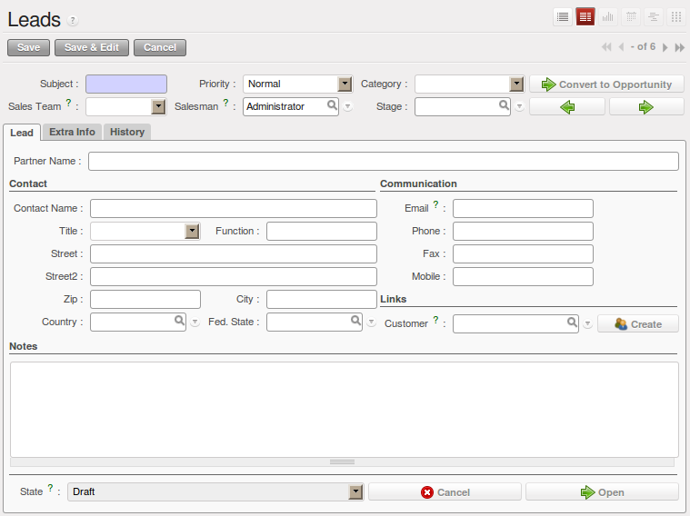
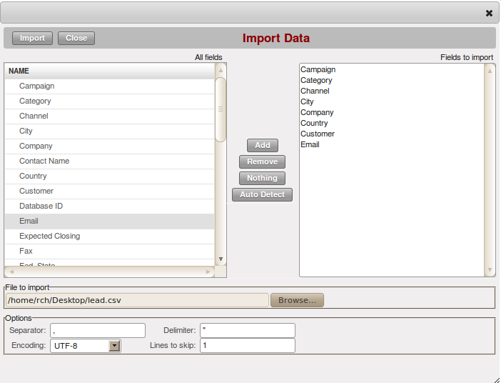
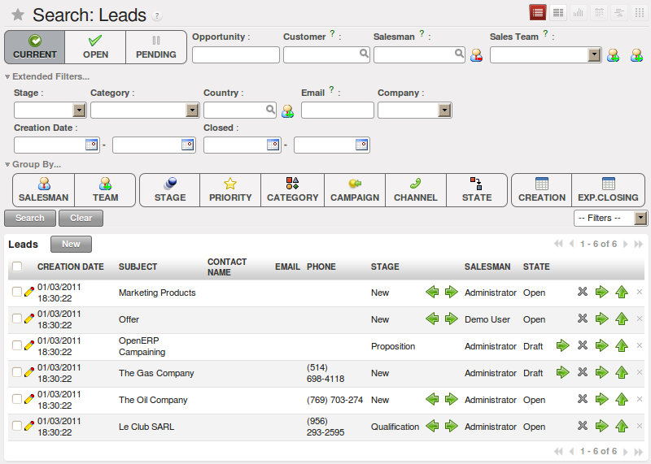

Lead Management
***************

A lead represents a possible business or sales. Usually it is the first step in your sales cycle, and therefore it contains valuable information. However, the most common mistake is that this information too often gets lost because it is registered nowhere, or such key information is not accessible when you need it.

Often leads are not registered centrally, which makes it very difficult to find the appropriate information.

Leads can be assigned to a *Sales Team* for follow up (see  :menuselection:`Sales --> Configuration --> Sales --> Sales Teams`). Each user can be added to a default Sales team which can be specified in the Preferences. You can also escalate a lead to another Sales team, according to the tree structure you defined for your sales teams.
Per sales team, you can assign a responsible user and a generic e-mail address that will be used. You can also assign specific stages. 

When a lead requires follow up, it will be converted to a sales opportunity. OpenERP checks whether a partner with the e-mail address from the lead form already exists, and then proposes to link the contact to the existing partner.

The following events could result in the creation of one or several leads, either manually or automatically:

* An email sent to one of your company's generic email addresses, such as sales@mycompany.com,

* A business card from a prospective customer met briefly at an exhibition: you have to contact him
  again to qualify the lead and to know if there is any possibility of a key sales opportunity,

* A database of potential customers in a given sector and region. The potential customers have to be
  contacted again individually or through a mass mailing to determine which contacts require further follow-up,

* An interesting contact that you met during a business networking event. You have to qualify it before assigning a salesperson to the contact,

* A form completed on your website directly integrated into OpenERP. Before converting the form
  into a sales proposition or opportunity, you should read and handle the person's request.

     .. note:: Separation of sales services

        Some companies will have a presales and a sales department.
        The role of the presales department is to acquire and qualify new leads,
        and the role of the sales department is to crystallize the sales opportunities or work with
        existing customers.

Employees in the presales department will usually work on leads. Once these leads are converted into customers or sales opportunities the sales department pays individual attention to each opportunity.

Storing your Business Cards effectively
=======================================

New prospects are usually entered as a lead in the system. This means that you do not create a
partner form or sales opportunity until you have qualified whether the lead is interesting or not.
If the new contact is indeed interesting you then enter the data on into a partner form and,
eventually, a sales opportunity.

To enter a lead manually use the menu :menuselection:`Sales --> Sales --> Leads` and click the `New` button. A
form opens to let you enter data about this new contact.

   *Creating a new lead*

Leads have a status that depends on the qualification work that has been carried out:

* ``Draft`` : the lead data has been entered, any work has not yet been done and a salesperson has not
  yet been assigned to the request,

* ``Open`` : the lead is being handled,

* ``Closed`` : the lead has been converted into a partner and/or a sales opportunity,

* ``Waiting`` : the lead is waiting for a response from the customer,

* ``Cancelled`` : the lead has been cancelled because the salesperson has decided that it is not worth
  following up.

You can use the arrows (even from List view) to change the status (qualification) of a lead.

On the :guilabel:`Communication & History` tab in the Lead form, you can see the action history for this lead. You can also add internal notes and change the status while adding such a note.

Importing a Leads Database
==========================

You can also import a huge list of leads. That may be useful if you have bought a database of
potential prospects and you want to load them all into the system to handle them all at the same time.

To do that you should start with a list of leads in CSV format. If your prospects are provided in
another format it is easy to convert them to the CSV format using Microsoft Excel or OpenOffice Calc.
Open the leads list using the menu :menuselection:`Sales --> Sales --> Leads`. At
the bottom of the list click on the :guilabel:`Import` link. OpenERP opens a form for importing the
data.

   *Importing leads into the system*

You then define which columns are present in your CSV file in the correct order. Select your file
and click on :guilabel:`Import`. Check in the chapter about system administration, :ref:`ch-config`, for more
information on import and export.

.. tip:: Various Imports

    Importing and Exporting data in OpenERP is a generic function available to all resources.
    So you can import and export such lists as partners, sales opportunities, accounting entries,
    products and price lists.

There are other methods of generating leads automatically or semi-automatically:

* through a Contact Form on your Website;

* Using the Outlook or Thunderbird plugin to insert new leads directly from an e-mail client when a
  salesperson sees promising e-mails ,

* Using the e-mail gateway for each incoming e-mail from a certain address (such as
  info@mycompany.com) which allows you to create a lead automatically from the contents of the e-mail,

* Using OpenERP's XML-RPC web-services to connect to a form on your website.

These different methods are described later in this book.

Organizing leads
****************

To help the users organize and handle leads efficiently, OpenERP provides several menus in the CRM
system that can be used depending on the needs of each:

The :menuselection:`Sales --> Sales --> Leads` can be used for several things:

* Click New to start creating a new lead.

* This view displays a list of all the leads (both open and not) which you are linked to,

* You can display a list of all your leads that you still need to handle (your open, draft and pending leads),

* You can display a list of all your leads that are still waiting for a customer response (usually in Pending status). This enables you to check periodically on your work to do,

* You can display a list of all the leads assigned to different salespeople.
  This menu (as those beneath it) are used by managers to check each person's work.

   *List of leads to be handled*

Leads are prioritized. Salespeople should ideally start working on leads from the top of the list. Open a
form to describe the lead. At this stage, they contact the suspected customer by email or phone and enter the
result of the contact on the lead form.

They can then change the status of the lead to a state that depends on the response from the
suspect:

* ``Cancelled`` : not to be followed as a lead,

* ``Waiting`` : waiting for a response from the suspect.

Converting Leads into Customers or Opportunities
************************************************

If a lead is interesting, you convert it into a partner / opportunity in the system.

You can do this in one step (convert to opportunity, and if partner does not exist, OpenERP will create it or merge it) or in two steps (first create partner, then convert to opportunity).

Click the button :guilabel:`Create` next to the :guilabel:`Customer` field to create a new partner or link to an existing partner. 

OpenERP shows a window allowing you to select:

* whether you want to create a new partner,

* whether you want to add this contact to an existing partner (merge). 

Then OpenERP opens a partner form with the information from the lead entered
into it. At this stage you can add more information such as the exact partner address and the
contact details.

The partner created is automatically attached to the lead, which enables you to keep complete
traceability from the lead. Have a look at the :guilabel:`Communication & History` tab in the lead.

If the salesperson thinks that there is a real opportunity with the lead, following the contact he had with the prospect, he
can convert it into a sales opportunity using the button :guilabel:`Convert to Opportunity`.

.. tip:: When you click the `Convert to Opportunity` button and the email address of the new contact is filled out, OpenERP will check whether this email address corresponds to one found for an existing partner. If so, OpenERP will directly propose to merge the new contact with the partner found.  

OpenERP opens a window allowing you to select:

* whether you want to create a new opportunity,

* whether you want to add this lead to an existing opportunity (merge). 

OpenERP then opens a window with the title of the opportunity (lead description) and the partner.
Fill out the estimated revenue and the success rate of converting to a sale.

.. figure:: images/crm_lead_convert.png
   :scale: 50
   :align: center

   *Converting a lead into a sales opportunity*

Some companies have more advanced processes for the qualification of a lead. They pass through
several steps, such as first call, renewing contact, waiting for a verbal agreement. 
You can easily configure this by creating your own stages through :menuselection:`Sales --> Configuration --> Leads & Opportunities --> Stages`. Use the sequence number to determine the order of the stages, i.e. 10 for First Call, 20 for Renewing Contact and so on.

You can then use your own stages through the :guilabel:`Stage` field that is found up to the right of the lead definition. To move it
automatically to the next step, you can use the button that looks like a right arrow.

.. Copyright © Open Object Press. All rights reserved.

.. You may take electronic copy of this publication and distribute it if you don't
.. change the content. You can also print a copy to be read by yourself only.

.. We have contracts with different publishers in different countries to sell and
.. distribute paper or electronic based versions of this book (translated or not)
.. in bookstores. This helps to distribute and promote the Open ERP product. It
.. also helps us to create incentives to pay contributors and authors using author
.. rights of these sales.

.. Due to this, grants to translate, modify or sell this book are strictly
.. forbidden, unless Tiny SPRL (representing Open Object Press) gives you a
.. written authorisation for this.

.. Many of the designations used by manufacturers and suppliers to distinguish their
.. products are claimed as trademarks. Where those designations appear in this book,
.. and Open Object Press was aware of a trademark claim, the designations have been
.. printed in initial capitals.

.. While every precaution has been taken in the preparation of this book, the publisher
.. and the authors assume no responsibility for errors or omissions, or for damages
.. resulting from the use of the information contained herein.

.. Published by Open Object Press, Grand Rosière, Belgium

