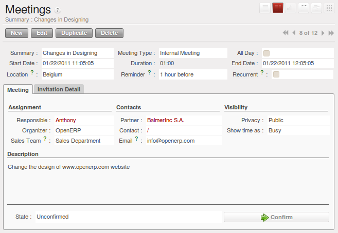

Tracking your Opportunities
===========================

While a lead represents the first contact with a prospect yet to be qualified, a sales opportunity
represents a potential contract. Each opportunity must be followed up by a salesperson spending time
to make a quotation or the cancellation of the opportunity.

Leads are generally handled en masse, with the automation of certain responses or emails.
Opportunities, on the contrary, are usually tracked one by one by the salespeople because it involves
a process of negotiation.

Just like leads, OpenERP provides several menus to handle sales opportunities efficiently. All opportunities can be found in the menu :menuselection:`Sales --> Sales --> Opportunities`.

To quickly create a new opportunity, use the menu :menuselection:`Sales --> Sales --> Opportunities` and click the `New` button.
You usually use this menu in the case where the opportunity is direct and has not been generated from a
lead. It can also be useful to create a shortcut to this menu so that you can quickly open a new
opportunity form when you need to – after a phone call, or an email, that needs followup.

The salesperson uses the menu :menuselection:`Sales --> Sales --> Opportunities` to track their opportunities by applying proper filters.
After various customer contacts, the salesperson can enter the information into the form to describe the activity. The `History` tab provides a history of all the information about the activity throughout its life. The activities are automatically reported on the partner form of the associated customer. To see this, open the `History` tab when you open the partner form.

   *History of events in a partner form*

When the leads have been converted into opportunities, the opportunities can be assigned to any
salesperson. Then you designate an opportunity manager in the company who is responsible for assigning the
new opportunities to different salespeople to suit their speciality, location or availability.

The manager can use the menu :menuselection:`Sales --> Sales --> Opportunities` and click the `Salesman` or `Group By` tab.
This gives you a list of all opportunities assigned to a salesperson. The manager can easily find unassigned opportunities, then enter the salesperson responsible for the opportunity into the field :guilabel:`Salesman`.

Geolocalize your Opportunities
==============================

.. index::
   single: module; crm_partner_assign

You can geolocalize your opportunities by using the module :mod:`crm_partner_assign`.

Install the crm_partner_assign module to use geolocalization when assigning opportunities to partners.

* Through Sales > Configuration > Leads & Opportunities > Partner Grade, create Partner grades, such as Gold Partner, Silver Partner, Ready Partner. These grades will be used to determine who gets assigned which kind of opportunities.

* Assign the grades to the partners on the Geo Localization tab of the partner form. Also assign a weight to determine the probability of assigning opportunities to a partner.

* Click the *Geo Localize* button to determine the GPS coordinates according to the address of the partner.

* Convert a lead from a partner nearby to an opportunity. Press the Geo Assign button on the Assignation tab of the opportunity. The most appropriate partner will be assigned.

* Click the Forward button to automatically send a mail to the assigned partner with all the details of the opportunity and the prospect.
 
* On the Geo Localization tab of the partner form, the assigned opportunity will be displayed. Of course, you can reassign the opportunity to another partner.

* Use the Opportunity Assignment Analysis for your reporting.

.. tip::
        Use the geolocalization together with the google_map module. This installs a Map button. When clicked, it will open a browser with the partner's location displayed in Google Maps.

In the partner form, the `Geo Localization` tab gives you the information you need.

   *Geo Localization in partner form*

Planning your Meetings effectively
==================================

There are several methods for entering a new meeting with a partner. The first method is to enter the meeting directly in the company calendar. To do that, use the menu :menuselection:`Sales --> Meetings --> Meetings`.

You can use the monthly, weekly or daily views to plan a meeting. To move between one mode and another use the buttons above and to the right of the calendar.

   *Meetings calendar in monthly view*

   *Meetings calendar in weekly view*

In the calendar you distinguish between multi-day events and events that last only for a few hours.
Multi-day events have a colored background whereas single events have a colored font. Each event
has a color that represents the user that created the meeting. You can filter the different users by
selecting them from the list at the left of the screen.

To enter a new meeting into the system you can click the day and the hour for a new meeting. In the
weekly and daily views you can also press the mouse left button on the calendar and slide the mouse
along to create an event of several hours. Open ERP then opens an entry screen for a new meeting.

   *Entering a new meeting*

.. tip:: Consolidated Calendar

    The advantage of integrated management is that the enterprise calendar will group several system
    events.
    Then in the Open ERP calendar you will automatically find both these meetings and such information
    as business opportunities, technical interventions, and requests for staff meetings.

Track your Phone Calls
======================

OpenERP allows you to manage incoming and outgoing calls.

Call management can be used for particular needs, such as:

* Entering customer calls so that you keep a record of the communication attached to a partner or a
  sales opportunity,

* Managing a call centre with operators who handle lists of calls to carry out one after another.

To enter details of a phone call, use one of the two following menus:

* :menuselection:`Sales --> Phone Calls --> Inbound` to register incoming calls,

* :menuselection:`Sales --> Phone Calls --> Outbound` to register outgoing calls,

The phone call will then be visible in the `History` tab of the `Partner` form to give you complete visibility of the
events for a customer or supplier.

.. Copyright © Open Object Press. All rights reserved.

.. You may take electronic copy of this publication and distribute it if you don't
.. change the content. You can also print a copy to be read by yourself only.

.. We have contracts with different publishers in different countries to sell and
.. distribute paper or electronic based versions of this book (translated or not)
.. in bookstores. This helps to distribute and promote the Open ERP product. It
.. also helps us to create incentives to pay contributors and authors using author
.. rights of these sales.

.. Due to this, grants to translate, modify or sell this book are strictly
.. forbidden, unless Tiny SPRL (representing Open Object Press) gives you a
.. written authorisation for this.

.. Many of the designations used by manufacturers and suppliers to distinguish their
.. products are claimed as trademarks. Where those designations appear in this book,
.. and Open Object Press was aware of a trademark claim, the designations have been
.. printed in initial capitals.

.. While every precaution has been taken in the preparation of this book, the publisher
.. and the authors assume no responsibility for errors or omissions, or for damages
.. resulting from the use of the information contained herein.

.. Published by Open Object Press, Grand Rosière, Belgium

