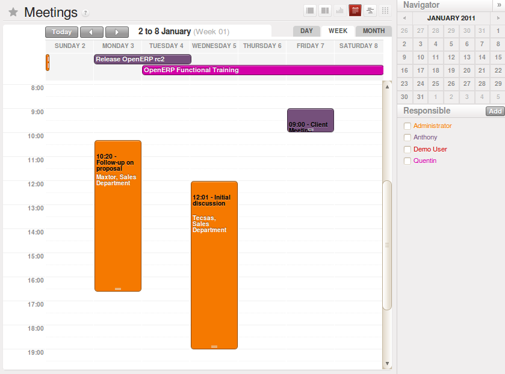
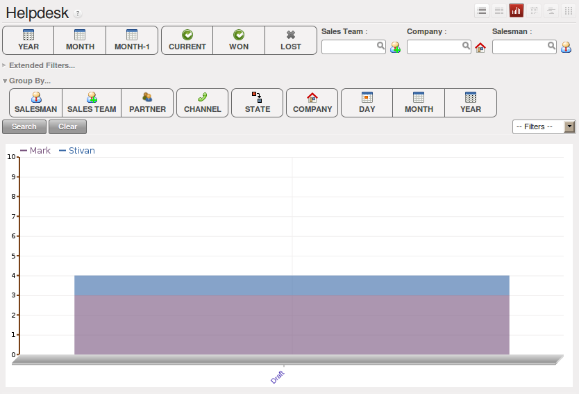
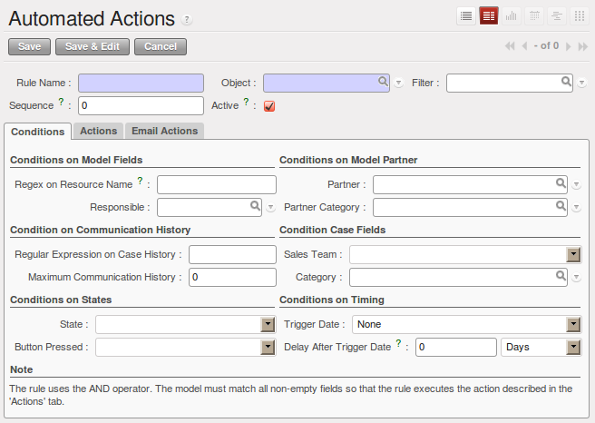

.. index:: calendars

Helpdesk Calendars
------------------

The OpenERP client can display any type of resource in the form of a timetable. You can
generate calendar views for each of your cases as you create menus for those cases.

So if you want to implement a shared calendar for your calendar in OpenERP all you need to use the menu
:menuselection:`Sales --> Meetings --> Meetings`.

You will get menus enabling you to manage calendars for each employee, and you will also get a shared
calendar for the company. This calendar view is totally dynamic. You can move an event or change its
duration just using your mouse.

   *Monthly view of the meeting calendar for cases*

You can change the view and return to the list view, forms or graphs by using the buttons at the top
right. Open ERP's usual search tools and filters enable you to filter the events displayed in the
calendar or, for example, to display the calendar for only some employees at a time.

   *Weekly view of the meeting calendar for cases*

.. note:: The generic calendar

	Unlike traditional CRM software, OpenERP's calendar view is not limited to displaying
	appointments. It is available for any type of resource.

	So in addition to the cases handled here, you could obtain calendars of tasks, deliveries,
	manufacturing orders, sales or personal leave.

	This view is very useful for planning or to get a global overview of a list of dated elements.

.. index:: performance analysis

Analyzing Performance
---------------------

Since all of your customer communications are integrated into the OpenERP system, you can analyse
the performance of your teams in many ways.

You can use menu :menuselection:`Sales --> Reporting` to view different statistical reports.

As for example statistical analysis of HelpDesk can be seen using the menu  :menuselection:`Sales --> Reporting -->
Helpdesk Analysis` and switch to `Graph` view.

   *Analyzing the performance of your HelpDesk support team*

The system shows you statistics per user and it is possible to filter on each section and use
other criteria for searching. For example, you can type in a date range, click :guilabel:`Filter`,
and see the graph change to reflect the new data.

By default, the system provides a list containing the following information for each month, user and
section, and an indication of the state of each set of information:

*  :guilabel:`number of cases`,

*  :guilabel:`average delay for closing` the request,

*  :guilabel:`estimated revenue` for a business opportunity,

*  :guilabel:`estimated cost`,

* estimate of revenue multiplied by the probability of success, to give you an :guilabel:`estimated weighted
  revenue` figure.

.. tip:: Navigating through the statistics

	You can obtain more information about a user or a case section from these reports, drilling down
	into the data displayed.

	In the web client you click the appropriate text string on one of the lines (such as
	:guilabel:`Demo User` or :guilabel:`Helpdesk and Support`) to open a form for it, and then click
	one of the buttons in the :guilabel:`Action` toolbar to the right of the User or Section form that
	is displayed.

	In the GTK client you would right-click over the text instead – this brings up a context menu with
	the same options as the web client would give you.

You can specify that the graph view, say, appears by default so that you can consistently present
the information more visually.

.. index::
   single: case; rule

Automating actions using rules
------------------------------

Analyzing figures gives you a better basis for managing all of your services and customer and
supplier relationships. But you can do more than just display the figures graphically from time to
time.

If the performance of a section, a user or a category of a case is beginning to cause concern then
you can use OpenERP's rules system to monitor the situation more closely. Rules enable you to
automatically trigger actions depending on criteria you define for each case. They provide a good
way of implementing a proper continuous improvement policy for your customer relations and quality
of service.

Using these rules you could:

* automatically send emails to the client during different phases of a support request, to keep the
  client up to date with progress,

* assign the case to another person if the the case manager is on holiday,

* send a reminder to the supplier if their response is delayed too long,

* always mark a case as urgent if it is from a major client,

* transfer the case to technical services if the request is about a technical fault.

To define new rules use the menu :menuselection:`Sales --> Configuration --> Automated Actions -->
Automated Actions` and click the `New` button.

   *Form to enter the Automated Action*

.. index::
   single: rule; case

The criteria for activating this rule are defined on the main part of the screen. These criteria
are:

* a condition about the initial state (for example during the creation of a case – initial state:
  \ ``None``\  , eventual state: \ ``Draft``\  ),

* a condition about the destination state (for example at the closure of a case to send a
  confirmation or thank you e-mail),

* the case section to which the rule applies,

* the category for the case,

* a condition about the manager of the case (for example to send copies of case progress to a
  manager if the client request is handled by a trainee),

* a condition about the priority level (for example to provide different types of reaction depending
  on the urgency of the request),

* a partner or a category to be applied to the rule,

* a date for the trigger

	- reporting by the date of creation

	- reporting by date of the last action

	- reporting by the length of time that it is been active.

If you have defined several criteria OpenERP will apply the rule only if all of the criteria are
valid.

You define the action that will be taken if the rule is met in the second tab of the lower part of
the setup window. The following actions are included:

* change the state of the case,

* move the case to a new section,

* assign the case to a system manager,

* change the priority of a case,

* send a reminder to the case manager or a partner,

* attach information (or not) to a reminder,

* send copies of the case discussion to specified email addresses,

* send a predefined email.

	.. note::  *Example 1 Improvement in the quality of support*

			For example, on the graph that analyses the performance of team support in Figure 4-6
			you can see that the Demo User takes an average time of 3 days and 4
			hours to close a customer support request. This is too long. After analyzing the data in depth,
			you can see that most cases were closed in less than two days, but some may take more than ten
			days.

			If you think that the quality of service should be improved you can automate certain actions. You
			could send copies of the discussion to a technical expert if the case remains open for longer
			than two days, defined by the following rule:

			* :guilabel:`Rule Name` : Copy to an expert after 2 days,

			* :guilabel:`Case state from` : Open,

			* :guilabel:`Case state to` : Open,

			* :guilabel:`Responsible` : Demo User,

			* :guilabel:`Trigger Date` : Creation date,

			* :guilabel:`Delay after trigger date` : 2 days,

			* :guilabel:`Add watchers (cc)` : expert@mycompany.com ,

			* :guilabel:`Remind responsible` : Yes.

			After the rule has been defined, the expert will receive a copy of the whole discussion between
			the Demo User and the customer for every case that remains unclosed after two days. He will be able
			to interact with the discussion to avoid lengthy delays on complex problems.

			Some companies use several support levels. The first level is handled by the least qualified
			support people and the higher levels by users who have the advantage of more experience. A user
			on level 1 can escalate the case to a higher level when necessary.

			To systematically train employees at level 1 you can create the following rule: when the case has
			been escalated they will continue to be copied on the progress of the case. If a user at support
			level 1 can not handle a request he can escalate it to level 2. Then when an expert at level 2
			answers the customer's request, the level 1 support person also receives the answer to the
			problem that he could not originally handle. So your team can be educated automatically from
			listening in to the passage of live support calls.

			Suppose that you supply two types of support contract to your customers: Gold and Normal. You can
			then create a rule which raises the priority of a case automatically if the partner is in the
			Gold Support Contract category.

			Define the case this way:

			* :guilabel:`Rule Name` : Priority to Gold Partners,

			* :guilabel:`Case state from` : /,

			* :guilabel:`Case state to` : Open,

			* :guilabel:`Partner Category` : Support Contract / Gold,

			* :guilabel:`Set priority to` : High.

			Improved client relations can flow from using such rules intelligently. With the statistical
			control system you can manage certain SLAs (Service Level Agreements) with your customers without
			a great deal of effort on your part. So you can be selective in replying to those of your
			partners based on the specific quality of service that you are contracted to supply.

	.. note::  *Example 2 Tracking supplier quality*

			Remember that an Open ERP partner can be a supplier as much as a customer. You can use the same
			mechanism for the management of supplier quality as you do for customer support.

			If any of your staff detect a quality problem with a product from a supplier they should create a
			new case in the Quality section. If the email gateway is installed all you need to do is copy an
			email to a specified address (for example complaints@mycompany.com) while sending your email of
			complaint to the supplier. The case is automatically created in Open ERP and the supplier's
			email response will close the case and be placed automatically in the case history.

			In this case the user can add corrective or preventative actions to conform to ISO 9001, without
			having to enter every action into OpenERP – most of the information comes just from the
			emails.

			The system's statistics provide analyses about the number and the cost of quality problems from
			different suppliers.

			If certain suppliers do not offer the service quality that you expect you can automatically create
			rules that:

			* send a reminder to the supplier after a few days if the case still remains open

			* remind the production manager to call the supplier and resolve the situation if the case has not
			  been closed within a week

			* select and qualify your suppliers on the basis of their quality of service

.. index:: gateway
   single: fetchmail

.. _ch-crm-fetchmail:

Using the e-mail gateway
------------------------

To automate the creation of current cases you can install the e-mail gateway.

The e-mail gateway enables you to use OpenERP's CRM without necessarily using the OpenERP
interface. Users can create up-to-date cases just by sending and receiving emails. This system works
with the major current email clients such as Microsoft Outlook, Thunderbird and
Evolution.

.. figure::  images/crm_gateway.png
   :scale: 50
   :align: center

   *Schematic showing the use of the e-mail gateway*

Installation and Configuration
^^^^^^^^^^^^^^^^^^^^^^^^^^^^^^

To use the e-mail gateway you must install the Fetchmail module. You might need a system administrator to carry out this work.

Install the Fetchmail module from the Configuration Wizard (CRM Configuration Wizard, Synchronization, Fetch Emails), or install it from the modules list.

*Step 1*

Go to :menuselection:`Tools --> Configuration --> Email Template --> Email Accounts` to define the e-mail smtp settings.

In the ``Description`` field, type the visible name you would like to use for the account.

In ``Server``, type the mail server, i.e. smtp.googlemail.com.

Type the SMTP port (e.g. 587), configure the other settings according to the specifications of your server.

Add the User Information, such as e-mail address for which the mails will enter OpenERP, i.e. support@mycompany.com, the user name and the password. Configure the other settings to your needs.

Save and click the ``Test Outgoing Connection`` button to check whether the settings are correct.

When everything is correctly configured, Approve the account. OpenERP will automatically create a Scheduler for the mails. You can also send/receive mails manually by clicking the ``Send/Receive`` button.

*Step 2*

Go to Sales > Configuration > Emails > Email Servers to define the e-mail server settings.

Assign a ``Name`` and select the ``Server Type``, i.e. IMAP Server.

Click ``Add Attachments`` if you want to include attachments for the mails received / sent.

Enter the Server Information, check SSL if necessary, i.e. imap.googlemail.com and the Login Information.

You can also choose to send an automatic reply on receipt of the mail. You can configure the mail here from the ``Email Server Action`` field.

Assign the ``Model`` to use when a new e-mail arrives, i.e. choose Helpdesk (crm.helpdesk) if you want every new e-mail that arrives to be created as a helpdesk case. 

Click Confirm to confirm the account settings.

On every e-mail check, OpenERP will create a new helpdesk case, or any other object according to the model you specified.
You can of course create as many accounts as you want and link them to different objects.

.. index:: fetchmail

.. index::
   single: case; create and maintain
..

Creating and maintaining cases
^^^^^^^^^^^^^^^^^^^^^^^^^^^^^^

Each time you start fetchmail it downloads all the e-mails and creates or updates the cases in CRM.
You can turn fetchmail into a daemon to check all new emails every five minutes by using the
OpenERP scheduler.

If you want to receive customer requests by e-mail you must first create a rule that automatically
assigns new cases to a specified user. You must then verify that this user possesses a suitable
e-mail address in the :guilabel:`Address` field within OpenERP.

To find out if the new e-mail should create a new case or update an existing case, OpenERP analyzes
the subject line of the email. Existing cases are identified by the case number in the subject line,
for example

Re: [101] Problem with ...

When a customer sends a new request by e-mail the case is automatically created and the e-mail is
transferred by the gateway to the user responsible for new cases, changing the subject line to add
the case identifier. The user can then respond by emailing or by using the OpenERP interface to
the case. If the user responds by e-mail the case can be automatically closed in OpenERP, keeping
the responses in the history list. If the partner responds again, the case is reopened.

.. Copyright © Open Object Press. All rights reserved.

.. You may take electronic copy of this publication and distribute it if you don't
.. change the content. You can also print a copy to be read by yourself only.

.. We have contracts with different publishers in different countries to sell and
.. distribute paper or electronic based versions of this book (translated or not)
.. in bookstores. This helps to distribute and promote the OpenERP product. It
.. also helps us to create incentives to pay contributors and authors using author
.. rights of these sales.

.. Due to this, grants to translate, modify or sell this book are strictly
.. forbidden, unless Tiny SPRL (representing Open Object Press) gives you a
.. written authorisation for this.

.. Many of the designations used by manufacturers and suppliers to distinguish their
.. products are claimed as trademarks. Where those designations appear in this book,
.. and Open Object Press was aware of a trademark claim, the designations have been
.. printed in initial capitals.

.. While every precaution has been taken in the preparation of this book, the publisher
.. and the authors assume no responsibility for errors or omissions, or for damages
.. resulting from the use of the information contained herein.

.. Published by Open Object Press, Grand Rosière, Belgium

