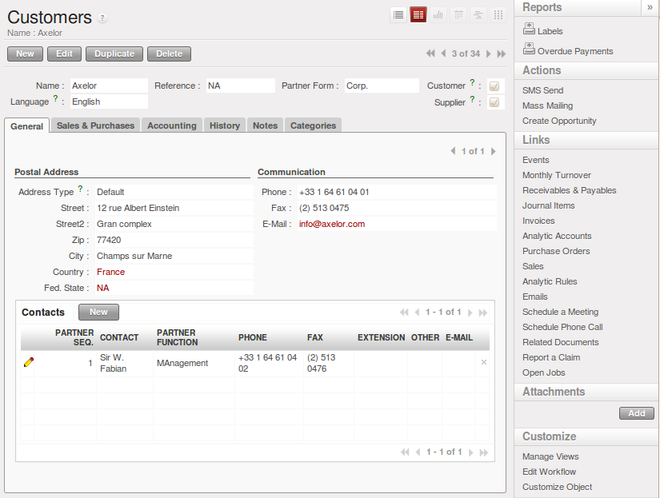

.. index::
   single: Partner
..

Organize your Partners
======================

In OpenERP, a partner represents all the entities that you can do business with. Some possible
different types of partners are:

* suppliers,

* manufacturers,

* customers,

* clients,

* employees,

* prospects.

The concept of a partner here is much more flexible than in many other management applications
because a partner can correspond to one type or a combination of several of these types. This avoids
double data-entry and provides greater flexibility in the features available.

So a partner can be both your supplier and your customer at the same time. This feature is
particularly important when you have subsidiaries or franchises since transactions between the
parent and its subsidiaries in these cases will generally be two-way.

Understanding Standard Fields
-----------------------------

.. todo: add info

To get a list of customer using demonstration data, use the menu :menuselection:`Sales -->
Address Book --> Customers`.

   *A customer form*

.. index::
   single: send SMS

To the right of the customer form you will find all of the actions, reports and shortcuts available to
the selected partner. This enables you to quickly send an SMS message, for example, or review a
partner's order history, or print a reminder letter.

.. tip::  Send an SMS message

	To send an SMS message from standard Open ERP you will have to place an order with the bulk SMS
	gateway operator Clickatell™http://clickatell.com.

	You will then receive an API number, a login and a password which you can use in Open ERP to send
	SMS messages to your partners.

	Or you can just develop a new module based on the inbuilt SMS functions, targeted at any of the
	other SMS service suppliers, and use that instead.

To send an SMS message to a partner or a selection of several partners, first select the partners
then click the :guilabel:`Send SMS` Action icon.

To create a company in OpenERP (that is – a new partner) you should at a minimum enter the
company's :guilabel:`Name` in the partner form.

.. Customizing Partner Fields
.. --------------------------

.. todo: add info

.. Creating and Updating Partners
.. ------------------------------

.. todo: add info

.. Performing Actions on Partners

.. todo: add info

.. Filtering your Partners
.. -----------------------

.. todo: add info

.. index:: Contact

Contacts / Addresses
--------------------

You can have several contacts for one partner. Contacts represent company employees that you are in
contact with, along with their address details. For each address you can indicate their type (\
``Default``\  , \ ``Invoice``\  , \ ``Delivery``\  , \ ``Contact``\   or \ ``Other``\  ). Based on
this, OpenERP can supply an address that matches the contact's function when generating documents
at various stages through an Order process.

Contacts can be entered into the first (:guilabel:`General`) tab of the :guilabel:`Customer` form,
or you can get direct access to the list of addresses through the :menuselection:`Sales -->
Address Book --> Addresses` menu.

You can search for a subset of Partners and Contacts using the search view.

.. note:: Independent partners or physical people

	If you want to represent a physical person rather than a company, in OpenERP, that person's name
	can be typed directly into the :guilabel:`Name` field on the Partner form. In this case do not put
	in any Contact Name.

.. index::
   pair: partner; category
..

Partner Categories
------------------

OpenERP uses hierarchical categories to organize all of its partners. To reach the list of
available partner categories, use the menu :menuselection:`Sales --> Configuration --> Address Book --> Partner Categories`.

   *List of Partner Category*

Double-click one of the categories in the partner category structure to get a list of the partners
in that category. If you click on a category that has sub-categories you will get a list of all of the
partners in the main category and in all of its subcategories.

Because categories are structured in a hierarchical manner, you can apply an action at any level of
the structure: a marketing promotion activity, for example, can be applied either to all customers,
or selectively only to customers in one category and its subcategories.

The tree structure is also very useful when you are running the various statistical reports. You can
structure reports at any level of the hierarchy using this partner segmentation.

In the following sections you will see how to assign partners to categories manually (perhaps for a
newsletter subscription or as a hot prospect), or automatically using segmentation rules.

Use the menu :menuselection:`Sales --> Configuration --> Address Book --> Partner Categories` and click the `New` button to
define a new category.

.. Copyright © Open Object Press. All rights reserved.

.. You may take electronic copy of this publication and distribute it if you don't
.. change the content. You can also print a copy to be read by yourself only.

.. We have contracts with different publishers in different countries to sell and
.. distribute paper or electronic based versions of this book (translated or not)
.. in bookstores. This helps to distribute and promote the Open ERP product. It
.. also helps us to create incentives to pay contributors and authors using author
.. rights of these sales.

.. Due to this, grants to translate, modify or sell this book are strictly
.. forbidden, unless Tiny SPRL (representing Open Object Press) gives you a
.. written authorisation for this.

.. Many of the designations used by manufacturers and suppliers to distinguish their
.. products are claimed as trademarks. Where those designations appear in this book,
.. and Open Object Press was aware of a trademark claim, the designations have been
.. printed in initial capitals.

.. While every precaution has been taken in the preparation of this book, the publisher
.. and the authors assume no responsibility for errors or omissions, or for damages
.. resulting from the use of the information contained herein.

.. Published by Open Object Press, Grand Rosière, Belgium

