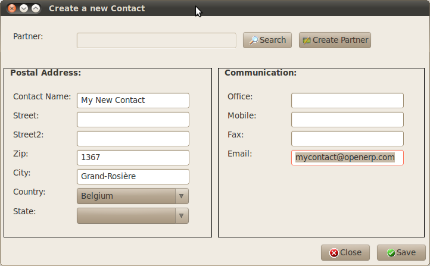

.. index::
   single: Thunderbird (Mozilla)

Mozilla Thunderbird interface
=============================

With the Mozilla Thunderbird plugin you can carry out a series of OpenERP operations directly from Thunderbird, such as:

* create a contact or partner from an e-mail,

* save an e-mail and its attachments in OpenERP,

* send any attachment to an OpenERP document (such as proposals, projects, and tasks).

Installing the Thunderbird plugin
---------------------------------

* Step 1: install the Thunderbird plugin in OpenERP

Use the OpenERP Configuration Wizard and install the ``Customer Relationship Management`` application. In the *CRM Application Configuration* dialog under Plug-In, select Thunderbird.
Then the *Thunderbird Plug-In* wizard appears. Next to the ``Thunderbird Plug-in`` field, click the ``Save As`` button to save the plugin to your desktop (or any other location on your computer).

You can also download the installation manual by clicking the orange arrow next to ``Installation Manual``.  

Another way to use the Thunderbird plugin, is by installing the OpenERP module \
``thunderbird``\. When you install this module, the same Configuration Wizard as explained before will be displayed. Follow the same instructions.

* Step 2: install the OpenERP extension in Thunderbird.

To do that, use the file \``openerp_plugin.xpi``\ that you saved on your desktop. 

Then proceed as follows:

	#. From Thunderbird, open the menu :menuselection:`Tools --> Add-ons`.

	#. Click Extensions, then click the :guilabel:`Install` button.

	#. Go to your desktop and select the file \ ``openerp_plugin.xpi``\. Click Open.

	#. Click :guilabel:`Install Now` then restart Thunderbird.

Once the extension has been installed, a new ``OpenERP`` menu item is added to your Thunderbird menubar. 

.. tip::  Thunderbird version

	The OpenERP plugin for Thunderbird only works with Thunderbird version 2.0 and above.

	So check your Thunderbird version before installing, and download the latest version that you need
	from the following address: http://www.mozilla.org/products/thunderbird/

Configuring the Thunderbird plugin
----------------------------------

When you have executed Installation Step 1 and Step 2, the first thing to do is connect Thunderbird to OpenERP.
A little configuration needs to be done.

.. note:: Before starting the configuration, make sure your gtk server and web server are running (xml-rpc should be allowed).

Go to the ``OpenERP`` menubar and select :guilabel:` Configuration`.

A configuration window appears enabling you to enter configuration data about your OpenERP server.

.. figure::  images/thunderbird_config.png
   :scale: 50
   :align: center

   *How to Connect to the Server*

	#. On the ``Configuration Settings`` tab, under *Connection Parameters* click the :guilabel: `Change` button
	   and type your server settings and xml-rpc port, e.g. ``http://127.0.0.1:8069``,

	#. Select the database you want to connect to, and type the user and the password required to log in to the database,

	#. Click the :guilabel: `Connect` button,

	#. On the ``Configuration Settings`` tab, under *Webserver Parameters* click the :guilabel: `Change` button
	   and type your web server settings, e.g. ``http://localhost:8080``,

	#. Click the :guilabel: `Open` button to test the connection.

When your connection has succeeded, you would typically want to configure Thunderbird to fit your needs.

To define extra document types, go to the :guilabel: `Document Settings` tab. This is the place where you can add objects from OpenERP that you wish to link mails to. The default installation comes with a number of predefined documents, such as Partners, Leads and Sales Orders.

Here is an example of how to configure extra document types. Suppose you would like to link mails to a purchase order.

	#. In the :guilabel: `Title`, type Purchase Order,

	#. In the :guilabel: `Document`, type the object from OpenERP, in this example ``purchase.order``,

	#. In the :guilabel: `Image`, select an icon you would like to use,

	#. Click the :guilabel: `Add` button to actually create the document type.

.. note:: To find the object you need in OpenERP, go to the menu :menuselection:`Administration --> Customization --> Database Structure --> Objects`. OpenERP will only show objects for which the corresponding Business Applications / Modules have been installed. You can only add objects to Thunderbird that are available in the selected database.

   *How to Add Extra OpenERP Document Types to Thunderbird?*

Using the Thunderbird plugin
----------------------------

You can use the menu :menuselection:`OpenERP` for several things.

The :guilabel: `Push` option allows you to archive e-mails to OpenERP, either to new document types or to existing ones. It also allows you to create a new contact.

The :guilabel: `Partner` allows you to open the Partner in OpenERP according to the e-mail (i.e. contact e-mail address) selected. 

With the :guilabel: `Document`, you can open the document concerned in OpenERP. Make sure you are logged in to the web version to use this functionality. You have to open the mail to use this feature. 

* Link a mail to an existing document in OpenERP

   *How to Access OpenERP from Thunderbird?*

To archive an e-mail in OpenERP from Thunderbird, select the e-mail and click the :guilabel:`Push` button. Alternatively you can open the menu :menuselection:`OpenERP --> Push`: the ``Push to OpenERP`` screen will open.

In the ``Link to an Existing Document`` section, select an object to which you like to add to your email and its attachments. You
can select any object you defined in the ``Document Settings`` section and attach the selected mail to the selected record.
The plugin also allows you to select several documents at once, simply by selecting a document and pressing the ``ctrl`` button when selecting the next document.

Do not forget to click the ``Search`` button to refresh the Documents list when you have selected a different document type.    

* Create a New Document

This feature can be used to create any of the configured document types in the ``Document Settings`` tab.
Suppose you would like to create a new lead from an e-mail. In the ``Create a New Document`` section, select ``CRM Lead``, then click the ``Create`` button. A new lead will be created in OpenERP from the selected e-mail.

* Create a New Contact / Partner

If you cannot find a partner or contact for your e-mail in OpenERP, the Thunderbird plugin allows you to
create one on the fly simply by using the information contained in the e-mail.

Select the e-mail from which you want to create a new contact, then click the ``Push`` button.
In the ``Create a New Contact`` section, click the ``New Contact`` button. This option offers two possibilities:
either you just create a contact (address), or you create a partner with the contact linked to it.

	- When you just want to create a new contact, complete the address data in the dialog box and click the ``Save`` button.
	  The contact will then be created in OpenERP.

	- When you also want to create a new partner, complete the contact data.
	  Then click the ``Create Partner`` button, add the partner's name and click the ``Save`` button.

	- You can also add a new contact to an existing partner. Click the ``Search`` button next to the Partner field
	  and select the corresponding partner from the list. Then complete the contact data and click the ``Save`` button.

   *Creating a contact on the fly from Thunderbird*

* Open the Document created in OpenERP

To access archived data from different documents in OpenERP you can use the menu :menuselection:`OpenERP --> Document` which allows you to access the document in OpenERP directly from your e-mail.

.. tip:: Knowledge Management

	The Thunderbird plugin is compatible with OpenERP's Knowledge (i.e. Document) Management. If you install the
	Knowledge application you will be able to:

	* search through the content of your company's documents (those that have the type .doc, .pdf, .sxw
	  and .odt) and also in archived emails,

	* have a shared file system that is connected to various OpenERP documents to share information and
	  access it with your favorite browser,

	* organize and structure your documents (such as projects, partners and users) in OpenERP's
	  system.

.. note:: Testing the Thunderbird plugin

	If you install the Thunderbird plugin as described,
	explore its functionality as described in this section using the database you 
	installed.

.. Copyright © Open Object Press. All rights reserved.

.. You may take electronic copy of this publication and distribute it if you don't
.. change the content. You can also print a copy to be read by yourself only.

.. We have contracts with different publishers in different countries to sell and
.. distribute paper or electronic based versions of this book (translated or not)
.. in bookstores. This helps to distribute and promote the Open ERP product. It
.. also helps us to create incentives to pay contributors and authors using author
.. rights of these sales.

.. Due to this, grants to translate, modify or sell this book are strictly
.. forbidden, unless Tiny SPRL (representing Open Object Press) gives you a
.. written authorisation for this.

.. Many of the designations used by manufacturers and suppliers to distinguish their
.. products are claimed as trademarks. Where those designations appear in this book,
.. and Open Object Press was aware of a trademark claim, the designations have been
.. printed in initial capitals.

.. While every precaution has been taken in the preparation of this book, the publisher
.. and the authors assume no responsibility for errors or omissions, or for damages
.. resulting from the use of the information contained herein.

.. Published by Open Object Press, Grand Rosière, Belgium

