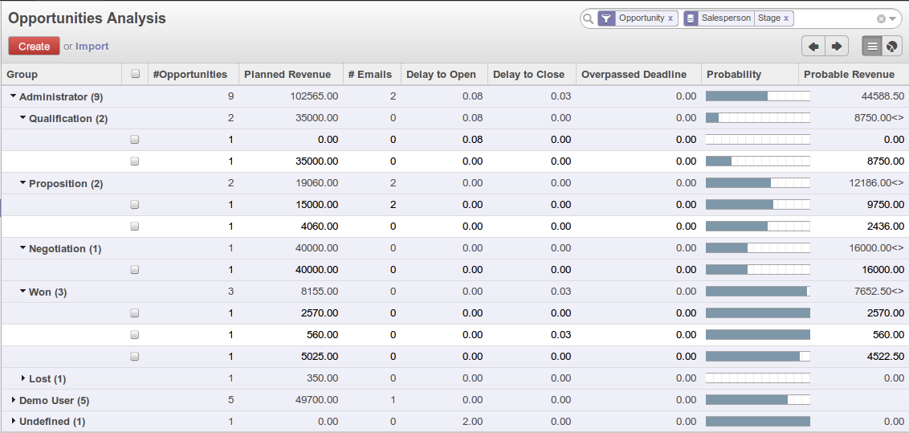
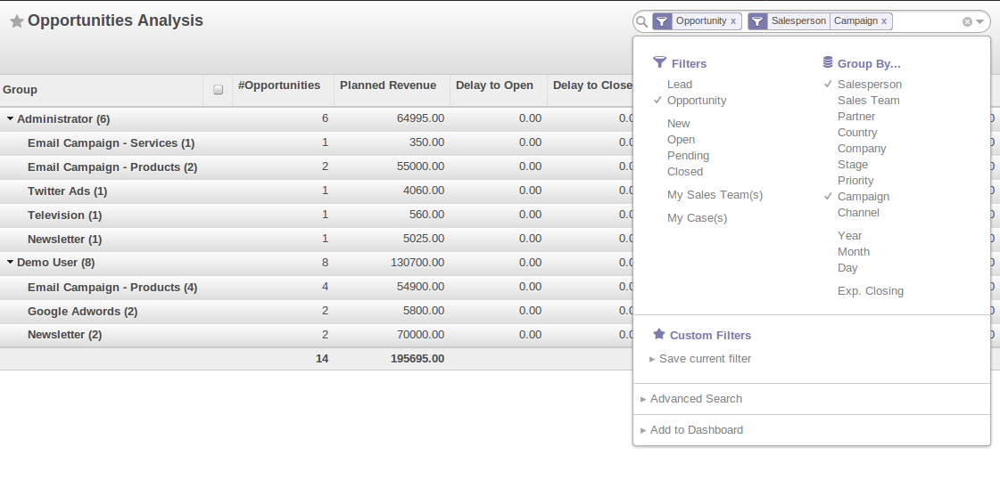

.. _part2-crm-reporting:

Analysing your Sales Performance
================================

Organizing Sales Funnel Reviews
-------------------------------

Through the **Opportunities Analysis**, :menuselection:`Reporting --> Sales`, you can keep track of your sales funnel. The analysis report gives you instant access to your opportunities displaying information such as planned revenue, probable revenue, overpassed deadline or the number of interactions per opportunity. This report is perfect for the Sales Manager to periodically review the sales pipeline with the salesteams concerned.

   *Sales Funnel Review*

The powerful `Advanced Search View` allows you to customize your analysis reports by using Group by features.

You can select specific options to filter your opportunities. For example, when you select a partner here and type partner name, only opportunities related to that specific partner will be displayed.

You can also filter the information of an opportunity according to the `Group by` features. 
Suppose you want to analyse your opportunities by campaign and by salesperson. When you open the **Opportunities Analysis** screen, you will notice that the opportunities are by default grouped by salesperson (see `Salesperson` button in the Group by area).

Since you want to group by `Campaign` first, click the `Salesman` button to uncheck it. Just click the `Campaign` button, then click `Salesperson` to get the report you want.

   *Opportunities Analysis*

Some examples of how you could use the **Opportunities Analysis** report to analyse your opportunities in various ways.

* 1. Customers with Open Opportunities:

        Group by `Partner`, check the `Open` to provide a list with the customer names and the number of draft / open opportunities.

* 2. Closed Opportunities:

        Check the `Closed` on filters, then group by `State`, then by `Stage` to display a list of closed opportunities divided by stage (lost and won).

* 3. Opportunity Sources:

        The number of opportunities can be displayed by closing date and sales stage, including Planned Revenue. Select only the Closed opportunities, group by Date, then by Stage to obtain this view. 

* 4. Opportunity Pipeline:

        To get an idea of what your salesperson's pipeline is like (or sales team), including the planned sales volume, select the Open and group by Salesman (or Sales Team).

* 5. Opportunities by Category:

        Click the `Graph` button in the Opportunities screen to display the report as a Graph.

.. tip:: Graph

      You can also display the **Opportunities Analysis** screen as a graph.   

.. Copyright © Open Object Press. All rights reserved.

.. You may take electronic copy of this publication and distribute it if you don't
.. change the content. You can also print a copy to be read by yourself only.

.. We have contracts with different publishers in different countries to sell and
.. distribute paper or electronic based versions of this book (translated or not)
.. in bookstores. This helps to distribute and promote the OpenERP product. It
.. also helps us to create incentives to pay contributors and authors using author
.. rights of these sales.

.. Due to this, grants to translate, modify or sell this book are strictly
.. forbidden, unless Tiny SPRL (representing Open Object Press) gives you a
.. written authorisation for this.

.. Many of the designations used by manufacturers and suppliers to distinguish their
.. products are claimed as trademarks. Where those designations appear in this book,
.. and Open Object Press was aware of a trademark claim, the designations have been
.. printed in initial capitals.

.. While every precaution has been taken in the preparation of this book, the publisher
.. and the authors assume no responsibility for errors or omissions, or for damages
.. resulting from the use of the information contained herein.

.. Published by Open Object Press, Grand Rosière, Belgium

