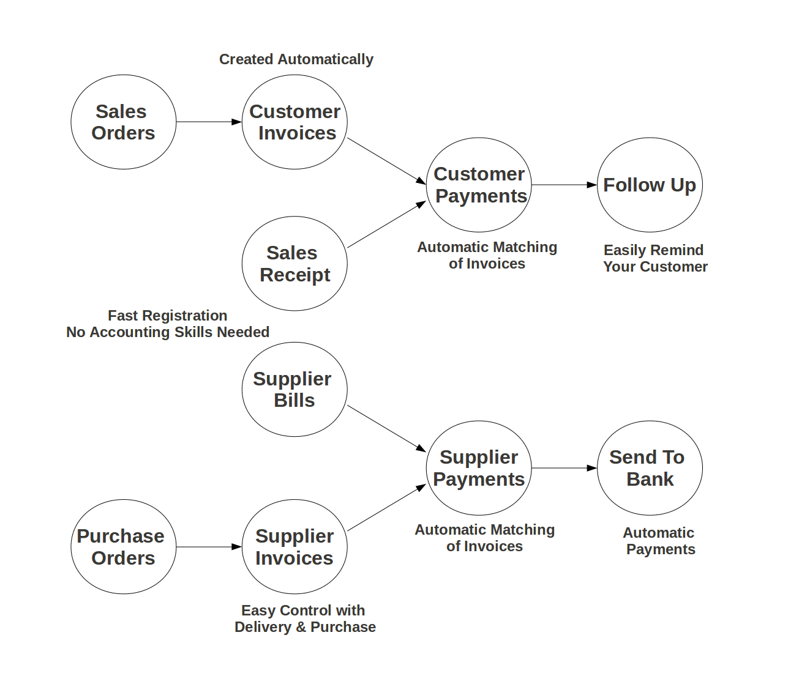
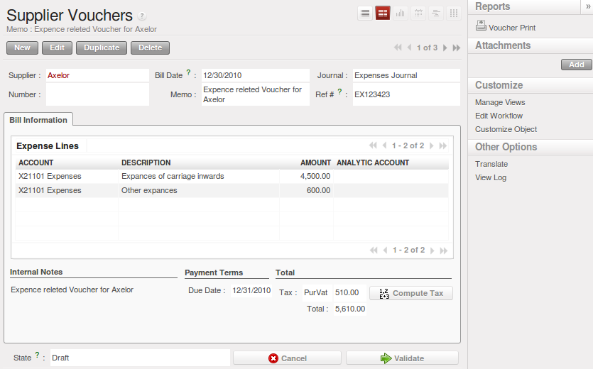
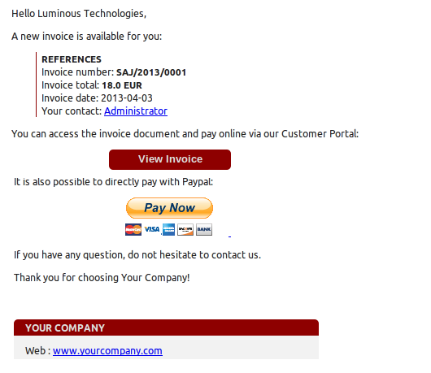
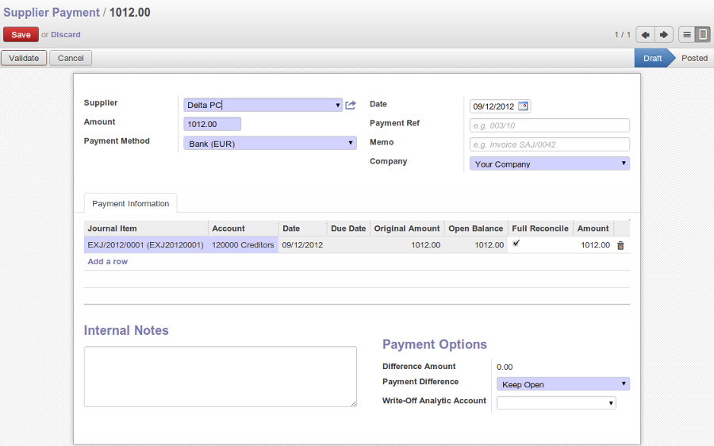

.. raw:: latex

    \afterpage{\clearpage}

In OpenERP, the invoicing workflow is very simple. You can see it in the following figure:

   *Invoicing Workflow*

An invoice can be generated from various documents like a `Sales Order`, a `Purchase Order` and also at the time of confirming a shipment. These methods will be used when you use OpenERP as a true accounting system.

Of course, companies often work together with an external accountant who keeps their books. In that case, you would like to know which invoices exist and have been paid.

The specific and easy-to-use `Invoicing` system in OpenERP allows you to keep track of your accounting, even when you are not an accountant.
It provides an easy way to follow up your suppliers and customers. You could use this simplified accounting when your (external) account keeps your books, but you would like to keep track of payments. The Invoicing system includes receipts and vouchers (an easy way to keep track of sales and purchases) as well as payment registration without the need to encode complete abstracts of account.

Simple Customer Receipts
------------------------

When you sell products to a customer, you can give him an invoice or a `Sales Receipt`, which is also called `Customer Receipt`.
Sales Receipts are merely a kind of sales ticket and not a real invoice.

When the sales receipt is confirmed, OpenERP creates journal items automatically and you can record the customer payment related to this sales receipt. The easy invoicing system does not require extensive accounting setup, and so you will be up and running quickly!

You can create and modify the sales receipt using the menu :menuselection:`Accounting --> Customers --> Sales Receipt`.

.. figure::  images/account_customer_receipt.png
   :scale: 75
   :align: center

   *Defining a Customer Receipt*

When you create a new `Sales Receipt`, you have to enter the `Customer` for whom you want to create a voucher. You can also define `Sales Lines` in the `Sales Information` tab. Here you have to define `Account`, `Amount` and `Description`.
At the bottom of the form, you will have two options for `Payment`: one is `Pay Directly` and another is `Pay Later or Group Funds`.
You have to enter the `Account` in the case of the `Pay Directly` option. The `Total` amount displays automatically with calculation of tax when you click the `Compute Tax` button.

After validating the sales receipt, you can print the voucher by clicking the `Voucher Print` action at the
upper right side. The voucher will be printed as follows.

.. figure::  images/account_sale_voucher.png
   :scale: 75
   :align: center

   *Sales Voucher*

When you purchase products from a supplier, a `Supplier Voucher` (a ticket) is given to you which is also called `Notes Payable`
in accounting terminology. When a supplier voucher is confirmed, it creates journal items automatically and you can record
the supplier payment related to this purchase receipt.

You can create and modify the supplier voucher through the menu :menuselection:`Accounting --> Suppliers --> Supplier Vouchers`.

   *Definition of Supplier Voucher*

The `Supplier Voucher` form looks like the `Sales Receipt` form. In this form, carefully select the journal. After validating the `Supplier Voucher`, you can print it using the `Voucher Print` action.

.. figure::  images/account_purchase_voucher.png
   :scale: 75
   :align: center

   *Supplier Voucher*

Invoice your Customers
----------------------

The new email and invoicing system in OpenERP allows you to create an invoice and automatically send an email with the invoice link to the customer.

The customer then has several options. If your customer also has an OpenERP instance, he can easily import the invoice you have sent him, simply by clicking the link.

It is surprising to see that in the 21rst century, most companies still process Quotations & Invoices manually, mostly by post or e-mail. The trend is clearly for personal communication to disregard these legacy media, replacing them with instant messaging, social networks, etc. The Electronic Data Interchange (EDI) platform is here to try opening OpenERP to more modern communication systems, where electronic documents are exchanged and synchronized in real-time between business partners. We will initially support a simple EDI mechanism for certain OpenERP documents, like Sales Orders, Purchase Orders and Invoices. We defined a simple and modern electronic format (JSON-based) to represent these documents, and we have added import/export capabilities in this format for the corresponding OpenERP business objects.

The flow will be as follows:

1. Your company issues a Sales Order, a Purchase Order or an Invoice for a specific partner, let's say Agrolait.

2. Partner Agrolait receives an email with a link to an online preview of the document.

3. In the online preview of the document, Agrolait can read the document, download or print the PDF version, and then choose between a few
options:

  a. import this document in his own OpenERP instance, simply by providing its address

  b. ask to create a new OpenERP online instance, where the document will be pre-imported

  c. ask for the raw EDI document, which the partner then can import in his own third-party software, possibly via a corresponding EDI import system

4. Partner Agrolait can also choose to directly pay online via Paypal or any other mechanism provided by your company.

The email notification is freely customizable as an Email Template, and the online preview of the EDI document can be customized with a 6.1-web-addon.

To get the EDI and automatic emailing of orders and invoices to work, you will have to install the :mod:`EDI` module.
You have to add an email adress to the partner, and make sur the "Opt-out" checkbox is not selected. Ask your system administrator to configure an Outgoing Mail Server. Note that email notifications will be added to a mail queue, but you can force emails to be send directly from the :menuselection:`Tools --> Message`.

The email your customer will receive, will look like the image displayed.

   *Mail to Your Customer*
 

Keep Track of your Customer's Payments
--------------------------------------

You should efficiently keep track of payments of your customers and suppliers. People who have no accounting knowledge and just want to use OpenERP to keep track of their payments, can work with the ``Invoicing & Payments`` access rights for such kind of user.

:guilabel:`Customer Payment` allows you to register the payments you receive from your customers.
In order to record a payment, you have to enter the customer, the payment method (= the journal) and the payment amount. OpenERP will automatically propose the reconciliation of this payment with open invoices or sales receipts.

You can do this in OpenERP using the menu :menuselection:`Accounting --> Customers --> Customer Payment`; click `New` to enter a new payment.

.. figure::  images/account_customer_payment.png
   :scale: 75
   :align: center

   *Customer Payment*

Suppose you have an invoice of 3000 EUR; the amount you actually receive from the customer is 2995 EUR (because of exchange rate differences, for example). You would consider the invoice as entirely paid. How would you proceed?

To create a new `Customer Payment`, select the customer, key in the `Paid Amount`, e.g. 2995 and select the `Payment Method`, i.e. your bank journal. Any open invoices, credit notes or advances for this partner will be displayed on the ``Payment Information`` tab.
In this example, the 3000 EUR invoice will be proposed. Now to consider this invoice as fully paid, you have to open the journal item on the ``Payment Information`` tab and change the amount to 3000.

Now select the proper ``Payment Difference``, i.e. `Reconcile Payment Balance` (you would use the `Keep Open` option if you want to claim the 5 EUR from the customer)agaplan. In the case of `Reconcile Payment Balance`, the write-off amount will be proposed automatically, but you have to enter the `Counterpart Account` so that accounting entries can be generated by OpenERP. You can also enter a comment about the reconciliation.

In the case you want to keep the invoice open, simply leave the default ``Keep Open`` option and post your payment.

This easy payment system also allows you to post a payment as an advance that you cannot directly attribute to a customer.

Let us take the following example. A customer has two open invoices, one of 2000, one of 1500. He pays 1000, but you cannot assign this to any of the two invoices directly. You can just enter this payment as an advance. How do you proceed?

When you key in an ``Amount paid`` of 1000 in your `Customer Payment`, the amount will be attributed to the oldest invoice. Now you do not want this, because you have no idea yet of what invoice the amount should be linked to. Click the amount in the first line and set it to 0.
Validate the payment. The system will now create an advance payment of 1000 for the customer concerned.

The supplier payment form allows you to track the payment to your suppliers in the same way as a customer payment.

Through the menu :menuselection:`Accounting --> Suppliers --> Supplier Payment`, click the `New` button to create a new `Supplier Payment`.

   *Supplier Payment Form*

Another way of keeping track of your payments is the way accountants will do it, by encoding Bank Statements. For more information about this, please refer to the chapter Advanced Invoice Management.

You can also install a module to import your payments electronically through a CODA file you receive from the bank. To do this install the module :mod:`account_coda`.

How should you proceed?

You have to enter your company's bank account(s) for which you want to have CODA files. Go to the menu :menuselection:`Accounting --> Configuration --> Financial Accounting --> Accounts --> Setup your Bank Accounts`. Choose the bank account type you want to use (IBAN or normal bank account). If you use IBAN, do not forget to also enter your bank's' BIC code.

.. tip:: Bank Journal

    When you save the bank account, a bank journal will be automatically created for that account.

Then add the bank account details for each partner that will pay you through a bank. You can do this in the Partner form, on the ``Accounting`` tab.

Download the CODA file from your bank to any directory. Import the electronic bank statement through the menu :menuselection:`Accounting --> Periodical Processing --> Statements --> Import Coda Statements`.

Enter the data required in the wizard (receivable and payable account, bank journal and a default account to post to when no corresponding partner is found). Then select the CODA file on your directory and click the ``Import`` button to start processing the CODA file.

OpenERP will then import a draft bank statement in the selected journal and will match all corresponding customer / supplier payments when possible. You can change the draft statement if necessary from the menu :menuselection:`Accounting --> Bank and Cash --> Bank Statements`. You can check any issues during file loading from the menu :menuselection:`Accounting --> Bank and Cash --> Coda Import Logs`.

.. Copyright © Open Object Press. All rights reserved.

.. You may take electronic copy of this publication and distribute it if you don't
.. change the content. You can also print a copy to be read by yourself only.

.. We have contracts with different publishers in different countries to sell and
.. distribute paper or electronic based versions of this book (translated or not)
.. in bookstores. This helps to distribute and promote the OpenERP product. It
.. also helps us to create incentives to pay contributors and authors using author
.. rights of these sales.

.. Due to this, grants to translate, modify or sell this book are strictly
.. forbidden, unless Tiny SPRL (representing Open Object Press) gives you a
.. written authorisation for this.

.. Many of the designations used by manufacturers and suppliers to distinguish their
.. products are claimed as trademarks. Where those designations appear in this book,
.. and Open Object Press was aware of a trademark claim, the designations have been
.. printed in initial capitals.

.. While every precaution has been taken in the preparation of this book, the publisher
.. and the authors assume no responsibility for errors or omissions, or for damages
.. resulting from the use of the information contained herein.

.. Published by Open Object Press, Grand Rosière, Belgium
