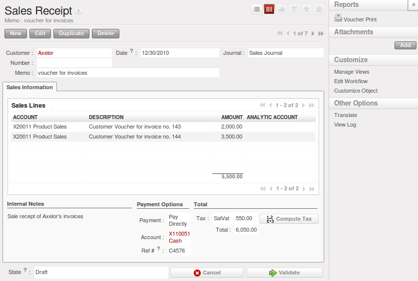

Invoicing Workflow
==================

In OpenERP, Invoice  Workflow is very simple. You can see it in the following figure.

   *Invoice workflow*

Invoice document can be generated form various other documents like `Sale Order`, `Purchase Order` and also
at the time of confirmation of shipment. So the systematic treatment of Invoice is very important. Whenever
invoice is generated, first of all it has to be in `Draft` state and hence no effect of it anywhere in your
`Accounting System`. Invoice state can be changed to `Open` by accountant or in `Pro-forma` state by any other
normal user. After that invoice will be in `Paid` state. Invoice can be cancelled if it is not paid.

Customer Receipts / Supplier Vouchers
-------------------------------------

When you sell products to a customer, you can give him an invoice or a `Sale Receipt` which is also called `Customer Receipt`.
When the sales receipt is confirmed, it creates journal items automatically and you can record the customer payment related
to this sales receipt.

You can create and modify the sale receipt using the menu :menuselection:`Accounting --> Customers --> Sales Receipt`.

   *Definition of Customer Receipt*

You can create and modify the supplier voucher through the menu :menuselection:`Accounting --> Customers --> Supplier Vouchers`.

.. figure::  images/account_supplier_voucher.png
   :scale: 50
   :align: center

   *Definition of Supplier Voucher*

Keep Track of your Payments
---------------------------

.. Copyright © Open Object Press. All rights reserved.

.. You may take electronic copy of this publication and distribute it if you don't
.. change the content. You can also print a copy to be read by yourself only.

.. We have contracts with different publishers in different countries to sell and
.. distribute paper or electronic based versions of this book (translated or not)
.. in bookstores. This helps to distribute and promote the Open ERP product. It
.. also helps us to create incentives to pay contributors and authors using author
.. rights of these sales.

.. Due to this, grants to translate, modify or sell this book are strictly
.. forbidden, unless Tiny SPRL (representing Open Object Press) gives you a
.. written authorisation for this.

.. Many of the designations used by manufacturers and suppliers to distinguish their
.. products are claimed as trademarks. Where those designations appear in this book,
.. and Open Object Press was aware of a trademark claim, the designations have been
.. printed in initial capitals.

.. While every precaution has been taken in the preparation of this book, the publisher
.. and the authors assume no responsibility for errors or omissions, or for damages
.. resulting from the use of the information contained herein.

.. Published by Open Object Press, Grand Rosière, Belgium
