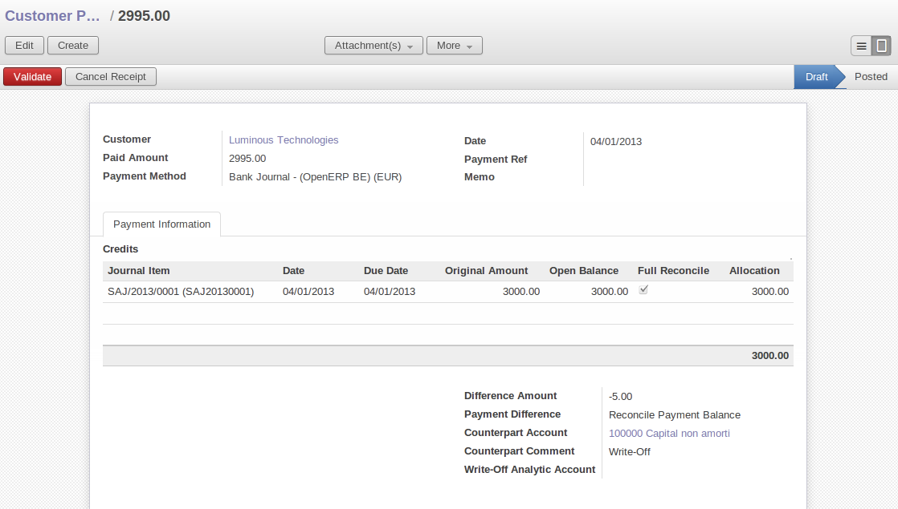

Invoicing Workflow
==================

In OpenERP, Invoicing  Workflow is very simple. You can see it in the following figure.

.. figure::  images/account_invoice_workflow.png
   :scale: 50
   :align: center

   *Invoiceing workflow*

Invoice document can be generated form various other documents like `Sale Order`, `Purchase Order` and also
at the time of confirmation of shipment. So the systematic treatment of Invoicing Workflow is very important. Whenever
invoice is generated, first of all it has to be in `Draft` state and hence no effect of it anywhere in your
`Accounting System`. Invoice state can be changed to `Open` by accountant or in `Pro-forma` state by any other
normal user. After that invoice will be in `Paid` state. Invoice can be cancelled if it is not paid.

Customer Receipts / Supplier Vouchers
-------------------------------------

When you sell products to a customer, you can give him an invoice or a `Sale Receipt` which is also called `Customer Receipt`.
When the sales receipt is confirmed, it creates journal items automatically and you can record the customer payment related
to this sales receipt.

You can create and modify the sale receipt using the menu :menuselection:`Accounting --> Customers --> Sales Receipt`.

.. figure::  images/account_customer_receipt.png
   :scale: 75
   :align: center

   *Definition of Customer Receipt*

When you create new `Sales Receipt` you have to enter the `Customer` in it for which you want to create voucher. You can also define `Sales lines`
in the `Sales Information` tab. In which you have to define `Account` with `Analytic Account`, `Amount` and `Description`.
At the bottom of the form you can have two option for `Payment` one is `Pay Directly` and another is `Pay Later or Group Funds`.
You have to enter `Account` in the case of `Pay Directly` option. `Total` amount displays automatically with calculation of tax while
click on the `Compute Tax` button.

After the validating the sales receipt you can print the voucher by clicking on the button `Voucher Print` at the
upper right side. The voucher will be printed like this.

   *Sale Voucher*

When you purchase products from supplier, `Supplier Voucher` is given to you which is also called `Notes Payable`
in accounting terminology. When the it is confirmed, it creates journal items automatically and you can record
the supplier payment related to this purchase receipt.

You can create and modify the supplier voucher through the menu :menuselection:`Accounting --> Suppliers --> Supplier Vouchers`.

.. figure::  images/account_supplier_voucher.png
   :scale: 75
   :align: center

   *Definition of Supplier Voucher*

The `Supplier Voucher` form looks like same as `Sales Receipt` form. In this form carefully select the journal,
in this case it is `Expenses Journal`. After validating the `Supplier Voucher` you can print it using `Voucher Print`
button.

.. figure::  images/account_purchase_voucher.png
   :scale: 50
   :align: center

   *Supplier Voucher*

Keep Track of your Payments
---------------------------

You should efficiently keep track of payments of your customers and suppliers.

Sales payment allows you to register the payments you receive from your customers.
In order to record a payment, you must enter the customer, the payment method (=the journal)
and the payment amount. OpenERP will propose to you automatically the reconciliation of this
payment with the open invoices or sales receipts.

You can do this in OpenERP using the menu :menuselection:`Accounting --> Customers --> Customer Payment`.

   *Customer payment form*

To create new `Customer Payment` select the customer and `Payment Method`. You can add invoice and other transaction in
the `Payment Information` tab. Now select proper `Payment Difference` form `Keep Open` and
`Reconcile with Write-Off`. In the case of `Reconcile with Write-Off` the write-off amount will come automatically
but you have to enter the `Write-Off account` so that accounting entries can be generated by OpenERP.

The supplier payment form allows you to track the payment you do to your suppliers.
When you select a supplier, the payment method and an amount for the payment,
OpenERP will propose to reconcile your payment with the open supplier invoices or bills.

By using the menu :menuselection:`Accounting --> Suppliers --> Supplier Payment` and click on `New` button to
create new `Supplier Payment`.

.. figure::  images/account_supplier_payment.png
   :scale: 50
   :align: center

   *Supplier payment form*

To create new `Supplier Payment` select the supplier and `Payment Method`. You can create the `Supplier Invoices and Outstanding transactions`
lines by selecting the invoice lines as well outstanding expenses. Now select proper `Payment Difference` form `Keep Open` and
`Reconcile with Write-Off`.

.. Copyright © Open Object Press. All rights reserved.

.. You may take electronic copy of this publication and distribute it if you don't
.. change the content. You can also print a copy to be read by yourself only.

.. We have contracts with different publishers in different countries to sell and
.. distribute paper or electronic based versions of this book (translated or not)
.. in bookstores. This helps to distribute and promote the Open ERP product. It
.. also helps us to create incentives to pay contributors and authors using author
.. rights of these sales.

.. Due to this, grants to translate, modify or sell this book are strictly
.. forbidden, unless Tiny SPRL (representing Open Object Press) gives you a
.. written authorisation for this.

.. Many of the designations used by manufacturers and suppliers to distinguish their
.. products are claimed as trademarks. Where those designations appear in this book,
.. and Open Object Press was aware of a trademark claim, the designations have been
.. printed in initial capitals.

.. While every precaution has been taken in the preparation of this book, the publisher
.. and the authors assume no responsibility for errors or omissions, or for damages
.. resulting from the use of the information contained herein.

.. Published by Open Object Press, Grand Rosière, Belgium
