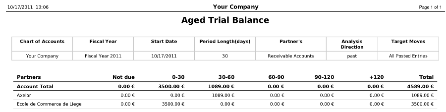
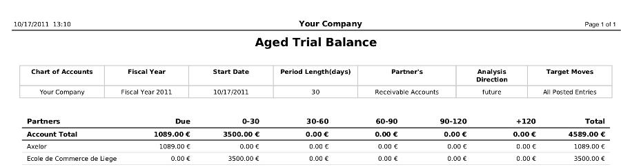
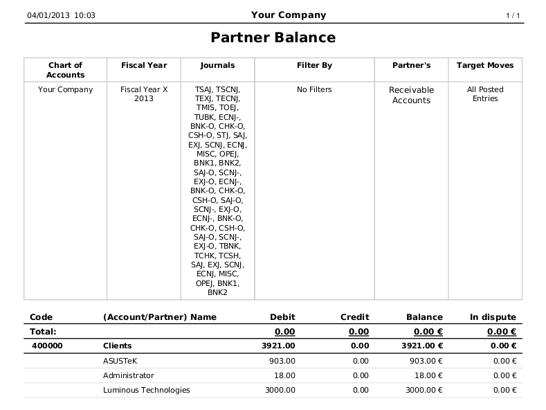
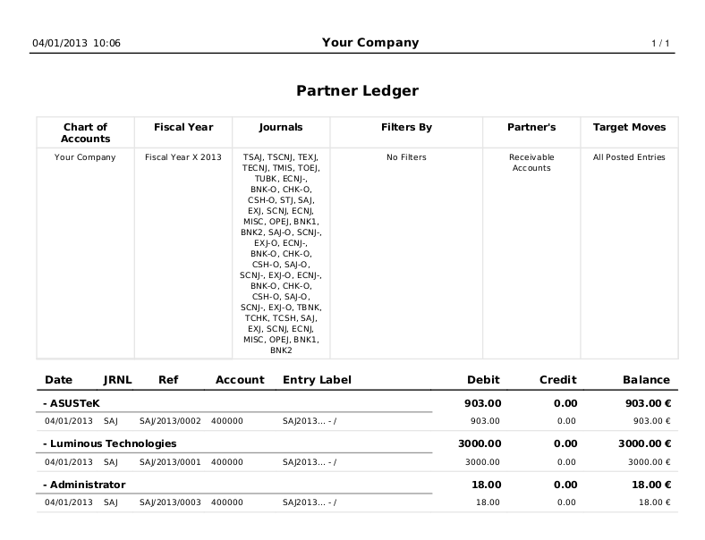
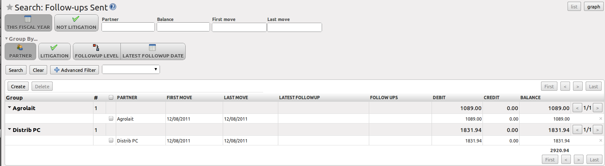

.. index::
   single: payable
   single: receivable
   single: creditor
   single: debtor

Get your Money in
=================

OpenERP provides many tools for managing customer and supplier accounts. You will see here:

* financial analysis of partners, to understand the reports that enable you to carry out an analysis
  of all of your partners,

* multi-level reminders, which is an automatic system for preparing reminder letters or emails when
  invoices remain unpaid,

* detailed analysis of individual partners.

Financial Analysis of Partners
------------------------------

.. index::
   single: module; board_account
   pair: dashboard; accounting

When members of your accounting department sign in to OpenERP, they can immediately be presented with the :guilabel:`Accounting Dashboard`. By default, it contains the customer invoices to approve, a company analysis according to account type, a Treasury graph and a useful graph for analyzing aged receivables. Click the ``Accounting`` button to open the dashboard. You can also call the dashboard from the menu :menuselection:`Accounting --> Reporting --> Dashboard --> Accounting Dashboard`.

.. index:: balance; aged

In the dashboard, the graph at the right entitled :guilabel:`Aged Receivables` represents your receivables week by week. At a glance, you can see the cumulative amount of your customer receivables by week.

All of OpenERP's graphs are dynamic. So you can, for example, filter the data by clicking the graph itself and then :guilabel:`Filter` in the Search form. When you click the graph, data will be displayed in list view. Now you enter extra search criteria and then click the `graph` button to display the data as a graph again.

To obtain a more detailed report of the aged balance (or order by past date), use the menu :menuselection:`Accounting --> Reporting --> Generic Reporting --> Partners --> Aged Partner Balance`.

When you click that report, OpenERP shows a wizard asking you for the chart of accounts, the start date of the analysis period and the size of the interval to be analyzed (in days). The start date will determine which documents will be included in the report (document date until the selected start date).
You can print an aged partner balance for Receivable Accounts or Payable Accounts of for both at the same time. The analysis direction may be Past (for entries that are due) or Future to keep track of your cash flow in the next days or weeks (according to your selection). OpenERP then calculates a table of credit balance by period. So, if you request an interval of 30 days, OpenERP generates an analysis of creditors for the past month, past two months, and so on.
An ageing balance will indicate how much of the accounts receivable is past due. It also reports how far past due the accounts are (number of days).

   *Aged Balance in the Past using a 30-days Period*

   *Aged Balance in the Future using a 30-days Period*

For an analysis by partner, you can use the partner balance that you get through the menu :menuselection:`Accounting --> Reporting --> Generic Reporting --> Partners --> Partner Balance`. The system then supplies you with a PDF report containing one line per partner representing the
cumulative credit balance.

   *Partner Balance*

.. index:: ledger

If you want detailed information about a partner, you can use the partner ledger from the menu :menuselection:`Accounting --> Reporting --> Generic Reporting --> Partners --> Partner Ledger`. You can optionally print one partner per page.

   *Partner Ledger*

Finally, you can look up individual account entries. To search for account entries, you can use the menu :menuselection:`Accounting --> Reporting --> Statistic Reports --> Entries Analysis`.

.. tip:: Exporting Entries

        Remember that you can export all types of resources in OpenERP.
        From the web client, you need to navigate to a search list for the resource, then click
        the :guilabel:`Export` link at the bottom left of the list.
        From the GTK client, you would use the menu :menuselection:`Form --> Export data`.
        This enables you to easily make your own analysis in Microsoft Excel or OpenOffice.org Calc,
        by exporting accounting entries.

.. index::
   single: follow-up
   single: reminder
   single: module; account_followup

Multi-step Reminders
--------------------

To automate the management of follow-ups (reminders) you should install the module :mod:`account_followup` (or check the `Followups Management` option in the `Add New Features` wizard).

Once the module is installed, configure your levels of follow-up using the menu :menuselection:`Accounting --> Configuration --> Miscellaneous --> Follow-Ups`.

The levels of follow-up are relative to the date of creation of an invoice, and not the due date. This enables you to put payment conditions such as 'payable in 21 days' and send a reminder in 30 days, or the converse.

For each level, you should define the number of days and create a note which will automatically be added into the reminder letter. The sequence determines the order of the level in ascending order.

.. csv-table::  Example of Configuring Follow-up Levels
   :header: "Sequence","Level","Days","Description"
   :widths: 5, 5, 15, 15

   "1","Level 1","15 days net","First payment reminder"
   "2","Level 2","30 days net","Second reminder"
   "3","Level 3","45 days from end of month","Put on notice"

You can send your reminders by mail and/or email with the menu :menuselection:`Accounting --> Periodical Processing --> Billing --> Send followups`.

.. figure::  images/account_followup_wizard.png
   :scale: 75
   :align: center

   *Prepare Reminders*

OpenERP presents you with a list of partners who are due to be reminded, which you can modify before starting the procedure. On the second tab of the form, you can supply the information you will send in the email reminder.

The system then gives you a PDF report with all of the reminder letters for each partner. Each letter is produced in the language of the partner (if that is available), and you can therefore get letters in several languages in the same PDF on several pages.

You should check the due date of customers and/or suppliers before starting the reminder procedure. You get a list of unreconciled entries' accounts. You can then modify the date, the last follow-up and the level of reminder for each entry.

To obtain a detailed statistical report of sent follow-ups use the menus in :menuselection:`Accounting --> Reporting --> Generic Reporting --> Partners --> Follow-ups Sent`.

The different reports are standard OpenERP screens, so you can filter them and explore the elements in detail.

   *Summary for Follow-ups*

.. index::
   single: overdue payments

.. Copyright © Open Object Press. All rights reserved.

.. You may take electronic copy of this publication and distribute it if you don't
.. change the content. You can also print a copy to be read by yourself only.

.. We have contracts with different publishers in different countries to sell and
.. distribute paper or electronic based versions of this book (translated or not)
.. in bookstores. This helps to distribute and promote the OpenERP product. It
.. also helps us to create incentives to pay contributors and authors using author
.. rights of these sales.

.. Due to this, grants to translate, modify or sell this book are strictly
.. forbidden, unless Tiny SPRL (representing Open Object Press) gives you a
.. written authorisation for this.

.. Many of the designations used by manufacturers and suppliers to distinguish their
.. products are claimed as trademarks. Where those designations appear in this book,
.. and Open Object Press was aware of a trademark claim, the designations have been
.. printed in initial capitals.

.. While every precaution has been taken in the preparation of this book, the publisher
.. and the authors assume no responsibility for errors or omissions, or for damages
.. resulting from the use of the information contained herein.

.. Published by Open Object Press, Grand Rosière, Belgium
