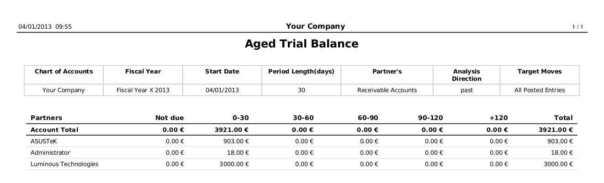
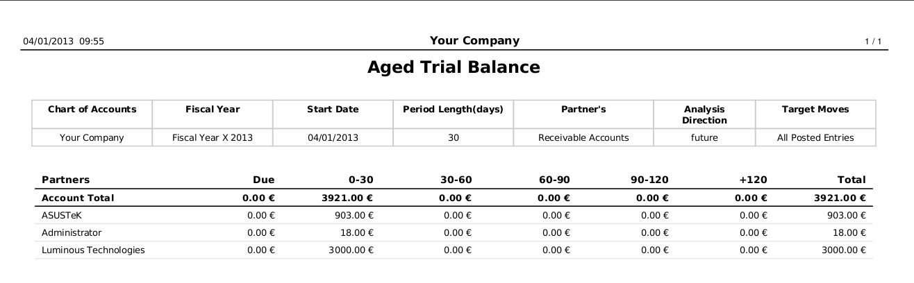
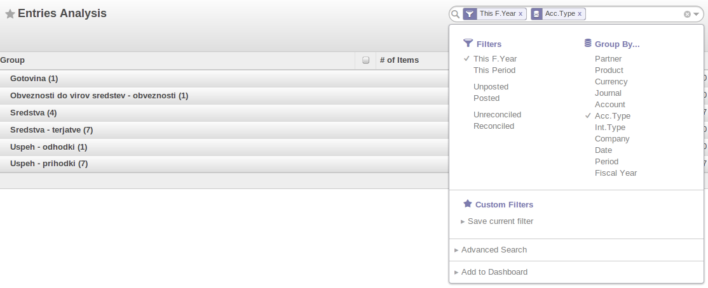
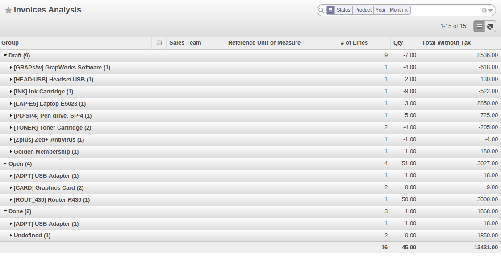

.. index::
   single: payable
   single: receivable
   single: creditor
   single: debtor

Get your Money in
=================

OpenERP provides many tools for managing customer and supplier accounts. In this part we will explain:

* financial analysis of partners, to understand the reports that enable you to carry out an analysis
  of all of your partners,

* multi-level reminders, which is an automatic system for preparing reminder letters or emails when
  invoices remain unpaid.

* detailed analysis of individual partners.

Financial Analysis of Partners
------------------------------

.. index::
   single: module; board_account
   pair: dashboard; accounting

When members of your accounting department sign in to OpenERP, they can immediately be presented with the :guilabel:`Accounting Dashboard`. By default, it contains company analysis according to account type. You can also call the dashboard from the menu :menuselection:`Reporting --> Dashboards --> Accounting`.

.. index:: balance; aged

To obtain a more detailed report of the aged balance (or order by past date), use the menu :menuselection:`Accounting --> Reporting --> Generic Reporting --> Partners --> Aged Partner Balance`.

When you click that report, OpenERP shows a wizard asking you for the chart of accounts, the start date of the analysis period and the size of the interval to be analysed (in days). The start date will determine which documents will be included in the report (document date until the selected start date) and it will serve as a reference date to calculate the amounts due for the selected interval.
You can print an aged partner balance for Receivable Accounts or Payable Accounts of for both at the same time. The analysis direction may be ``Past`` (for entries that are due) or ``Future`` to keep track of your cash flow in the next days or weeks (according to your selection). OpenERP then calculates a table of credit balance by period. So, if you request an interval of 30 days, OpenERP generates an analysis of creditors for the past month, past two months, and so on.
An ageing balance will indicate how much of the accounts receivable is overdue. It also reports how far overdue the accounts are (number of days).

.. tip:: Aged Partner Balance

    This report works best of you use payment terms or if you set a due date yourself.

   *Aged Balance in the Past using a 30-days Period*

   *Aged Balance in the Future using a 30-days Period*

For an analysis by partner, you can use the partner balance that you get through the menu :menuselection:`Accounting --> Reporting --> Generic Reporting --> Partners --> Partner Balance`. The system then supplies you with a PDF report containing one line per partner representing debit, credit and balance. The total is displayed per account receivable.

   *Partner Balance*

.. index:: ledger

If you want detailed information about all invoices, credit notes and payments related to partner, print the partner ledger from the menu :menuselection:`Accounting --> Reporting --> Generic Reporting --> Partners --> Partner Ledger`. You can choose to print one partner per page.

   *Partner Ledger*

Furthermore, OpenERP also provides statistics about individual account entries, invoices and treasury, for instance. To look up statistic information about your accounting, explore the menu :menuselection:`Reporting --> Accounting`. There you will find ``Invoices Analysis``, ``Entries Analysis`` and ``Treasury Analysis`` etc.. By default these statistics are displayed as a list which you can filter to fit your needs. Standard filter buttons, extended filters and grouping features allow you to make an in-depth analysis of your accounting. But the list is not all OpenERP has to offer. These statistic reports can be displayed as a graph simply by clicking the ``Graph`` button at the top right side of the screen. Notice that graphs allow for only one Group by function at a time.

   *Entries Analysis List View*

   *Entries Analysis Graph View*

.. tip:: Exporting Entries

        Remember that you can export all types of resources in OpenERP.
        You can go to the :guilabel:`More` button at the top centre of any view. The Export feature enables you to easily create your own analysis in tools such as Microsoft Excel or Calc (LibreOffice or OpenOffice), simply by exporting accounting entries.

.. index::
   single: follow-up
   single: reminder
   single: module; account_followup
   single: overdue payments

Multi-step Reminders
--------------------

To automate the management of follow-ups (reminders) you should install the module :mod:`account_followup` (or select the `Manage customer payment follow-ups` option in the Settings -> Configuration -> Accounting -> eInvoicing & Payments).

This module is integrated with the email features of OpenERP. Ask your system administrator to define the smtp server through the menu :menuselection:`Settings --> Technical --> Email --> Outgoing Mail Servers`.

Once the module is installed, configure your levels of follow-up using the menu :menuselection:`Accounting --> Configuration --> Follow-Up Levels`.

.. note:: Follow-ups

    You can define only one follow-up cycle per company, because you cannot link the follow-up cycle to a partner.

The levels of follow-up are relative to the due date; when no payment term is specified, the invoice date will be considered as the due date.

For each level, you should define the number of days and create a note which will automatically be added into the reminder letter. The order in which you define the various follow-up levels determines the order in which letters will be sent.

.. csv-table::  Example of Configuring Follow-up Levels
   :header: "Sequence","Level","Days","Description"
   :widths: 5, 5, 15, 15

   "1","Level 1","15 days net","First payment reminder"
   "2","Level 2","30 days net","Second reminder"
   "3","Level 3","45 days from end of month","Put on notice"

To obtain a detailed statistical report of sent follow-ups go to the menu :menuselection:` Reporting --> Accounting --> Follow-ups Analysis`. This screen will let you analyse your reminder data in various ways, e.g. by follow-up level, by partner or for a combination of these data. You can also group by ``Latest Followup Date`` or ``Partner``, for instance.

The different reports are standard OpenERP screens, so you can filter them and explore the elements in detail.

   *Reminder Statistics*

Analyse your Turnover
=====================

Analyse your invoicing in OpenERP through the **Invoices Analysis** screen from the menu :menuselection:`Reporting --> Accounting --> Invoices Analysis`.

In this statistic report, the columns displayed will vary according to the selections and grouping made, thus making it a very flexible report to analyse your invoices.

This report provides an overview of what has been invoiced to your customer as well as the average payment delays. To see the average due delay, make sure to group by ``Due Date``.
You can easily group by partner, product category, ... or select only invoices that have not been confirmed yet.

This is also an easy way to check your sales people's impact on turnover. You can see your turnover per product category, per salesman, per partner and many more options.

   *Analysing your Invoices*

To quickly see the total turnover per customer in a graph view, group by ``Partner`` and click the ``Graph`` button to change to graph mode.

.. figure::  images/account_turnover_analysis.png
   :scale: 75
   :align: center

   *Analysing your Customer's Turnover*

.. Copyright © Open Object Press. All rights reserved.

.. You may take electronic copy of this publication and distribute it if you don't
.. change the content. You can also print a copy to be read by yourself only.

.. We have contracts with different publishers in different countries to sell and
.. distribute paper or electronic based versions of this book (translated or not)
.. in bookstores. This helps to distribute and promote the OpenERP product. It
.. also helps us to create incentives to pay contributors and authors using author
.. rights of these sales.

.. Due to this, grants to translate, modify or sell this book are strictly
.. forbidden, unless Tiny SPRL (representing Open Object Press) gives you a
.. written authorisation for this.

.. Many of the designations used by manufacturers and suppliers to distinguish their
.. products are claimed as trademarks. Where those designations appear in this book,
.. and Open Object Press was aware of a trademark claim, the designations have been
.. printed in initial capitals.

.. While every precaution has been taken in the preparation of this book, the publisher
.. and the authors assume no responsibility for errors or omissions, or for damages
.. resulting from the use of the information contained herein.

.. Published by Open Object Press, Grand Rosière, Belgium
