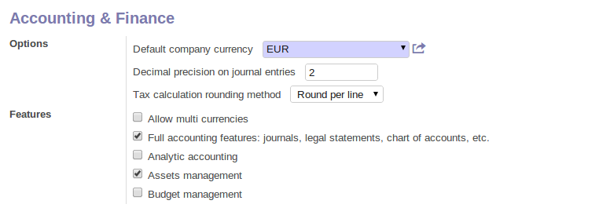
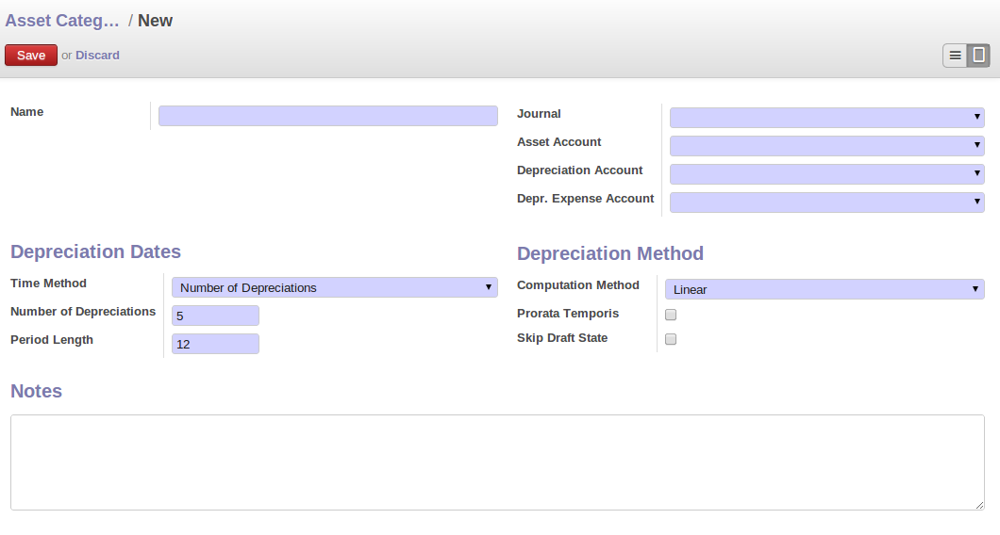
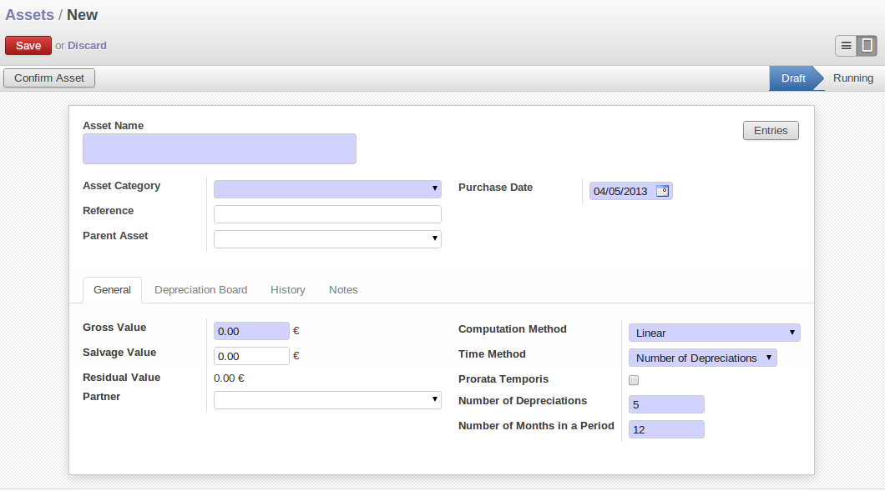
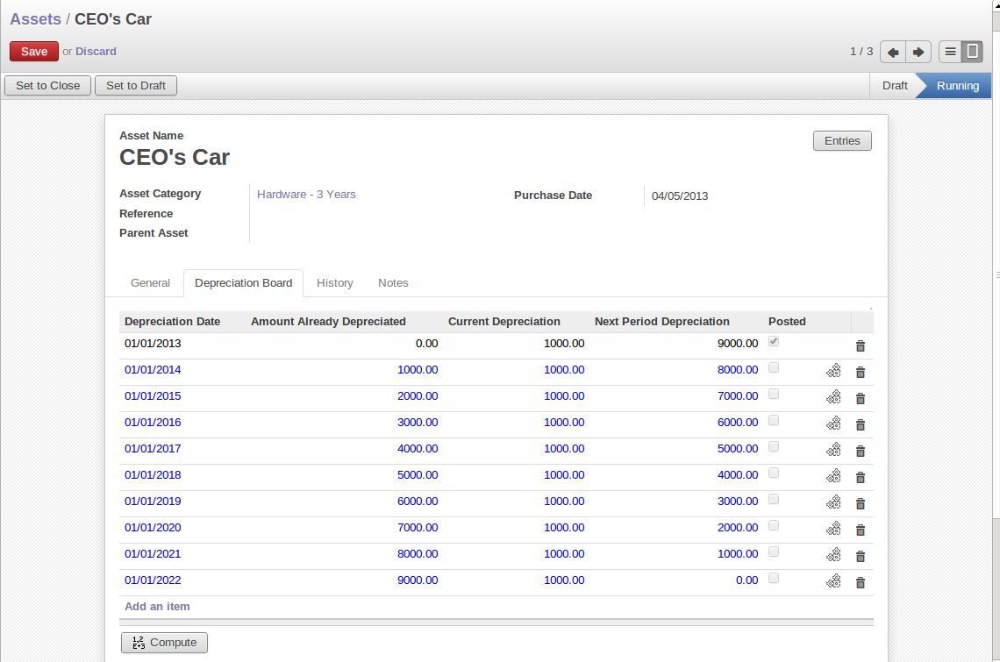
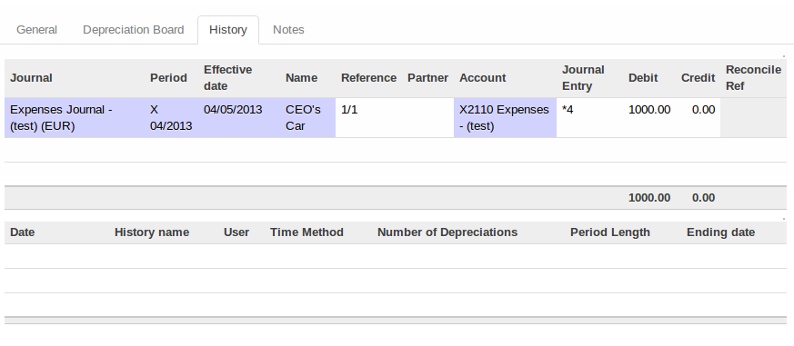
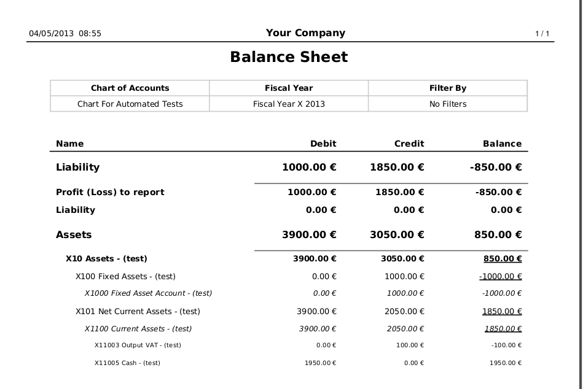
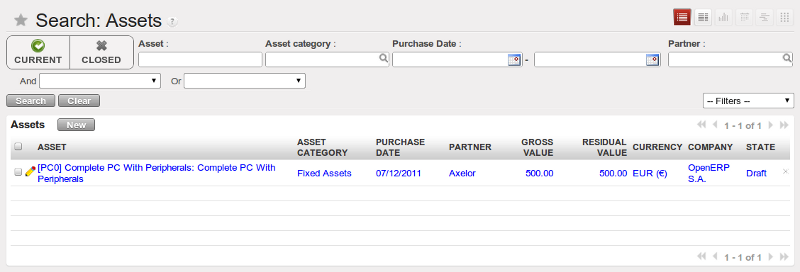

.. index::
   pair: managing; asset

Asset Management
================
 *Financial and accounting asset management. To manage the assets owned by a company or an individual and to keep track of depreciation occurred on those assets. Also allows to create accounting moves of the depreciation lines.*

You can manage your assets and accounting related to those assets using account_asset module.
The configuration wizard to install this module is shown below:

   *Configuration wizard to install account_asset module*

Using the menu *Accounting ‣ Assets ‣ Assets,* you can store all information related to your assets like how much depreciation can be occurred, depreciation amount based on selected depreciation method, date on which the asset is purchased, purchase value of the asset, supplier of the asset etc.

You can also see different states of assets.
If the asset is confirmed then the depreciation lines can be posted in the accounting.
An asset can be closed manually when depreciation is over or it will be closed automatically when the last depreciation line is posted.

You can also see asset hierarchy by using menu *Accounting ‣ Assets ‣ Asset Hierarchy*.

The statistical report for assets can be seen using the menu *Accounting ‣ Reporting ‣ Statistic Reports ‣ Assets Analysis*.

Define asset categories
-----------------------

You can create asset categories by using the form view opens after the configuration wizard.
You can see it as below:

   *Asset categories form*

You can add more categories by navigating to the menu: *Accounting ‣ Configuration ‣ Financial Accounting ‣ Assets ‣ Asset Categories* and click *New*.

You can configure the following information:

 - *Name* : A name for asset category
 - *Journal* : A journal to store the accouting entries mostly purchase or expense journal.
 - *Asset Account* : This account will be credited when depreciation line is posted.
 - *Depreciation Account* : Account, same as Asset Account or it can be different for storing depreciation separately.
 - *Depr.
   Expense Account* : Account which will be debited when depreciation line is posted.
 - *Time Method* : Either ``Number of Depreciations`` or ``Ending Date``.
 - *Number of Depreciations* : If time method is ``Number of Depreciations`` you must specify a number of depreciation lines.
 - *Ending Date* : If time method is ``Ending Date`` then you must specify the ending date and the depreciation date won't go beyond this date.
 - *Period Length* : Time duration between two depreciations, in months.
 - *Computation Method* : Either ``Linear`` or ``Degressive``.
 - *Degressive Factor* : If computation method is ``Degressive`` then you must specify degressive factor.
   This is used to calculate depreciation lines by multiplying it with remaining depreciation value.
 - *Prorata Temporis* : If **True**, first depreciation entry will be calculated from purchase date.
 - *Skip Draft State* : If **True**, assets of this category will be automatically confirmed when created from invoice.

Manage assets and depreciation
------------------------------

   *Assets form*

You can create asset by using the menu *Accounting ‣ Assets ‣ Assets* and click *New*. You can enter following information for assets.

 - *Asset* : A name for an asset.
 - *Asset Category* : Select a category for the asset.
 - *Gross Value* : Gross purchase amount of the asset.
 - *Salvage Value* : Amount which we plan to have that cannot be depreciated.
 - *Purchase Date* : Date on which asset is purchased.
 - *Partner* : Supplier of the asset.

After computing the depreciation you get the following values in Depreciation board based on selected methods and period.
Now you can confirm the asset by clicking on *Confirm Asset* button.
The state of the asset will now be ``Running``.

For the confirmed assets you can post the depreciation lines by clicking on *Create Move* button on depreciation line.
You can also see that *Depreciation Amount* on depreciation line is deducted from the *Residual Value*.

   *Depreciation board*

You can see the accounting entry for the posted depreciation lines on *History* tab as shown below:

   *Accounting entry for posted depreciation line*

You can get a complete report for account move entries of assets in the Balance Sheet report by using the menu *Accounting ‣ Reporting ‣ Legal reports ‣ Accounting Reports ‣ Balance Sheet*. You can select a related Chart of Accounts and check Landscape Mode field and click on *Print* to generate a PDF report with your specifications.
You will get the following report.

   *Balance Sheet PDF report*

Analysis of Assets
------------------

*Accounting ‣ Reporting ‣ Statistic Reports ‣ Assets Analysis* will give you the statistical report of assets.
This report is enhanced by various filters and groupings to assist you in your search and required information.

   *Asset Analysis report*

Assets and Invoice
------------------

From the menu *Accounting ‣ Suppliers ‣ Supplier Invoices* and click *New*, you can create a supplier invoice.
You can select the supplier.
On *Invoice line* you can click on *New* and select the *Product* you want to make it as asset and *Asset Category*. You can now click on *Save & Close*.

   *Invoice line form*

Now you can *Approve* the invoice, there will be an asset created for the product selected on invoice line.
You can see it by going to the menu *Accounting ‣ Assets ‣ Assets*.

   *Assets tree view*
