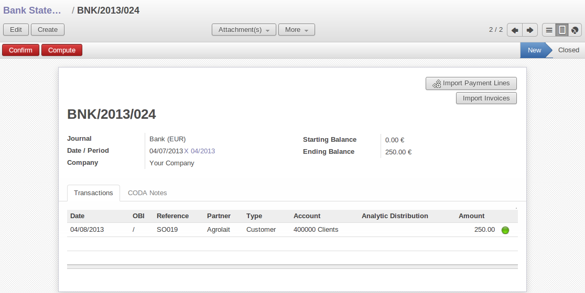
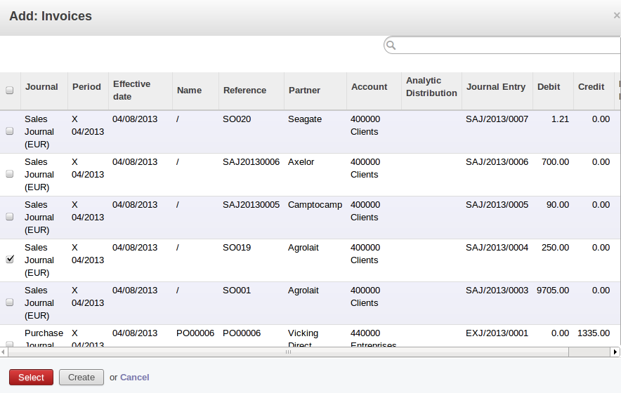
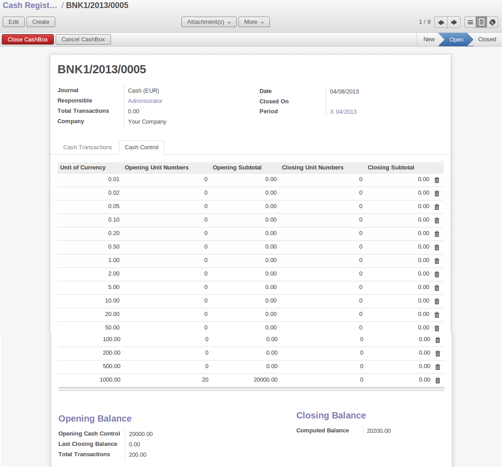
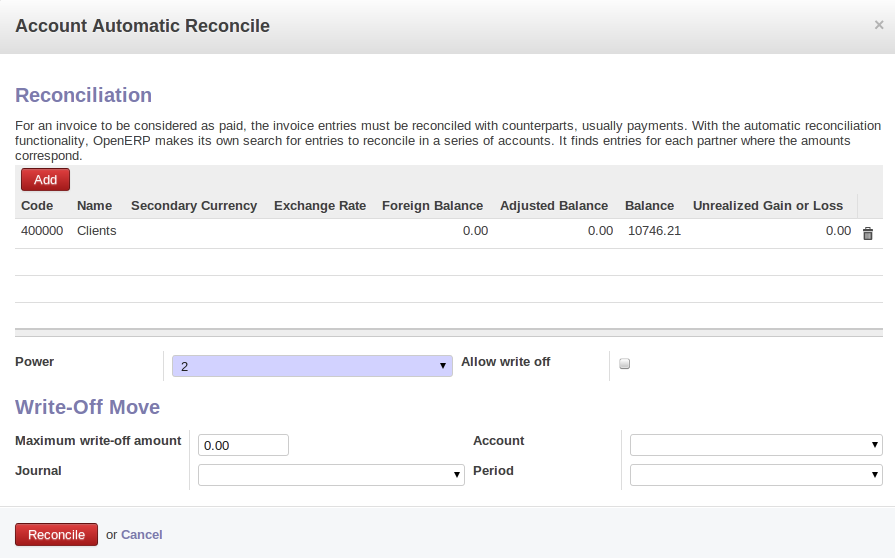
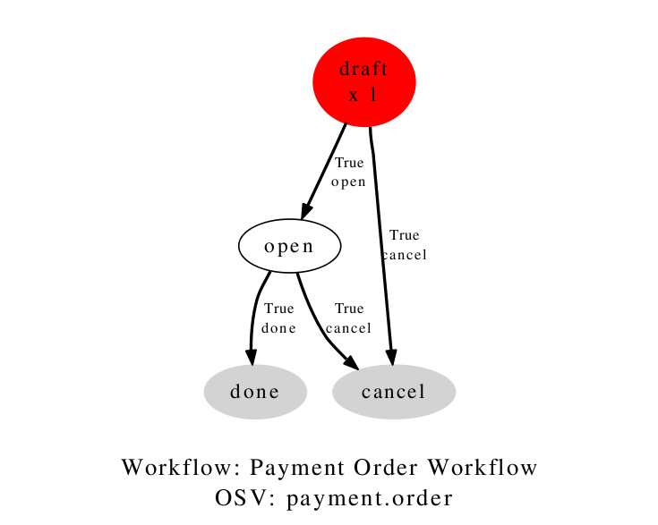
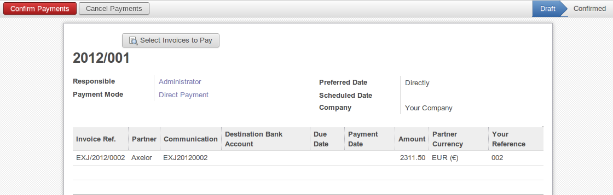

.. index::
   pair: accounting; entry

Accounting Entries
==================

Various methods of creating accounting entries can be used. You have already seen how an invoice
creates its own entries, for example.

This section deals, in order, with

* managing bank statements,

* managing cash,

* manual journal entries,

You will see how to proceed with entering financial transactions here. In Open ERP you use the same
form for handling bank statements and for managing cash. The two types of transaction differ only in
the journal that is used.

.. index::
   pair: bank; statement
   single: accounting; bank statement

Managing Bank Statements
------------------------

Open ERP provides a visual tool for managing bank statements that simplifies data entry into
accounts. As soon as a statement entry is validated the corresponding accounting entries are
automatically generated by Open ERP. This lets non-accounting people enter financial
transactions without fussing about such things as credit, debit and counterparts

Start by entering a statement line. To do that use the menu :menuselection:`Accounting -->
Bank and Cash --> Bank Statements`.
A data entry form for bank statements then opens as shown in figure :ref:`fig-accstate`.

.. _fig-accstate:

   *Data entry form for a bank statement*

The statement reference :guilabel:`Name` and the :guilabel:`Date` are automatically suggested by Open ERP from
the preceding statement line. You can configure your own reference by managing sequences in the
:menuselection:`Administration` menu.

You must then select the :guilabel:`Journal`. Ideally, when you are configuring your company you would create at
least one journal for each bank account and one journal for petty cash in your company. So select
the journal corresponding to the bank account whose statement you are handling.

The currency that you are using for the statement line is that of the selected journal. If you are
entering statement lines for an account in American dollars (USD) the amounts must be entered in
\ ``USD``\ . The currency is automatically converted to the company's main currency when you confirm
the entry, using the rates in effect at the date of entry (which means that you would need valid
currency conversion rates to be created first).

The initial balance is completed automatically by Open ERP based on the final balance of the
preceding statement. You can modify this value and force another value. This lets you enter
statements in the order of your choice. Also if you have lost a page of your statement you can enter
the following ones immediately and you are not forced to wait for a duplicate from the bank.

So, complete the final balance, which corresponds to the last value on the account after all of the
statement entries. This amount will be the control for operations before approving the statement.

Then you must enter all the lines on the statement. Each line corresponds to a banking transaction.

Enter the transaction line. When you type the Partner name, Open ERP automatically proposes the
corresponding account. The total amount due for the customer or supplier is pre-completed by
Open ERP (:guilabel:`Amount`). This gives you a simple indication of the effective payment. You
must the enter the amount that appears on your statement line: a negative sign for a withdrawal and
a positive sign for a cash payment or deposit.

.. todo:: really?

When the payment entry has been made you can reconcile this directly with the accounting
entry for the invoices. Click on the button `Import Invoices` then you can select the invoices for
which your payment will have been reconciled.

   *Reconciliation from data entry of the bank statement*

.. note::  Reconciliation

	Other methods of reconciliation are possible: from accounting entries, when saving the payment
	directly on an invoice, or using the automatic reconciliation tool. But if you can, you should do a
	reconciliation when you are encoding the payment because that is the time when you have all of the
 	information you need to hand for reconciling the payment with the corresponding invoice.

 	You can carry out either a full or a partial reconciliation.

.. index::
   single: adjustment

If you see a difference between the payment and the invoices to reconcile,
you can enter the difference in the second part of the form :guilabel:`Write-off`.
You have to set an account for the adjustment. The main reasons explaining the difference are usually:

* losses or profits,

* exchange differences,

* discounts given for rapid payment.

When the reconciliation is complete - that is the payment is equal to the sum of the due
payments and the adjustments - then you can close the reconciliation form.

The reconciliation operation is optional – you could very well do it later or not do it at all.
It is got two significant effects, however:

* marking that the invoices have been paid,

* preventing the payment and invoice amounts from appearing on customer reminder letters. Unless
  you have reconciled them a customer will see the invoice and payment amounts on her reminder letter
  (which will not alter the balance due since they will just cancel each other out).

Finally, once you have entered the various lines of your bank statement you can validate it.
Open ERP then automatically generates the corresponding accounting entries if the balance
calculated equals the final balance indicated in the header. The reconciled invoices are marked as
paid at that point.

A user with advanced accounting skills can enter accounting entries directly into the bank journal.
The resulting account is the same but the operation is more complex because you must know the
accounts to use and must have mastered the ideas of credit and debit.

.. index::
   single: cash management

Cash Management
---------------

To manage cash, you can use the menu :menuselection:`Accounting -->
Bank and Cash --> Cash Registers`. At the start of the day you set the
opening amount of cash in the entry (:guilabel:`Opening Balance`). Instead of confirming the entry immediately
you should leave it in the ``Draft`` state.

All the transactions throughout the day are then entered in this statement. When you close the cash
till, generally at the end of the day, you enter the amount found in the cash till in the field
:guilabel:`Closing Balance`. Then confirm the statement to close the day's cash statement and automatically
generate the corresponding accounting entries.

.. tip::  Confirming the statement

	Accounting entries are only generated when the statement is confirmed.
	So if the total statement has not been approved (that is to say during the day, in the case of petty
	cash)
	you should not be surprised if partner payments have not been deducted from their corresponding
	account.

Manual entry in a journal
-------------------------

Invoices and statements produce accounting entries in different journals. But you could equally
create entries directly in a journal without using the forms to help you. This functionality is
often used for various entry transactions.

To do this, use the following menu :menuselection:`Accounting --> Journal Entries -->
Journal Items`.

As you will recall, these entries are usually generated automatically by Open ERP. If you have not
created an invoice you will have to enter values manually.

Fill these fields manually in this order:

*  :guilabel:`Effective Date` : invoice date,

*  :guilabel:`Move` : leave this empty so that Open ERP can fill it in automatically from the next number in
   sequence for line validations,

*  :guilabel:`Ref.` : reference from the supplier invoice,

*  :guilabel:`Partner Ref.` : partner concerned,

*  :guilabel:`Account` : account for the purchase line (\ ``Products Purchase``\  ),

*  :guilabel:`Name` : description of the invoice line ( ``PC2`` ),

*  :guilabel:`Credit` : \ ``1196``\  .

Press the :guilabel:`Enter` key on your keyboard to validate this first line. The next sequence number is
assigned to your accounting entry. Your line is then colored red and takes the \ ``Unbalanced``\   state.
When a line is in the draft state then it is not yet reflected in the accounts. Open ERP will not
validate that line until the balancing entry is made (so the credit amounts must balance the debit
amounts for that set of entries).

Open ERP now proposes the balancing accounting line to be filled in. If the account used (in this
case account \ ``600``\  ) includes taxes by default in its definition Open ERP automatically
proposes taxes associated with the amount entered. At this stage you can modify and validate this
second line of the account, or replace it with other information such as a second purchase line.

When you have entered all of the data from your lines, Open ERP automatically proposes counterpart
entries to you, based on the credit entries.

.. tip:: Completing a balancing entry

	When an accounting entry is matched, Open ERP moves it to the open state automatically and
	prepares to enter the next data.

	If you want to add some other balancing lines you can enter the number of the entry on the new line
	that you are entering.
	In such a case the whole line stays at Draft until the whole set balances to zero.

Reconciliation Process
----------------------

The reconciliation operation consists of matching entries in different accounts to indicate that
they are related. Generally reconciliation is used for:

* matching invoice entries to payments so that invoices are marked as paid and customers do not get
  payment reminder letters (reconciliation in a customer account),

* matching deposits and cheque withdrawals with their respective payments,

* matching invoices and credit notes to cancel them out.

A reconciliation must be carried out on a list of accounting entries by an accountant, so that the
sum of credits equals the sum of the debits for the matched entries.

Reconciliation in Open ERP can only be carried out in accounts that have been configured as
reconcilable (the :guilabel:`Reconcile`  field).

.. tip:: Do not confuse: **account** reconciliation and **bank statement** reconciliation

	It is important not to confuse the reconciliation of accounting entries with bank statement
	reconciliation.
	The first consists of linking account entries with each other, while the second consists of
	verifying
	that your bank statement corresponds with the entries of that account in your accounting system.
	You can perform this using menu :menuselection:`Accounting --> Periodical Processing --> Statements --> Statements Reconciliation`.

There are different methods of reconciling entries. You have already seen the reconciliation of
entries while doing data entry in an account. Automatic and manual reconciliations are described
here.

.. index::
   single: reconciliation; automatic

Automatic Reconciliation
^^^^^^^^^^^^^^^^^^^^^^^^

For automatic reconciliation, you will be asking Open ERP to make its own search for entries to
reconcile in a series of accounts. It tries to find entries for each partner where the amounts
correspond.

Depending on the level of complexity that you choose when you start running the tool, the software
could reconcile from two to nine entries at the same time. For example, if you select level 5,
Open ERP will reconcile three invoices and two payments if the total amounts correspond.

   *Form for automatic reconciliation*

To start the reconciliation tool, click :menuselection:`Accounting --> Periodical Processing --> Reconciliation --> Automatic Reconciliation`.

A form opens, asking you for the following information:

* :guilabel:`Account to reconcile` : you can select one, several, or all reconcilable accounts,

* the period to take into consideration (:guilabel:`Start of Period` / :guilabel:`End of Period`),

* the Reconciliation :guilabel:`Power`  (from \ ``2``\   to \ ``9``\  ),

* information needed for the adjustment (details for the :guilabel:`Write-Off Move`).

.. note:: Reconciling

	You can reconcile:

	* all the Accounts Receivable – your customer accounts of type Debtor,

	* all the Accounts Payable – your supplier accounts of type Creditor.

The adjustment option enables you to reconcile entries even if their amounts are not exactly
equivalent. For example, Open ERP permits foreign customers whose accounts are in different
currencies to have a difference of up to, say, 0.50 units of currency and put the difference in a write-
off account.

.. index::
   single: adjustment; limit

.. tip:: Limit write-off adjustments

	You should not make the adjustment limits too large. Companies that introduced substantial automatic
	write-off adjustments have found that all employee expense reimbursements below the limit were
	written off automatically!

.. note:: Default values

	If you run the automatic reconciliation tool regularly you should set default values for each
	field by pressing the :kbd:`Ctrl` key and using the right-click mouse button
	(when the form is in edit mode using the web client), or just right-click using the GTK client.
	The resulting context menu enables you to set default values.
	This means that you will not have to re-type all the fields each time.

.. index::
   single: reconciliation; manual

Manual Reconciliation
^^^^^^^^^^^^^^^^^^^^^

For manual reconciliation, open the entries for reconciling an account through the menu :menuselection:`Accounting --> Periodical Processing --> Reconciliation --> Manual Reconciliation`.
You can also call up manual reconciliation from any screen that shows accounting
entries.

.. todo:: is that right?

Select entries that you want to reconcile. From the selection, Open ERP indicates the sum of debits
and credits for the selected entries. When these are equal you can click the :guilabel:`Reconcile Entries`
button to reconcile the entries.

	.. note::  *Example Real case of using reconciliation*

			Suppose that you are entering customer order details. You ask “what is outstanding on the
			customer account ?” (that is the list of unpaid invoices and unreconciled payments). To review
			it from the order form, navigate to the :guilabel:`Partner` record and select
			the view :guilabel:`Receivables and Payables`. Open ERP opens a history of unreconciled accounting entries
			on screen.

	            .. figure::  images/account_sample2_entries.png
	               :align: center
	               :scale: 50

	               *Unreconciled accounting entries*

			After running the `Reconcile Entries` wizard, this these lines can not be selected and will not appear when the entries are listed again. If
			there is a difference between the two entries, Open ERP suggests that you make an adjustment.
			This adjustment is a compensating entry that enables a complete reconciliation. You must
			therefore specify the journal and the account to be used for the adjustment.

For example, if you want to reconcile the following entries:

.. csv-table:: Entries for reconciliation
   :header: "Date","Ref.","Description","Account","Debit","Credit"
   :widths: 12, 5, 15, 5,5,5

   "12 May 08","FAC23","Car hire","4010","544.50",""
   "25 May 08","FAC44","Car insurance","4010","100.00",""
   "31 May 08","PAY01","Invoices n° 23, 44","4010","","644.00"

On reconciliation, Open ERP shows a difference of 0.50. At this stage you have two possibilities:

* do not reconcile, and the customer receives a request for 0.50,

* reconcile and accept an adjustment of 0.50 that you will take from the P&L account.

Open ERP generates the following account automatically:

.. csv-table:: Write-off account
   :header: "Date","Ref.","Description","Account","Debit","Credit"
   :widths: 12, 5, 15, 5,5,5

   "Date","Ref.","Description","Account","Debit","Credit"
   "03 Jun 08","AJ001","Adjustment: profits and losses","4010","","0.50"
   "03 Jun 08","AJ001","Adjustment: profits and losses","XXX","0.50",""

The two invoices and the payment will be reconciled in the first adjustment line. The two invoices
will then be automatically marked as paid.

.. index::
   single: payments
..

Management of payments
======================

Open ERP gives you forms for preparing, validating and executing payment orders. This enables you
to manage issues such as:

	#.	Payment provided on several due dates.

	#.	Automatic payment dates.

	#.	Separating payment preparation and payment approval in your company.

	#.	Preparing an order during the week containing several payments, then creating a payment file at
		the end of the week.

	#.	Creating a file for electronic payment which can be sent to a bank for execution.

	#.	Splitting payments dependent on the balances available in your various bank accounts.

Process for managing payment orders
-----------------------------------

.. index::
   single: module; account_payment

To use the tool for managing payments you must first install the module :mod:`account_payment`.
It's part of the core Open ERP system.

The system lets you enter a series of payments to be carried out from your various bank
accounts. Once the different payments have been registered you can validate the payment orders.
During validation you can modify and approve the payment orders, sending the order to the bank
for electronic funds transfer or just printing cheques as you wish.

For example if you have to pay a supplier's invoice for a large amount you can split the payments
amongst several bank accounts according to their available balance. To do this you can prepare
several Draft orders and validate them once you're satisfied that the split is correct.

This process can also be regularly scheduled. In some companies, a payment order is kept in Draft
state and payments are added to the draft list each day. At the end of the week it's an accountant's
job to work on all of the waiting payment orders.

Once the payment order is confirmed there's still a validation step for an accountant to carry out.
You could imagine that these orders would be prepared by an accounts clerk, and then approved by a
manager to go ahead with payment.

.. todo:: Can you get to the workflow in the web client?
.. todo:: There doesn't seem to be a process associated with a payment order.

.. tip:: Payment Workflow

	An Open ERP workflow is associated with each payment order. Select a payment order and
	if you're in the GTK client
	click :menuselection:`Plugins --> Print workflow` from the top menu.

	You can integrate more complex workflow rules to manage payment orders by adapting the workflow.
	For example, in some companies payments must be approved by a manager under certain cash flow or
	value limit conditions.

   *Payments workflow*

When the accounting manager validates the document, Open ERP generates a banking file with all the
payment orders. You can then just send the file over your electronic connection with your bank to
execute all your payments.

In small businesses it's usually the same person who enters the payment orders and who validates
them. In this case you should just click the two buttons, one after the other, to confirm the
payment.

Preparation and execution of orders
-----------------------------------

To enter a payment order, use the menu :menuselection:`Financial Management --> Payment --> Payment
Orders --> New Payment Order`.

   *Entering a payment order*

Open ERP then proposes a reference number for your payment order.

You then have to choose a payment mode from the various methods available to your company. These
have to be configured when you set the accounting system up using menus :menuselection:`Financial
Management --> Configuration --> Payment Type` and :menuselection:`Financial Management -->
Configuration --> Payment Mode`. Some examples are:

* Cheques

* Bank transfer,

* Visa card on a FORTIS account,

* Petty cash.

Then you set the :guilabel:`Preferred date` for payment:

* :guilabel:`Due date` : each operation will be effected at the invoice deadline date,

* :guilabel:`Directly` : the operations will be effected when the orders are validated,

* :guilabel:`Fixed date` : you must specify an effective payment date in the :guilabel:`Scheduled date
  if fixed` field that follows.

The date is particularly important for the preparation of electronic transfers because banking
interfaces enable you to select a future execution date for each operation. So to configure your
Open ERP most simply you can choose to pay all invoices automatically by their deadline.

You must then select the invoices to pay. They can be manually entered in the field
:guilabel:`Payment Line` but it's easier to add them automatically. For that, click :guilabel:`Add
payment lines` and Open ERP will then propose lines with payment deadlines. For each deadline you
can see:

* the invoice :guilabel:`Effective date`,

* the reference :guilabel:`Ref.` and description of the invoice, :guilabel:`Name`,

* the deadline for the invoice,

* the amount to be paid in the company's default currency,

* the amount to be paid in the currency of the invoice.

You can then accept the payment proposed by Open ERP or select the entries that you'll pay or not
pay on that order. Open ERP gives you all the necessary information to make a payment decision for
each line item:

* account,

* supplier's bank account,

* amount that will be paid,

* amount to pay,

* the supplier,

* total amount owed to the supplier,

* due date,

* date of creation.

You can modify the first three fields on each line: the account, the supplier's bank account and the
amount that will be paid. This arrangement is very practical because it gives you complete
visibility of all the company's trade payables. You can pay only a part of an invoice, for example,
and in preparing your next payment order Open ERP automatically suggests payment of the remainder
owed.

When the payment has been prepared correctly, click :guilabel:`Confirm`. The payment then changes to
the \ ``Open``\   state and a new button appears that can be used to start the payment process.
Depending on the chosen payment method, Open ERP provides a file containing all of the payment
orders. You can send this to the bank to make the payment transfers.

In future versions of Open ERP it's expected that the system will be able to prepare and print
cheques.

As usual, you can change the
start point for the payment workflow from the
:menuselection:`Administration --> Customization --> Workflow` menus.

.. Copyright © Open Object Press. All rights reserved.

.. You may take electronic copy of this publication and distribute it if you don't
.. change the content. You can also print a copy to be read by yourself only.

.. We have contracts with different publishers in different countries to sell and
.. distribute paper or electronic based versions of this book (translated or not)
.. in bookstores. This helps to distribute and promote the Open ERP product. It
.. also helps us to create incentives to pay contributors and authors using author
.. rights of these sales.

.. Due to this, grants to translate, modify or sell this book are strictly
.. forbidden, unless Tiny SPRL (representing Open Object Press) gives you a
.. written authorisation for this.

.. Many of the designations used by manufacturers and suppliers to distinguish their
.. products are claimed as trademarks. Where those designations appear in this book,
.. and Open Object Press was aware of a trademark claim, the designations have been
.. printed in initial capitals.

.. While every precaution has been taken in the preparation of this book, the publisher
.. and the authors assume no responsibility for errors or omissions, or for damages
.. resulting from the use of the information contained herein.

.. Published by Open Object Press, Grand Rosière, Belgium

