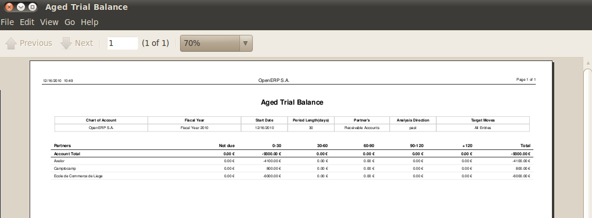
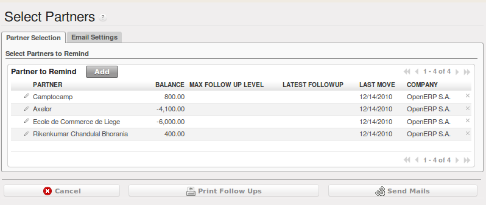

.. index::
   single: payable
   single: receivable
   single: creditor
   single: debtor

Reporting
=========

Open ERP provides many tools for managing customer and supplier accounts. You will see here:

* financial analysis of partners, to understand the reports that enable you to carry out an analysis
  of all of your partners,

* multi-level reminders, which is an automatic system for preparing reminder letters or emails when
  invoices remain unpaid,

* detailed analysis of individual partners.

Financial Analysis of Partners
------------------------------

.. index::
   single: module; board_account
   pair: dashboard; accounting

When members of your accounts department sign on to the Open ERP system, they can immediately be
presented with the :guilabel:`Accounting Dashboard`. By default it contains a useful graph for analyzing
Receivables. Then look at it using
the menu :menuselection:`Accounting --> Reporting --> Dashboard --> Accounting Dashboard`.

   *Accounting Dashboard*

.. index:: balance; aged

In the dashboard, the graph at the right entitled :guilabel:`Aged Receivables` represents your
receivables week by week. That shows you at a glance the cumulative amount of your customer debtors
by week.

All of Open ERP's graphs are dynamic. So you can, for example, filter the data by clicking
:guilabel:`Zoom` and then :guilabel:`Filter` on the Search form. Or just click on :guilabel:`Zoom`
to open in a larger window for a graph, then click :guilabel:`Search` to display this in a list
view.

To obtain a more detailed report of the aged balance (or order by past date) use the menu
:menuselection:`Accounting --> Reporting --> Generic Reporting --> Partners --> Aged Partner Balance`.

   *Aged balance using a 30 day period*

When opening that report, Open ERP asks for the name of the company, the fiscal period and the size
of the interval to be analyzed (in days). Open ERP then calculates a table of credit balance by
period. So if you request an interval of 30 days Open ERP generates an analysis of creditors for
the past month, past two months, and so on.

For an analysis by partner you can use the partner balance that you get through the menu
:menuselection:`Accounting --> Reporting --> Generic Reporting --> Partners --> Partner Balance`. The
system then supplies you with a PDF report containing one line per partner representing the
cumulative credit balance.

   *Partner balances*

.. index:: ledger

If you want detailed information about a partner you can use the partner ledgers that you reach
through the menu :menuselection:`Accounting --> Reporting --> Generic Reporting --> Partners --> Partner
Ledger`.

   *Partner ledger*

Finally you can look up individual account entries by searching for useful information. To search
for account entries:

You can use the menu :menuselection:`Accounting --> Reporting --> Statistic Reports --> Entries Analysis`.

.. tip:: Exporting entries

	It is helpful to remember that you can export all types of resource in Open ERP.
	From the web client you need to navigate to a search list for the resource then click
	the :guilabel:`Export` link at the bottom left of the list.
	From the GTK client you would use the menu :menuselection:`Form --> Export data`.
	This enables you to easily make your own analysis in Microsoft Excel or OpenOffice.org Calc,
	by exporting accounting entries.

.. index::
   single: follow-up
   single: reminder
   single: module; account_followup

Multi-step Reminders
---------------------

To automate the management of followups (reminders) you must install the module
:mod:`account_followup`.

Once the module is installed configure your levels of followup using the menu
:menuselection:`Accounting --> Configuration --> Miscellaneous --> Follow-Ups`.

The levels of follow-up are relative to the date of creation of an invoice and not the due date.
This enables you to put payment conditions such as 'payable in 21 days' and send a reminder in 30
days, or the converse.

For each level you should define the number of days and create a note which will automatically be
added into the reminder letter. The sequence determines the order of the level in ascending order.

.. csv-table::  Example of configuring followup levels
   :header: "Sequence","Level","Days","Description"
   :widths: 5, 5, 15, 15

   "1","Level 1","15 days net","First payment reminder"
   "2","Level 2","30 days net","Second reminder"
   "3","Level 3","45 days from end of month","Put on notice"

You can send your reminders by mail and/or email with the menu :menuselection:`Accounting
--> Periodical Processing --> Billing --> Send followups`.

   *Form for preparing follow-up letters*

Open ERP presents you with a list of partners who are due reminders, which you can modify before
starting the procedure. On the second tab of the form you can supply the information you will send in
the email reminder.

The system then gives you a PDF report with all of the reminder letters for each partner. Each
letter is produced in the language of the partner (if that is available) and you can therefore get
letters in several languages in the same PDF on several pages.

You should check the due date of customers and/or suppliers before starting the reminder procedure.
You get a list of unreconciled entries accounts. You can then modify
the date and the last follow-up and the level of reminder for each entry.

To obtain a detailed statastical report of dent follow-ups use the menus in :menuselection:`Accounting --> Reporting --> Generic Reporting --> Partners --> Follow-ups Sent`.

The different reports are standard Open ERP screens, so you can filter them and explore the elements
in detail.

   *Summary screen for follow-ups*

.. index::
   single: overdue payments

Partner Information
-------------------

In daily use of Open ERP a manager will often need to search quickly for financial
information amongst partner data. For this she can use the buttons to the right of form when she
opens a partner form, to go directly to:

* a follow-up letter from the :guilabel:`Overdue payments` Report button,

* the list of open :guilabel:`Invoices`,

* a shortcut to :guilabel:`Journal Items`,

* the unclosed CRM requests from :guilabel:`Open cases`,

* a shortcut to the unreconciled :guilabel:`Receivables and Payables`.

The exact links depend on the modules that are installed in OpenERP.

These links are also available to her using the navigation features such as right-clicking partner
fields in the GTK client.

The :guilabel:`Overdue payments` report produces a PDF document which is used for follow-up but it
does not modify any of the partner's accounting entries. Its use does not increase the follow-up
level so you can run this report repeatedly without any problem.

In Open ERP you can search for a partner on the basis of the value of its trade receivables. So
search for partners with a credit amount between 1 and 99999999 and you will get a list of partners
that owe you payment. You can then select the whole list and print follow-up letters for them all.

To the right of the partner form there is a shortcut to :guilabel:`Invoices`. This link includes
all of the invoices defined in the systems, namely:

* customer invoices,

* supplier invoices,

* credit notes,

* supplier credit notes.

.. tip::  Reminders from accounting entries

	Companies that do not have computerized records tend to keep track of payments from invoices and
	paperwork and not from a formal partner account.

	It is better to create reminder letters from a partner's account receivable than from unpaid bills,
	however.
	By using the Open ERP system you can easily take account of all advances, unreconciled payments,
	credit notes and credit payments.

	So it is better to send a letter based on the accounting entries of invoices and unreconciled
	payments than just on a list of unpaid invoices.

In the links appearing on the partner form, two buttons enable the opening of partner accounting
entries:

*  :guilabel:`Journal Items`,

*  :guilabel:`Receivables & Payables`.

The first button is useful for obtaining a historical analysis of the customer or supplier. You can
get information about such significant items as sales volume and payment delays. The second button
is a filter which shows only the open trade credits and debits for the partner.

.. Copyright © Open Object Press. All rights reserved.

.. You may take electronic copy of this publication and distribute it if you don't
.. change the content. You can also print a copy to be read by yourself only.

.. We have contracts with different publishers in different countries to sell and
.. distribute paper or electronic based versions of this book (translated or not)
.. in bookstores. This helps to distribute and promote the OpenERP product. It
.. also helps us to create incentives to pay contributors and authors using author
.. rights of these sales.

.. Due to this, grants to translate, modify or sell this book are strictly
.. forbidden, unless Tiny SPRL (representing Open Object Press) gives you a
.. written authorisation for this.

.. Many of the designations used by manufacturers and suppliers to distinguish their
.. products are claimed as trademarks. Where those designations appear in this book,
.. and Open Object Press was aware of a trademark claim, the designations have been
.. printed in initial capitals.

.. While every precaution has been taken in the preparation of this book, the publisher
.. and the authors assume no responsibility for errors or omissions, or for damages
.. resulting from the use of the information contained herein.

.. Published by Open Object Press, Grand Rosière, Belgium
