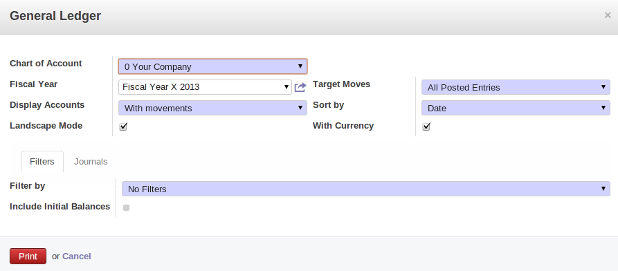
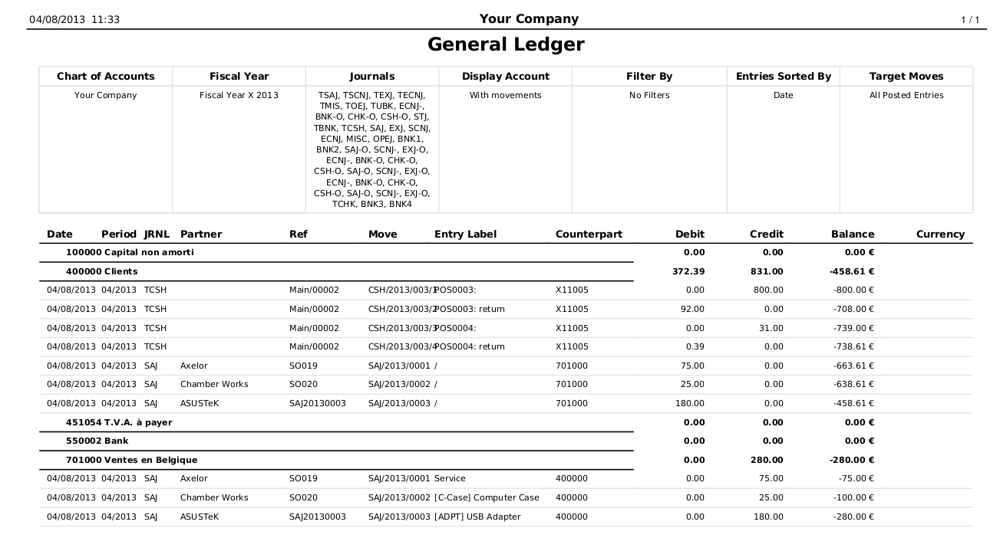
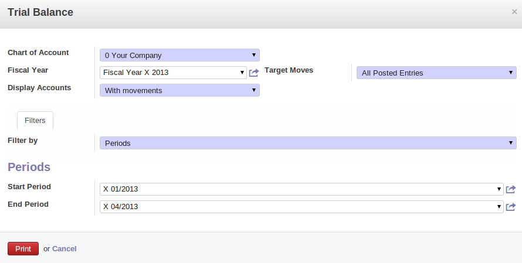
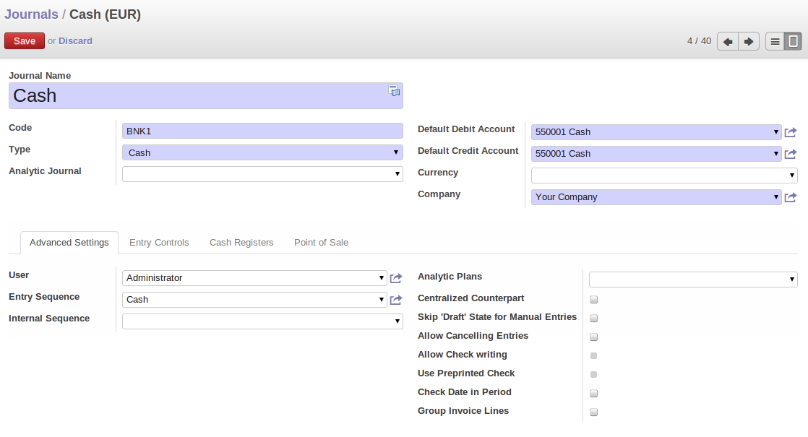
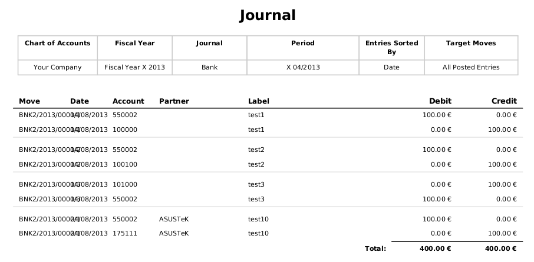
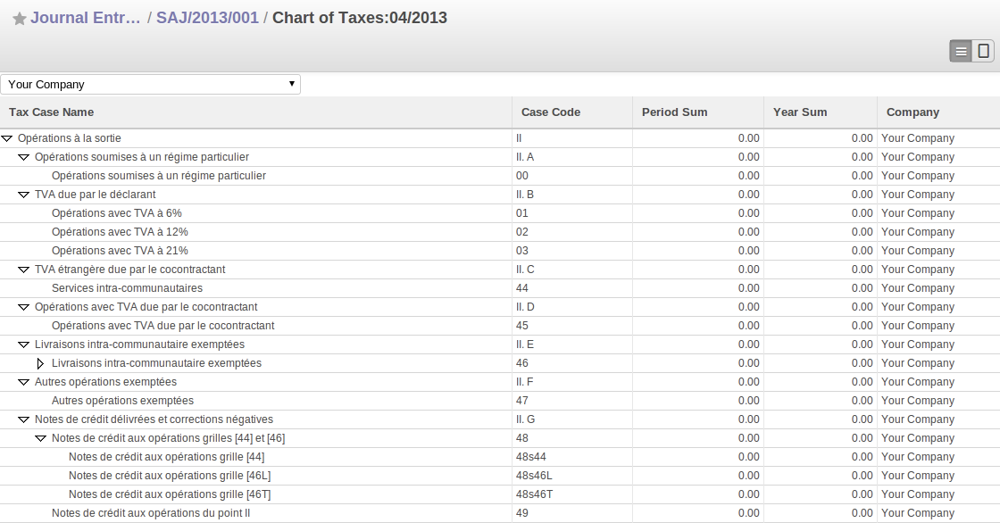

Statutory Taxes and Chart of Accounts
=====================================

This section deals with statutory taxes and accounts which are legally required from the company:

* the taxation structure provided by OpenERP,

* the accounts ledgers,

* account balance (used to produce the income statement and balance sheet),

* the different journals (general, centralized and detailed),

* the tax declaration.

.. tip:: Other Declarations

	In addition to the legal declarations available in the accounts modules,
	OpenERP supplies declarations based on the functionality in other modules.

	.. index::
	   single: module; report_intrastat

	You can, for example, install the :mod:`report_intrastat` module for intra-stat declarations
	about sending goods to and receiving goods from other countries.

.. index:: tax

Taxation
--------

You can attach taxes to financial transactions so that you can:

* add taxes to the amount that you pay or get paid,

* report on the taxes in various categories that you should pay the tax authorities,

* track taxes in your general accounts,

* manage the payment and refund of taxes using the same mechanisms that OpenERP uses for other
  monetary transactions.

Since the detailed tax structure is a mechanism for carrying out governments' policies, and the
collecting of taxes so critical to their authorities, tax requirements and reporting can be
complex. OpenERP has a flexible mechanism for handling taxation that can be configured through its
GUI or through data import mechanisms to meet the requirements of many various tax jurisdictions.

The taxation mechanism can also be used to handle other tax-like financial transactions, such as
royalties to authors based on the value of transactions through an account.

Setting up a Tax Structure
^^^^^^^^^^^^^^^^^^^^^^^^^^

Setup taxation using :menuselection:`Accounting --> Configuration -->
Financial Accounting --> Taxes --> Taxes`.

Three main objects are involved in the tax system in OpenERP:

* a :guilabel:`Tax Case` (or :guilabel:`Tax Code`), used for tax reporting, that can be set up in a hierarchical
  structure so that multiple codes can be formed into trees in the same way as a Chart of Accounts.

* a :guilabel:`Tax`, the basic tax object that contains the rules for calculating tax on the financial
  transaction it is attached to, and is linked to the General Accounts and to the Tax Cases. A tax can
  contain multiple child taxes and base its calculation on those taxes rather than the base
  transaction, providing considerable flexibility. Each tax belongs to a :guilabel:`Tax Group` (currently just
  \ ``VAT``\   or \ ``Other``\  ).

* the :guilabel:`General Accounts`, that record the taxes owing and paid. Since the general accounts are
  discussed elsewhere in this part of the book and are not tax-specific, they will not be detailed in
  this section.

You can attach zero or more :guilabel:`Supplier Tax` and :guilabel:`Customer Tax` items to products, so that you can
account separately for purchase and sales taxes (or Input and Output VAT – where VAT is Value
Added Tax). Because you can attach more than one tax, you can handle a VAT or Sales Tax separately
from an Eco Tax on the same product.

Your Tax Declaration
^^^^^^^^^^^^^^^^^^^^

Tax Cases are also known in OpenERP as Tax Codes. They are used for tax reporting, and can be set
up in a hierarchical structure to form trees in the same way as a Chart of Accounts.

To create a new Tax Case, use the menu :menuselection:`Accounting --> Configuration -->
Financial Accounting --> Taxes --> Tax codes`. You define the following fields:

   *Definition of Tax Code*

*  :guilabel:`Tax Case Name` : a unique name required to identify the Case,

*  :guilabel:`Case Code` : an optional short code for the case,

*  :guilabel:`Parent Code` : a link to a parent Tax Case that forms the basis of the tree structure
   like a Chart of Accounts,

*  :guilabel:`Coefficent for parent` : choose ``1.00`` to add the total to the parent account or ``-1.00`` to
   subtract it,

*  :guilabel:`Description` : a free text field for documentation purposes.

You can also see two read-only fields:

*  :guilabel:`Year Sum` : a single figure showing the total accumulated on this case for the
   financial year.

*  :guilabel:`Period Sum` : a single figure showing the total accumulated on this case for the
   current financial period (perhaps 1 month or 3 months).

You will probably need to create two tax cases for each different tax rate that you have to define,
one for the tax itself and one for the invoice amount that the tax is based on. And you will create
tax cases that you will not link to Tax objects (similar to General Account \ ``View``\   types) just
to organize the tree structure.

To view the structure that you have constructed, you can use the menu :menuselection:`Accounting --> Charts --> Chart of Taxes`.
This tree view reflects the structure of the
:guilabel:`Tax Cases` and shows the current tax situation.

Define Taxes
^^^^^^^^^^^^

Tax objects calculate tax on the financial transactions that they are attached to, and are linked to
the General Accounts and to the Tax Cases.

To create a new Tax Case, use the menu :menuselection:`Accounting --> Configuration -->
Financial Accounting --> Taxes --> Taxes`.

   *Definition of Tax*

You define the following fields:

*  :guilabel:`Tax Name` : a unique name required for this tax (such as \ ``12% Sales VAT``\  ),

*  :guilabel:`Tax Type` : a required field directing how to calculate the tax: ``Percentage``,
   ``Fixed Amount``, ``None``, ``Balance`` or ``Python Code``, (the latter is found in the :guilabel:`Compute Code`
   field in the :guilabel:`Special Computation` tab),

*  :guilabel:`Applicability` : a required field that indicates whether the base amount should be
   used unchanged (when the value is \ ``Always``\  ) or whether it should be processed by Python Code in
   the :guilabel:`Applicable Code` field in the :guilabel:`Special Computation` tab when the value is \ ``Given by Python Code``\  ),

*  :guilabel:`Amount` : a required field whose meaning depends on the Tax Type, being a multiplier
   on the base amount when the :guilabel:`Tax Type` is \ ``Percentage``\  , and a fixed amount added to the base
   amount when the :guilabel:`Tax Type` is \ ``Fixed Amount``\  ,

*  :guilabel:`Include in base amount` : when checked, the tax is added to the base amount and not
   shown separately,

*  :guilabel:`Domain` : is only used in special developments, not in the core OpenERP system,

*  :guilabel:`Invoice Tax Account` :a General Account used to record invoiced tax amounts, which may
   be the same for several taxes or split so that one tax is allocated to one account,

*  :guilabel:`Refund Tax Account` : a General Account used to record invoiced tax refunds, which may
   be the same as the Invoice Tax Account or, in some tax jurisdictions, must be separated,

*  :guilabel:`Tax on Children` : when checked, the tax calculation is applied to the output from other
   tax calculations specified in the :guilabel:`Child Tax Accounts` field (so you can have taxes on
   taxes), otherwise the calculation is applied to the base amount on the transaction,

*  :guilabel:`Tax included in Price` : when checked, the total value shown includes this tax,

*  :guilabel:`Tax Application` : selects whether the tax is applicable to ``Sale``, ``Purchase`` or ``All``
   transactions,

*  :guilabel:`Child Tax Accounts` : other tax accounts that can be used to supply the figure for
   taxation.

.. tip:: Using Child Taxes

	You can use child taxes when you have a complex tax situation that you want to hide from your end users.
	For example, you might define a motor mileage expenses product with a composite tax made up of two
	child taxes –
	a non-reclaimable private element and a reclaimable business element (which is the case in some
	European countries).

	When your staff come to claim motor mileage, they do not need to know about this taxation,
	but the accounting impact of their claim will be automatically managed in OpenERP.

The fields above apply the taxes that you specify and record them in the general accounts, but do not
provide you with the documentation that your tax authorities might need. For this, use the :guilabel:`Tax
Definition` tab to define which Tax Cases should be used for this tax:

*  :guilabel:`Account Base Code` : tax case to record the invoiced amount that the tax is based on,

*  :guilabel:`Account Tax Code` : tax case to record the invoiced tax amount,

*  :guilabel:`Refund Base Code` : tax case to record the refund invoice amount that the tax
   is based on,

*  :guilabel:`Refund Tax Code` : tax case to record the refund invoice tax amount.

Taxes on Products and Accounts
^^^^^^^^^^^^^^^^^^^^^^^^^^^^^^

When you have created a tax structure consisting of Tax Cases and Tax objects, you can use the taxes
in your various business objects so that financial transactions can be associated with taxes and
tax-like charges.

.. tip:: Retail Customers

	When you are retailing to end users rather than selling to a business,
	you may want to (or be required to) show tax-inclusive prices on your invoicing documents rather
	than a tax-exclusive price plus tax.

You can assign multiple taxes to a Product. Assuming you have set up the appropriate taxes, you
would use the menu :menuselection:`Sales --> Products --> Products` to open and edit a Product definition,
then:

* select one or more :guilabel:`Sale Taxes`  for any products that you might sell, which may
  include a \ ``Sales Tax``\   or \ ``Output VAT``\  , and a \ ``Sales Eco Tax``\  ,

* select one or more :guilabel:`Purchase Taxes` for any products that you might purchase, which may
  include a \ ``Purchase Tax``\   or \ ``Input VAT``\  , and a \ ``Purchase Eco Tax``\  .

Generally, when you make a purchase or sale, the taxes assigned to the product are used to calculate
the taxes owing or owed.

.. index::
   single: module; import_export

.. note:: Tax Regions

	The third-party module :mod:`import_export` (currently in ``extra-addons``)
	can be used to extend OpenERP's tax system,
	so that you can assign taxes to different accounts depending on the location of the Partner.
	The :guilabel:`Partner` is given a new :guilabel:`Partner Location` field that can be set to ``Local``,
	``Europe`` or ``Outside``,
	so that taxes and tax bases can be channelled to different accounts.

	This module could be the basis of more ambitious location-based tax accounting.

And you can assign multiple taxes to an account, so that when you transfer money through the account
you attract a tax amount. In such a case, this 'tax' may not be legally-required taxation but
something tax-like, for example, authors' royalties or sales commission.

.. index::
   single: balance sheet

General Ledger and Trial Balance
--------------------------------

To print the `General Ledger`, you can use the menu :menuselection:`Accounting --> Reporting --> Legal Reports --> Accounting Reports --> General Ledger`.
You will find the following wizard which is used to filter the resulting report.

   *Wizard for selecting the specific entries in report*

Select the proper options and journal(s) from the above wizard to print the `General Ledger`.

   *General Ledger*

.. index::
   single: module; account_simulation

.. tip::  Simulated Balance

	While you are printing account balances,
	if you have installed the :mod:`account_simulation` module from ``extra-addons``,
	OpenERP asks you which level of
	simulation to execute.

	Results will vary depending on the level selected.
	You could, for example, print the balance depending on various methods of amortization:

	* the normal IFRS method,

	* the French method.

	More generally, it enables you to make analyses using other simulation levels that you could
	expect.

To print the `Trial Balance`, you can use this menu :menuselection:`Accounting --> Reporting --> Legal Reports --> Accounting Reports --> Trial Balance`.
This report allows you to print or generate a PDF of your trial balance, allowing you to quickly check the balance of each of your accounts in a single report.

   *Trial Balance*

You can print the `General Ledger`  and `Trial Balance` report
directly from  the `Account` form also.

.. index:: journal

The Accounting Journals
-----------------------

To configure the different journals use the menu :menuselection:`Accounting --> Configuration --> Financial Accounting -->
Journals --> Journals`.

   *Definition of the  journal*

.. index::
   single: module; sale_journal
   single: module; purchase_journal

.. note::  Journals

	Note that there are different types of journals in OpenERP:

	* accounting journals (detailed in this chapter),

	* purchase journals (for distributing supplies provided on certain dates),

	* sales journals (for example, classifying sales by their type of trade),

	* the invoice journals (to classify sales by mode of invoicing - daily / weekly / monthly - and
	  automating the tasks.

	To get access to these different journals install the modules :mod:`sale_journal` (found at the time of
	writing in ``addons``, so available in a standard installation) and :mod:`purchase_journal` (found in
	``extra-addons`` at the time of writing, so needing special installation).

.. todo:: which reports are these - the Reports to the right?

OpenERP provide three main reports regarding the journals:

* To print `Journals`, use the menu :menuselection:`Accounting --> Reporting --> Legal Reports --> Journals --> Journals`.

   *Printing a journal*

* To print `General Journals`, use the menu :menuselection:`Accounting --> Reporting --> Legal Reports --> Journals --> General Journals`.

* To print `Centralizing Journal`, use the menu :menuselection:`Accounting --> Reporting --> Legal Reports --> Journals --> Centralizing Journal`.

Tax Declaration
---------------

Information required for a tax declaration is automatically generated by OpenERP from invoices. In
the section on invoicing, you will have seen that you can get details of tax information from the area
at the bottom left of an invoice.

You can also get the information from the accounting entries in the columns to the right.

OpenERP keeps a tax chart that you can reach from the menu :menuselection:`Accounting --> Charts --> Chart of Accounts`. The structure of the chart is for calculating the tax
declaration, but all the other taxes can be calculated also(such as the French DEEE).

.. index::
   single: TVA
   single: VAT

   *Example of a Belgian TVA (VAT) declaration*

The tax chart represents the amount of each area of the tax declaration for your country. It is
presented in a hierarchical structure which lets you see the detail only of what interests you and
hides the less interesting subtotals. This structure can be altered as you wish to fit your needs.

You can create several tax charts if your company is subject to different types of tax or tax-like
accounts, such as:

* authors' rights,

* ecotaxes, such as the French DEEE for recycling electrical equipment.

Each accounting entry can then be linked to one of the tax accounts. This association is done
automatically by the taxes which had previously been configured in the invoice lines.

.. tip:: Tax Declaration

	Some accounting software manages the tax declaration in a dedicated general account.
	The declaration is then limited to the balance in the specified period.
	In OpenERP, you can create an independent chart of taxes, which has several advantages:

	* it is possible to allocate only a part of the tax transaction,

	* it is not necessary to manage several different general accounts depending on the type of sale and
	  type of tax,

	* you can restructure your chart of taxes as you need.

At any time, you can check your chart of taxes for a given period using the report
:menuselection:`Accounting --> Reporting --> Generic Reporting --> Taxes --> Taxes Report`.

This data is updated in real time. This is very useful because it enables you to preview at any time
the tax that you owe at the start and end of the month or quarter.

Furthermore, for your tax declaration, you can click on one of the tax accounts to investigate the
detailed entries that make up the full amount. This helps you search for errors, such as when you have
entered an invoice at full tax rate when it should have been zero-rated for an inter-community trade or for
a charity.

In some countries, tax can be calculated on the basis of payments received rather than invoices
sent. In this instance, choose \ ``Payments``\   instead of
\ ``Invoices``\   in the :guilabel:`Based On` field. Even if you make your declaration on the
basis of invoices sent and received, it can be helpful to compare the two reports to see the
amount of tax that you pay but have not yet received from your customers.

.. Copyright © Open Object Press. All rights reserved.

.. You may take electronic copy of this publication and distribute it if you don't
.. change the content. You can also print a copy to be read by yourself only.

.. We have contracts with different publishers in different countries to sell and
.. distribute paper or electronic based versions of this book (translated or not)
.. in bookstores. This helps to distribute and promote the OpenERP product. It
.. also helps us to create incentives to pay contributors and authors using author
.. rights of these sales.

.. Due to this, grants to translate, modify or sell this book are strictly
.. forbidden, unless Tiny SPRL (representing Open Object Press) gives you a
.. written authorisation for this.

.. Many of the designations used by manufacturers and suppliers to distinguish their
.. products are claimed as trademarks. Where those designations appear in this book,
.. and Open Object Press was aware of a trademark claim, the designations have been
.. printed in initial capitals.

.. While every precaution has been taken in the preparation of this book, the publisher
.. and the authors assume no responsibility for errors or omissions, or for damages
.. resulting from the use of the information contained herein.

.. Published by Open Object Press, Grand Rosière, Belgium
