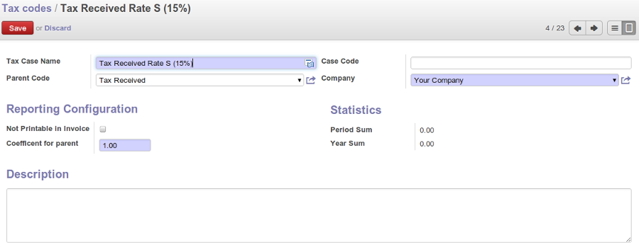

Managing your Tax Structure
===========================

This section deals with statutory taxes and accounts which are legally required from the company:

* the taxation structure provided by Open ERP,

.. index:: tax

You can attach taxes to financial transactions so that you can:

* add taxes to the amount you pay or receive,

* report on the taxes in various categories that you should pay the tax authorities,

* track taxes in your general accounts,

* manage the payment and refund of taxes using the same mechanisms OpenERP uses for other monetary transactions.

Since the detailed tax structure is a mechanism for carrying out governments' policies, and the collection of taxes so critical to their authorities, tax requirements and reporting can be complex. OpenERP has a flexible mechanism for handling taxation that can be configured to meet the requirements of many various tax jurisdictions.

The taxation mechanism can also be used to handle other tax-like financial transactions, such as royalties to authors based on the value of transactions through an account.

From the menu :menuselection:`Accounting --> Configuration --> Financial Accounting --> Taxes` you can define your tax structure. Note that when you use a predefined (localised) chart of accounts, taxes will be configured as well in most cases.

Three main objects are involved in the tax system in Open ERP:

* :guilabel:`Tax Case` (or :guilabel:`Tax Code`), used for tax reporting, that can be set up in a hierarchical
  structure so that multiple codes can be formed into trees in the same way as a Chart of Accounts. The Tax Codes structure is used to define your VAT return. You can define tax codes from the menu :menuselection: `Accounting --> Configuration --> Financial Accounting --> Taxes --> Tax Codes`.

* :guilabel:`Taxes`, the basic tax object that contains the rules for calculating tax on the transaction it is attached to, linked to the General Accounts and to the Tax Codes. A tax can contain multiple child taxes and base its calculation on those taxes rather than the base transaction, providing considerable flexibility.

* the :guilabel:`General Accounts`, which record the taxes owing and paid. Since the general accounts are discussed elsewhere in this part of the book and are not tax-specific, they will not be detailed in this section.

You can attach zero or more :guilabel:`Supplier Tax` and :guilabel:`Customer Tax` items to products, so that you can account separately for purchase and sales taxes (or Input and Output VAT – where VAT is Value Added Tax). Because you can attach more than one tax, you can handle a VAT or Sales Tax separately from an Eco Tax on the same product.

Tax Cases are also known in OpenERP as Tax Codes. They are used for tax reporting, and can be set up in a hierarchical structure to form trees in the same way as a Chart of Accounts.

To create a new Tax Code, use the menu :menuselection:`Accounting --> Configuration --> Financial Accounting --> Taxes --> Tax Codes`. You should define the following fields:

   *Tax Code*

*  :guilabel:`Tax Case Name`: a unique name required to identify the tax case, usually taken from your VAT return,

*  :guilabel:`Case Code`: an optional short code for the case,

*  :guilabel:`Parent Code`: a link to a parent Tax Case to create a tree structure (like a Chart of Accounts),

*  :guilabel:`Not Printable in Invoice`: a checkbox allowing you to indicate that any taxes linked to the tax code concerned should not be printed on the invoice,

*  :guilabel:`Coefficient for parent`: choose ``1.00`` to add the total to the parent account or ``-1.00`` to subtract it,

*  :guilabel:`Description`: a free text field for documentation purposes.

You can also see two read-only fields:

*  :guilabel:`Period Sum`: a single figure showing the total accumulated on this case for the
   current financial period.

*  :guilabel:`Year Sum`: a single figure showing the total accumulated on this case for the financial year.

You will probably need to create two tax cases for each different tax rate that you have to define, one for the tax itself and one for the invoice amount that the tax is based on. And you will create tax cases that you will not link to Tax objects (similar to General Account \ ``View``\   types) just to organize the tree structure.

To view the structure that you have constructed, you can use the menu :menuselection:`Accounting --> Charts --> Chart of Taxes`.
This tree view reflects the structure of the :guilabel:`Tax Codes` and shows the current tax situation.

Tax objects calculate tax on the transactions that they are attached to, and are linked to the General Accounts and to the Tax Codes.

To create a new Tax, use the menu :menuselection:`Accounting --> Configuration --> Financial Accounting --> Taxes --> Taxes`.

   *Defining Taxes*

You define the following fields:

*  :guilabel:`Tax Name`: a unique name required for this tax (such as \ ``21% Sales VAT``\  ),

*  :guilabel:`Tax Code`: an optional code for this tax (such as \ ``VAT IN IC``\  ),

*  :guilabel:`Tax Application`: defines whether the tax is applicable to ``Sales``, ``Purchase`` or ``All`` transactions,

*  :guilabel:`Tax Included in Price`: when checked, the price shown in the product or invoice is inclusive of this tax,

*  :guilabel:`Tax Type`: a required field indicating how tax should be calculated: ``Percentage``,
   ``Fixed Amount``, ``None``, ``Balance`` or ``Python Code``, (the latter is found in the :guilabel:`Compute Code`
   field in the :guilabel:`Special Computation` tab),

.. In that case, you also have to set the following field:
.. *  :guilabel:`Applicability` : a required field that indicates whether the base amount should be used unchanged (when the value is
.. \``Always``\  ) or whether it should be processed by Python Code in the :guilabel:`Applicable Code` field in the :guilabel:`Special
.. Computation` tab when the value is \ ``Given by Python Code``\  ),

*  :guilabel:`Amount`: a required field whose meaning depends on the Tax Type, being a multiplier of the base amount when the :guilabel:`Tax
   Type` is \ ``Percentage``\  , and a fixed amount added to the base amount when the :guilabel:`Tax Type` is \ ``Fixed Amount``\  ,

*  :guilabel:`Invoice Tax Account`: a General Account used to record invoiced tax amounts, which may be the same for several taxes or split so that one tax is allocated to one account,

*  :guilabel:`Refund Tax Account`: a General Account used to record invoiced tax refunds, which may be the same as the Invoice Tax Account or, in some tax jurisdictions, has to be separated,

*  :guilabel:`Tax on Children`: when checked, the tax calculation is applied to the output from other tax calculations specified in the :guilabel:`Child Tax Accounts` field (so you can have taxes on taxes), otherwise the calculation is applied to the base amount of the transaction,

*  :guilabel:`Include in base amount`: when checked, the tax is added to the base amount and not shown separately, such as Eco taxes,

*  :guilabel:`Child Tax Accounts`: other tax accounts that can be used to supply the figure for taxation.

.. tip:: Using Child Taxes

    You can use child taxes when you have a complex tax situation requiring several tax codes to be used.

The fields above apply the taxes that you specify and record them in the general accounts, but do not
provide you with the documentation that your tax authorities might need. For this, use the :guilabel:`Tax
Definition` tab to define which Tax Cases should be used for this tax:

*  :guilabel:`Account Base Code`: tax case to record the invoiced amount (exclusive of taxes) the tax is calculated on,

*  :guilabel:`Account Tax Code` : tax case to record the calculated tax amount,

*  :guilabel:`Refund Base Code` : tax case to record the refund amount (exclusive of taxes) the tax is calculated on,

*  :guilabel:`Refund Tax Code` : tax case to record the refund tax amount.

When you have created a tax structure consisting of Tax Cases and Tax objects, you can use the taxes in your various business objects so that transactions can be associated with taxes and tax-like charges, such as Eco Taxes (Recupel and Bebat, for instance).

.. tip:: Retail Customers

    When you are retailing to end users rather than selling to a business,
    you may want to (or be required to) show tax-inclusive prices on your invoicing documents rather
    than a tax-exclusive price plus tax.

You can assign multiple taxes to a Product. Assuming you have set up the appropriate taxes, you would use the menu :menuselection:`Sales --> Products --> Products` to open and edit a Product definition, then:

* select one or more :guilabel:`Sale Taxes` for any products that you might sell, which may
  include a \ ``Sales Tax``\   or \ ``Output VAT``\  and a \ ``Sales Eco Tax``\  ,

* select one or more :guilabel:`Purchase Taxes` for any products that you might purchase, which may
  include a \ ``Purchase Tax``\   or \ ``Input VAT``\  and a \ ``Purchase Eco Tax``\  .

Generally, when you make a purchase or sales, the taxes assigned to the product are used to calculate the taxes owing or owed.

You can also assign multiple taxes to an account, so that when you transfer money through the account you attract a tax amount. This principle can easily be used when posting purchase invoices for which no products are required.

.. index:: fiscal position

Taxes on Products and Accounts will usually be national taxes. OpenERP is capable of automatically converting national taxes to intracommunal or export taxes.

Go to the menu :menuselection:`Accounting --> Configuration -_> Financial Accounting --> Taxes --> Fiscal Positions`. You can use the fiscal positions to automatically convert national taxes to the required intracommunal or external taxes, according to the fiscal position specified for the customer or supplier.

Fiscal positions allow you to make a mapping from national taxes to intracommunal or external taxes, or to map your accounts according to these criteria. You can link fiscal positions to your customers and suppliers to ensure automatic and easy VAT conversion.
