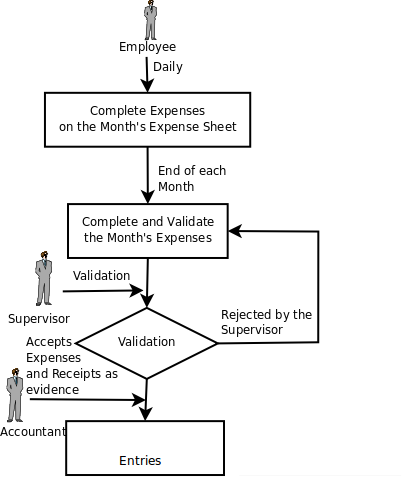
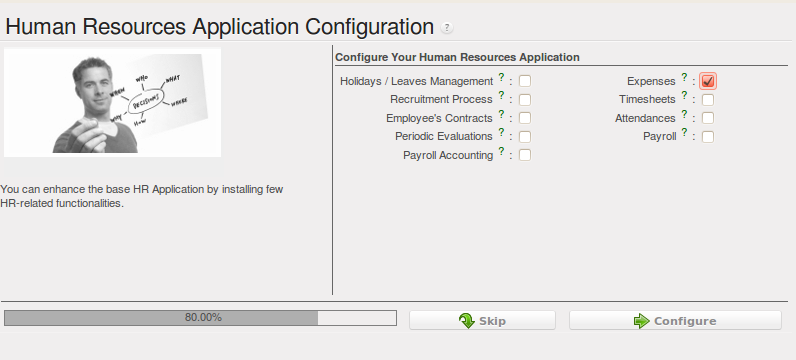
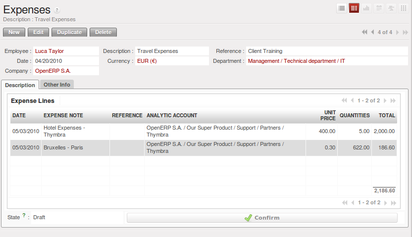

Keeping Track of Expenses
=========================

Employee expenses are charges incurred on behalf of the company. The company then reimburses these
expenses to the employee. The receipts encountered most frequently are:

* car travel, reimbursed per unit of distance (mile or kilometer),

* subsistence expenses, reimbursed based on the bill,

* other purchases, such as stationery and books, destined for the company but carried out by the
  employee.

An integrated process
---------------------

   *Process for Dealing with Expense Reimbursements*

Expenses generated by employees are grouped into periods of a week or a month. At the end of the
period the employee confirms all of its expenses and a summary sheet is sent to the department
manager. The manager is responsible for approving all the expense requests generated by his team.
The expense sheet must be signed by the employee, who also attaches its receipts to the expense sheet.

Once the sheet has been approved by the head of department it is sent to the Accounting department, which registers the
company's liability to the employee. Accounting can then pay this invoice and reimburse the employee
who originally advanced the money.

Some receipts are for project expenses, so these can then be attached to an analytic account. The
costs incurred are then added to the supplementary cost of the analytic account when the invoice is
approved.

You often need to invoice expenses to a customer, depending on the precise contract that has been
negotiated. Travelling and subsistence expenses are generally handled this way. These can be
recharged to the customer at the the end of the month if the contract price has been negotiated inclusive of
expenses.

If you have to go through many steps to reclaim expenses, it can all quickly become too cumbersome,
especially for those employees who claim large numbers of different expense lines. If you have got a
good system that integrates the management of these claims, such as the one described, you can avoid
many problems and increase staff productivity.

If your systems handle expenses well then you can avoid significant losses by setting your terms of
sales effectively. In fixed-price contracts, expense reimbursements are usually invoiced according to
the actual expense. It is in your interest to systematize their treatment, and automate the process
to the maximum, to recharge as much as you are contractually able.

Employee Expenses
-----------------

.. index::
   single: module; hr_expense

Install the module :mod:`hr_expense` to automate the management of expense claims.
The configuration wizard to install this module is shown below.

   *Configuration wizard to install hr_expense module*

Users can then enter and review their expenses using the menu :menuselection:`Human Resources --> Expenses --> Expenses`.

   *Expenses form to enter and review expenses*

Create templates for the various expenses accepted by the company using OpenERP's
product form. You could, for instance, create a product with the following parameters for the
reimbursement of travel expenses by car at 0.25 per kilometer:

*  :guilabel:`Product` : \ ``Car travel``\  ,

*  :guilabel:`Unit of measure` : \ ``km``\  ,

*  :guilabel:`Standard Cost` : \ ``0.25``\  ,

*  :guilabel:`Sales price` : \ ``0.30``\  ,

*  :guilabel:`Type of product` : \ ``Service``\  .

The employee keeps its expenses sheet in the \ ``Draft``\   state while completing it throughout the
period. At the end of the period (week or month) the employee can confirm its expense form using the
:guilabel:`Confirm` button on the form. This puts it into the state \ ``Waiting Approval``\  .

At the end of the period the department manager can access the list of expense forms waiting for
approval using the menu :menuselection:`Human Resources --> Expenses --> Expenses`.

The department manager can then approve the expenses, which automatically creates a supplier invoice
in the employee's name so that the employee can be reimbursed. An analytic account is coded onto
each line of the invoice. When the invoice is confirmed, general and analytic accounting entries are
automatically generated as they would be with any other invoice.

If you base your invoicing on service time or analytic costs, the expense will
automatically be recharged to the customer when the customer invoice is generated for services
associated with the project.

Invoicing from timesheets allows you to prepare all your invoices, both
expenses and timesheets for a project's customer.

You can view the statistical analysis of expenses using menu  :menuselection:`Human Resources --> Reporting --> Expenses Analysis`.

.. Copyright © Open Object Press. All rights reserved.

.. You may take electronic copy of this publication and distribute it if you don't
.. change the content. You can also print a copy to be read by yourself only.

.. We have contracts with different publishers in different countries to sell and
.. distribute paper or electronic based versions of this book (translated or not)
.. in bookstores. This helps to distribute and promote the Open ERP product. It
.. also helps us to create incentives to pay contributors and authors using author
.. rights of these sales.

.. Due to this, grants to translate, modify or sell this book are strictly
.. forbidden, unless Tiny SPRL (representing Open Object Press) gives you a
.. written authorisation for this.

.. Many of the designations used by manufacturers and suppliers to distinguish their
.. products are claimed as trademarks. Where those designations appear in this book,
.. and Open Object Press was aware of a trademark claim, the designations have been
.. printed in initial capitals.

.. While every precaution has been taken in the preparation of this book, the publisher
.. and the authors assume no responsibility for errors or omissions, or for damages
.. resulting from the use of the information contained herein.

.. Published by Open Object Press, Grand Rosière, Belgium

