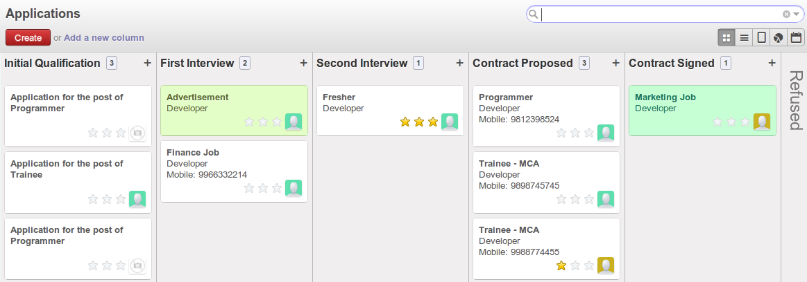
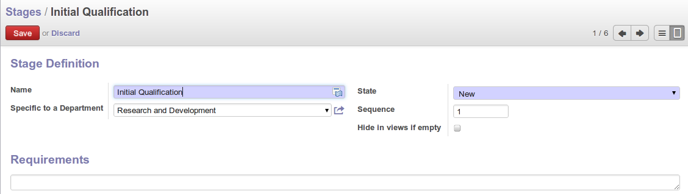
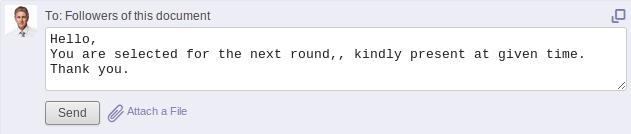
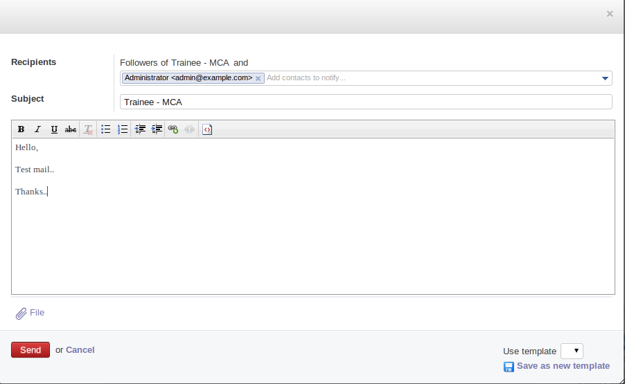
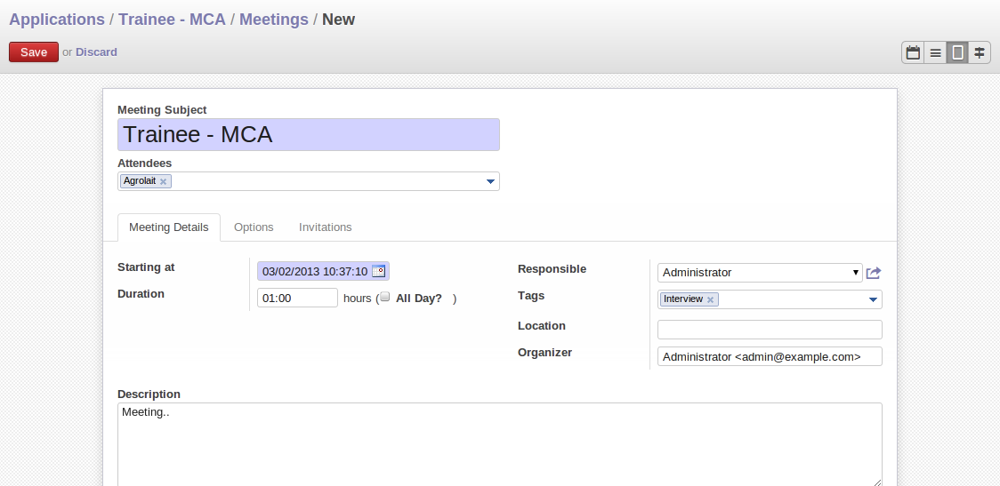
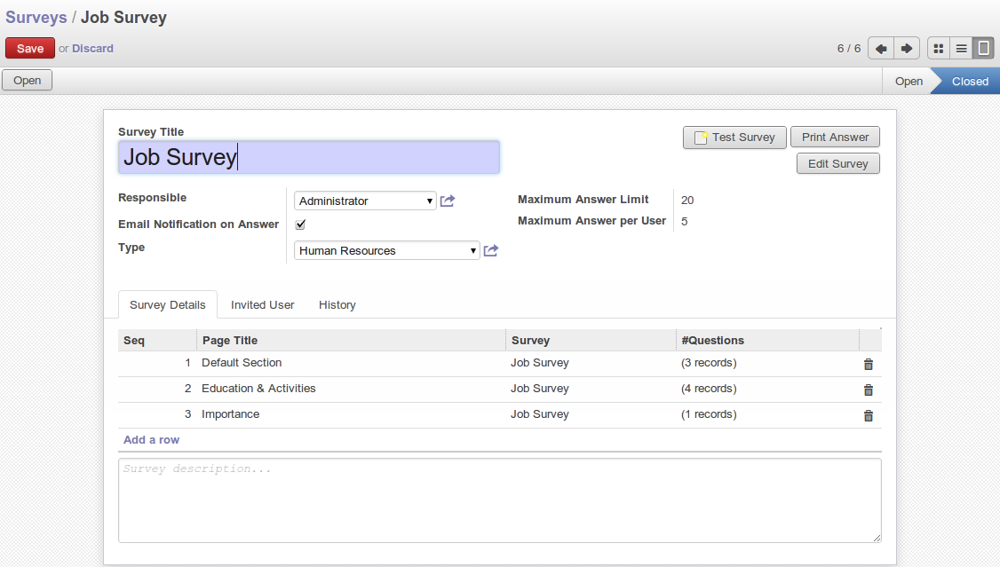

.. index::
   single: recruitments
..

Talent Acquisition
==================

Using OpenERP, you can efficiently manage the process of hiring new people for your organization.
It is a well managed recruitment process from initial contact to hiring the applicant.

.. index::
   single: module; hr_recruitment

You need to install :mod:`hr_recruitment` module to efficiently manage the recruitment process or Go to menu :menuselection:`Settings --> Configuration --> Human Resources` tick ``Manage the recruitment process`` and click on apply button.

.. figure::  images/config_wiz_recruitment.png
   :scale: 75
   :align: center

   *Configuration to install hr_recruitment module*

The :guilabel:`Applications` form can be seen from the menu :menuselection:`Human Resources --> Recruitment --> Applications`.

.. figure::  images/recruitment_applicant_form.png
   :scale: 60
   :align: center

   *Applications recruitment form*

You can manage the following information using the Applicants form:

* :guilabel:`Applicant's Name`
* :guilabel:`Applied Job`
* :guilabel:`Department`
* :guilabel:`Stage`: can be ``Initial Qualification``, ``First Interview``, ...
* :guilabel:`Responsible`: Responsible person who conducts the interview
* :guilabel:`Contact` information
* :guilabel:`Contract Data`: including Availability, Expected Salary, Proposed Salary
* :guilabel:`Qualification` of the applicant
* :guilabel:`State`: reflects the actual status of the recruitment process like ``New``, ``In Progress``, ``Pending``, ``Refused`` or ``Hired``

Initially, the applicant state is ``New``, after that it can be converted to ``In Progress``.
If the applicant is at one of the different stages like it may be in `Waiting for approval by human resource department` or `Waiting for offer acceptance by applicant`,
in these cases, the applicant state should be ``Pending``. When the status is ``Hired``, you can find that applicant's detail from the list of employees.

The information about the :guilabel:`Job Position` can be maintained by the menu :menuselection:`Human Resources --> Configuration --> Job Positions`.

.. figure::  images/recruitment_job_position.png
   :scale: 60
   :align: center

   *Job Positions in the organization*

The key features of OpenERP for the process of hiring new people using :mod:`hr_recruitment` module are:

* It manages job positions and the recruitment process.
* It is integrated with the :mod:`survey` module to allow you to define interviews for different jobs.
* This module is integrated with the mail gateway to automatically track emails
  sent to jobs@yourcompany.com.
* It is also integrated with the document management system to store and search CVs in your CV base.

You can analyse data of recruitment process through the menu :menuselection:`Reporting --> Human Resources --> Recruitment Analysis`.

.. index::
   single: recruitments; create applicants from e-mail

Create applicants automatically based on incoming mail and keep track of attachments such as resumes and cover letters
----------------------------------------------------------------------------------------------------------------------

You have seen how to create new applicants from the `Applicants` form. You can also configure your email server in OpenERP to create new applicants based on incoming mails. For example, if you have an e-mail ID ``jobs@yourcompany.com``, you can configure it such that all emails received at this ID automatically generate new job applicants.

For this, you have to install the :mod:`fetchmail` module from module list and For configuring :guilabel:`Fetch Emails` Go to menu :menuselection:`Settings --> Configuration --> Human Resources` tick ``Create applicants from an incoming email account`` and click on configure button or Navigate to :menuselection:`Setting --> Technical --> Email --> Incoming Mail Servers` and click :guilabel:`Create`. Supply the following information in the `Email Servers` form:

* :guilabel:`Name` : A name for the server configuration.
* :guilabel:`Server Type` : Either ``POP Server`` or ``IMAP Server``.
* :guilabel:`Keep Attachment` : Set to ``True``, to be able to retrieve attachments like CVs, cover letters, etc.
* :guilabel:`Server` : Server name.
* :guilabel:`Port` : Server port.
* :guilabel:`User Name` : The username on this e-mail server.
* :guilabel:`Password` : The password for access to this e-mail account.
* :guilabel:`Model` : The object model for which you wish to generate a record. Select ``Applicant`` (hr.applicant) in this case.

.. figure::  images/recruitment_config_server.png
   :scale: 60
   :align: center

   *Configuring an e-mail server*

After configuring your server, click the :guilabel:`Test & Confirm` button to enable this configuration and click on  Fetch `Now button` to start receiving e-mails.

Whenever you receive a new e-mail at the configured e-mail address, a new applicant record is created having the same subject name as the e-mail subject. The applicants e-mail details are stored too, for future correspondence. You can add more details to this job application. You can view these newly created applicants from :menuselection:`Human Resources --> Recruitment --> Applications`. In the figure :ref:`ejob`, the `Initial Qualification` applicants have been created automatically from received e-mails.

.. _ejob:

   *Job applicants automatically created from e-mails*

Because you have configured your server to add attachments, if an incoming applicant e-mail contains attachments, it will be linked to the corresponding applicant record. You can find it in the :guilabel:`Attachments` section at the top of the applicant form. You can click on the attachment name to open it.

.. figure::  images/recruitment_email_attach.png
   :scale: 60
   :align: center

   *Applicant form with its corresponding attachments*

.. index::
   single: recruitments; stages

Define stages to track the progress in the recruitment process
--------------------------------------------------------------

Rarely will a recruitment process end after just a single meeting or a phone call. It is in fact a string of stages through which a recruitment progresses in order to bear a favourable outcome. You can define the stages which a recruitment process would undergo. Use the menu :menuselection:`Human Resources --> Configuration --> Recruitment --> Stages` to define various stages.

   *Defining recruitment stages*

You must give the stage a :guilabel:`Name`. Use the :guilabel:`Sequence` field to give a sequence order when displaying a list of stages. You may also associate the stage with a :guilabel:`Department` and :guilabel:`State`. The stages are now conveniently placed on the top right hand of each of Applications. Using this, you can qualify an ongoing recruitment process from one stage to another by just one click.

.. index::
   single: recruitments; next action

Define next action and next action dates
----------------------------------------

The :guilabel:`Next Action Date` and :guilabel:`Next Action` fields on the `Applicants` form let you define an action you would like to initiate on a given date. It serves as a reminder to the recruitment officer regarding what step he must take next and on which date.

.. index::
   single: recruitments; communication history

E-mail communication with the applicant
----------------------------------------------------------------

In 7.0 you can send message or email easily.

OpenChatter provides a simple communication tool to discuss amongst colleagues or external contacts, either with an individual or with a group.

You can see OpenChatter below the applicants form and you can send message or mail via that chatter.

   *Send a message to the applicant*

Here too , You may also add attachments through the OpenChatter. Click :guilabel:`Post` to send the message. 

And for send a mail throgh Openchatter , the full window seems like follow:

   *Send an e-mail to the applicant*

You can also schedule meetings with an applicant. To do this, click the :guilabel:`Schedule Meeting` button on the `Applicants` form. A calendar of meetings opens in the `Meetings` form. Here, you click an empty area on a date for which you wish to schedule the meeting. It shows as follow:

   *Schedule a meeting with an applicant*

You can manage the following details from this form:

* :guilabel:`Start Date` : The scheduled start date and time.
* :guilabel:`Duration` : The duration of the meeting in hours.
* :guilabel:`Location` : Location of the meeting.
* :guilabel:`Reminder` : If you want to be reminded about the meeting, you can select an alarm time before the event occurs.
* :guilabel:`Description` : You may specify the agenda of the meeting here.

On the :guilabel:`Invitation Detail` tab, you also have the choice to invite people for the meeting. Click :guilabel:`Save` once you have entered the necessary details. You can then see the meeting appear in the calendar as shown below:

   *The scheduled meeting "Trainee - MCA" with the applicant as seen in the calendar*

You can track and edit your meetings with applicants from the menu :menuselection:`Sales --> Meetings --> Meetings`. By default, you will see the month-wise calendar view of meetings.

.. index::
   single: recruitments; questionnaires
   single: recruitments; survey

Fill questionnaires for each applicant (for instance preliminary questionnaires)
--------------------------------------------------------------------------------

You can use questionnaires as a tool to interview a job applicant. To be able to use questionnaires for a job applicant you must first define one through :menuselection:`Tools --> Surveys --> Surveys`. Click :guilabel:`Create` to open a new survey form. You may enter the :guilabel:`Survey Title` and the :guilabel:`Responsible` user for the survey.

   *The survey form*

A survey may have multiple pages. Each page may contain multiple questions and each question may have multiple answers. Different users may give different answers to the questions. You can define these in the :guilabel:`Survey` tab of the form. When you have entered the necessary details in the form, click :guilabel:`Save`. Since you will use this survey in a job interview, click the :guilabel:`Open` button to change the survey's state from ``Draft`` to ``Open``.

Then, go to :menuselection:`Human Resources --> Configuration --> Job Positions` and select the job position that the applicant has applied for, or create a new job position. In the :guilabel:`Interview Form` field of the `Job Positions` form, enter the name of the survey you have just created, thus linking a questionnaire with this job profile and making it available for use during the interview.

You can now open the form of the applicant whose interview you wish to initiate. If an :guilabel:`Applied Job` is specified to which a survey is linked, the :guilabel:`Start Interview` button becomes accessible. Click it to initiate the survey, and fill in the applicant's response as you proceed. After the questionnaire has been completed, you can click the :guilabel:`Print Interview` button on the `Applicants` form to view the applicant's response in a PDF file.

   *The applicant's response in a PDF file*

.. Copyright © Open Object Press. All rights reserved.

.. You may take electronic copy of this publication and distribute it if you don't
.. change the content. You can also print a copy to be read by yourself only.

.. We have contracts with different publishers in different countries to sell and
.. distribute paper or electronic based versions of this book (translated or not)
.. in bookstores. This helps to distribute and promote the OpenERP product. It
.. also helps us to create incentives to pay contributors and authors using author
.. rights of these sales.

.. Due to this, grants to translate, modify or sell this book are strictly
.. forbidden, unless Tiny SPRL (representing Open Object Press) gives you a
.. written authorisation for this.

.. Many of the designations used by manufacturers and suppliers to distinguish their
.. products are claimed as trademarks. Where those designations appear in this book,
.. and Open Object Press was aware of a trademark claim, the designations have been
.. printed in initial capitals.

.. While every precaution has been taken in the preparation of this book, the publisher
.. and the authors assume no responsibility for errors or omissions, or for damages
.. resulting from the use of the information contained herein.

.. Published by Open Object Press, Grand Rosière, Belgium
