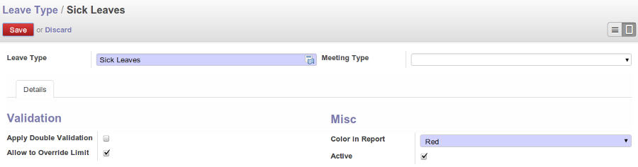
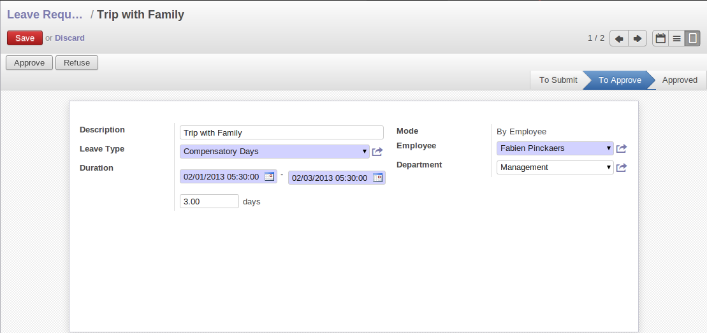
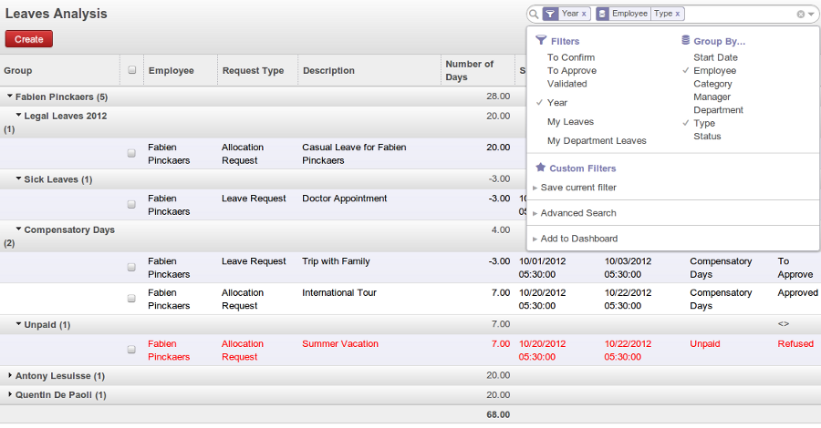
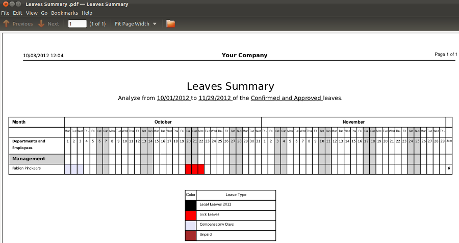
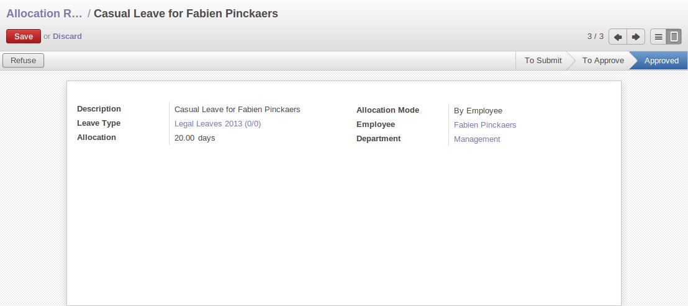

.. index::
   single: Human Resources; holidays
..

Holiday Management
==================

You can manage leaves taken by employees using the :mod:`hr_holidays` module. 
Go to the menu :menuselection:`Settings --> Configuration --> Human Resources`.Then in ``Additional Features`` tick the `Manage holidays, leaves and allocation requests`.And then click on the ``Apply`` button.

.. figure::  images/config_wiz_holidays.png
   :scale: 75
   :align: center

   *Install hr_holidays module*

Using the menu :menuselection:`Human Resources --> Leaves --> My Leave Requests` an employee can request a leave.

Leaves requests can be recorded by employees and validated by their managers.
Once a leave request is validated, it appears automatically in the agenda of the employee.
You can define several leave types (paid holidays, sickness, etc.) and manage allocations
per type.

OpenERP can provide the following features for efficient holiday management process:

* It helps you to manage leaves and leave requests.
* Synchronisation with an internal agenda (use of :mod:`crm`) is possible:
  in order to automatically create a case when a holiday request is accepted,
  you have to link the holidays status to a case section.
* You can set up colour preferences according to your leave type, for example, `Sick Leave` should be red in reports.
* An employee can request for more days off, by making a new Allocation Request through :menuselection:`Human Resources --> Leaves --> My Allocation Requests`.

The statistical report for leaves can be seen using the
:menuselection:`Reporting --> Human Resources --> Leaves Analysis` menu.

.. index::
   single: holidays; leave types

Define different leave types
----------------------------

You can define various leave types which can be availed of by an employee during a request for leave. To define a new leave type, navigate to :menuselection:`Human Resources --> Configuration --> Leave Type` and click :guilabel:`New`.

   *Leave Type form*

You can configure the following information:

* :guilabel:`Leave Type` : A name for the leave type.
* :guilabel:`Colour in Report` : A colour that will be used in the leaves summary report.
* :guilabel:`Meeting` : If you select a meeting, once a leave is validated, an event will be created in the calendar.
* :guilabel:`Apply Double Validation` : If ``True``, then the request will require a second validator.
* :guilabel:`Allow to Override Limit` : If ``True``, the employee will be allowed to take more leaves than the maximum limit.

After entering the leave type information, click :guilabel:`Save`.

.. index::
   single: holidays; manage requests and approvals

Manage Holiday requests and approvals
-------------------------------------

An employee can request for leave from :menuselection:`Human Resources --> Leaves --> My Leave Requests`. In a new :guilabel:`My Leave Requests` form, you may enter the following:

* :guilabel:`Description` : Reason for leave.
* :guilabel:`Mode` : Either ``By Employee`` or ``By Employee Category``.
* :guilabel:`Employee` : If leave category is ``By Employee``, you must select an employee who places this request.
* :guilabel:`Category` : If leave category is ``By Employee Category``, you must select an employee category which places this request.
* :guilabel:`Leave Type`: Select a pre-defined type of leave.
* :guilabel:`Duration` : Leave start date and end date.
* :guilabel:`days` : It is calculated based on the :guilabel:`Start Date` and the :guilabel:`End Date`.

   *Leave Requests form*

The employee can then :guilabel:`Save` the request which will also make it available to his manager for approval. The employee's manager can find leave requests awaiting approval by navigating to :menuselection:`Human Resources --> Leaves --> Leave Requests to Approve`. The manager can select a pending request to open its form view and click :guilabel:`Refuse` to reject the request or :guilabel:`Approve` to accept the request. If the selected leave type has :guilabel:`Apply Double Validation` set to ``True``, then another action by a second manager will be required to give the request its final state, from ``Waiting Second Approval`` to either ``Approved`` or ``Refused``.

.. index::
   single: holidays; previous requests

Track previous Holiday requests
-------------------------------

Previous holidays can be tracked in a number of ways in OpenERP. You can get a report of your(currently logged in user) leave requests from :menuselection:`Human Resources --> Leaves --> My Leave Requests`. Click :guilabel:`Validated` in the `Filters` to see a list of your approved leave requests. To see refused requests, clear your filters and see the records marked with the colour red.

To see your(currently logged in user) allocation requests, navigate to :menuselection:`Human Resources --> Leaves --> My Allocation Requests` and follow the same procedure as above.

Through :menuselection:`Human Resources --> Leaves --> Leaves Summary`, you can track previous leaves as well as allocation requests in the same manner, but only for the currently logged in user. By default, you can see the requests grouped by leave type and which are validated.

:menuselection:`Reporting --> Human Resources --> Leaves Analysis` will give you the statistical report of leaves and allocations grouped by year, employee and leave type. 

All the above statistical reports are enhanced by various filters and groupings to assist you in your search for required information. You can filter requests by their :guilabel:`State` (`Validated`, `To Confirm`, `To Approve`), :guilabel:`Year`, :guilabel:`My Leaves` and :guilabel:`My Department Leaves`. You can also view requests placed in :guilabel:`This Month`. You can group by :guilabel:`Employee`, :guilabel:`Manager`, :guilabel:`Department`, :guilabel:`Type`, :guilabel:`Category`, :guilabel:`Start Date` and :guilabel:`State`.

   *Leaves Analysis statistical report*

To get an overview of leaves by department, go to :menuselection:`Reporting --> Human Resource --> Reports --> Leaves by Department`. You may select a :guilabel:`From` date, a :guilabel:`Leave Type` (``Approved``, ``Confirmed`` or ``Both Approved and Confirmed``) and select at least one department. Click :guilabel:`Print` to generate a PDF report based on your specifications.

   *Leaves by Department PDF report*

.. index::
   single: holidays; allocation requests

Allow employees to enter their own allocation requests
------------------------------------------------------

To be able to request leaves at all, an employee must be allocated some leaves which he can avail of. Usually the management makes an allocation of leaves for its employees. But, for instance, when an employee has been working on an exceptional basis on weekends, he might be entitled to extra leaves. In such a case, the employee himself can be allowed to place a request for allocation, which can then be approved or rejected by his manager. If approved, the employee can request leaves based on the type and limit of this allocation too.

Leave allocations can be requested from :menuselection:`Human Resources --> Leaves --> My Allocation Requests`. In its form view you can fill the following details:

* :guilabel:`Description` : A name for the request.
* :guilabel:`Allocation Mode` : Either ``By Employee`` or ``By Employee Category``.
* :guilabel:`Employee` : If allocation category is ``By Employee``, you must select an employee for whom this allocation is made.
* :guilabel:`Category` : If allocation category is ``By Employee Category``, you must select an employee category for whom this allocation is made.
* :guilabel:`Leave Type` : Select a pre-defined leave type.
* :guilabel:`Number of Days` : The number of days requested for allocation.
* :guilabel:`Reasons` : Specify the reason of request.

The employee can click :guilabel:`Save`.

   *Allocation Requests form*

The manager will then find this request in his list of allocation requests. He can then either click :guilabel:`Refuse` to reject the request or click :guilabel:`Approve` to accept the request.

.. Copyright © Open Object Press. All rights reserved.

.. You may take electronic copy of this publication and distribute it if you don't
.. change the content. You can also print a copy to be read by yourself only.

.. We have contracts with different publishers in different countries to sell and
.. distribute paper or electronic based versions of this book (translated or not)
.. in bookstores. This helps to distribute and promote the OpenERP product. It
.. also helps us to create incentives to pay contributors and authors using author
.. rights of these sales.

.. Due to this, grants to translate, modify or sell this book are strictly
.. forbidden, unless Tiny SPRL (representing Open Object Press) gives you a
.. written authorisation for this.

.. Many of the designations used by manufacturers and suppliers to distinguish their
.. products are claimed as trademarks. Where those designations appear in this book,
.. and Open Object Press was aware of a trademark claim, the designations have been
.. printed in initial capitals.

.. While every precaution has been taken in the preparation of this book, the publisher
.. and the authors assume no responsibility for errors or omissions, or for damages
.. resulting from the use of the information contained herein.

.. Published by Open Object Press, Grand Rosière, Belgium
