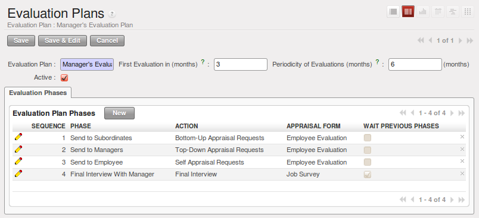

.. index::
   single: evaluation
..

Inspire your People through Assessments
=======================================

A motivated workforce of people can give the best outcome for an organization. OpenERP
can maintain this motivational process by periodical evaluation of employees' performance.

The regular assessment of human resources can benefit your people as well your organization.
For efficient periodical evaluation of employees' performance, you need to install the :mod:`hr_evaluation`
module. Go to the menu Settings ‣ Configuration ‣ Human Resources. And then tick the `Organize employees periodic evaluation`.

.. figure::  images/config_wiz_evaluation.png
   :scale: 75
   :align: center

   *install hr_evaluation module*

To create and manage new evaluations, you can use the menu :menuselection:`Human Resources --> Appraisal --> Appraisals`.

.. figure::  images/employee_evaluation.png
   :scale: 59
   :align: center

   *Employee Appraisal form*

Each employee can be assigned an appraisal  plan. These plans define the frequency and the
way you manage your periodic personal appraisal. You will be able to define steps and attach
interview forms to each step. OpenERP manages all kinds of Appraisals: bottom-up, top-down,
self appraisal and final appraisal by the manager.

The main features of the appraisal process covered by OpenERP are as follows:

* Ability to create employees appraisal.
* An appraisal can be created by an employee for subordinates, juniors as well
  as his manager.
* The appraisal is done under a plan in which various surveys can be created.
  Each survey can be answered by a particular level of employee hierarchy.
  The final review and appraisal is done by the manager.
* Every appraisal filled by employees can be viewed through a PDF form.
* Interview Requests are generated automatically by OpenERP according to employees
  appraisal plans. Each user receives automatic emails and requests to perform appraisal
  of their colleagues periodically.

You can analyse appraisal data through the menu :menuselection:`Reporting --> Human Resources -->  Appraisal Analysis`.

.. index::
   single: evaluation; define categories

Define different appraisal categories
--------------------------------------

You can create new appraisal plans from :menuselection:`Human Resources --> Configuration -->  Appraisal Plans`. Click :guilabel:`Create` and fill in the following details:

* :guilabel:`Appraisal Plan` : A name for the appraisal plan.
* :guilabel:`First Appraisal in (months)` : This will be used to schedule the first appraisal date of the employee when selecting an appraisal plan.
* :guilabel:`Periodicity of Appraisal (months)` : This depicts the delay between each appraisal of this plan (after the first one).

   *Appraisal Plans form*

You must also create :guilabel:`Appraisal Plan Phases`, to let your plan evolve from one stage to another and be able to take appropriate action at every stage, like sending an e-mail. You can configure the following settings in an appraisal plan phase:

* :guilabel:`Phase` : A name for the appraisal plan phase.
* :guilabel:`Wait Previous Phases` : Set to ``True`` if you want all preceding phases to finish before launching this phase.
* :guilabel:`Sequence` : The sequence number of this phase.
* :guilabel:`Action` : Select an action, either ``Top-Down Appraisal Requests``, ``Bottom-Up Appraisal Requests``, ``Self Appraisal Requests`` or ``Final Interview``.
* :guilabel:`Appraisal Form` : The survey to link to this phase.

Here you will be able to customize more settings, like whether you would like to send an e-mail for this phase and the corresponding layout for it. You can also choose to send the results (answers) of this phase to the managers and employees.

.. index::
   single: evaluation; plan dates

Plan assessment dates
---------------------

Once an appraisal plan is created, you can use it in an appraisal of an employee. Create a new appraisal from :menuselection:`Human Resources --> Appraisal --> Appraisals`. Select an :guilabel:`Employee` for whom this appraisal is being designed and select a :guilabel:`Plan` too. Here you must specify a deadline for the appraisal in the :guilabel:`Date` field.

Although, appraisal reminders are sent based on the :guilabel:`First Appraisal in (months)` and :guilabel:`Periodicity of Appraisal (months)` fields in :guilabel:`Appraisal Plans` form. You can use these to regulate assessment dates of Appraisals that utilize a corresponding plan.

.. index::
   single: evaluation; link to survey

Link survey and job evaluations
-------------------------------

An appraisal plan is a sequence of phases, and each phase is linked to an appraisal form. This appraisal form is nothing but a survey, a tool for assessment through a questionnaire. Surveys are defined at :menuselection:`Tools --> Surveys --> Surveys`. When an appraisal is started, interview requests are automatically created based on appraisal plans. If you create additional interview requests, there too you have to link the interview to a :guilabel:`Survey`. You may link to a survey that is any state (even ``Draft``), but in order to start the interview, the linked survey must be in ``Open`` state.

.. Copyright © Open Object Press. All rights reserved.

.. You may take electronic copy of this publication and distribute it if you don't
.. change the content. You can also print a copy to be read by yourself only.

.. We have contracts with different publishers in different countries to sell and
.. distribute paper or electronic based versions of this book (translated or not)
.. in bookstores. This helps to distribute and promote the OpenERP product. It
.. also helps us to create incentives to pay contributors and authors using author
.. rights of these sales.

.. Due to this, grants to translate, modify or sell this book are strictly
.. forbidden, unless Tiny SPRL (representing Open Object Press) gives you a
.. written authorisation for this.

.. Many of the designations used by manufacturers and suppliers to distinguish their
.. products are claimed as trademarks. Where those designations appear in this book,
.. and Open Object Press was aware of a trademark claim, the designations have been
.. printed in initial capitals.

.. While every precaution has been taken in the preparation of this book, the publisher
.. and the authors assume no responsibility for errors or omissions, or for damages
.. resulting from the use of the information contained herein.

.. Published by Open Object Press, Grand Rosière, Belgium
