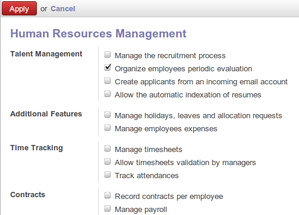
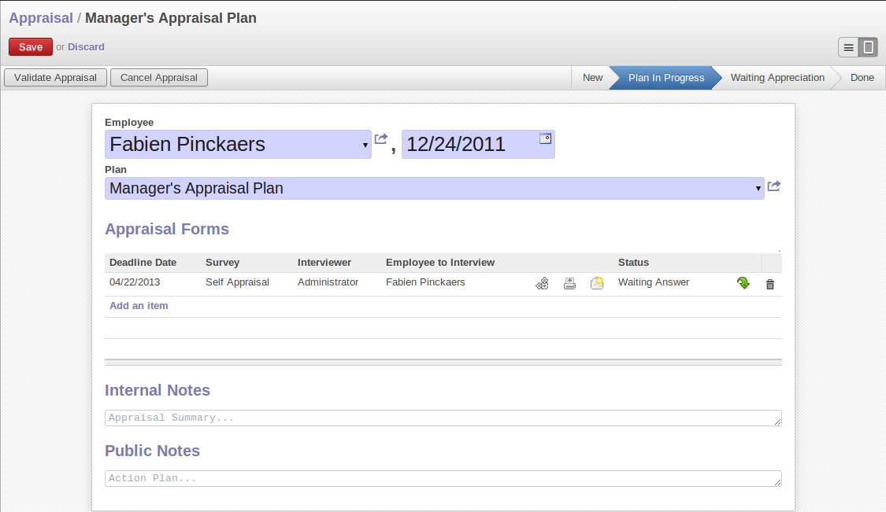

.. index::
   single: motivation
..

Inspire your People
====================

Motivated workforce of people can give the best out come for the organization. OpenERP
can maintain this motivational process by periodical evaluation of employees' performance and
efficient holiday management.

Assessments
-----------

The regular assessments of human resources can be benefited to your people as well organization.
For efficient periodical evaluation of employees' performance you need to install :mod:`hr_evaluation`
module.The configuration wizard to install this module is shown below.

   *Configuration wizard to install hr_evaluation module*

To create and manage new evaluation you can use the menu :menuselection:`Human Resources --> Evaluations --> Evaluations`.

   *Employee's evaluation form*

Each employee can be assigned to an evaluation plan. These plans define the frequency and the
way you manage your periodic personal evaluation. You will be able to define steps and attach
interview forms to each step. OpenERP manages all kind of evaluations: bottom-up, top-down,
self evaluation and final evaluation by the manager.

The main features of the evaluation process covered by OpenERP are as follow.

* Ability to create employees evaluation.
* An evaluation can be created by employee for subordinates,juniors as well
  as his manager.
* The evaluation is done under a plan in which various surveys can be created
  and it can be defined which level of employee hierarchy fills what and
  final review and evaluation is done by the manager.
* Every evaluation filled by the employees can be viewed by nice pdf form.
* Interview Requests are generated automatically by OpenERP according to employees
  evaluation plan. Each user receives automatic emails and requests to perform evaluation
  of their colleagues periodically.

You can analyse evaluation data through the menu :menuselection:`Human Resources --> Reporting --> Evaluations Analysis`.

Holiday Management
------------------

you can manage the leaves taken by employees using :mod:`hr_holidays`
module.The configuration wizard to install this module is shown below.

.. figure::  images/config_wiz_holidays.png
   :scale: 50
   :align: center

   *Configuration wizard to install hr_holidays module*

Using the menu :menuselection:`Human Resources --> Holidays --> Leave Requests` employee can put the leave request.

.. figure::  images/employee_leave_request_form.png
   :scale: 50
   :align: center

   *Configuration wizard to install hr_holidays module*

Leaves requests can be recorded by employees and validated by their managers.
Once a leave request is validated it appears automatically in the agenda of the employee.
You can define several allowance types (paid holidays, sickness, etc) and manage allowances
per type.

OpenERP can provide following features for efficient holiday management process.

* It helps you to manage leaves and leaves' requests.
* A synchronisation with an internal agenda (use of the CRM module) is possible:
  in order to automatically create a case when an holiday request is accepted,
  you have to link the holidays status to a case section.
* You can set up  colour preferences according to your leave type like `Seak Leave` should be red in reports.
* An employee can make an ask for more off-days by making a new Allocation

.. Copyright © Open Object Press. All rights reserved.

.. You may take electronic copy of this publication and distribute it if you don't
.. change the content. You can also print a copy to be read by yourself only.

.. We have contracts with different publishers in different countries to sell and
.. distribute paper or electronic based versions of this book (translated or not)
.. in bookstores. This helps to distribute and promote the Open ERP product. It
.. also helps us to create incentives to pay contributors and authors using author
.. rights of these sales.

.. Due to this, grants to translate, modify or sell this book are strictly
.. forbidden, unless Tiny SPRL (representing Open Object Press) gives you a
.. written authorisation for this.

.. Many of the designations used by manufacturers and suppliers to distinguish their
.. products are claimed as trademarks. Where those designations appear in this book,
.. and Open Object Press was aware of a trademark claim, the designations have been
.. printed in initial capitals.

.. While every precaution has been taken in the preparation of this book, the publisher
.. and the authors assume no responsibility for errors or omissions, or for damages
.. resulting from the use of the information contained herein.

.. Published by Open Object Press, Grand Rosière, Belgium