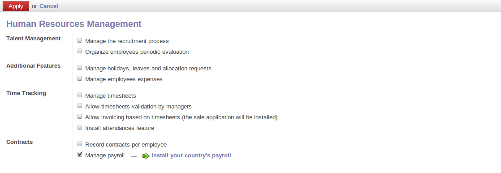
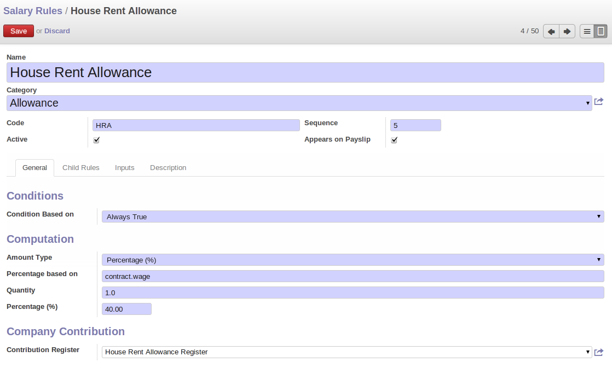
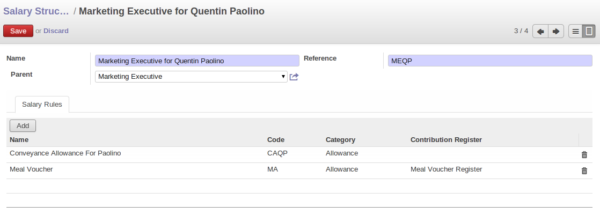
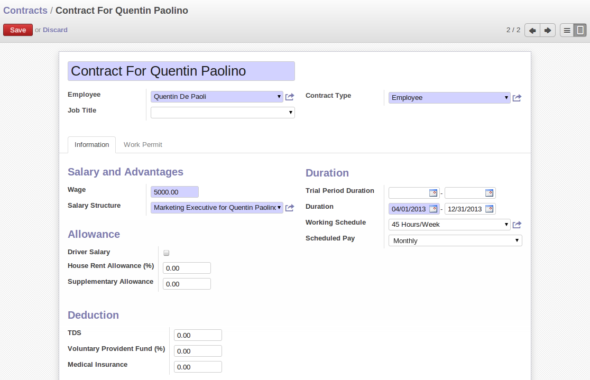
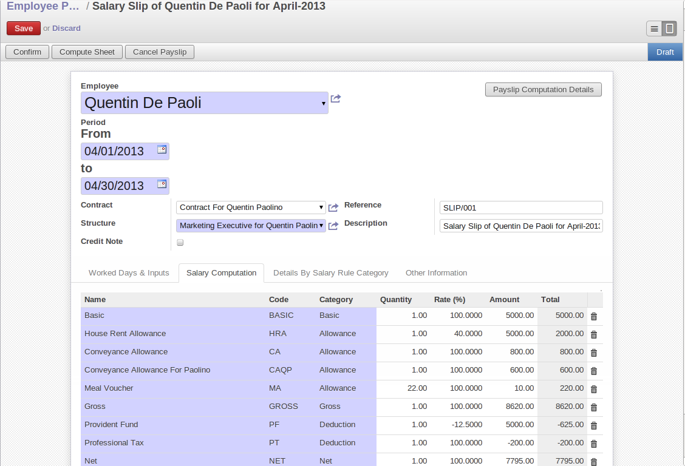
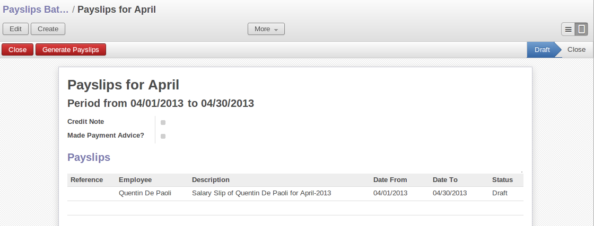
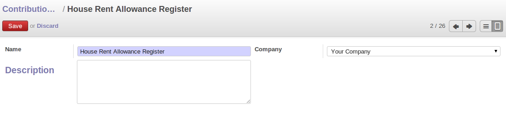
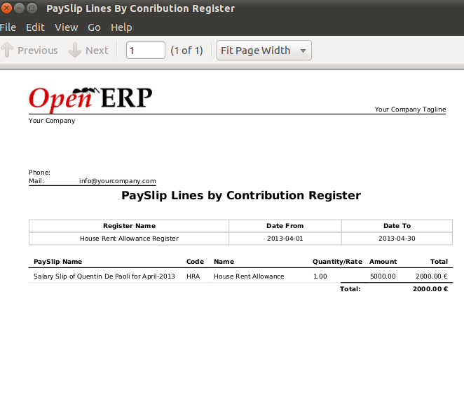

HR Payroll

You can manage your company's payroll by using hr_payroll module.The configuration wizard to install this module is shown below:

OpenERP provides the following features for efficient payroll management process:-

- Salary calculation after considering all the allowances, deductions and incentives (if any) etc.,
- Calculation of allowances, deductions and incentives by using the formula.
- Salary processing on the basis of leaves taken.
- Generating Reports.
- Integrated with Contracts and Holidays.

Define Salary Rule Categories

Salary Rule Categories are your Basic, Allowance, Deduction, Gross, Net and Company Contribution by using which you can define your Salary Rule.You can define Salary Rule Categories by using the menu :menuselection:`Human Resources --> Configuration --> Payroll --> Salary Rule Categories` and click *New.*

.. image:: images/salary_rule_categories.png
   :align: center

You can configure the following information:-

- *Name* : A name for the Salary Rule Category
- *Code* : A code for the Salary Rule Category.(The code must be unique).
- *Parent* : It is used to create hierarchy for reporting purpose.

After entering the Salary Rule Category information click *Save.*

Define Salary Rules

Salary Rules  are the various types of Allownces, Deductions, etc.You can define Salary Rules by using the menu
:menuselection:`Human Resources --> Configuration --> Payroll --> Salary Rules` and click *New.*

Before starting to configure a rule I would like to mention a list of Available Variables which will be used to specify field values(as python code) on Salary Rules.

Available variables:

- *payslip* : object containing the payslips.
- *employee* : hr.employee object.
- *contract* : hr.contract object.
- *rules* : object containing the rules code (previously computed).
- *categories* : object containing the computed salary rule categories (sum of amount of all rules belonging to that category).
- *worked_days* : object containing the computed worked days.
- *inputs* : object containing the computed inputs.

You can configure the following information:-

- *Name* : A name for the Salary Rule.
- *Code* : A code for the salary rule .It must be unique.
- *Category* : Select a category for a rule.
- *Sequence* : Provide the sequence(integer).
- *Active* : If **False**, it will allow you to hide the salary rule without removing it.
- *Appears on Payslip* : If **False** it won't appear on the payslip but will be considered in the calculation.
- *Condition Based on* : If you want to consider a rule on the basis of some condition then you can select from any of the three
    1. *Always True* : As the name implies the condition is always True and hence it will always be considered during the Payslip calculation.
    2. *Range* : The rule will be considered if it falls under a particular range.On the selection of range field three more fields needs to be filled.
        - *Range Based on* : You can provide the base value for range by using the above mentioned variable.For e.g.'contract.wage'.This will take the wages mentioned on contract.
        - *Minimum Range* : The minimum amount applied for this rule.
        - *Maximum Range* : The maximum amount, applied for this rule.
    3. Python Expression : You can specify your condition by python expression.The selection of python expression will give one more field to be filled.
        - *Python Condition* : The expression can be written using the above mentioned variable.Ex.result = rules.NET > categories.NET * 0.10.
- *Amount Type* : The computation type for the rule amount.There are three types available to compute the amount.i.e Fixed Amout, Percentage, Python Code.
    1. *Fixed Amount* : On the selection of Fixed Amount two more fields needs to be filled.They are:-
        - *Quantity* : For e.g. A rule for Meal Voucher having fixed amount of 1€ per worked day can have its quantity defined in expression like 'worked_days.WORK100.number_of_days' which will then be multiplied with the amount.
        - *Fixed Amount* : An amount for a rule.
    2. *Percentage* : Here you can calculate the amount through percentage.
        - *Percentage based on* : You can provide a base value for type percentage by using the above mentioned variable.Ex. If you want to give 5% of wages for Provident Fund then you have to specify percentage based on as contract.wage.
        - *Quantity* : For e.g. A rule for Meal Voucher having fixed amount of 1€ per worked day can have its quantity defined in expression like 'worked_days.WORK100.number_of_days' which will then be multipied with the calculated percentage amount.
        - *Percentage* : Provide Percentage
    3. *Python Expression* : You can specify your condition by python expression.The selection of python expression will give one more field to be filled.
        - *Python condition* : For e.g. If you want to calculate Gross then you can write your expression like result = categories.BASIC + categories.ALW

- *Contribution Register* : Eventual third party involved in the salary payment of the employees.Used in report.
- *Child Rules* : It is used to assign child rules.
- *Inputs* : It is used when you want to provide some Input.
    - *Code* : A code for an input that can be used in salary rule.Code must be unique.
    - *Salary Rule Input* : Selection of salary rule.
    - *Description* : Description for an input.

Description : Description regarding the rule.

After entering the salary rule information click Save.

- Note: If you are using python code then returned value has to be set in the variable 'result'
- Note: If you are defining a rule for Allowance then make sure that the 'amount' , 'percentage',  or 'python code' you enter is positive. And if its for Deduction then it has to be negative.
- Note: A code has to be unique and you cannot change the code for working days i.e.'WORK100'.
- Note: Sequence plays a major role in the calculation and appearance of payslip lines.For e.g. A sequence defined on a rule calculating the Gross should always be greater than the sequence's given on Allowance's rules, else it won't be considered in the calculation of Gross value.
- Note: You can also use the method() in your expression.There is a sum() method available for three objects/variables i.e.payslip, worked_days, inputs.They are
    - *payslip.sum(code, from_date, to_date)*
    - *worked_days.sum(code, from_date, to_date)*
    - *inputs.sum(code, from_date, to_date)*
The date given for the from_date and to_date parameters should be in the form 'YYYY-MM-DD'.

Define Salary Structure

Using the menu :menuselection:`Human Resources --> Configuration --> Payroll --> Salary Structure` you can define salary structure.

You can configure the following information:-

- *Name* : A name for a salary structure.
- *Reference* : A code for a salary structure.It must be unique.
- *Parent* : Select a structure whose rules you want to inherit.
- *Salary Rules* : Add the salary rules which you want to provide under your structure.

After entering the salary structure information click Save.

Define Contracts

We need to define a contract for an employee which will be used during the payslip generation.
Using the menu :menuselection:`Human Resources --> Contracts` you can define contract.

You can configure the following information:-

- *Contract Reference* : A name for a contract.
- *Employee* : Select an employee for whom you are creating a contract.
- *Job Title* : Select designation for an employee.
- *Wage* : Wages of an employee.
- *Contract Type* : Select whether a contract is for employee, worker or subcontractor.
- *Start Date* : Date from which contract is applicable.
- *End Date* : Date on which contract expires.
- *Working Schedule* : No of working hours/week.
- *Salary Structure* : Salary structure for payslip.

After entering the contract information click Save.

Employee Payslips

Using the menu :menuselection:`Human Resources --> Payroll --> Employee Payslips` you can generate payslips.

You can configure the following information:-

- *Employee* : Select an employee.
- *Reference* : Slip number.
- *Contract* : Select a contract to be considered for payslip.
- *Structure* : Salary Structure for generating payslip lines.
- *Description* : Description of payslip.
- *Credit Note* : If **True**, indicates this payslip has refund of another.
- *Date From* : The beginning date of pay period
- *Date To* : The last date of pay period.

On the selection of an employee the Reference,Contract, Structure, Description, Worked Days and Input data ( if you have a rule that has an input data) fields will be automatically field.

Click on the *Compute Sheet* button will fill the payslip lines based on the rules defined in your salary structure.
Payslip lines will appear and will be calculated based on the sequence provided on salary rules.Allowances and Deductions will be shown in positive and negative values respectively.

Details By Salary Rule Category Tab: It displays the rules grouped by its categories.

Worked Days & Inputs Tab:- It displays the worked days and inputs.

Worked Days : The no of days and hours an employee has worked.It will be computed on employee onchange.It calculates the number of working days and hours on the basis of Working Schedule provided on contract.It also calculates the leaves.

- *Description* : Description regarding your working or leave day.
- *Code* :  Code for Payslip Worked Days.
- *Payslip* : Payslip on which Payslip Worked Days has to be applied.
- *Sequence* : Sequence for Payslip Worked Days which will be considered in the calculation and its display..
- *Number of Days* : Number of Days an employee has worked or taken leave.
- *Number of Hours* : Number of Hours for which an employee has worked or taken leave.
- *Contract* : Contract to be applied for Payslip Worked Days.

Note: You cannot change the code for working days i.e.'WORK100'.
Input Data : It is used when you want to provide some incentive.Input Data comes from the rules having Inputs.You need to provide an amount through Payslip Input Data.

- *Description* : Description for Payslip Input.
- *Code* : A code for Payslip Input.
- *Payslip* : Payslip on which Payslip Input has to be applied.
- *Sequence* : Sequence for Payslip Input which will be considered in the calculation and its display.
- *Amount* : The amount for an incentive.
- *Contract* : Contract to be applied for Payslip Input.

Other Information Tab: -

- *Other Information* : It holds the information regarding the company, payment, notes, etc.
- *Company* : The company
- *Payslip Run* : Name of Payslip Run through which payslip is generated.
- *Made Payment Order* : If True, the payment is made.
- *Notes* : Some additional information related to payslip.

Click on the Confirm button when the payslip is fully calculated and the Payment is made.It will change the state to done.

Payslips Run

Using the menu :menuselection:`Human Resources --> Payroll --> Payslips Run` you can create payslips for various employees at a time.
Its like a register which holds payslips of various employees created through Generate Payslips wizard.

You need to configure the following:-

- *Name* : A name for Payslips Run.
- *Date From* : The beginning date of pay period which will be the Date From for payslips to be created..
- *Date To* : The last date of pay period which will be the Date To for payslips to be created.
- *Credit Note* :If **True**, indicates that all payslips generated from here are refund payslips.

Click on the *Generate Payslips* wizard will let you choose the employees for which you want to generate payslips.

- *Payslips* : It holds the newly generated Payslips through wizard.

A click on the Close button changes the state to close.

Contribution Registers

Using the menu :menuselection:`Human Resources --> Configuration --> Payroll --> Contribution Registers` you can create a Contribution Register.

You need to configure the following:-

- *Name* : A name for the Contribution Register
- *Company* : Contribution Register belonging to a company
- *Description* : Description related to Contribution Register

After creating a register you can assign it on Salary rule.When Payslip is created, payslip lines generated through salary rules having a contribution register will be linked with that register.To see the payslip lines related to a contribution register go to that particular register and print the Payslip Lines report.

Employee Payslip PDF Report

You can print the Employee Payslip PDF Report from the form view of Employee Payslips.

.. image:: images/payslip_report.png
   :align: center

Payslip Details PDF Report

You can print the Payslip Details report from the form view of Employee Payslips. It prints the report grouped by Salary Rule Category and also prints the Payslip Lines by Contribution Register.

.. image:: images/payslip_details_report.png
   :align: center

Payslip Lines PDF Report

You can print the Payslip Lines report from the form view of Contribution Registers. It prints the Payslip Lines by Contribution Register.

