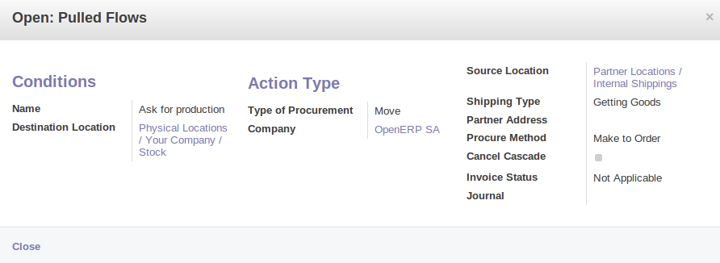
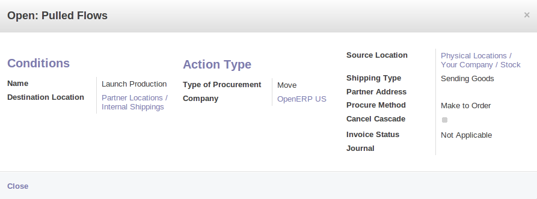
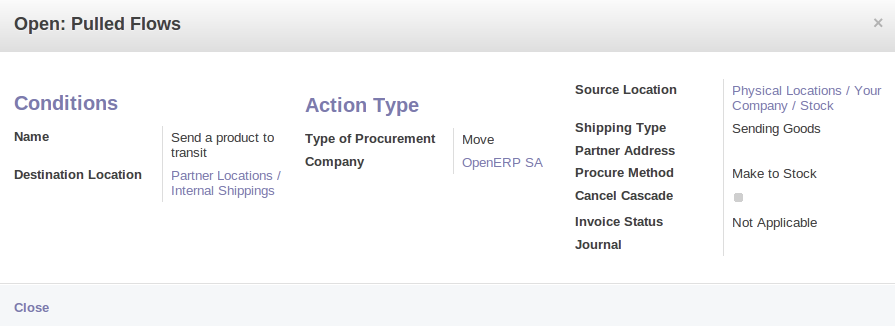
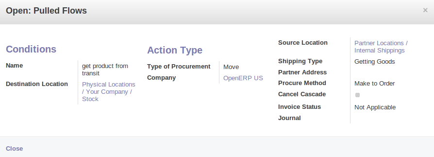
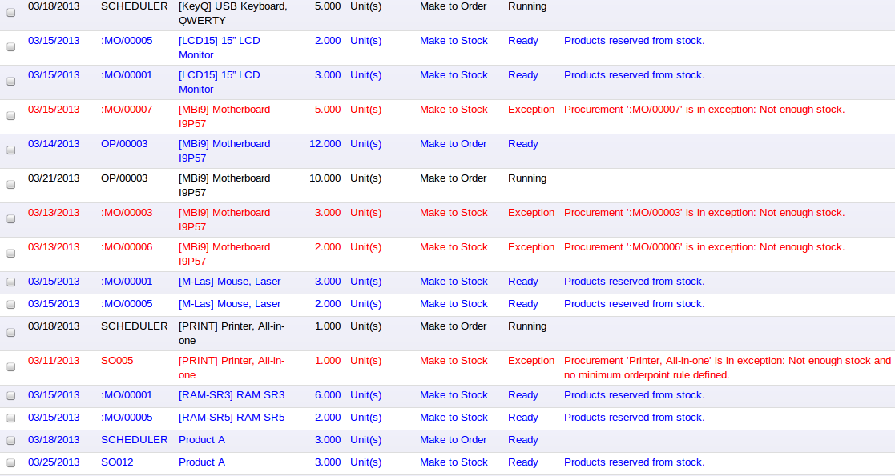
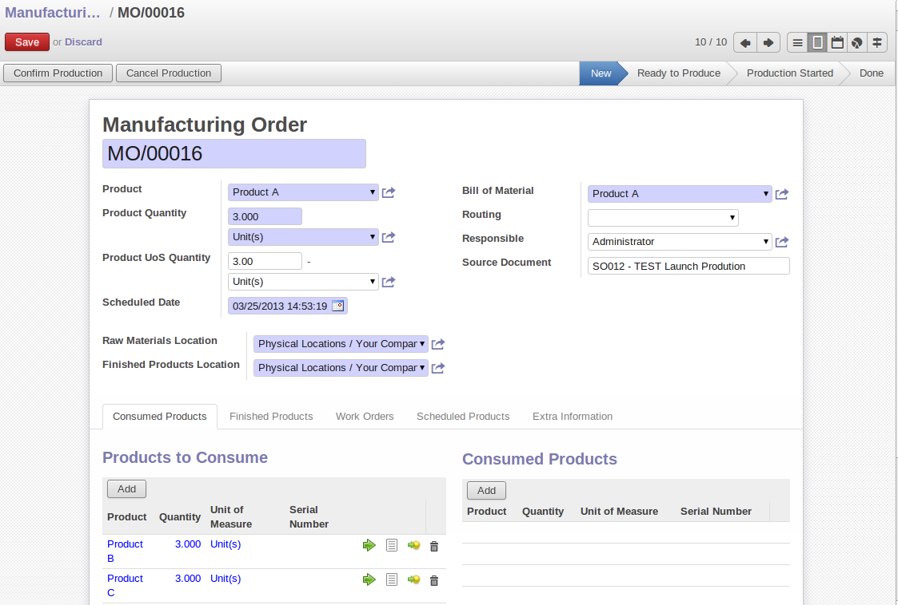

Stock Location Example
++++++++++++++++++++++

In this section, we will develop a more detailed example that includes different concepts seen
in the previous sections. 

The following example will use the *Stock Location types*, the *Logisitc Flows* and the *Bill Of
Materials*.

We have two companies: OpenERP SA and OpenERP US.

We have three products: Product A, Product B and Product C. For each product, we will have to define
the Stock Location to determine where to take these products.

To make one unit of Product A, we need the Product B and the Product C. So we will have to define a 
*Bill of Material*.

.. table:: Bill of Materials

   =========== ==========
   Field       Value
   =========== ==========
   Product     Produit A
   Product Qty 1
   Name        Product A
   BoM Type    Normal
   Company     OpenERP US
   =========== ==========

The different components to produce one unit of Product A are one unit of Product B
and one unit of Product C.

.. table:: Companies and Products
   
   ========== =====================
   Company    What
   ========== =====================
   OpenERP SA Sell the Product A
   OpenERP SA Store the Product C
   OpenERP US Produce the Product A
   OpenERP US Store the Product B
   ========== =====================
              
.. table:: Logistics Flows

   ======================== ==== ========= ======================================================
   Name                     Type Product   Goal of the flow
   ======================== ==== ========= ======================================================
   Ask for Production       Pull Product A OpenERP SA asks to OpenERP US to produce the Product A
   Launch Production        Pull Product A OpenERP US launches the production of the Product A
   Send Product to Transit  Pull Product C OpenERP US asks for the Product C to OpenERP SA
   Get Product from Transit Pull Product C OpenERP US receives the Product C
   ======================== ==== ========= ======================================================
   
Here are the details of the different flows:

	
	*Ask for Production*
	

	
	*Launch Production*	
	

	
	*Send Product to Transit*	

	
	*Get Product from Transit*

With this configuration, when a Sale Order for 3 units of Product A is confirmed and the scheduler has been launched,
you will have the following [WHAT?]:

	
	*[WHAT?]*
	
And the following stock moves have been generated:

	
	*Stock moves*

Because we are using two different companies, different stock moves have been generated. The products have to move 
from OpenERP SA to OpenERP US for the products C. After the manufacturing process, the products A have to move from
OpenERP US to OpenERP SA to be sold to the customer.

Once you have confirmed the different moves for the products B and C, the Manufacturing Order is in `ready to produce`
status. So you can run the production of the three units of Product A.

	
	*Launch the production*

Once again due to the use of two companies, you have to confirm different delivery. One to deliver the product 
from OpenERP US to OpenERP SA and another to deliver the product from OpenERP SA to the customer.
Now you have to confirm the delivery of the three units from OpenERP US to OpenERP SA, then to confirm the 
reception of the products in OpenERP SA and finally, deliver the products to you final customer.	
   
