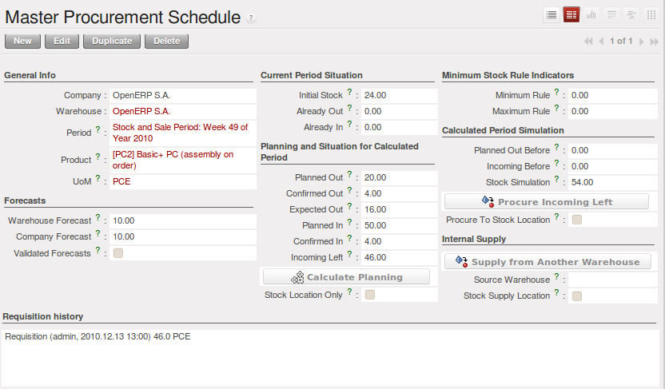
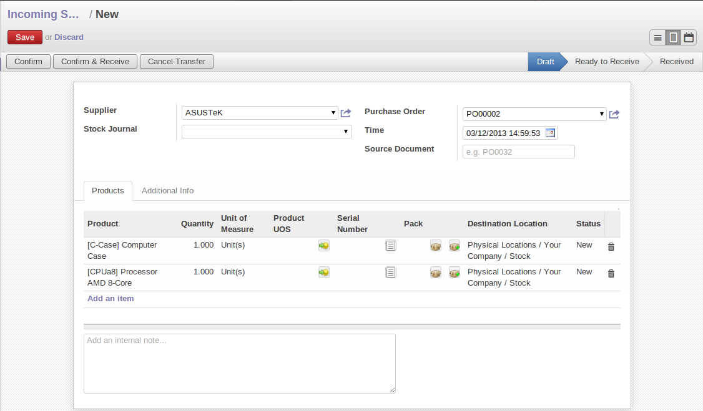
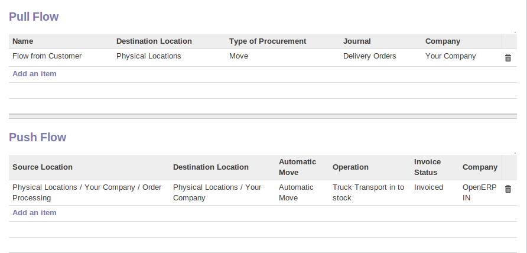

Advanced Elements of Stock Management
=====================================

In this section you will enter the details for stock management and control.

Requirements Calculation / Scheduling
-------------------------------------

Requirements calculation is the calculation engine that plans, prioritises and starts the automated
procurement as a function of rules defined in the products.

.. note:: Requirements Calculation

    Requirements Calculation is often called Scheduling.

    By default, it automatically starts once a day.
    You can also start it manually using the menu :menuselection:`Manufacturing --> Schedulers --> Compute Schedulers`.
    It then uses the parameters defined in the products, the suppliers and the company
    to determine the priorities between the different product orders, deliveries and purchases from
    suppliers.

.. index:: Just in Time

Just In Time
------------

By default, scheduling starts automatically once a day. You should make this
scheduling execute overnight to ensure that the system does not slow down under a heavy load of scheduling when
you are also trying to use it interactively yourselves.

To set the start time for the scheduler, go to the menu
:menuselection:`Administration --> Configuration --> Scheduler --> Scheduled Actions`. Select the rule
called 'Run mrp scheduler' and modify the date and time of the next execution.

.. index::
   single: module; mrp_jit

Some companies want to plan orders progressively as they are entered so they do not wait until
procurement orders are planned the next day. Install the module :mod:`mrp_jit` (`Reconfigure` wizard, `Just In Time Scheduling`) to handle this. Once
it is installed, each requirement (that could result in a Production or Purchase Order)
will be planned in real time as soon as it has been confirmed.

Then if you make a customer order with a product that is ``Make To Order`` the quotation request to a
supplier will immediately be generated.

.. index::
   single: module; sale_supplier_direct_delivery

.. tip :: Delivery from the Supplier or to the Customer

    The :mod:`sale_supplier_direct_delivery` module enables you to deliver the product directly from
    the supplier to the customer. At the time of writing, this module is in ``extra-addons``.
    The logic that the product follows is configured individually for each product and affects only those
    products marked ``Make to Order``.

This mode is not always sensible. Each order is processed immediately when confirmed. So if an order
is to be delivered in three months the scheduler will reserve goods in stock for each order once
it has been confirmed. It would have been more sensible to leave these products available for other
orders.

If a Purchase Order's :guilabel:`Invoicing Control` is configured ``From Order``,
the scheduler will immediately create the corresponding
supplier quotation request. It would have been preferable to delay for several weeks if
you could have used the lead time to group the purchase with other future orders.

So the negative effects of working with the Just in Time module are:

* Poor priority management between orders,

* Additionally stocked products.

.. index::
   single: planning; stock management

Planning
--------

You have seen that most OpenERP documents can be changed in a planning view. It is the same for
deliveries and goods receipts. You can put them into a calendar view at any time to plan your
deliveries or goods receipts.

   *Planning the Deliveries of Customer Products*

Planned dates on a packing order are put in each stock move line. If you have a packing
order containing several products not all of the lines necessarily need to be delivered
the same day. The minimum and maximum dates in a packing order show the earliest and latest dates on
the stock move lines for the packing.

If you move a packing order in the calendar view, the planned date in the stock move lines will
automatically be moved as a result.

.. index::
   single: back order

Managing Partial Deliveries
---------------------------

Partial deliveries, sometimes called Back Orders, are generated automatically by OpenERP. When you
confirm a customer delivery or the receipt of products from suppliers, OpenERP asks you to confirm
the quantity delivered or received.

If you leave the quantities alone, OpenERP confirms and then closes the order for delivery or receipt.
If you modify a quantity, OpenERP will automatically generate a second delivery or goods receipt document
for the remaining quantities. The first will be confirmed and the second will remain in the list of
waiting deliveries (or receipts).

   *Confirmation Screen for Delivered Quantities*

When you open the list of current deliveries, you find the field :guilabel:`Back Order of` which
shows the reference number of the first delivery sent to the customer. That enables you to quickly
find the deliveries for partial orders each day so that you can treat them as a priority.

Receiving Supplier Products
---------------------------

OpenERP supports three approaches to control data entry for products ordered from suppliers:

* Manual data entry,

* Using the goods receipt documents pre-generated by the system,

* Selecting from all the products waiting from the supplier, independently from goods receipt documents.

You can see how the configuration of the supplier order affects receipts in detail in :ref:`ch-purchase`.

.. index::
   single: goods receipt

Manual Data Entry of Goods Receipt
----------------------------------

To enter data about goods receipt manually, go to the menu :menuselection:`Warehouse
--> Warehouse Management --> Incoming Shipments` and click the `New` button. Then enter the necessary data manually in the goods
receipt form.

   *Manual Data Entry for Product Receipt*

Confirming Pre-generated Goods Receipt Documents
------------------------------------------------

If you use Purchase Orders in OpenERP, product receipts are automatically generated by the system
when the purchase order is confirmed. You do not have to enter any date, just confirm that
the quantities ordered match the quantities received.

In this case, OpenERP generates a list of all products waiting to be received from the menu
:menuselection:`Warehouse --> Warehouse Management --> Incoming Shipments`, and by the applying proper filter, Group by `State` find all
incoming shipments with the corresponding state.

   *List of Items Waiting to be Received*

Then you just look for the corresponding entry using the supplier name or order reference. Click it
and confirm the quantities. If it shows you quantities that differ from the control form, OpenERP
will automatically generate another receipt document that will be set open, waiting for the
remaining deliveries. You can leave it open or
cancel it if you know that products missed by your supplier will never be delivered.

Confirmation by Selecting Products Waiting
------------------------------------------

The approach shown above is very useful if goods receipts correspond to the original orders.
If your suppliers deliver items that do not necessarily coincide with the orders, however,
it is easier to work by products received rather than by orders.

In this case you can manually create a new goods receipt using the menu :menuselection:`Warehouse --> Products Moves
--> Receive Products`. OpenERP opens a list of all the receivable/received product from that supplier and you can
automatically add some or all of them to your form. You can filter receivable products based on state and confirm it. This method
of data entry is very useful when you are entering goods received at one time from several orders.

.. index::
   single: routing; logistics

Product Routing
---------------

.. index::
   single: module; stock_location

You should install the :mod:`stock_location` module (`Reconfigure` wizard, `Advanced Routes`) if routing products to customers, from suppliers or
in your warehouse is determined by the identity of the product itself.

   *Managing the Paths from one Location to Another in a Product Form*

This will let you configure logistics rules individually for each product. For example, when a
specific product arrives in stores it can automatically be sent to quality control. In this case it
must be configured with rules on the product form. The fields that make up those rules are:

* :guilabel:`Source Location`: the rule only applies if a product comes from this location,

* :guilabel:`Destination Location`: the rule only applies if a product ends up in this location,

* :guilabel:`Automatic Move`: ``Automatic Move``, ``Manual Operation``, ``Automatic No Step Added``,

* :guilabel:`Delay (days)`,

* :guilabel:`Operation`: a free text field which will be included in the automatic stock
  move proposed by OpenERP.

There are two main logistic flows:

* :guilabel:`Pushed Flows`

* :guilabel:`Pulled Flows`

Push flows are useful when the arrival of certain products in a given location should always
be followed by a corresponding move to another location, optionally after a certain delay.
The original Warehouse application already supports such Push flow specifications on the
Locations themselves, but these cannot be refined per product.

Pull flows are a bit different from Push flows, in the sense that they are not related to
the processing of product moves, but rather to the processing of procurement orders.
What is being pulled is a need, not directly products.

You will now see some examples of using these locations and logistics by product:

* A rentable product,

* A product bought in China, following its freight by ship from port to port,

* A product that you want to send to quality control before putting it in stocks.

Example 1: A Rentable Product
^^^^^^^^^^^^^^^^^^^^^^^^^^^^^

A rentable product is just a product delivered to a customer that is expected to be returned in a
few days time. When it has been delivered to the customer, OpenERP will generate a new goods
receipt note with a forecast date at the end of the rental period. So you generate a list of goods
pending receipt that you confirm when they are returned to your stores. To do this, you should
configure a product with the following rules:

.. table:: Example Product For Rental

   ==================== ================
   Field                Value
   ==================== ================
   Source Location      Customer
   Destination Location Stock
   Automatic Move       Manual Operation
   Delay (days)         15
   Operation            Product return
   ==================== ================

Then when the product is delivered to the customer, OpenERP automatically generates a goods receipt
form in draft state ready for returning it to Stock. This is due in 15 days time. With such a
system your forecasts and stock graphs can always be correct in real time.

Example 2: Management of Imports by Sea
^^^^^^^^^^^^^^^^^^^^^^^^^^^^^^^^^^^^^^^

To manage products that follow a complex logistical import path by sea and then into customs, create
as many 'Supplier' locations as there are steps, then create rules to move the product from one
place to the other during the purchase.

Take a product that has been bought in China and delivered to you stores in Brussels, Belgium.
Import by sea takes around 7 weeks and must go through the following steps:

* Delivery from the supplier to the port of Shanghai: 2 days,

* Sea transport from Shanghai to the port of Antwerp: 1 month,

* Customer at the port of Antwerp: 2 weeks,

* Delivery by truck from the port of Antwerp to your stores: 3 days.

You should track the movement of your goods and enter all the documents as each move is made
so that you know where your goods are at any moment, and can estimate when they are likely to
arrive in your stores. To do this, create all the locations for the intermediate steps:

* Shanghai Port,

* Antwerp Port,

* Antwerp Customs.

Finally, in the product form, create the following rule to show that when purchased, the goods
do not arrive at your stores directly, but instead at the port of Shanghai. In this example, the
stores are configured to enter all the products in a location called 'Input'.

.. table:: Rule to move products automatically to Shanghai Port

   ==================== ========================
   Field                Value
   ==================== ========================
   Source Location      Input
   Destination Location Shanghai Port
   Automatic Move       Automatic No Step Added
   Delay (days)         2
   Operation            Sending to Shanghai Port
   ==================== ========================

OpenERP will then change the usual product receipt (which has them arriving in the Input
location) to a delivery from this supplier to the external port. The move is automatically carried
out because operations at this level are too labour-intensive to be done manually.

You then have to create a rule on the product form to move it from one location to another:

.. table:: Rule to move products manually from Shanghai Port to Antwerp Port

   ==================== ===============================
   Field                Value
   ==================== ===============================
   Source Location      Shanghai Port
   Destination Location Antwerp Port
   Automatic Move       Manual Operation
   Delay (days)         30
   Operation            Sending to Antwerp Port by ship
   ==================== ===============================

.. table:: Rule to move products manually from Antwerp Port to Antwerp Customs

   ==================== ==================
   Field                Value
   ==================== ==================
   Source Location      Antwerp Port
   Destination Location Antwerp Customs
   Automatic Move       Manual Operation
   Delay (days)         15
   Operation            Customs in Antwerp
   ==================== ==================

.. table:: Rule to move products manually from Antwerp Customs to Stock

   ==================== ==============================
   Field                Value
   ==================== ==============================
   Source Location      Antwerp Customs
   Destination Location Stock
   Automatic Move       Manual Operation
   Delay (days)         3
   Operation            Truck transport into stock
   ==================== ==============================

Once the rules have been configured, OpenERP will automatically prepare all the documents needed
for the internal stock movements of products from one location to another. These documents will be
assigned one after another depending on the order defined in the rules definition.

When the company receives notification of the arrival at a port or at customs, the corresponding
move can be confirmed. You can then follow, using each location:

* where a given goods item can be found,

* quantities of goods awaiting customs,

* lead times for goods to get to stores,

* the value of stock in different locations.

Example 3: Quality Control
^^^^^^^^^^^^^^^^^^^^^^^^^^

You can configure the system to put a given product in the Quality Control bay automatically when it
arrives in your company. To do that, you just configure a rule for the product to be placed
in the Quality Control location rather than the Input location when the product is received from the
supplier.

.. table:: Rule to move products manually from Input to Quality Control

   ==================== ==============================
   Field                Value
   ==================== ==============================
   Source location      Input
   Destination location Quality Control
   Automatic Move       Manual Operation
   Delay (days)         0
   Operation            Quality Control
   ==================== ==============================

Once this product has been received, OpenERP will then automatically manage the request for an
internal movement to send it to the ``Quality Control`` location.

.. Copyright © Open Object Press. All rights reserved.

.. You may take electronic copy of this publication and distribute it if you don't
.. change the content. You can also print a copy to be read by yourself only.

.. We have contracts with different publishers in different countries to sell and
.. distribute paper or electronic based versions of this book (translated or not)
.. in bookstores. This helps to distribute and promote the OpenERP product. It
.. also helps us to create incentives to pay contributors and authors using author
.. rights of these sales.

.. Due to this, grants to translate, modify or sell this book are strictly
.. forbidden, unless Tiny SPRL (representing Open Object Press) gives you a
.. written authorisation for this.

.. Many of the designations used by manufacturers and suppliers to distinguish their
.. products are claimed as trademarks. Where those designations appear in this book,
.. and Open Object Press was aware of a trademark claim, the designations have been
.. printed in initial capitals.

.. While every precaution has been taken in the preparation of this book, the publisher
.. and the authors assume no responsibility for errors or omissions, or for damages
.. resulting from the use of the information contained herein.

.. Published by Open Object Press, Grand Rosière, Belgium
