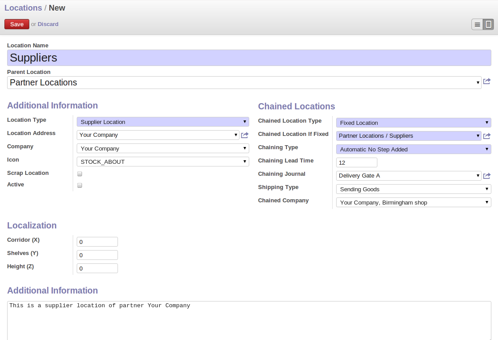
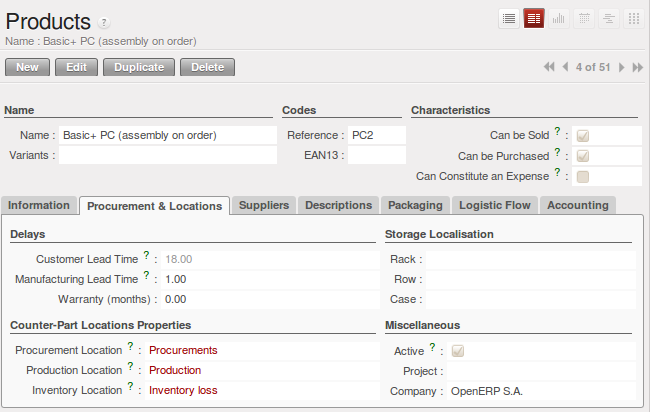
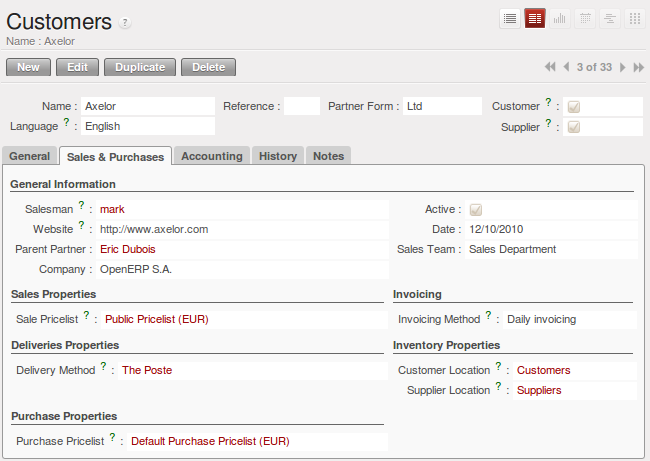

Basic Logistics Configuration
=============================

In this section you will see how to configure stock management to match your company's needs. OpenERP
can handle many different situations by configuring it to behave as required.

.. index::
   single: stock; location

Stock Locations
---------------

You have seen in the preceding sections that the whole of stock management is built on a concept of
stock locations. Locations are structured hierarchically to account for the subdivision of a
warehouse into sections, aisles, and/or cupboards. The hierarchical view also enables you to
structure virtual locations such as production counterparts. That gives you a finer level of
analysis.

Use the menu :menuselection:`Warehouse --> Configuration --> Warehouse Management --> Locations` then click
:guilabel:`New` to define new locations.

   *Defining a Stock Location*

You should then give a name to your stock location. Now look at the location types.

.. index::
   single: stock; location type

Location Types
--------------

The location must have one of the following types:

* View: shows that the location is only an organizational node for the hierarchical structure, and
  cannot be involved in stock moves itself. The view type is not usually made into a leaf node in a
  structure – it usually has children.

* Customer: destination for products sent to customers,

* Supplier: source of products received from suppliers,

* Internal: locations for your own stock,

* Inventory: the counterpart for inventory operations used to correct stock levels,

* Production: the counterpart for production operations; receipt of raw material and sending
  finished products,

* Procurement: the counterpart for procurement operations when you do not yet know the source
  (supplier or production). Products in this location should be zero after the scheduler run
  completes,

* Transit Location for Inter-Company Transfers, used as an intermediate location in a multicompany environment.

You can have several locations of the same type. In that case your product, supplier and warehouse
configurations determine the location that is to be used for any given operation.

The counterparts for procurement, inventory and production operations are given by the locations
shown in the product form. The counterparts of reception and delivery operations are given by the
locations shown in the partner form. The choice of stock location is determined by the configuration of
the warehouse, linked to a Shop :menuselection:`Sales --> Configuration --> Sales --> Shop`.

   *Defining Stock Locations in the Product Form*

   *Defining Stock Locations in the Customer Form*

.. index::
   single: stock; localization

Location Addresses
------------------

Each location can be given an address. That enables you to create a location for a customer or a
supplier, for example. You can then give it the address of that customer or supplier. You should
indicate to OpenERP on the partner form that it should use this location rather than the default
location given to partner deliveries.

.. tip:: Subcontracting production

    You will see in the chapter, :ref:`ch-mnf` that it is possible to assign a location to a
    manufacturing workcenter.
    If this location is at a supplier's you must give it an address so that OpenERP can prepare a
    delivery order for the supplier and a receive operation for the manufactured goods.

    Creating a location specifically for a partner is also a simple solution for handling consigned
    stocks in OpenERP.

.. note:: Consigned Stock

    Consigned stock is stock that is owned by you (valued in your accounts) but is physically
    stocked by your supplier.
    Or, conversely, it could be stock owned by your customer (not valued by you) but stocked in your
    company.
    Make sure that you create consignment locations as part of your internal stock.

To enable you to consolidate easily at a higher level, the location definition is hierarchical. This
structure is given by the field :guilabel:`Parent location`. That also enables you to manage complex
cases of product localization. For example, you could imagine the following scenario.

One Company with Two Warehouses
^^^^^^^^^^^^^^^^^^^^^^^^^^^^^^^

A company has a warehouse in Paris and in Bordeaux. For some orders you must deliver the products
from Paris, and for others from Bordeaux. But you should also specify a fictitious warehouse that
OpenERP uses to calculate if it should deliver products from Paris or from Bordeaux.

To do this in OpenERP, you would create a third warehouse 'France' which consolidates the warehouses in
Paris and Bordeaux. You create the following physical locations:

* Company

  * Output

    * Warehouses France

      * Warehouse Paris

      * Warehouse Bordeaux

OpenERP will then deliver the goods from the warehouse that has the ordered product in stock. When
products are available in several warehouses, OpenERP will select the nearest warehouse. To
formalize the notion of distance between warehouses you should use the geographic co-ordinates (X,
Y, Z) of the different stores to enable OpenERP to search for the nearest goods.

The same co-ordinates could also be used to structure the shelves, aisles and interior rooms in a
warehouse.

.. index::
   single: stock; real time valutation

Accounting Valuation in Real Time
---------------------------------

.. index::
   single: accountant

If you have experience of managing with traditional software you will know the problem of getting
useful indicators. If you ask your accountant for a stock valuation or the value added by production
he will give you a figure. If you ask for the same figure from your stores manager you will get an
entirely different amount. You have no idea who is right!

In OpenERP the management of stock is completely integrated with the accounts, to give strong
coherence between the two systems. The double-entry structure of locations enables a very precise
correspondence between stocks and accounts.

Each stock movement also generates a corresponding accounting entry in an accounting journal to
ensure that the two systems can stay in permanent synchronization.

To do that, set up a general account for each location that should be valued in your accounts. If a
product goes to one location or another and the accounts are different in the two locations, OpenERP automatically generates the corresponding accounting entries in the accounts, in the stock journal.

If a stock move will go from a location without an account to a location where an account has been
assigned (for example goods receipt from a supplier order), OpenERP generates an accounting entry
using the properties defined in the product form for the counterpart. You can use different accounts
per location or link several location to the same account, depending on the level of analysis
needed.

You use this system for managing consigned stocks:

* a supplier location that is valued in your own accounts or,

* a location in your own company that is not valued in your accounts.

.. index::
   single: chained location
   single: location; chained

How to configure Accounting Valuation?
^^^^^^^^^^^^^^^^^^^^^^^^^^^^^^^^^^^^^^

* In the Product form, go to the `Accounting` tab and select the `Real Time (automated)` option for Inventory Valuation,

To define your accounts, you have two options. Set them on the product category, or on the product.

* From the Information tab, for the Product Category, set the Stock Input Account, the Stock Output account and the Stock Variation account,

OR

* From the Accounting tab, for the Product, set the Stock Input Account and the Stock Output account.

You can also overwrite the accounts from the Product or the Product Category by defining Stock Input and Stock Output account for a Location.

.. note:: You can also install the :mod:`account_anglo_saxon` module to value your stock according to anglosaxon principles.

The figure below shows the various accounts that can be used, with and without the :mod:`account_anglo_saxon` module installed.

.. figure:: images/account_anglo_saxon.pdf
   :scale: 75
   :align: center

   *Setting up Stock Valuation Accounts*
   
Linked locations
----------------

Locations in OpenERP can be linked between each other to define paths followed by products. So you
can then define rules such as: all products that enter the warehouse must automatically be sent to
quality control. The warehouse and quality control are represented by two different locations.

Then when a product arrives in a location, OpenERP can automatically suggest that you send the
product to another linked location. Three link modes are available:

* Manual Operation
* Automatic Move
* Automatic No Step Added

The `Manual Operation` mode will create an internal move order to the linked location once products
arrive in the source locations. This order will wait for a confirmation of the move by a user.
This enables you to have a list of moves to do, proposed by the system and confirmed by the storesperson.

.. index::
   single: module; stock_location

.. tip:: Product Logistics

    The module :mod:`stock_location` lets you generate paths to follow, not just at the level of
    locations but also at the level of products.
    It then enables you to manage default locations for a given product or to refer to the products
    as a function of
    operations such as quality control, supplier receipt, and after-sales service.

    A more detailed explanation of this module, with examples, is given at the end of this chapter.

The `Automatic Move` mode will do the same but will not wait for a confirmation from the user. Products will
automatically be sent to the linked location without any intervening manual operation to do. This
corresponds to the case where, for simplicity, you delete a step in the process so the end user can
set off the process automatically.

The `Automatic No Step Added` mode will not include the additional stock move but will change the
destination move transparently to assign the linked the location. You could then assign a
destination location to which you send all the products that arrive in your warehouse. The
storesperson will modify the goods receipt note.

If there is a linkage to do, the field :guilabel:`Chained Location Type` lets the destination
location be determined. If the field is set to 'customer', the location is given by the properties
of the partner form. If the field is set to ``fixed`` , the destination location is given by the field
:guilabel:`Chained Location If Fixed`.

Some operations take a certain time between order and execution. To account for this lead time, you
can set a value in days in the field :guilabel:`Chaining Lead Time`. Then the extra move (automatic or
not) will be carried out several days after the original move. If you use the mode `Automatic No Step Added`,
the lead time is inserted directly into the initial order. In this way you can add
security lead times at certain control points in the warehouse.

Case of structuring locations
-----------------------------

You will see in the next part that linking locations lets you manage a whole series of complex cases
in managing production efficiently:

* handling multiple operations for a customer order,

* tracking import and export by sea transport,

* managing a production chain in detail,

* managing rented products,

* managing consigned products.

To show these concepts, five cases of structuring and configuring these locations are given below.
Many other configurations are possible depending on needs.

Handling customer orders
------------------------

Customer orders are usually handled in one of two ways:

* item note (or preparation order), confirmed when the item is ready to send,

* delivery order (or freight note), confirmed when the transporter has delivered the item to a
  customer.

You use the following stock move in Open ERP to simulate these operations:

* Packing Note: Stock > Output,

* Delivery Order: Output > Customer.

The first operation is automatically generated by the customer order. The second is then generated
by the stock management by showing that the ``Output`` location is linked to the ``Customer`` location.
That then gives the two operations waiting. If the ``Output`` location is not situated beneath the
stock location you then have to move the item from stock to the place that the item is prepared.

Some companies do not want to work in two steps, because it just seems like extra work to have to
confirm a delivery note in the system. You can then set the link mode to 'Automatic' to make Open
ERP automatically confirm the second step. It is then assumed the all the items have automatically
been delivered to the customer.

.. index::
   single: linked production

Linked Production
-----------------

The :mod:`stock_location` module enables you to manage the linkages by product in addition to doing
that by location. You can then create a location structure that represents your production chain by
product.

The location structure looks like this:

* Stock

  * Level 1

  * Level 2

    * Link 1

      * Operation 1

      * Operation 2

      * Operation 3

      * Operation 4

You can then set the locations a product or a routing must go through on the relevant form. All
products that enter the production chain will automatically follow the predetermined path.

You can see the location structure using :menuselection:`Warehouse --> Inventory Control --> Location Structure`

.. figure:: images/stock_product_path.png
   :scale: 75
   :align: center

   *Logistics for a given product*

To improve your logistics, you will see further on in this chapter how you can put minimum stock rules
onto different locations to guarantee security stocks for assembly operators. Reports on the state
of stocks in different locations will rapidly show you the bottlenecks in your production chain.

.. Copyright © Open Object Press. All rights reserved.

.. You may take electronic copy of this publication and distribute it if you don't
.. change the content. You can also print a copy to be read by yourself only.

.. We have contracts with different publishers in different countries to sell and
.. distribute paper or electronic based versions of this book (translated or not)
.. in bookstores. This helps to distribute and promote the Open ERP product. It
.. also helps us to create incentives to pay contributors and authors using author
.. rights of these sales.

.. Due to this, grants to translate, modify or sell this book are strictly
.. forbidden, unless Tiny SPRL (representing Open Object Press) gives you a
.. written authorisation for this.

.. Many of the designations used by manufacturers and suppliers to distinguish their
.. products are claimed as trademarks. Where those designations appear in this book,
.. and Open Object Press was aware of a trademark claim, the designations have been
.. printed in initial capitals.

.. While every precaution has been taken in the preparation of this book, the publisher
.. and the authors assume no responsibility for errors or omissions, or for damages
.. resulting from the use of the information contained herein.

.. Published by Open Object Press, Grand Rosière, Belgium
