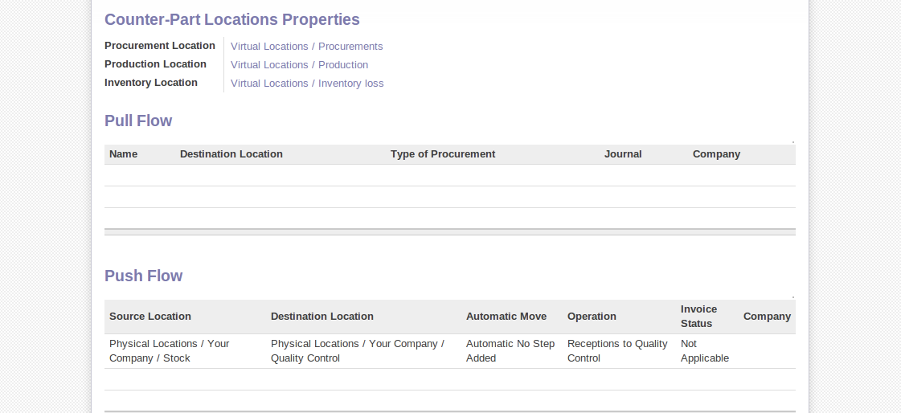

Logistics Configuration in a Multi-Company Environment
======================================================

To configure your logistics in multi-company environment you need to install module :mod:`stock_location`.

This module supplements the Warehouse application by adding support for per-product location paths,
effectively implementing Push and Pull inventory flows.

Typically this could be used to:

* Manage product manufacturing chains
* Manage default locations per product
* Define routes within your warehouse according to business needs, such as:
   - Quality Control
   - After Sales Services
   - Supplier Returns
* Help rental management, by generating automated return moves for rented products

Once this module is installed, an additional tab appear on the product form, where you can add
Push and Pull flow specifications.

Push flows
----------
Push flows are useful when the arrival of certain products in a given location should always
be followed by a corresponding move to another location, optionally after a certain delay.
The original Warehouse application already supports such Push flow specifications on the
Locations themselves, but these cannot be refined per-product.

A push flow specification indicates which location is chained with which location, and with
what parameters. As soon as a given quantity of products is moved in the source location,
a chained move is automatically foreseen according to the parameters set on the flow specification
(destination location, delay, type of move, journal, etc.) The new move can be automatically
processed, or require a manual confirmation, depending on the parameters.

Suppose whenever the product `CPU3` comes to location `Stock` it has to be first move to location `Quality Control` in order to
maintain the quality. For that configure the push flow like this:

* :guilabel:`Operation` : `Receptions to Quality Control`
* :guilabel:`Source Location` : `Stock`
* :guilabel:`Destination Location` : `Quality Control`
* :guilabel:`Automatic Move` : `Automatic No Step Added`
* :guilabel:`Delay (days)` : `1`
* :guilabel:`Shipping Type` : `Getting Goods`

Find the product CPU3 using menu :menuselection:`Warehouse --> Product --> Products`. In the

   *A push flow specification for product CPU3*

A push flow related to how stock moves should be generated in order to increase or decrease inventory.

Pull flows
----------

Pull flows are a bit different from Pull flows, in the sense that they are not related to
the processing of product moves, but rather to the processing of procurement orders.
What is being pulled is a need, not directly products.
A classical example of Push flow is when you have an Outlet company, with a parent Company
that is responsible for the supplies of the Outlet.

  [ Customer ] <- A - [ Outlet ]  <- B -  [ Holding ] <~ C ~ [ Supplier ]

When a new procurement order (A, coming from the confirmation of a Sale Order for example) arrives
in the Outlet, it is converted into another procurement (B, via a Push flow of type 'move')
requested from the Holding. When procurement order B is processed by the Holding company, and
if the product is out of stock, it can be converted into a Purchase Order (C) from the Supplier
(Push flow of type Purchase). The result is that the procurement order, the need, is pushed
all the way between the Customer and Supplier.

Technically, Pull flows allow to process procurement orders differently, not only depending on
the product being considered, but also depending on which location holds the "need" for that
product (i.e. the destination location of that procurement order).

Find the product CPU1 using menu :menuselection:`Warehouse --> Product --> Products` in order to see the
configuration of the pulled flow.

.. figure:: images/stock_pulled_flow.png
   :scale: 75
   :align: center

   *A pull flow specification for product CPU1*

Now sale 1 unit of product `CPU1` from the `Shop1` and run scheduler using menu :menuselection:`Warehouse -->
Schedulers --> Compute Schedulers`. Then check the stock moves for product `CPU1` from the menu  :menuselection:`Warehouse -->
Traceability --> Stock Moves`.

.. figure:: images/stock_move_pull_flow.png
   :scale: 75
   :align: center

   *Stock move of CPU1 releted to pull flow specification*

A pull flow related to how procurement process run in order to find product to increase or decrease inventory.
