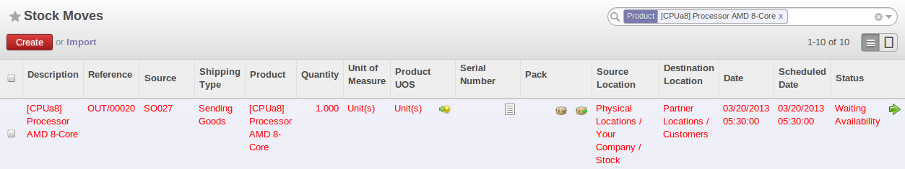

Logistics Configuration in a Multi-Company Environment
======================================================

To configure your logistics in multi-company environment you need to install :mod:`stock_location` module.

This module supplements the Warehouse application by adding support for location paths per product,
effectively implementing Push and Pull inventory flows.

Typically this could be used to:

* Manage product manufacturing chains,
* Manage default locations per product,
* Define routes within your warehouse according to business needs, such as:
   - Quality Control
   - After Sales Services
   - Supplier Returns
* Help rental management, by generating automated return moves for rented products.

Once this module is installed, an additional `Logistics Flows` tab appears in the product form, where you can add
Push and Pull flow specifications.

Push Flows
----------
Push flows are useful when the arrival of certain products in a given location should always
be followed by a corresponding move to another location, optionally after a certain delay.

.. note::
   The core Warehouse application already supports such Push Flow specifications on the
   Locations, but these cannot be refined per product.

A push flow specification indicates what location is chained with another location, as well as the parameters used. As soon as a given quantity of products is moved in the source location, a chained move is automatically foreseen according to the parameters set on the flow specification (destination location, delay, type of move, journal, etc.) The new move may be automatically processed, or may require a manual confirmation, depending on the parameters.

Suppose whenever the product `CPU3` enters the `Stock` location, it first has to be moved to the `Quality Control` location in order to
maintain the quality.

Look up the product CPU3 using the menu :menuselection:`Warehouse --> Product --> Products`.

To have OpenERP accomplish this, configure the push flow as follows:

* :guilabel:`Operation`: `Receptions to Quality Control`
* :guilabel:`Source Location`: `Stock`
* :guilabel:`Destination Location`: `Quality Control`
* :guilabel:`Automatic Move`: `Automatic No Step Added`
* :guilabel:`Delay (days)`: `1`
* :guilabel:`Shipping Type`: `Getting Goods`

.. figure:: images/stock_pushed_flow.png
   :scale: 75
   :align: center

   *Push Flow Specification for Product CPU3*

A push flow related to how stock moves should be generated in order to increase or decrease inventory.

Pull flows
----------

Pull flows are a bit different from Pull flows, in the sense that they are not related to
the processing of product moves, but rather to the processing of procurement orders.
What is being pulled is a need, not directly products.
A classical example of Push flow is when you have an Outlet company, with a parent Company
that is responsible for the supplies of the Outlet.

  [ Customer ] <- A - [ Outlet ]  <- B -  [ Holding ] <~ C ~ [ Supplier ]

When a new procurement order (A, coming from the confirmation of a Sale Order for example) arrives
in the Outlet, it is converted into another procurement (B, via a Push flow of type 'move')
requested from the Holding. When procurement order B is processed by the Holding company, and
if the product is out of stock, it can be converted into a Purchase Order (C) from the Supplier
(Push flow of type Purchase). The result is that the procurement order, the need, is pushed
all the way between the Customer and Supplier.

Technically, Pull flows allow to process procurement orders differently, not only depending on
the product being considered, but also depending on which location holds the "need" for that
product (i.e. the destination location of that procurement order).

To explain pull flow for the product `CPU1`, first we have to configure the minimum stock rules of `CPU1` for
the company `OpenERP S.A.` and `Shop 1` using the menu :menuselection:`Warehouse --> Automatic Procurements --> Minimum Stock Rules` .

For the company `OpenERP S.A.`:

* :guilabel:`Min Quantity` : `10`
* :guilabel:`Max Quantity` : `50`

For the company `Shop 1`;

* :guilabel:`Min Quantity` : `10`
* :guilabel:`Max Quantity` : `20`

Find the product CPU1 using menu :menuselection:`Warehouse --> Product --> Products` in order to define the
configuration of the pulled flow.

.. figure:: images/stock_pulled_flow.png
   :scale: 75
   :align: center

   *A pull flow specification for product CPU1*

There are two specification of pull flow for product `CPU1`.

`Specification 1`:

* :guilabel:`Name` : `Receive from Warehouse`
* :guilabel:`Destination Location` : `Shop 1`
* :guilabel:`Type of Procurement` : `Move`
* :guilabel:`Company` : `Shop 1`
* :guilabel:`Source Location` : `Internal Shippings`
* :guilabel:`Partner Address` : `OpenERP S.A., Belgium Gerompont Chaussee de Namur 40`
* :guilabel:`Shipping Type` : `Getting Goods`
* :guilabel:`Procure Method` : `Make to Order`

`Specification 2`:

* :guilabel:`Name` : `Deliver Shop`
* :guilabel:`Destination Location` : `Internal Shippings`
* :guilabel:`Type of Procurement` : `Move`
* :guilabel:`Company` : `OpenERP S.A.`
* :guilabel:`Source Location` : `Stock`
* :guilabel:`Partner Address` : `Fabien`
* :guilabel:`Shipping Type` : `Sending Goods`
* :guilabel:`Procure Method` : `Make to Stock`

Now sale 1 unit of product `CPU1` from the `Shop1` and run scheduler using menu :menuselection:`Warehouse -->
Schedulers --> Compute Schedulers`. Then check the stock moves for product `CPU1` from the menu  :menuselection:`Warehouse -->
Traceability --> Stock Moves`.

   *Stock move of CPU1 releted to pull flow specification*

These moves can be explained like this:

[ Customer ] <-- [ :guilabel:`Shop 1` ]  <-- Internal Shippings <-- Stock <--  [ :guilabel:`OpenERP S.A.` ]

When the company :guilabel:`Shop 1` sale one unit of `CPU1` to customer so its stock goes down to 10 unit.
According to the minimum stock rule of the product `CPU1` OpenERP generate a procurement order of 21 unit
of `CPU1` for the company :guilabel:`Shop 1` (OP/00007). So 21 unit of `CPU1` moves from company
:guilabel:`OpenERP S.A.` to :guilabel:`Shop 1` according to their internal configuration of Source and
Destination Locations.

A pull flow related to how procurement process run in order to find product to increase or decrease inventory.
