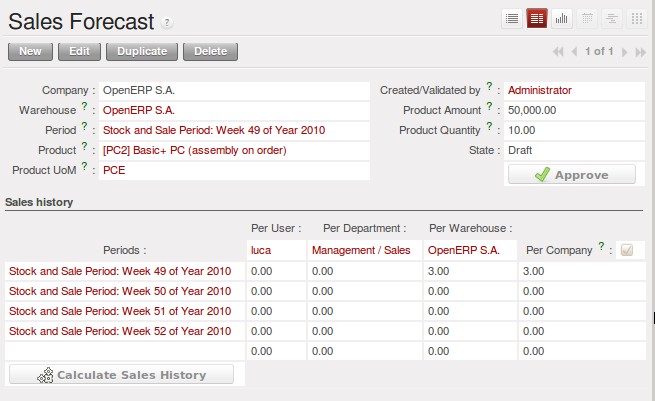

.. index:: MPS
.. index:: Master Production Schedule
.. index:: Master Procurement Schedule

Scheduling
==========

The master production plan, sometimes called the MPS (Master Production Schedule), enables you to
generate forecasts for incoming and outgoing material. It is based on forecasts of inputs and outputs
by the logistics manager.

.. note:: MPS, Procurement and Production

   OpenERP distinguishes between Production, Purchase and Procurement.

   Production is manufacturing, Purchase is the acquisition of goods from another party,
   and Procurement is either one or both of those. So it would be better to call the
   MPS the Master Procurement Schedule. Which OpenERP does!

.. tip:: Product trading

    Also called the Production Plan, this tool is also very useful for traded products which are not
    manufactured.
    You can then use it for stock management with purchased and manufactured products.

.. index::
   single: module; stock_planning

To be able to use the production plan, you must install the :mod:`stock_planning` module.

.. index:: forecasts

Sales Forecasts
---------------

The first thing to do to work with a production plan is to define the periods for stock management.
Some companies plan daily, others weekly or monthly.

.. tip:: Stock Management Interval

   The interval chosen for managing stock in the production plan will depend on the length of your
   production cycle. You generally work daily, weekly or monthly.

   If it takes several days to assemble your products, you most likely will define a weekly plan. If your
   manufacturing cycles take several months you can work with a monthly plan.

Go to the menu :menuselection:`Sales --> Configuration --> Stock and Sales Periods -->
Stock and Sales Periods`. A window appears enabling you to automatically define the next periods that will be
provided for stock management.

.. figure:: images/sale_period.png
   :scale: 75
   :align: center

   *Defining Periods for Stock Management*

Salespeople can then enter their sales forecasts by product and by period using the menu
:menuselection:`Sales --> Sales Forecasts --> Sales Forecasts`. The forecasts can be
made by quantity or by value. For a forecast by amount OpenERP automatically calculates for you the
quantity equivalent to the estimated amount. This can be modified manually as needed before
completion.

   *Sales Forecast to Help Create a Master Production Plan*

.. index::
   single: plan; production

Production Plan
---------------

The manager responsible for logistics then plans receipts (manufacturing or purchases) and outgoings
(consumption or customer deliveries) by period. Go to the menu :menuselection:`Warehouse --> Stock Planning --> Master Procurement Schedule`.

For each period and product, OpenERP gives you the following information:

* Stock estimated at the end of the period, calculated as stock in the following period less the total
  estimated outgoings plus total estimated inputs,

* Closed entries, coming from production or confirmed purchases,

* Forecast inputs for the period, calculated using the incoming entries less the closing amounts,

* Planned inputs entered manually by the logistics manager,

* Closed outgoings which are the consumption of manufacturing waiting and deliveries to be made to
  customers,

* Forecast outgoings, calculated from the planned outgoings, less the closing amounts,

* Planned outgoings, manually entered by the logistics manager,

* Sales forecasts, which represent the sum of forecasts made by the salespeople.

.. figure:: images/stock_forecast.png
   :scale: 75
   :align: center

   *The Master Production Schedule (MPS)*

The production plan enables the logistics manager to play with the forecasted receipts and
outgoings and test the impact on the future stock for the product concerned. It enables
you for example to check that the stock does not fall below a certain level for that product.

You can also open the production plan for past periods. In this case OpenERP shows you the real
stock moves, by period for forecast reports.

If you do not have automated procurement rules for a product you can start procurement at any time
based on the estimates of the production plan.
To do this press the button :guilabel:`Procure Incoming Left` (i.e. remaining) on
the :guilabel:`Master Procurement Schedule`.
OpenERP plans procurement for an amount equal to the entries forecast.

.. Copyright © Open Object Press. All rights reserved.

.. You may take electronic copy of this publication and distribute it if you don't
.. change the content. You can also print a copy to be read by yourself only.

.. We have contracts with different publishers in different countries to sell and
.. distribute paper or electronic based versions of this book (translated or not)
.. in bookstores. This helps to distribute and promote the Open ERP product. It
.. also helps us to create incentives to pay contributors and authors using author
.. rights of these sales.

.. Due to this, grants to translate, modify or sell this book are strictly
.. forbidden, unless Tiny SPRL (representing Open Object Press) gives you a
.. written authorisation for this.

.. Many of the designations used by manufacturers and suppliers to distinguish their
.. products are claimed as trademarks. Where those designations appear in this book,
.. and Open Object Press was aware of a trademark claim, the designations have been
.. printed in initial capitals.

.. While every precaution has been taken in the preparation of this book, the publisher
.. and the authors assume no responsibility for errors or omissions, or for damages
.. resulting from the use of the information contained herein.

.. Published by Open Object Press, Grand Rosière, Belgium
