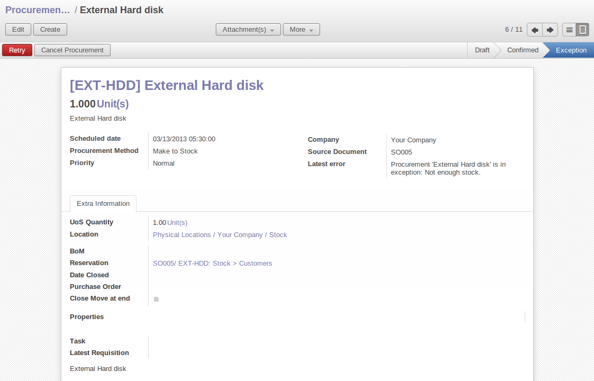
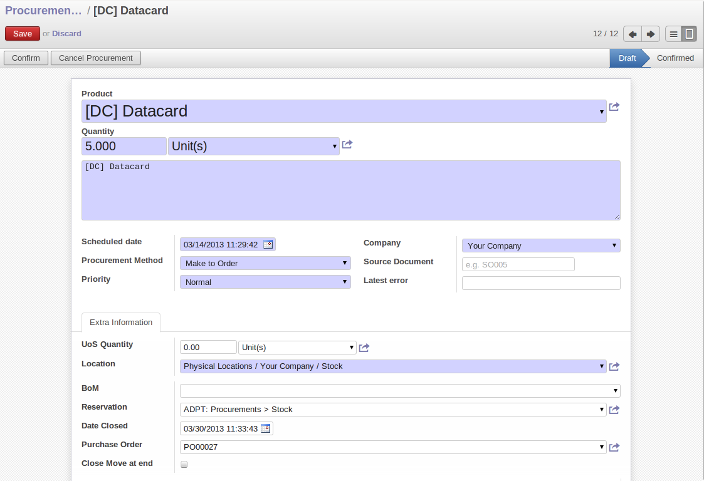
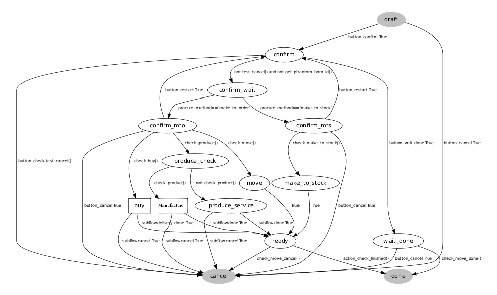

.. index:: MPS
.. index:: Master Production Schedule
.. index:: Master Procurement Schedule

Scheduling Procurements
=======================

OpenERP distinguishes between Production, Purchase and Procurement.

Production is manufacturing, Purchase is the acquisition of goods from another party,  and Procurement is either one or both of those.

Processing Exceptions
---------------------

The set of stock requirements is generated by procurement orders.

In normal system use, you do not need to worry about procurement orders because they are automatically
generated by OpenERP and the user will usually work on the results of a procurement: a production
order, a purchase order, a sales order and a task.

If there should be configuration problems, the system can remain blocked by a procurement without
generating a corresponding document. For example, suppose that you configure a product :guilabel:`Procurement Method`
as ``Make to Order``, and :guilabel:`Supply Method` as ``Manufacture``, but you have not defined the bill of materials. In that case, procurement of the product will stay blocked in an exception state ``No Bill of Materials defined for this product``. You then have to create a bill of materials to solve the problem.

Troubleshooting:

* No bill of materials defined for production: you need to create a BoM or indicate
  that the product can be purchased instead.

* No supplier available for a purchase: you have to define a supplier in the `Procurements` tab
  of the product form.

* No address defined on the supplier partner: you have to complete an address for the default supplier
  for the product concerned.

* No quantity available in stock: you have to create a reordering rule and put it in the order, or manually procure it.

Some problems are just those of timing and can be automatically corrected by the system.

Use the menu :menuselection:`Warehouse --> Schedulers --> Procurement Exceptions` to see all the exceptions.

If a product has to be 'in stock', but is not available in your stores, OpenERP will make the
exception as 'temporary' or 'to be corrected'. The exception is temporary if the system can procure
it automatically, for example, if a procurement rule is defined for minimum stock.

   *Example of a Procurement in Exception*

If no procurement rule is defined, the exception has to be corrected manually by the user. Once the
exception is corrected, you can restart by clicking :guilabel:`Retry`. If you do not do that, 
OpenERP will automatically recalculate on the next automated requirements calculation.

Manual Procurement
------------------

To procure internally, you can create a procurement order manually. Use the menu
:menuselection:`Warehouse --> Schedulers --> Procurement Exceptions` and click the `New` button to do this.

   *Encoding a New Procurement Order*

The procurement order will then be responsible for calculating a proposal for automatic procurement
for the product concerned. This procurement will start a task, a purchase order for the supplier or
a production depending on the product configuration.

   *Workflow for Handling a Procurement according to Product Configuration*

It is better to encode a procurement order rather than direct purchasing or production. This method
has the following advantages:

* The form is simpler because OpenERP calculates the different values from other values and defined rules: purchase date calculated from order date, default supplier, raw materials needs, selection of the most suitable bill of materials, etc.

* The calculation of requirements prioritises the procurements. If you encode a purchase directly, you short-circuit the planning of different procurements.

Request Procurements
--------------------

On the product form you have an :guilabel:`Request Procurement` shortcut button that lets you quickly create a new procurement order.

   *Procurement Request*

.. Copyright © Open Object Press. All rights reserved.

.. You may take electronic copy of this publication and distribute it if you don't
.. change the content. You can also print a copy to be read by yourself only.

.. We have contracts with different publishers in different countries to sell and
.. distribute paper or electronic based versions of this book (translated or not)
.. in bookstores. This helps to distribute and promote the OpenERP product. It
.. also helps us to create incentives to pay contributors and authors using author
.. rights of these sales.

.. Due to this, grants to translate, modify or sell this book are strictly
.. forbidden, unless Tiny SPRL (representing Open Object Press) gives you a
.. written authorisation for this.

.. Many of the designations used by manufacturers and suppliers to distinguish their
.. products are claimed as trademarks. Where those designations appear in this book,
.. and Open Object Press was aware of a trademark claim, the designations have been
.. printed in initial capitals.

.. While every precaution has been taken in the preparation of this book, the publisher
.. and the authors assume no responsibility for errors or omissions, or for damages
.. resulting from the use of the information contained herein.

.. Published by Open Object Press, Grand Rosière, Belgium
