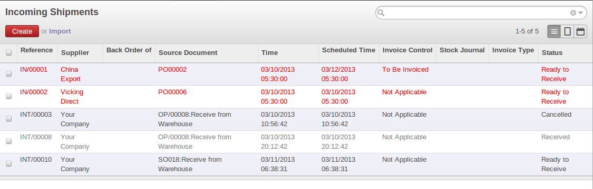
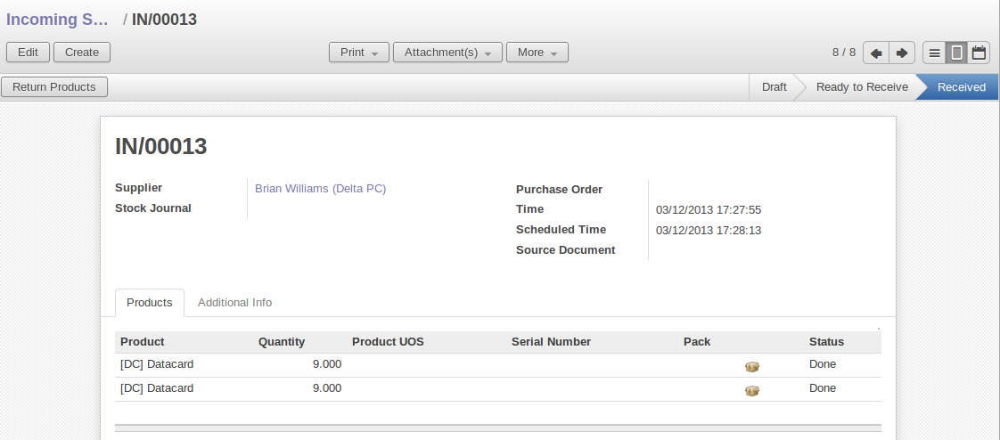
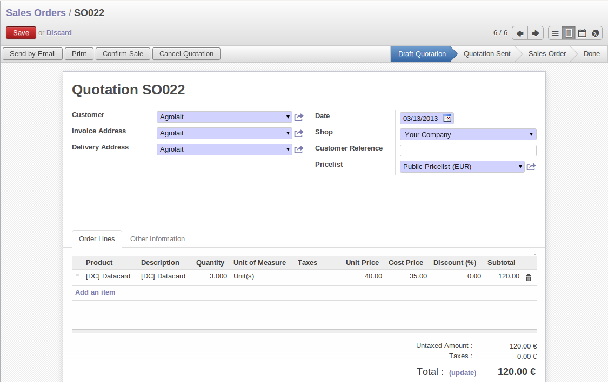
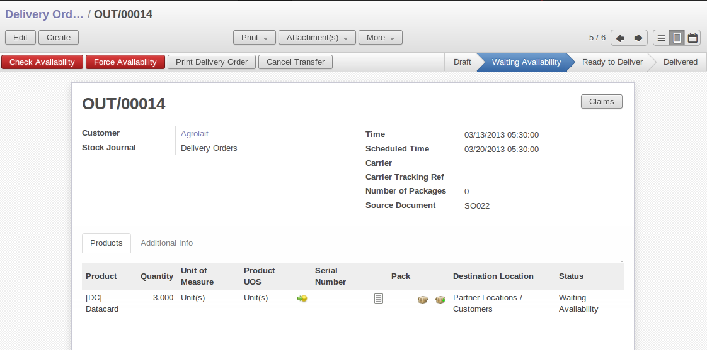
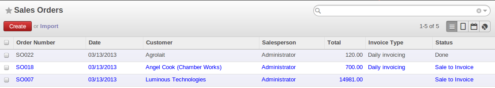

Stocks
======

.. index::
   single: virtual; stock

In the product form you can find the `Stock by Location` action that will give you the stock levels of the various
different products in any selected location. If you have not selected any location, OpenERP
calculates stocks for all of the physical locations. When you are in the Stock by Location view, click the `Print` button to print the `Location Content` or the `Location Inventory Overview` reports.

.. note::  Availability of Stock

    Depending on whether you look at the product from a customer order, or from the menu of a product
    form, you can get different values for stock availability. If you use the product menu, you get
    the stock in all of the physical stock locations. Looking at the product from the order you will
    only see the report of the warehouse selected in the order.

In this respect, two important fields in the product form are:

* :guilabel:`Real Stock`: Quantity physically present in your warehouse,

* :guilabel:`Virtual Stock`: Calculated as follows: real stock – outgoing + incoming.

.. note::  Virtual Stock

    Virtual stock is very useful because it shows what the salespeople can sell. If the virtual stock is higher than the
    real stock, this means products will be coming in. If virtual stock is smaller than real stock, certain products are
    reserved for other sales orders or work orders.

.. tip:: Detail of Future Stock

   To get more details about future stock, you can click :guilabel:`Stock Level Forecast` to the right of the product form
   to get the report :ref:`fig-stfore` below.
   OpenERP shows a graph of the change of stock in the days to come, varying as a function of
   purchase orders, confirmed production and sales orders.

   .. _fig-stfore:

   .. figure:: images/stock_forecast_report.png
      :scale: 50
      :align: center

      *Printout of forecast stock levels*

.. tip:: Filter on Stock by Location 

   By default, in Product list view, the columns `Real Stock` and `Virtual Stock` show the stock figures for all stock locations
   where a product is stored. Use the `Extended Filters` to enter a specific stock location if you want to see the stock in a
   specific location.

Lead Times and Locations
------------------------

The tab :guilabel:`Procurement & Locations` contains information about different lead times and
locations. Three lead time figures are available:

* :guilabel:`Customer Lead Time`: lead time promised to the customer, expressed in number of days
  between the order and the delivery to the customer,

* :guilabel:`Manufacturing Lead Time`: lead time, in days, between a production order and the end
  of production of the finished product,

* :guilabel:`Warranty (months)`: length of time in months for the warranty of the delivered products.

.. note:: Warranty

    The warranty period is used in the Repairs management and after-sales service.
    You can find more information on this subject in :ref:`ch-mnf`.

Fields in the section :guilabel:`Storage Localisation` are given for information – they do not have
any impact on the management of stock.

:guilabel:`Counter-Part Locations Properties` are automatically proposed by the system but the different values can be
modified. You will find counterpart locations for:

* :guilabel:`Procurement`,

* :guilabel:`Production`,

* :guilabel:`Inventory`.

A procurement location is a temporary location for stock moves that have not yet been finalized by
the scheduler. When the system does not yet know if procurement is to be done by a purchase or
production, OpenERP uses the counterpart location :guilabel:`Procurement`. In this location, you will find
everything that has not yet been planned by the system. The quantities of product in this location
cancel each other out.

.. index::
   single: inventory
   single: stock check

Initial Inventory
-----------------

Once a product has been defined, use an initial inventory operation to put current quantities
into the system by location for the products in stock. Use the menu :menuselection:`Warehouse
--> Inventory Control --> Physical Inventories` to do your initial inventory.

   *Defining a new inventory operation*

Give a name (for example ``Initial Inventory`` or ``Lost Product XYZ`` ) and a date (proposed by default) for each inventory
operation. 

You have three ways of doing an inventory.

* Click the Import inventory action and select the location concerned. You can choose to include child locations and set the inventory to zero (especially useful to ensure the count is done correctly).

* You can update the inventory from the Product form. Go to the `Information` tab, `Stocks` section, and click the `Update` button. On confirmation, OpenERP will create a Physical Inventory.

* You can manually add inventory lines. You can then enter data about the quantities available for each product by location.
  Start by entering the location, for example ``Stock`` , and then select the product. OpenERP
  automatically completes the quantity available for that product in the location
  shown. You can then change that value to correct the value in stock.

Enter data for a single line in your inventory:

* :guilabel:`Location` : Stock,

* :guilabel:`Product` : PC1 Computers,

* :guilabel:`Quantity` : 23 Units.

.. tip:: Periodical Inventory

    You are usually legally required to do a stock check of all your products at least once a year.
    As well as doing a complete annual stock check, OpenERP also supports the method of periodical
    inventory.

    That means you can check the stock levels of a proportion of your products every so often.
    This system is accepted in France as long as you can guarantee that all of your products have
    been counted at least once per year.
    To see the last inventory count per product, use the report :menuselection:`Warehouse --> Reporting --> Last Product Inventories`.

    You can do this the same way for all products and all locations,
    so you only carry out small inventory operations through the year rather than
    a single large stock check at one point in the year (which usually turns out to be at an
    inconvenient time).

When your inventory operation is finished, you can confirm it using the `Confirm Inventory` button to the bottom right of
the form.
OpenERP will then automatically create the stock moves to close the gaps, as mentioned at the start
of this chapter.
You can verify the moves generated using the `Posted Inventory` tab of the inventory operation form.

The correct levels of your product are now in your stock locations. A simple way of verifying this
is to reopen the product form to see the quantities available in stock.

Receipt of a Supplier Order by Purchase Order
---------------------------------------------

Incoming Shipments forms are automatically prepared by OpenERP from the purchase management
process. You will find a list of all the awaited receipts in the menu :menuselection:`Warehouse
--> Warehouse Management --> Incoming Shipments`. Use the order number or the supplier name to find the
right goods receipt form for confirmation of a goods-in. This approach enables you to control
quantities received by referring to the quantities ordered.

   *List of items waiting*

You can also do goods-in data entry manually if there is no order, using the same menu by clicking on `New` button.

A new goods-in data entry form then opens. Enter the supplier data in the :guilabel:`Address` field
and you can type in the reference number from your supplier in the field :guilabel:`Origin`. You
should then enter data about the products received in the lines.

The source location is already completed by default because of your supplier selection. You should
then give the destination location where you will place the products. For example, enter ``Stock``.
At this stage, you can set a lot number for traceability (this function will be described later in
this chapter, so leave this field empty for the moment).

Once the form has been completed you can confirm the receipt of all the products at the same time
using the :guilabel:`Process Now` button. If you want to enter data for a goods receipt that you are still
waiting for, click the button :guilabel:`Process Later`.

   *Form for entering goods received from a supplier order*

The products then arrive in stock and should reflect the quantities shown on the product form.

In the `Incoming Shipments` form, the field :guilabel:`Invoicing Control` lets you influence the way you
send invoices to suppliers. If this is set to ``To be invoiced``, a supplier invoice will now be
generated automatically in the draft state, based on the goods received. Your accountant then has to
confirm this pre-invoicing once the supplier's invoice is received. This enables you to verify that
the invoiced quantities correspond to the quantities received.

Receipt of a Supplier Order by Product
--------------------------------------

From this version on, you can also handle receptions by product, even from List view. Go to :menuselection:`Warehouse --> Products Moves --> Receive Products`.

Filters allow you to easily select receipts to be done, and so on. One way to quickly receive products is to Group by `Supplier` and select `To Do`. 

This is very useful functionality when your supplier sends the goods for several purchase orders at a time. You can now just receive the products, regardless of the purchase order they come from.

The List view offers great flexibility and allows you to rapidly receive products by keeping full functionality! Of course, you can handle both partial and complete receptions and you can add information about the production lots and packs.

Of course, you can also accomplish this from Form view.

Customer Delivery
-----------------

.. index::
   single: module; sale

Everything about goods receipt can also be done manually for a customer delivery. But this time, use
the automated product delivery processes based on customer orders. Install the :mod:`sale` module (`Reconfigure` wizard, `Sales Management`), so
that you can proceed further in this section of the chapter.

Now create a new customer order from the menu :menuselection:`Sales --> Sales --> Sales Orders`.
Enter the following data in this order:

* :guilabel:`Shop` : ``OpenERP S.A.``

* :guilabel:`Customer` : ``Agrolait``

* :guilabel:`Sale order lines` :

  * :guilabel:`Product` : ``[PC2] Basic+ PC (assembly on order)``,

  * :guilabel:`Quantity (UoM)` : ``3``,

  * :guilabel:`Product UoM` : ``PCE``,

  * :guilabel:`Procurement Method` : ``from stock``.

You have already seen that OpenERP shows you the available product stock when you have selected list
mode. The real stock is equal to the virtual stock because you have nothing to deliver to customers
and you are not waiting for any of these products to be received into stock. The salesperson then has
all the information needed to take orders efficiently.

   *Entering an order for three computers*

Then confirm the quotation to convert it to an order. If you return to the product form, you will see
the virtual stock is now smaller than the real stock. Indeed, three products have been
reserved by the order that you created, so they cannot be sold to another customer.

Start the scheduler through the menu :menuselection:`Warehouse --> Schedulers --> Compute Schedulers`. Its
functionality will be detailed in :ref:`ch-mnf`. This manages the reservation of
products and places orders based on the dates promised to customers, and the various internal lead
times and priorities.

.. index::
   single: module; mrp_jit

.. tip:: Just in Time

    Install the module :mod:`mrp_jit` to schedule each order in real time after it has been confirmed.
    This means that you do not have to start the scheduler or wait for its periodical start time.

Now have a look at the list of deliveries waiting to be carried out using the menu
:menuselection:`Warehouse --> Warehouse Management --> Delivery Orders`. You find a line
there for your order representing the items to be sent. Double-click the line to see the detail of
the items proposed by OpenERP.

   *Items on a Customer Order*

.. tip::  States

    OpenERP distinguishes between the states **Confirmed** and **Assigned**.

    An item is **Confirmed** when it is needed, but the available stock may be insufficient.
    An item is **Assigned** when it is available in stock and the storesperson reserves it:
    the necessary products have been reserved for this specific operation.

You can also confirm a customer delivery using the :guilabel:`Confirm Order` button in the `Sales Order`.
When you click the :guilabel:`Process` button of `Outgoing Deliveries`, a window opens where you can
enter the quantities actually delivered. If you enter a value less than the forecast one, OpenERP
automatically generates a partial delivery note and a new order for the remaining items. For this
exercise, just confirm all the products.

If you return to the list of current orders, you will see that your order has now been marked as
delivered (``Done``). A progress indicator from 0% to 100% is shown by each order so that the
salesperson can follow the progress of his orders at a glance.

   *List of Orders with their Delivery State*

.. index::
   single: stock; negative

.. note:: Negative Stock

    Stock Management is very flexible so that it can be more effective.
    For example, if you forget to enter products at goods-in, this will not prevent you from sending
    them to customers.
    In OpenERP, you can force all operations manually using the button :guilabel:`Force Availability`.
    In this case, your stocks risk becoming negative. You should monitor all stocks for negative
    levels and carry out an inventory correction when that happens.

.. index::
   single: stock; analysis

Customer Delivery by Product
----------------------------

From this version on, you can also handle deliveries by product, even from List view. Go to :menuselection:`Warehouse --> Products Moves --> Deliver Products`.

Filters allow you to easily select deliveries to be done, available deliveries and so on. One way to quickly deliver products is to Group by `Customer` and select either `To Do` or `Available`.
 
This is very a useful functionality when you send the goods to your customer for several sales orders at a time. You can now just deliver the products, regardless of the sales order they come from.

The List view offers great flexibility and allows you to rapidly deliver products by keeping full functionality! Of course, you can handle both partial and complete deliveries, and you can add information about the production lots and packs.

Of course, you can also accomplish this from Form view.

Analysing Stock
---------------

Have a look at the effect of these operations on stock management. There are several ways of viewing
stocks:

* from the Product form,

* from the Locations,

* from the Orders,

* from the Reporting menu.

Open the Product form from the menu :menuselection:`Warehouse --> Product --> Products` and look
at the list of items. You will immediately see the following information about the products:

* :guilabel:`Real Stock`,

* :guilabel:`Virtual Stock`.

If you want more information, you can use the actions to the right of the form. If you click the
report :guilabel:`Stock Level Forecast`, OpenERP opens a graphical view of the stock levels for
the selected products changing with time over the days and weeks to come.

To get the stock levels by location, use the button :guilabel:`Stock by Location`. OpenERP then
gives you the stock of this product for all its possible locations. If you only want to
see the physical locations in your company, just filter this list using the `Location Type` ``Internal``. By default, physical locations are already in red to better distinguish them from the other locations.
Consolidated (or View) locations (the sum of several locations, following the hierarchical structure) are
displayed in blue.

   *Stock quantities by location for a given product*

You can get more details about all the `Stock Moves` or `Future Stock Moves` from the product form. You will then see each move
from a source location to a destination location. Everything that influences stock levels
corresponds to a stock move.

You could also look at the stocks available in a location using the menu :menuselection:`Inventory
Control --> Locations Structure`. You can select the locations for which you want to see the hierarchy by clicking the drop-down list. Click a location to look at the stocks by product (a wizard appears). A location
containing child locations shows the consolidated contents for all of its child locations.

You should now check the product quantities for various locations to familiarize yourself with this
double-entry stock management system. You should look at:

* supplier locations to see how goods receipts are linked,

* customer locations to see how packing notes are linked,

* inventory locations to see the accumulated profit and loss,

* production locations to see the value created for the company.

Also look at how the real and virtual stocks depend on the location selected. If you enter a
supplier location:

* the real stock shows all of the product receipts coming from this type of supplier,

* the virtual stock takes into account the quantities expected from these suppliers (+ real stock +
  quantities expected from these suppliers). It is the same scheme for customer locations and
  production locations.

From the :menuselection:`Warehouse --> Reporting` menu have a look at the Dashboard and the Analysis Reports, such as `Inventory Analysis` and `Moves Analysis`.
The filters allow you to see for instance the current and future stock, for all locations or for a given location. You can use Extended Filters and the Group by functionality to create your own report.

.. Copyright © Open Object Press. All rights reserved.

.. You may take electronic copy of this publication and distribute it if you don't
.. change the content. You can also print a copy to be read by yourself only.

.. We have contracts with different publishers in different countries to sell and
.. distribute paper or electronic based versions of this book (translated or not)
.. in bookstores. This helps to distribute and promote the OpenERP product. It
.. also helps us to create incentives to pay contributors and authors using author
.. rights of these sales.

.. Due to this, grants to translate, modify or sell this book are strictly
.. forbidden, unless Tiny SPRL (representing Open Object Press) gives you a
.. written authorisation for this.

.. Many of the designations used by manufacturers and suppliers to distinguish their
.. products are claimed as trademarks. Where those designations appear in this book,
.. and Open Object Press was aware of a trademark claim, the designations have been
.. printed in initial capitals.

.. While every precaution has been taken in the preparation of this book, the publisher
.. and the authors assume no responsibility for errors or omissions, or for damages
.. resulting from the use of the information contained herein.

.. Published by Open Object Press, Grand Rosière, Belgium
