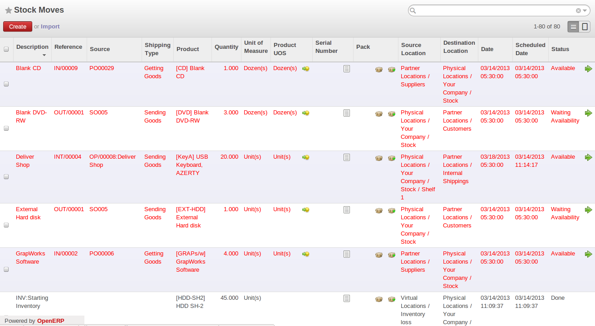
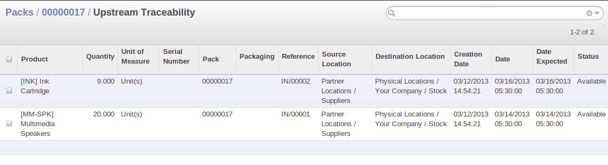
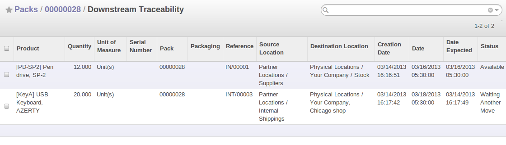

Managing Lots and Traceability
==============================

The double-entry management in OpenERP enables you to run very advanced traceability. All
operations are formalized in terms of stock moves, so it is very easy to search for the cause of any
gaps in stock moves.

.. index::
   single: traceability; upstream
   single: traceability; downstream

.. note:: Upstream Traceability

    It runs from the raw materials received from the supplier and follows the
    chain to the finished products delivered to customers.
    (Note that the name is confusing - this would often be considered a downstream direction.
    Think of it as **Where Used**.)
    
.. note:: Downstream Traceability

    It follows the product in the other direction, from customer to the
    different suppliers of raw material.
    (Note that the name is confusing - this would often be considered an upstream direction.
    Think of it as **Where Supplied**.)

Stock Moves
-----------

Use the menu :menuselection:`Warehouse --> Traceability --> Stock Moves`
to track past stock transactions for a product or a given location. All the operations
are available. You can filter on the various fields to retrieve the operations about an order,
or a production activity, or a source location, or any given destination.

   *History of Stock Movements*

Each stock move is in a given state. The various states are:

* ``New`` : When the stock move is created and not yet confirmed,

* ``Waiting Another Move``: This state can be seen when a move is waiting for another one, for example in a chained flow,

* ``Waiting Availability`` : his state is reached when the procurement resolution is not straight forward. It may need the scheduler to run, a component to me manufactured,

* ``Available`` : When products are reserved, it is set to Available,

* ``Done`` : When the shipment is processed, the state is Done,

* ``Cancelled`` : the stock move was not carried out, so it is not taken into account in either real stock or
  virtual stock.

Delivery orders, goods receipts and internal picking lists are just documents that group a set of
stock moves. You can also consult the history of these documents using the menu
:menuselection:`Warehouse --> Traceability --> Packs`.

Lots
----

OpenERP can also manage product lots. Two lot types are defined:

* Serial Numbers (batch numbers) are represented by a unique product or an assembly of identical
  products leaving the same production area. They are usually identified by bar codes stuck on the
  products. The batch can be marked with a supplier number or your own company numbers.

* Tracking numbers are logistical lots to identify the container for a set of
  products. This corresponds, for example, to the pallet numbers on which several different products
  are stocked.

These lots can be encoded onto all stock moves and, specifically, on incoming shipments lines, internal moves
and outgoing deliveries.

.. figure:: images/picking_form_line.png
   :scale: 75
   :align: center

   *Entering a Line for Production Receipt*

To enter the Serial number in an operation, you can use an existing Serial number or create a new pack. A
Serial (batch number) is used for a single product. A tracking number can be
used several times for different products, so you can mix different products on a pallet or in a box.

You can also specify on the product form the operations in which a Serial number is
required. You can then compel the user to set a lot number for manufacturing operations, goods
receipt, or customer packing.

You do not have to encode the Serial numbers one by one to assign a unique Serial number to a set of several items.
You only need to take a stock move for several products line and click the button
:guilabel:`Split in Serial Number`. You can then give a Serial number prefix (if you want) and OpenERP will
complete the prefix in the wizard with a continuing sequence number. This sequence number
might correspond to a set of pre-printed barcodes that you stick on each product.

.. figure:: images/picking_split_lot.png
   :scale: 75
   :align: center

   *Splitting a Serial Number into uniquely Identified Parts*

.. index:: traceability (stock)

Traceability
------------

If you key in the Serial numbers for stock moves as described above, you can investigate the traceability of any
given Serial number. Go to the menu :menuselection:`Warehouse --> Traceability --> Serial Number` or :menuselection:`Warehouse --> Traceability --> Packs`.

.. tip:: Product Shortcuts

    From the product form, in more option offers useful information:

    * :guilabel:`Product Margin`,

    * :guilabel:`Stock by Location`,

    * :guilabel:`Sales Order Lines`,

    * :guilabel:`Product BoM Structure`.

There are several actions can be performed :

* :guilabel:`Upstream Traceability`: from supplier through to customers,

* :guilabel:`Downstream Traceability`: from customer back to suppliers,

* Stock in all the physical and virtual locations.

   *Tracing Upstream in Make to Order*

   *Tracing Downstream in Make to Stock*

Finally, on a lot, you can enter data on all the operations that have been done for the product. That
keeps a useful history of the pre-sales operations.

Scrapping Products
==================

In OpenERP, there are many ways to handle scrap products. 

#. :menuselection:`Warehouse --> Receiver/Deliver Products --> Incoming Products`

#. :menuselection:`Warehouse --> Receiver/Deliver Products --> Deliver Products`

#. :menuselection:`Warehouse --> Receiver/Deliver By Orders --> Incoming Shipments`

    .. figure:: images/incoming_scrap.png
	   :scale: 75
	   :align: center
	
	   *Scrapping from an Incoming Shipment*

#. :menuselection:`Warehouse --> Receiver/Deliver By Orders --> Internal Moves`

   .. figure:: images/internal_scrap.png
	  :scale: 75
	  :align: center
	
	  *Scrapping from an Internal Move*	

#. :menuselection:`Warehouse --> Receiver/Deliver By Orders --> Delivery Orders`

	
	  *Scrapping from a Delivery Order*	

When you decide to scrap some products, they are transferred to the :guilabel:`Scrap` location.
To display the content of this :guilabel:`Virtual Location`, go to :menuselection:`Warehouse --> Inventory Control --> Location Structure`, then select the virtual locations and display the :guilabel:`Scrap` location.

If you want to transfer the products to another location, you can create a new one and check the 
:guilabel:`Scrap Location` in the additional information.

Identifying Products and Locations with Barcodes and RFID Devices
=================================================================

You can the barcode in the product form in the field :guilabel:`EAN13`.

.. Copyright © Open Object Press. All rights reserved.

.. You may take electronic copy of this publication and distribute it if you don't
.. change the content. You can also print a copy to be read by yourself only.

.. We have contracts with different publishers in different countries to sell and
.. distribute paper or electronic based versions of this book (translated or not)
.. in bookstores. This helps to distribute and promote the OpenERP product. It
.. also helps us to create incentives to pay contributors and authors using author
.. rights of these sales.

.. Due to this, grants to translate, modify or sell this book are strictly
.. forbidden, unless Tiny SPRL (representing Open Object Press) gives you a
.. written authorisation for this.

.. Many of the designations used by manufacturers and suppliers to distinguish their
.. products are claimed as trademarks. Where those designations appear in this book,
.. and Open Object Press was aware of a trademark claim, the designations have been
.. printed in initial capitals.

.. While every precaution has been taken in the preparation of this book, the publisher
.. and the authors assume no responsibility for errors or omissions, or for damages
.. resulting from the use of the information contained herein.

.. Published by Open Object Press, Grand Rosière, Belgium

