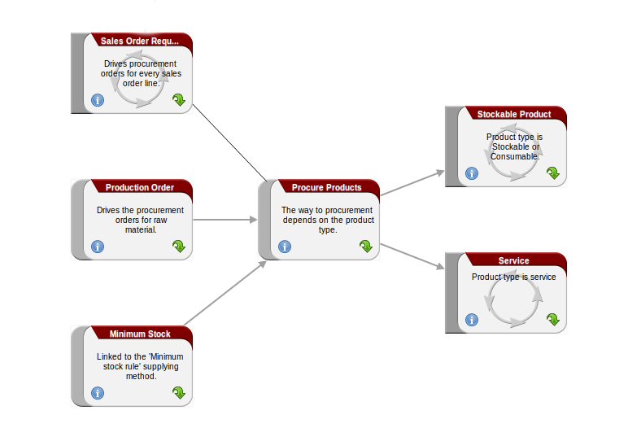

Manufacturing
=============

Once the bills of materials have been defined, OpenERP becomes capable of automatically deciding on
the manufacturing route depending on the needs of the company.

Production orders can be proposed automatically by the system depending on several criteria
described in the preceding chapter:

* Using the ``Make to Order`` rules,

* Using the ``Order Point`` rules,

* Using the Production plan.

Clearly, it is also possible to start production manually. To do this you can use the button :guilabel:`New` in 
the menu :menuselection:`Manufacturing --> Manufacturing --> Manufacturing Orders`.

.. figure:: images/mrp_auto.png
   :scale: 75
   :align: center

   *Manufacturing Order*

.. index::
   single: module; mrp_jit

If you have not installed the Just-In-Time planning module :mod:`mrp_jit`, you should start
using OpenERP to schedule the Production Orders automatically using the
various system rules. To do this, use the menu :menuselection:`Warehouse --> Schedulers --> Compute Schedulers`.

.. tip:: Procurement Exceptions

	You must pay attention to the fact that you have to define `minimum stock rules` for each product that is in 
	``Make to Stock``.

Raw material consumption
++++++++++++++++++++++++

Finished product manufacturing
++++++++++++++++++++++++++++++

Subproduct production
+++++++++++++++++++++

Scrapping
+++++++++

If you have to scrap the final product before it is finished, you will have to scrap every components
allowed to this product. 

.. figure:: images/mo_scrap.png
    :scale: 75
    :align: center
    
    *Scrapping a Product to Finish*

If you scrap a Product to Finish, you will get the situation illustrated in the previous figure. A 
finished product will be *created* and put in the scrapped virtual location, and a new Product to
Finish has been added to the manufacturing order.

.. tip:: Scrap a product

    To scrap a product, you have to edit the manufacturing order and then select the product to be
    scrapped by clicking on the little pencil on the left of the item.

This new product has been added because when you have to manufacture a product and if this product
has to be scrapped, you have to produce another product to replace the scrapped one. The reason why 
you have to scrap each component manually is that the production problem can come from one component.

If the production process is finished and you see that you have to scrap the finished product, you will
not have to scrap the different components. They are already *consumed*. They are not available anymore
for further manufacturing orders, they have been moved to the production Stock Location.

Production orders
+++++++++++++++++

To open a Production Order, use the menu
:menuselection:`Manufacturing --> Manufacturing --> Manufacturing Orders` and click on `New` button.
You get a blank form for entering a new production order as shown in the figure :ref:`fig-mrpprdnew`.

.. _fig-mrpprdnew:

.. figure:: images/mrp_production_new.png
   :scale: 75
   :align: center

   *New production order*

The production order follows the process given by the figure :ref:`fig-mrpprdproc`.

.. _fig-mrpprdproc:

   *Process for handling a production order*

The `Scheduled date` , `Product Qty` and `Reference`, are automatically completed when the form is first opened.
Enter the product that you want to produce, and the quantity required. The :guilabel:`Product UOM` by
default is completed automatically by OpenERP when the product is first selected.

You then have to set two locations:

	* The location from which the required raw materials should be found, and

	* The location for depositing the finished products.

For simplicity, put the ``Stock`` location in both places. The field :guilabel:`Bill of Materials` will
automatically be completed by OpenERP when you select the product.  You
can then overwrite it with another BoM to specify something else to use for this specific
manufacture, then click the button :guilabel:`Compute Data`.

The tabs :guilabel:`Scheduled Products` and :guilabel:`Work Orders` are also completed automatically when you click
:guilabel:`Compute Data` (in the :guilabel:`Work Orders` or :guilabel:`Scheduled Products` tabs). 
You will find the raw materials there that are required for the production and the operations needed by the assembly staff.

If you want to start production, click the button :guilabel:`Confirm Production`, and OpenERP then
automatically completes the :guilabel:`Products to Consume` field in the :guilabel:`Consumed Products` tab and
:guilabel:`Products to Finish` field in :guilabel:`Finished Products` tab.

The information in the :guilabel:`Consumed Products` tab can be changed if:

* you want to enter a serial number for raw materials,

* you want to change the quantities consumed (lost during production).

For traceability, you can set lot numbers on the raw materials used, or on the finished
products.
Note the :guilabel:`Production Lot` and :guilabel:`Pack` numbers.

Once the order is confirmed, you should force the reservation of materials
using the :guilabel:`Force Reservation` button. This means that you do not have
to wait for the scheduler to assign and reserve the raw materials from your stock for this
production run. This shortens the procurement process.

If you do not want to change the priorities, just
leave the production order in this state and the scheduler will create a plan based on the priority
and your planned date.

.. todo:: Report that State is not shown on a Production Order

To start the production of products, click :guilabel:`Start Production`. The raw materials are then
consumed automatically from stock, which means that the draft ( ``Waiting`` ) movements become ``Done`` .

Once the production is complete, click :guilabel:`Produce`. The finished products are
then moved into stock.

.. Copyright © Open Object Press. All rights reserved.

.. You may take electronic copy of this publication and distribute it if you don't
.. change the content. You can also print a copy to be read by yourself only.

.. We have contracts with different publishers in different countries to sell and
.. distribute paper or electronic based versions of this book (translated or not)
.. in bookstores. This helps to distribute and promote the OpenERP product. It
.. also helps us to create incentives to pay contributors and authors using author
.. rights of these sales.

.. Due to this, grants to translate, modify or sell this book are strictly
.. forbidden, unless Tiny SPRL (representing Open Object Press) gives you a
.. written authorisation for this.

.. Many of the designations used by manufacturers and suppliers to distinguish their
.. products are claimed as trademarks. Where those designations appear in this book,
.. and Open Object Press was aware of a trademark claim, the designations have been
.. printed in initial capitals.

.. While every precaution has been taken in the preparation of this book, the publisher
.. and the authors assume no responsibility for errors or omissions, or for damages
.. resulting from the use of the information contained herein.

.. Published by Open Object Press, Grand Rosière, Belgium
