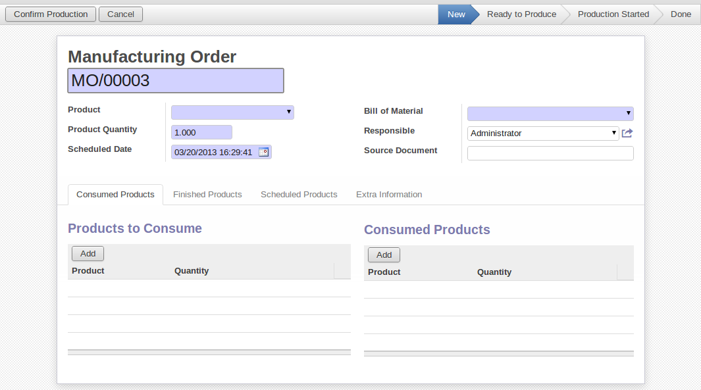
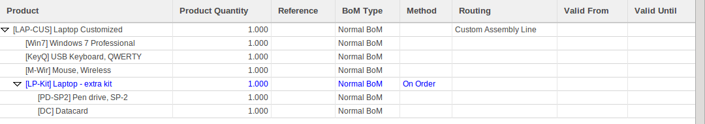
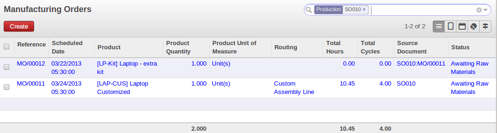
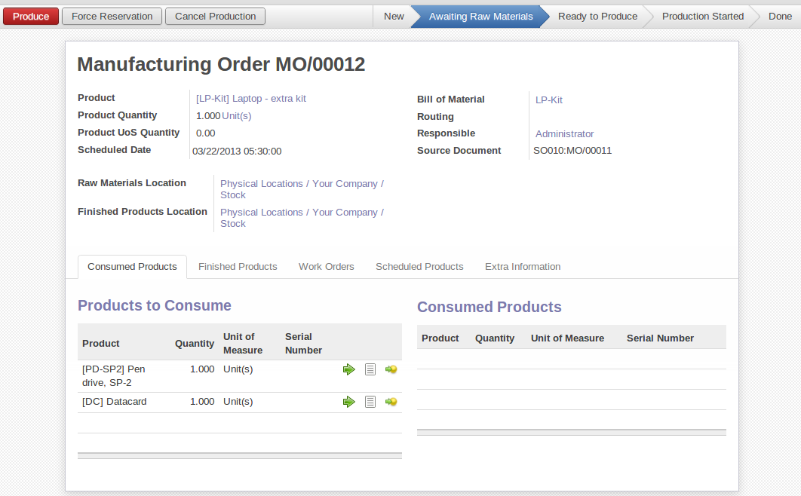
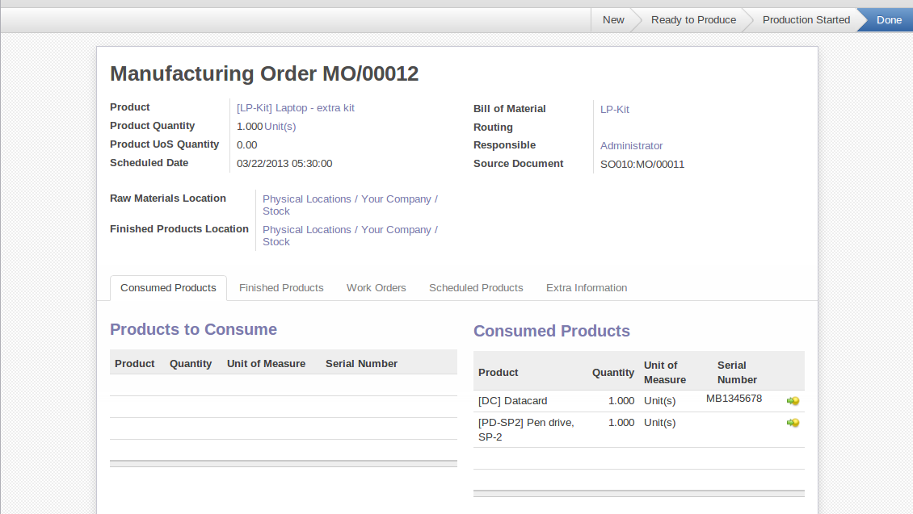
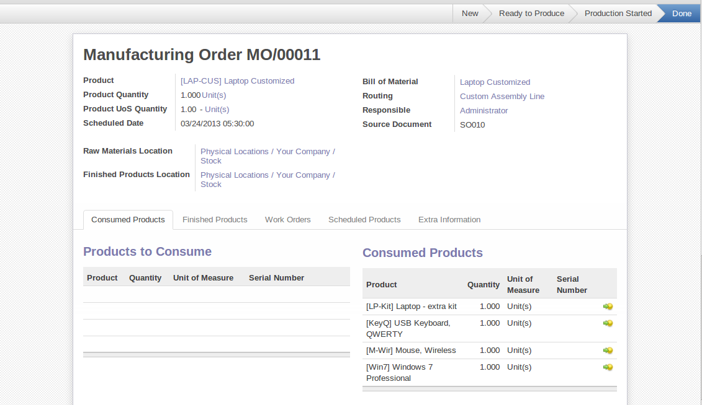
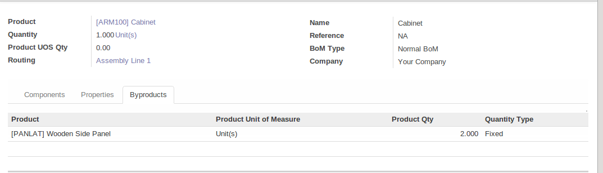
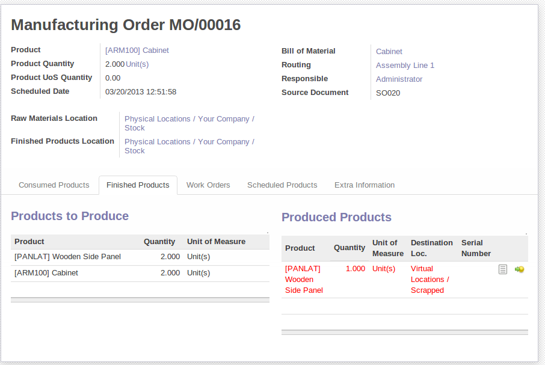
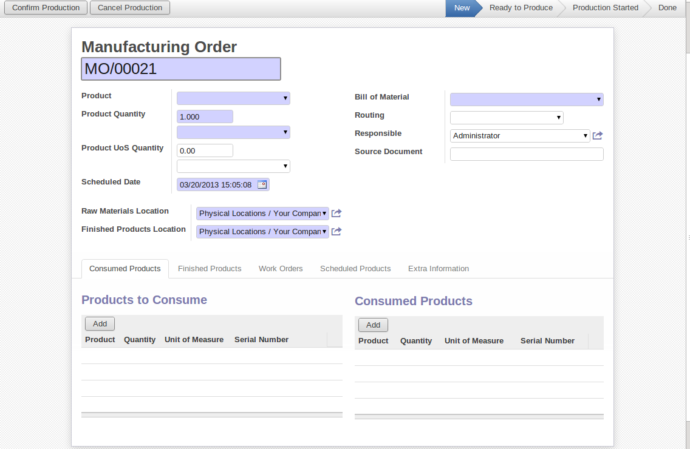

Manufacturing Orders
====================

Once the bills of materials have been defined, OpenERP is capable of automatically deciding on the manufacturing route according to the needs of the company.

Production orders can be proposed automatically by the system depending on several criteria described in the preceding chapter:

* Using the ``Make to Order`` rules,

* Using the ``Order Point`` (Minimum Stock) rules,

* Using the Production plan.

Of course, you can also start production manually by clicking the button :guilabel:`Create` in the menu :menuselection:`Manufacturing --> Manufacturing --> Manufacturing Orders`.

   *Manufacturing Order*

.. index::
   single: module; mrp_jit

If you have not installed the Just-in-Time planning module :mod:`mrp_jit`, you should start using OpenERP to schedule the Production Orders automatically using the various system rules. To do this, use the menu :menuselection:`Warehouse --> Schedulers --> Run Schedulers`.

.. tip:: Procurement Exceptions

        Pay attention to the fact that you have to define `minimum stock rules` for each product set as ``Make to Stock``.

Complete Production Workflow
============================

To understand the usefulness and the functioning of the system you should test a complete workflow
on the database installed with the demonstration data. We will show you:

* How to create a sales order,

* The manufacturing workflow for an intermediate product,

* The manufacturing of an ordered product,

* The delivery of products to a customer,

* Invoicing at the end of the month,

* Traceability for after-sales service.

This more advanced case of handling problems in procurement will be sorted out later in the chapter.

The Sales Order
+++++++++++++++

.. index:: quotation
.. index:: sales order

Begin by encoding a sales (or customer) order through the menu :menuselection:`Sales --> Sales --> Quotation -> Create`. Enter the following information:

* :guilabel:`Customer` : Agrolait,

* :guilabel:`Create Invoice` : On Delivery Order (``Other Information`` tab),

* :guilabel:`Sales Order Lines`, click `Add an item`:

  * :guilabel:`Product` : [LAP-CUS] Laptop Customised,

  * :guilabel:`Quantity (UoM)` : 1,

  * :guilabel:`Product UoM` : Unit(s),

  * :guilabel:`Procurement Method` : on order.

Once the quotation has been entered, you can confirm it immediately by clicking the button
:guilabel:`Confirm Sale` at the top. Keep note of the order reference because this
follows all through the process. Usually, in a new database, this will be ``SO009`` . At this stage `SO010`

.. figure:: images/mrp_sales_process_new.png
   :scale: 60
   :align: center

   *Process for Handling Sales Order SO010*

.. index::
   single: semi-finished product

Producing an Intermediate Product
+++++++++++++++++++++++++++++++++

To understand the implications of requirements calculation, you should know the configuration of the sold product. To do this, go to the form for product LAP-CUS and click the :guilabel:`Product BoM Structure` From the more button. You get the screen shown in :ref:`fig-mrpbomtree` which is the composition of the selected product.

.. _fig-mrpbomtree:

   *Composition of LAP-CUS*

The LAP-CUS Customised Laptop has to be manufactured in two steps:

1: The intermediate product: LP-Kit

2: The finished product using that intermediate product: LAP-CUS

The manufacturing supervisor can then consult the production orders using the menu
:menuselection:`Manufacturing --> Manufacturing --> Manufacturing Orders`. You then get a
list of orders.

   *List of Manufacturing Orders*

You will see the Manufacturing order for `LP-Kit` and one for `[LAP-CUS] Laptop Customized` because it depends on an intermediate product. Return to the Manufacturing order for `LP-Kit` and click it. If there are several of them, select the one corresponding to your order using the source document that contains your order number (in this example ``SO010`` ).

   *Details of a Production Order*

The system shows you that you have to manufacture product `LAP-CUS` using the components: `LP-Kit`. You can then confirm the production twice:

Start production: consumption of raw materials,

Produce: manufacturing of finished product.

Manufacturing order is Waiting for raw material, you should set the availability by clicking ``Force Reservation`` Button.

Click the ``Mark as Started`` button, then click the ``Edit`` button, and edit the line for the product [DC]Datacard. Enter a serial number for it by putting the cursor in the field :guilabel:`Serial Number` and to create a new Number. Enter an internal reference, for example: ``MB1345678``. The system may then show you a warning because this lot is not in stock, but you can ignore this message.

Click the ``Produce`` button to manufacture the finished product.

The production order has to be in the closed state as shown in the figure :ref:`fig-mrpprdfrm`.

.. _fig-mrpprdfrm:

   *Production Order after the Different Stages*

Finished Product Manufacturing
++++++++++++++++++++++++++++++

Having manufactured the intermediate product LP-Kit, OpenERP automatically proposes the manufacturing
of the computer LAP-CUS using the order created earlier. Return to the Manufacturing Orders menu and look at the orders Ready to Produce through  :menuselection:`Manufacturing --> Manufacturing --> Manufacturing Orders`.

You will find LAP-CUS which has been sold to the customer (source document SO010), as shown in the figure hereafter.

    
    *Completed Production for LAP-CUS*

Now that the production has been completed, the product sold to the customer has been manufactured and the raw materials have been consumed and taken out of stock.
 
.. tip:: Automatic Actions

    As well as managing the use of materials and the production of stocks, manufacturing can have the following
    automatic effects which are detailed further on in the chapter:
    
    * adding value to stock,
    * generating operations for assembly staff,
    * automatically creating analytical accounting entries.

Subproduct Production
+++++++++++++++++++++

If you need to manage subproducts, you should install the module :mod:`mrp_byproduct` 
Go to menu menu :menuselection:`Settings --> Configuration --> Manufacturing`.And in `Order`, tick Produce several products.
The normal behaviour of manufacturing in OpenERP enables you to manufacture several units of the
same finished product from raw materials (A + B > C). With Subproduct management, the manufacturing result can be to have both finished products and secondary products (A + B > C + D).

.. note:: Subproduct Material

    In OpenERP, subproduct material corresponds to secondary products that are a by-product of the main manufacturing
    process. For example, cutting planks of timber will produce other planks but these bits of timber are too small 
    (or the offcuts may have value for the company if they can be used elsewhere).

If the module :mod:`mrp_byproduct` has been installed, you get a new tab By products in the Bill of Material
that lets you set secondary products resulting from the manufacturing of the finished product.

    
    *Definition of Subproducts*

When OpenERP generates a production order based on a bill of materials that uses a secondary product, you pick
up the list of all products in the second tab of the production order ``Finished Products``.
    
.. figure:: images/mrp_production.png
    :scale: 60
    :align: center
    
    *Production Order producing Several Finished Products*

Secondary products enable you to generate several types of products from the same raw materials and manufacturing methods - only these are not used in the calculation of requirements. Then, if you need the secondary products, OpenERP will not ask you to manufacture another product to use the waste products and secondary products of this production. In this case, you should enter another production order for the secondary product.

.. note:: Services in Manufacturing

    Unlike most software for production management, OpenERP manages services as well as stockable products. So
    it is possible to put products of type Service in a bill of materials. These do not appear in the production 
    order, but their requirements will be taken into account.
    
    If they are defined as Make to Order, OpenERP will generate a task for the manufacturing or a subcontract
    order for the operations. The behaviour will depend on the Supply Method configured in the product form: Buy
    or Produce.

Scrapping
+++++++++

If you have to scrap the final product before it is finished, you will have to scrap every component allowed for this product. 

    
    *Scrapping a Product to Finish*

If you scrap a Product to Finish, you will get the situation illustrated in the previous figure. A finished product will be *created* and put in the scrapped virtual location. A new Product to Finish has been added to the manufacturing order.

This new product has been added for the following reason: when you have to manufacture a product and if this product
has to be scrapped, you have to produce another product to replace the scrapped one. The reason why 
you have to scrap each component manually is that the production problem can come from one component.

If the production process is finished and you see that you have to scrap the finished product, you will
not have to scrap the different components. They are already *consumed*. They are not available anymore
for further manufacturing orders; they have been moved to the production Stock Location.

Production Orders
+++++++++++++++++

To open a Production Order, use the menu :menuselection:`Manufacturing --> Manufacturing --> Manufacturing Orders` and click the `New` button.
You get a blank form to enter a new production order as shown in the figure :ref:`fig-mrpprdnew`.

.. _fig-mrpprdnew:

   *New Production Order*

The production order follows the process given by the figure :ref:`fig-mrpprdproc`.

.. _fig-mrpprdproc:

.. figure:: images/mrp_production_processus.png
   :scale: 60
   :align: center

   *Process for Handling a Production Order*

The `Scheduled date` , `Product Qty` , `Name` and Default Locations, are automatically completed when the form is first opened.
Enter the product that you want to produce, and the quantity required. The :guilabel:`Product UOM` by
default completed automatically by OpenERP when the product is first selected.

You then have to set two locations:

	* The location from which the required raw materials should be found, and

	* The location for depositing the finished products.

The field :guilabel:`Bill of Materials` will
automatically be completed by OpenERP when you select the product. You can then overwrite it with another BoM to specify something else to use for this specific manufacturing.

The tabs :guilabel:`Scheduled Products` and :guilabel:`Work Orders` are also completed automatically when you click
:guilabel:`Compute Data` (in the :guilabel:`Work Orders` or :guilabel:`Scheduled Products` tabs). 
You will find the raw materials there that are required for the production and the operations needed by the assembly staff.

If you want to start production, click the button :guilabel:`Confirm Production`, and OpenERP automatically completes the :guilabel:`Products to Consume` field in the :guilabel:`Consumed Products` tab and :guilabel:`Products to Produce` field in :guilabel:`Finished Products` tab.

The information in the :guilabel:`Consumed Products` tab can be changed if:

* you want to enter a serial number for raw materials,

* you want to change the quantities consumed (lost during production).

For traceability, you can set serial numbers on the raw materials used, or on the finished
products.
Note the :guilabel:`Serial Number` and :guilabel:`Pack` numbers.

Once the order is confirmed, you should force the reservation of materials
using the :guilabel:`Force Reservation` button. This means that you do not have
to wait for the scheduler to assign and reserve the raw materials from your stock for this
production run. This shortens the procurement process.

If you do not want to change the priorities, just leave the production order in this state and the scheduler will create a plan based on the priority and your planned date.

To start the production of products, click :guilabel:`Mark as Started`. The raw materials are then consumed automatically from stock, which means that the ``Ready to Produce`` movements become ``Production Started``.

Once the production is complete, click :guilabel:`Produce`. The finished products are now moved into stock.

.. Copyright © Open Object Press. All rights reserved.

.. You may take electronic copy of this publication and distribute it if you don't
.. change the content. You can also print a copy to be read by yourself only.

.. We have contracts with different publishers in different countries to sell and
.. distribute paper or electronic based versions of this book (translated or not)
.. in bookstores. This helps to distribute and promote the OpenERP product. It
.. also helps us to create incentives to pay contributors and authors using author
.. rights of these sales.

.. Due to this, grants to translate, modify or sell this book are strictly
.. forbidden, unless Tiny SPRL (representing Open Object Press) gives you a
.. written authorisation for this.

.. Many of the designations used by manufacturers and suppliers to distinguish their
.. products are claimed as trademarks. Where those designations appear in this book,
.. and Open Object Press was aware of a trademark claim, the designations have been
.. printed in initial capitals.

.. While every precaution has been taken in the preparation of this book, the publisher
.. and the authors assume no responsibility for errors or omissions, or for damages
.. resulting from the use of the information contained herein.

.. Published by Open Object Press, Grand Rosière, Belgium
