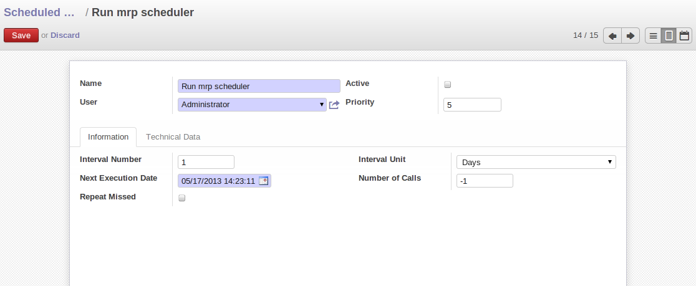
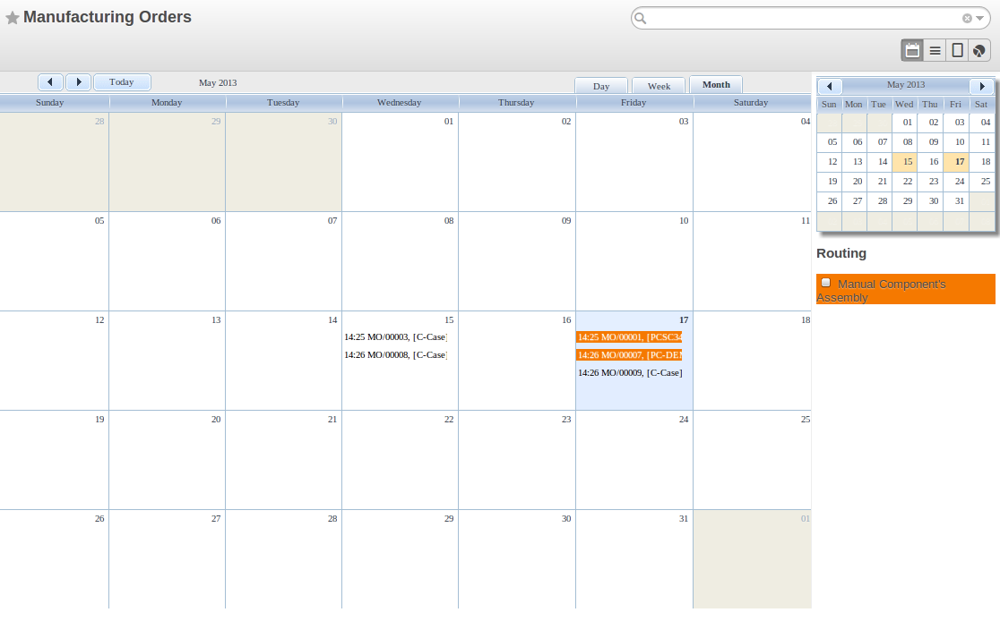
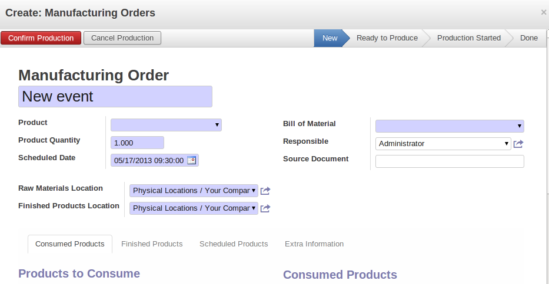
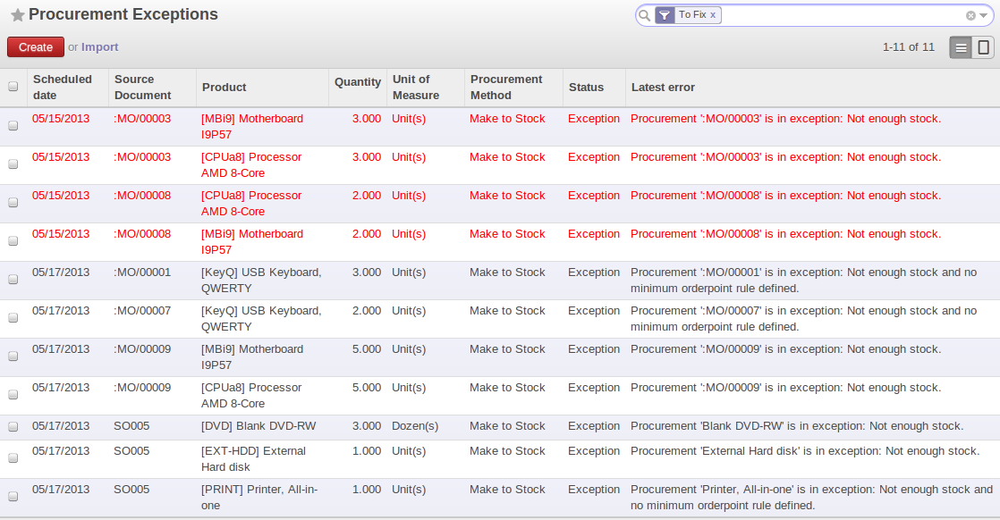
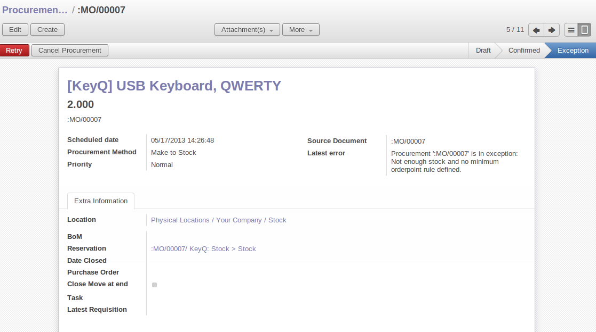
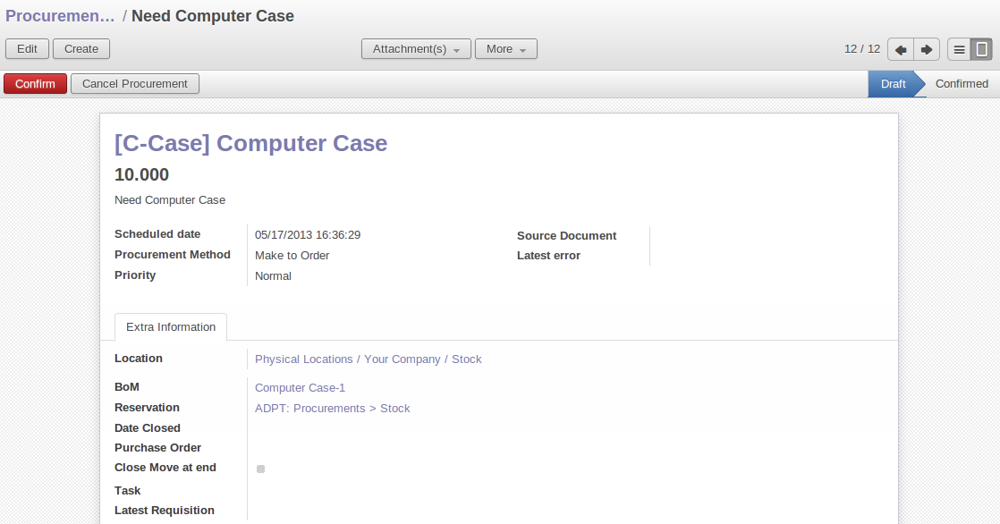
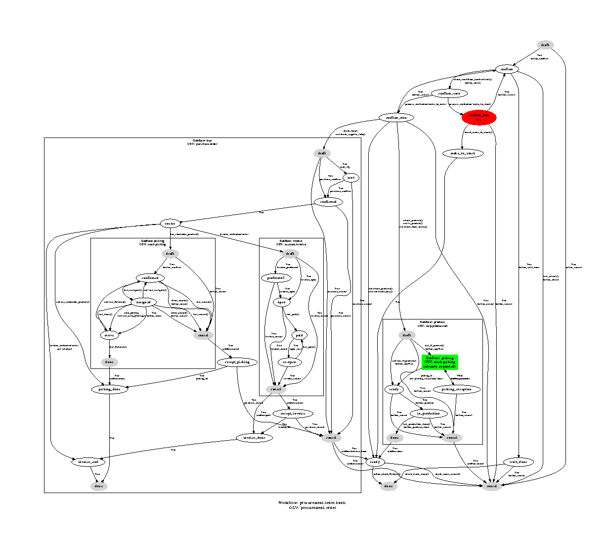
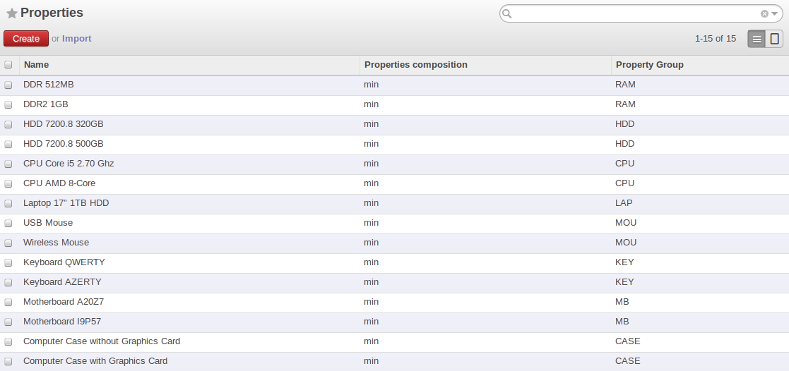
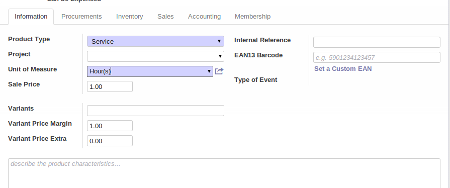
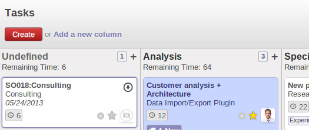

Forecasting and Supplying
=========================

Scheduler
+++++++++

The requirements scheduler is the calculation engine which plans and prioritises production and purchasing automatically according to the rules defined on products. By default, the scheduler is set to run once a day (OpenERP automatically creates a *Scheduled Action* for this). You can also start the scheduler manually from the menu :menuselection:`Warehouse --> Schedulers --> Compute Schedulers`.
The scheduler uses all the relevant parameters defined for products, suppliers and the company to determine the priorities between the different production orders, deliveries and supplier purchases.

.. note::

        You can set the starting time of the scheduler by modifying the corresponding action in the menu :menuselection:`Administration --> Configuration --> Scheduler --> Scheduled Actions`. Modify the ``Run mrp Scheduler`` configuration document.

   *Configuring the Start Time to Calculate Requirements*

.. tip::  Calculating Requirements / Scheduling

    Scheduling only validates procurements that are confirmed but not yet started. These procurement reservations
    will themselves start production, tasks or purchases depending on the configuration of the requested product.

You take into account the priority of operations when starting reservations and procurements.
Urgent requests, those with a date in the past, or requests with a date earlier than the others will be started first. In case there are not enough products in stock to satisfy all the requests, you can be sure that the most urgent requests will be produced first.

Planning
++++++++

In OpenERP, you can plan the production in an easy way. Simply by going to :menuselection:`Manufacturing --> Planning`, you can plan manufacturing orders, work orders and/or work centers.

By clicking ``Manufacturing Orders`` in the *Planning* menu, a calendar view will open in which you can select a day to create the order whenever you want. You will also see the already planned orders. By dragging and dropping a manufacturing order in Calendar view, you can change the starting date of the order.

    
    *Planning Manufacturing Orders*

When you click in a day in the Calendar view, an empty manufacturing order window will open and let you choose which product you want to produce.

    
    *New Manufacturing Order*    

Scheduler and Just in Time
--------------------------

When you want to work according to the *Just in Time* way, you should install the module :mod:`mrp_jit`.

If you install this module, you will not have to run the regular procurement scheduler anymore (but you still need to run the minimum order point rule scheduler, or for example let it run daily.) 

All procurement orders will be processed immediately, which could in some cases entail a small performance impact. 

It may also increase your stock size because products are reserved as soon as possible and the scheduler time range is not taken into account anymore. In that case, you can no longer use priorities for the different picking orders. 

Lead times
----------

All procurement operations (that is, the requirement for both production orders and purchase orders) are automatically calculated by the scheduler. But more than just creating each order, OpenERP plans the timing of each step. A planned date calculated by the system can be found on each order document.

To organize the whole chain of manufacturing and procurement, OpenERP bases everything on the delivery date promised to the customer. This is given by the date of the confirmation in the order and the lead times shown in each product line of the order. This lead time is itself proposed automatically in the field :guilabel:`Customer Lead Time` shown in the product form. This Customer Lead Time is the difference between the time on an order and that of the delivery.

To see a calculation of the lead times, take the example of the cabinet above. Suppose that the cabinet is assembled in two steps, using the two following bills of materials.

.. table:: Bill of Materials for 1 SHE100 Unit

   ============  ========  ===============
   Product Code  Quantity  Unit of Measure
   ============  ========  ===============
   SIDEPAN       2         Unit
   WOOD002       0.25      m
   LIN040        1         m
   WOOD010       0.249     m
   METC000       12        Unit
   ============  ========  ===============

.. table:: Bill of Materials for 2 SIDEPAN Units

   ============  ========  ===============
   Product Code  Quantity  Unit of Measure
   ============  ========  ===============
   WOOD002       0.17      m
   ============  ========  ===============

The SIDEPAN is made from an order using the workflow shown. The WOOD002 is purchased on order and the other products are all found in stock. An order for the product SHE100 will then generate two production orders (SHE100 and SIDEPAN) then produce two purchase orders for the product WOOD02.
Product WOOD02 is used in the production of both SHE100 and SIDEPAN. Set the lead times on the product forms to the following:

.. table:: Lead Times

   ============ ================== ======================= ==================
   Product Code Customer Lead Time Manufacturing Lead Time Supplier Lead Time
   ============ ================== ======================= ==================
   SHE100       30 days            5 days
   SIDEPAN                         10 days
   WOOD002                                                 5 days
   ============ ================== ======================= ==================

A customer order placed on the 1st January will set up the following operations and lead times:

* Delivery SHE100: 31 January (=1st January + 30 days),

* Manufacture SHE100: 26 January (=31 January – 5 days),

* Manufacture SIDEPAN: 16 January (=26 January – 10 days),

* Purchase WOOD002 (for SHE100): 21 January (=26 January – 5 days),

* Purchase WOOD002 (for SIDEPAN): 11 January (=16 January – 5 days).

In this example, OpenERP will propose placing two orders with the supplier of product WOOD002. Each of these orders can be for a different planned date. Before confirming these orders, the purchasing manager could group (merge) these orders into a single order.

Security Days
-------------

The scheduler will plan all operations as a function of the time configured on the products. But it is also possible to configure these factors in the company. These factors are then global to the company, whatever the product concerned may be. In the description of the company, on the
:guilabel:`Configuration` tab, you find the following parameters:

* `Scheduler Range Days`: all the procurement requests that are not between today and today plus the number of days specified here are not taken into account by the scheduler.
  
* `Manufacturing Lead Time`: number of additional days needed for manufacturing,

* `Purchase Lead Time`: additional days to include for all purchase orders with this supplier,

* `Security Days`: number of days to deduct from a system order to cope with any problems of procurement,

.. note:: Purchase Lead Time

    The security delay for purchases is the average time between the order generated by OpenERP and
    the real purchase time from the supplier by your purchasing department.
    This delay takes into account the order process in your company, including order negotiation time.

Take for instance the following configuration:

* `Manufacturing Lead Time` : 1,

* `Purchase Lead Time` : 3,

* `Security Days` : 2.

The example above will then be given the following lead times:

* Delivery SHE100: 29 January (= 1st January + 30 days – 2 days),

* Manufacture SHE100: 23 January (= 29 January – 5 days – 1 day),

* Manufacture SIDEPAN: 12 January (= 26 January – 10 days – 1 day),

* Purchase WOOD002 (for SHE100): 15 January (= 26 January – 5 days – 3 days),

* Purchase WOOD002 (for SIDEPAN): 4 January (= 12 January – 5 days – 3 days).

Procurement
+++++++++++

In normal system use, you do not need to worry about procurement orders, because they are automatically generated by OpenERP and the user will usually work on the results of a procurement: a production order, a purchase order, a sales order and a task.

But if there are configuration problems, the system can remain blocked by a procurement without generating a corresponding document.

Automating Purchasing and Replenishment
---------------------------------------

In the product form view, you can select between two procurement methods:

    * Make To Stock (MTS)
    * Make To Order (MTO)

These two ways will impact the way you have to configure your automatic purchasing and replenishment. For the MTS method, you will
have to define Minimum Stock Rules to order products when the minimum treshold and a supplier to define where to order the products. 
For the MTO method, you must define a supplier for the product in order to buy new products when a sale order or a manufacturing 
order is confirmed.

Exception management (Scheduler)
--------------------------------

In OpenERP, you can have different procurement exceptions. An exception appears in the procurement exception view when the 
system does not know what to do with an object such as a Manufacturing Order or a Purchase Order.

You can find four types of exceptions:

    * No bill of materials defined for production: in this case you have got to create one or indicate that the product can be purchased instead.

    * No supplier available for a purchase: it is then necessary to define a supplier in the tab Supplier of the product form.

    * No address defined on the supplier partner: you must complete an address for the supplier by default for the product in consideration.

    * No quantity available in stock: you must create a rule for automatic procurement (for example, a minimum stock rule) and put it in the order, or manually procure it.

    
    *Procurement exceptions*
    
Some problems are just those of timing and can be automatically corrected by the system.

If a product must be ‘in stock’ but is not available in your stores, OpenERP will make the exception in
‘temporary’ or ‘to be corrected’. The exception is temporary if the system can procure it automatically, for
example, if a procurement rule is defined for minimum stock.

When an exception is raised, you can check the configuration of your product in order to correct the misconfiguration. Then you
can choose to relaunch the scheduler or to retry to execute the action by selecting the line, click on :guilabel:`Retry` and then
on :guilabel:`Run procurement`.

    
    *Correct a procurement exception*

The exception related to the BoM definition comes from the fact that a product with a supply method set as *Produce* has no
Bill Of Materials. The system does not know how to produce this product and then raise an exception.    

Manual Procurement
------------------

To procure internally, you can create a procurement order manually. Use the menu :menuselection:`Warehouse --> Schedulers -->
Procurement Exceptions` and click the New button to do this.

    
    *Manual Procurement*

The procurement order will then be responsible for calculating a proposal for automatic procurement for the
product concerned. This procurement will start a task, a purchase order for the supplier or a production
depending on the product configuration.

    
    *Procurement flow*

It is better to encode a procurement order rather than direct purchasing or production. This method has the
following advantages:

The form is simpler because OpenERP calculates the different values from other values and defined rules: purchase date 
calculated from order date, default supplier, raw materials needs, selection of the most suitable bill of
materials, etc.

The calculation of requirements prioritises the procurements. If you encode a purchase directly, you short-circuit
the planning of different procurements.

.. tip:: Shortcuts

    On the product form you have an **action** shortcut button :guilabel:`Procurement Request` that lets you quickly 
    create a new procurement order.
        

Subcontracting management
=========================

In OpenERP it is possible to subcontract production operations (for example, painting and item
assembly) at a supplier's. To do this you must indicate on the relevant routing document a supplier
location for stock management.

You must then configure a location dedicated to this supplier with the following data:

* :guilabel:`Location Type` : Supplier,

* :guilabel:`Location Address` : Select an address of the subcontractor partner,

* :guilabel:`Chained Location Type` : Fixed,

* :guilabel:`Chained Location If Fixed` : your Stock,

* :guilabel:`Chaining Lead Time` : number of days before receipt of the finished product.

Then once the manufacture has been planned for the product in question, OpenERP will generate the
following steps:

* Delivery of raw materials to the stores for the supplier,

* Production order for the products at the suppliers and receipt of the finished products in the stores.

Once the production order has been confirmed, OpenERP automatically generates a delivery order to
send to the raw materials supplier. The storesperson can access this delivery order using the menu
:menuselection:`Warehouse --> Warehouse Management --> Internal Moves`. The raw materials will then be placed in
stock at the supplier's stores.

Once the delivery of raw materials has been confirmed, OpenERP activates the production order. The
supplier uses the raw materials sent to produce the finished goods which will automatically be put
in your own stores. The confirmation of this manufacture is made when you receive the products from
your supplier. It is then that you indicate the quantities consumed by your supplier.

.. tip:: Subcontract Without Routing

   If you do not use routing, you can always subcontract work orders by creating an empty routing in
   the subcontract bill of materials.

Production orders are found in the menu :menuselection:`Manufacturing --> Manufacturing -->
Manufacturing Orders`. A production order is always carried out in two stages:

#. Consumption of raw materials.

#. Production of finished products.

Depending on the company's needs, you can specify that the first step is confirmed at the
acknowledgement of manufacturing supplier, and the second at the receipt of finished goods in the
warehouse.

Matching Sales Orders and BoM thanks to Properties
==================================================

In OpenERP, you can define several bills of materials for the same product. In fact, you can have
several manufacturing methods or several approved raw materials for a given product. You will see in
the following section that the manufacturing procedure (the routing) is attached to the Bill of
Materials, so the choice of bill of materials implicitly includes the operations to make it.

Once several bills of materials have been defined for a particular product, you need to have a
system to enable OpenERP to select one of them for use. By default, the bill of materials with the
lowest sequence number is selected by the system.

To gain more control over the process during the sale or procurement, you can use **properties**.
The menu :menuselection:`Manufacturing --> Configuration --> Master Bill of Materials --> Properties` enables you to
define properties, which can be defined arbitrarily to help you select a
bill of materials when you have a choice of BoMs.

.. note:: Properties

   Properties is a concept that enables the selection of a method for manufacturing a product.
   Properties define a common language between salespeople and technical people,
   letting the salespeople to have an influence on the manufacture of the products using
   non-technical language and the choices decided on by the technicians who define Bills
   of Materials.

For example, you can define the properties and the following groups:

.. table:: Properties

   =====================  ============
   Property Group         Property
   =====================  ============
   Warranty               3 years
   Warranty               1 year
   Method of Manufacture  Serial
   Method of Manufacture  Batch
   =====================  ============

Once the bills of materials have been defined, you could associate the corresponding properties to them. Then
when the salesperson goes to encode a product line he can attach the properties there. If the
product must be manufactured, OpenERP will automatically choose the bill of materials that matches
the defined properties in the order most closely.

Note that the properties are only visible in the Bills of Materials and Sales Management if you are
working in the ``Extended`` view mode. If you cannot see it on your screen, add the group ``Useability /
Extended View`` to your user.

   *Properties on a customer order line*

Example: Manufacturing in a Batch or on a Production Line

As an example, take the manufacture of the cabinet presented above. You can imagine that the company
has two methods of manufacturing this cabinet:

* Manually: staff assemble the cabinets one by one and cut the wood plank by plank. This approach is
  usually used to assemble prototypes. It gets you very rapid production, but at a high cost and
  only in small quantities.

* On a production line: staff use machines that are capable of cutting wood by bandsaw. This method
  is used for production runs of at least 50 items because the lead times using this method are quite
  lengthy. The delay of the start of production is much longer, yet the cost per unit is much lower
  in this volume.

You define two bills of materials for the same cabinet. To distinguish between them, you will define
two properties in the same group: ``manual assembly`` and ``production line assembly`` . On the quotation, the
salesperson can set the method of manufacture he wants on each order line,
depending on the quantities and the lead time requested by the customer.

.. index::
   single: BoM, substitute products

.. note:: Bills of Materials and Substitute Products

    In some software, you use the term ``substitute`` for this principle of configurable properties in
    a bill of materials.

By putting a bill of materials on its own line, you can also implement substitute products. You set
the bill of materials to type ``Assembly`` to make the substitution transparent and to prevent OpenERP
from proposing an intermediate production order.

Production and services
=======================

In OpenERP, you can handle three types of goods: two types of products (Stockable or Consumable products) and one
type of services.

For this last category, OpenERP can react in two different ways. Once a manufacturing order is generated for a
product and if this product contains a :guilabel:`Service`, a task can be automatically generated or not.

.. note::
   In order to automatically generate a task, you have to installe the module :mod:`project_mrp` which
   requires that the installation of the module :mod:`project`.

By default, the generated task is not linked to any project. You can change this behaviours by creating a project
a linked the service to this project. This can be done in the product form, in the tab :guilabel:`Procurement & 
Locations` in the :guilabel:`Miscellaneous` section.

    
    *Link a Service Product to a Project*

To illustrate this process, follow the next example:

First, you have to create a project to link the service to it. We will call this project *Consulting*. After
creating the project, we have to create a new product. Here are the characteristics of this product:
   

.. table:: Configure a New Service

   ================== ==============
   Field              Value
   ================== ==============
   Name               Consulting
   Reference          CSLT
   Product Type       Service
   Procurement Method Make To Order
   Supply Method      Produce
   Default UoM        Hour
   **Project**        **Consulting**
   ================== ==============
   
Once you configure your project and your product, you can create a Sale Order to order hours of consultancy.
When you confirm the Sale Order, a task has been created.

    
If you go to :menuselection:`Project --> Project --> Task`, you will find a new task called:
:guilabel:`SO011:[CSLT] Consulting`. This task is linked to the project :guilabel`Consulting`.

    
    *A Product linked to a Task and a Project*    

.. Copyright © Open Object Press. All rights reserved.

.. You may take electronic copy of this publication and distribute it if you don't
.. change the content. You can also print a copy to be read by yourself only.

.. We have contracts with different publishers in different countries to sell and
.. distribute paper or electronic based versions of this book (translated or not)
.. in bookstores. This helps to distribute and promote the OpenERP product. It
.. also helps us to create incentives to pay contributors and authors using author
.. rights of these sales.

.. Due to this, grants to translate, modify or sell this book are strictly
.. forbidden, unless Tiny SPRL (representing Open Object Press) gives you a
.. written authorisation for this.

.. Many of the designations used by manufacturers and suppliers to distinguish their
.. products are claimed as trademarks. Where those designations appear in this book,
.. and Open Object Press was aware of a trademark claim, the designations have been
.. printed in initial capitals.

.. While every precaution has been taken in the preparation of this book, the publisher
.. and the authors assume no responsibility for errors or omissions, or for damages
.. resulting from the use of the information contained herein.

.. Published by Open Object Press, Grand Rosière, Belgium
