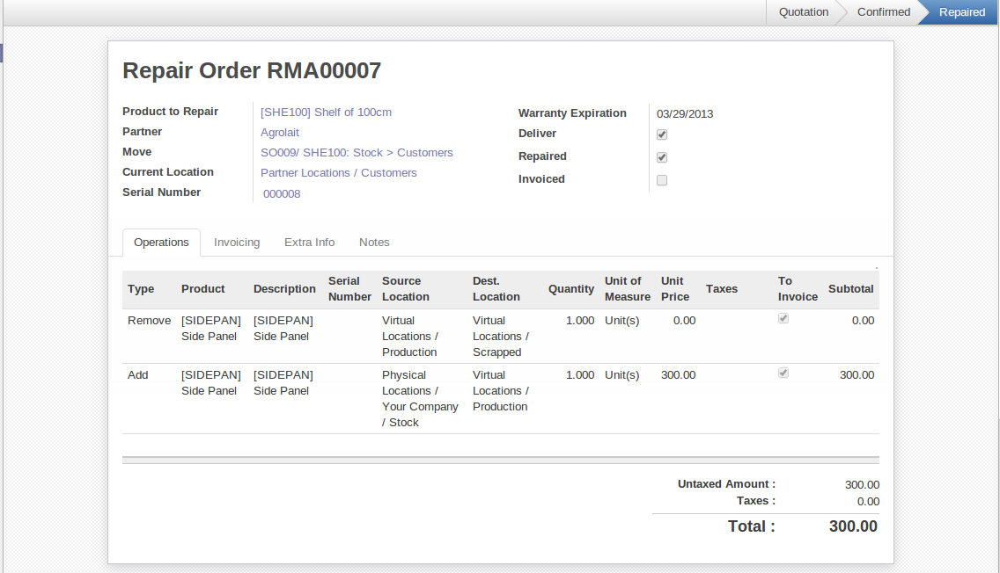

Logistics and Manufacturing
===========================

Manufacturing Stock Locations
+++++++++++++++++++++++++++++

Stock Moves linked to Manufacturing Processes
+++++++++++++++++++++++++++++++++++++++++++++

To get an overview of all stock moves, go to :menuselection:`Stock --> Production --> Stock`.

Traceability
++++++++++++

The traceability allows you to track your production lots in the system. With this functionality you can
easily know where your products are in your warehouse. In counterpart, you will be forced to mention a
number of lot to each product to be able to track it in the system.

To enable the traceability on the manufacturing process, you have to select the box :guilabel:`Track
Manufacturing Lots` in the :guilabel:`Lots` section in the product form.

In the manufacturing order, you have to mention a production lot number in order to continue the process.
You can select the production lot in the :guilabel:`Manufacturing Order` form in the second tab, called
:guilabel:`Finished Products`. You have to click on the Product to Finish you want to trace, a new open will 
open and you will find the field to link the manufacturing order to a production lot.

    
    *Tracking of a manufacturing order*

When you have linked some manufacturing orders to production lots, you can trace them in 
:menuselection:`Warehouse --> Traceability --> Production Lots`. In this view, you see the
different production lots linked to a product. If you select one lot, you will have the possibility 
to choose between :guilabel:`Upstream Traceability` or :guilabel:`Downstream Traceability`.

    
    *Choosing between Upstream and Downstream Traceability*
    
.. tip:: Traceability
    
    **Upstream Traceability**: It runs from the raw materials received from the supplier and follows 
    the chain to the finished products delivered to customers. (Note that the name is confusing - this 
    would often be considered a downstream direction. Think of it as **Where Used**.)
    
    **Downstream Traceability**: It follows the product in the other direction, from customer to the different 
    suppliers of raw material. (Note that the name is confusing - this would often be considered an upstream 
    direction. Think of it as **Where Supplied**.)

        

    
    *Upstream Traceability*

The different lines show the stock moves attached to the production of the product. There are several
stock moves that are traced due to the Bill Of Materials attached to the product *[PC1] Basic PC*.
    
        

    
    *Downstream Traceability*        

In this window, you only see the move for the finished product. It is due to the definition of the 
concept of Downstream Traceability. It only shows the flow from the customer to the supplier of raw
materials.

Managing repairs
================

.. index::
   single: module; mrp_repair

The management of repairs is carried out using the module :mod:`mrp_repair`. Once it is installed this
module adds a new :menuselection:`Manufacturing --> Manufacturing --> Repair Orders` menu under the Manufacturing menu for
creating repair jobs and reviewing repairs in progress.

In OpenERP, a repair will have the following effects:

* Use of materials: items for replacement,

* Production of products: items replaced from reserved stock,

* Quality control: tracking the reasons for repair,

* Accounting entries: following stock moves,

* Receipt and delivery of product from and to the end user,

* Adding operations that can be seen in the product's traceability,

* Invoicing items used and/or free for repairs.

Entering Data for a New Repair
++++++++++++++++++++++++++++++

Use the menu :menuselection:`Manufacturing --> Manufacturing --> Repair Orders` to enter a new repair into
the system. You will see a blank form for the repair data, as shown in the figure :ref:`fig-mrprepnew2` below.

.. _fig-mrprepnew2:

   *Entering data for a new repair*

Start by identifying the product that will be repaired using the product lot number. OpenERP then
automatically completes fields from the selected lot – the partner fields, address, delivery
location, and stock move.

If a warranty period has been defined in the product description, in months, OpenERP then completes
the field :guilabel:`Guarantee limit` with the correct warranty date.

You must then specify the components that you will be adding, replacing or removing in the operations
part. On each line, you must specify the following:

Add or remove a component of the finished product:

* `Product`,

* `Qty`,

* `UoM`,

* `Unit Price`,

* `To Invoice` or not.

Once the component has been selected, OpenERP automatically completes most of the fields:

* :guilabel:`Qty` : 1,

* :guilabel:`UoM` : unit for managing stock defined in the product form,

* :guilabel:`Unit Price` : calculated from the customer list price,

* :guilabel:`Source Location` : given by the stock management,

* :guilabel:`To Invoice` : depends on the actual date and the guarantee period.

This information is automatically proposed by the system, but you can modify it all yourself.

You can also encode additional charges in the second tab of the repair - applicable list price,
address and type of invoice, as well as additional line items that need to be added to the repair
bill.

   *Repair form, second tab*

The third tab is for encoding information about the internal notes like
picking, invoice and locations.

Repair Workflow
+++++++++++++++

A defined process handles a repair order – both the repair itself and invoicing the client. The
figure :ref:`fig-mrprepflow2` shows this repair process.

.. _fig-mrprepflow2:

   *Process for handling a repair*

Once a repair has been entered onto the system, it is in the ``Quotation`` state. In this state it has no
impact on the rest of the system. You can print a quotation from it using the action `Quotation / Order`.

You can specify the `Invoice Method` in the second tab:

* ``No Invoice``,

* ``Before Repair``,

* ``After Repair``.

You can confirm the repair operation or create an invoice for the customer depending on this state.

The repair quotation can then be sent to the customer.
Once the customer approves the repair by clicking the `Confirm Repair` button, use the menu :menuselection:`Manufacturing --> Manufacturing --> Repair Orders`
to find the confirmed repair. Click `Start Repair` to start repairing and put it into
the ``Under Repair`` state.

.. index::
   pair: invoicing; repair

Invoicing the Repair
++++++++++++++++++++

When the repair is to be invoiced, an invoice is generated in the draft state by the system. This
invoice contains the raw materials used (replaced components) and any other costs such as the time
used for the repair. These other costs are entered on the second tab of the repair form.

If the product to be repaired is still under guarantee, OpenERP automatically suggests that the
components themselves are not invoiced, but will still use any other defined costs. You can override
any of these default values when you are entering the data.

The link to the generated invoice is shown on the second tab of the repair document.

Stock Movements and Repair
++++++++++++++++++++++++++

When the repair has been carried out, OpenERP automatically carries out stock movements for
components that have been removed, added or replaced on the finished product.

The move operations are carried out using the locations shown on the first tab of the repair
document. If a destination location has been specified, OpenERP automatically handles the final
customer delivery order when the repair has been completed. This also lets you manage the delivery
of the repaired products.

For example, take the case of the cabinet that was produced at the start of this chapter. If you
have to replace the shelf PANLAT, you must enter data for the repair as shown in figure :ref:`fig-mrpreppan2`.

.. _fig-mrpreppan2:

   *Repair of a shelf in a cabinet*

In this example, you would carry out the following operations:

* Removal of a PANLAT shelf in the cabinet and put the faulty shelf in the location *Defective Products*,

* Placement of a new PANLAT shelf that has been taken from stock.

When the repair is ready to be confirmed, OpenERP will generate the following stock moves:

* Put faulty PANLAT into suitable stock location *Default Production > Defective Products*,

* Consume PANLAT: *Stock > Default production*.

If you analyze the traceability of this lot number, you will see all the repair operations in the
upstream and downstream traceability lists of the products concerned.

.. Copyright © Open Object Press. All rights reserved.

.. You may take electronic copy of this publication and distribute it if you don't
.. change the content. You can also print a copy to be read by yourself only.

.. We have contracts with different publishers in different countries to sell and
.. distribute paper or electronic based versions of this book (translated or not)
.. in bookstores. This helps to distribute and promote the OpenERP product. It
.. also helps us to create incentives to pay contributors and authors using author
.. rights of these sales.

.. Due to this, grants to translate, modify or sell this book are strictly
.. forbidden, unless Tiny SPRL (representing Open Object Press) gives you a
.. written authorisation for this.

.. Many of the designations used by manufacturers and suppliers to distinguish their
.. products are claimed as trademarks. Where those designations appear in this book,
.. and Open Object Press was aware of a trademark claim, the designations have been
.. printed in initial capitals.

.. While every precaution has been taken in the preparation of this book, the publisher
.. and the authors assume no responsibility for errors or omissions, or for damages
.. resulting from the use of the information contained herein.

.. Published by Open Object Press, Grand Rosière, Belgium
