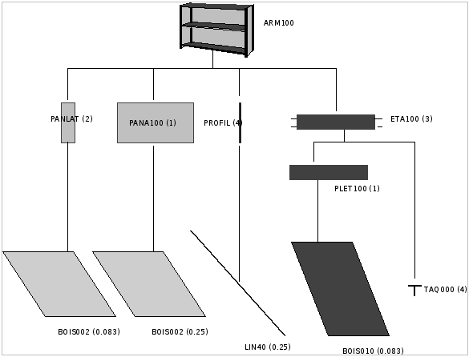
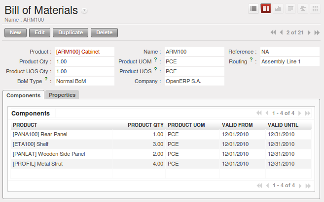
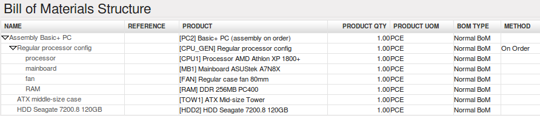
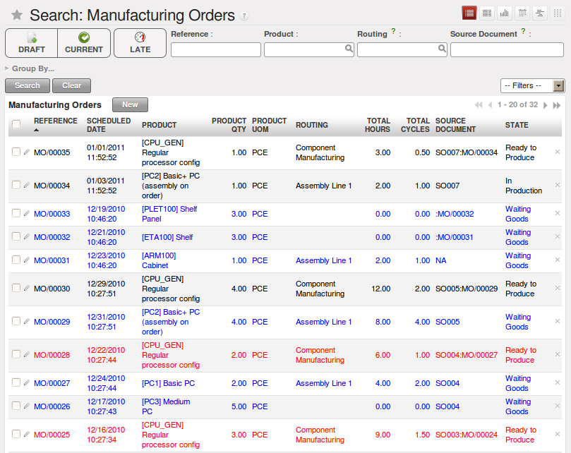
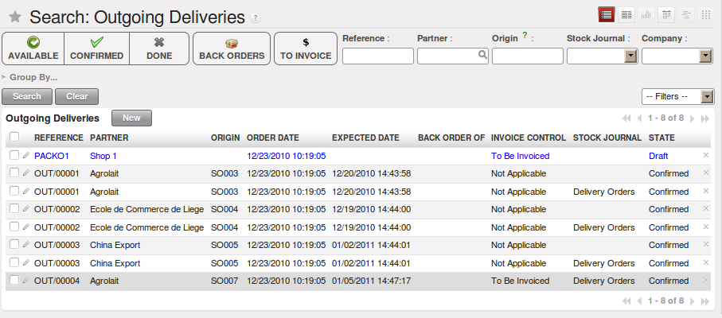
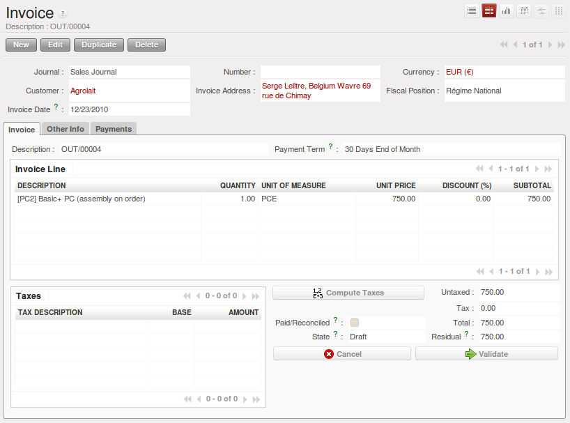
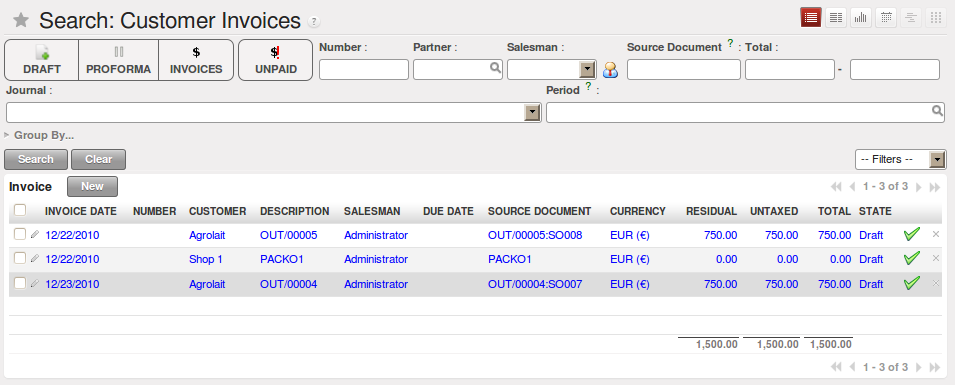
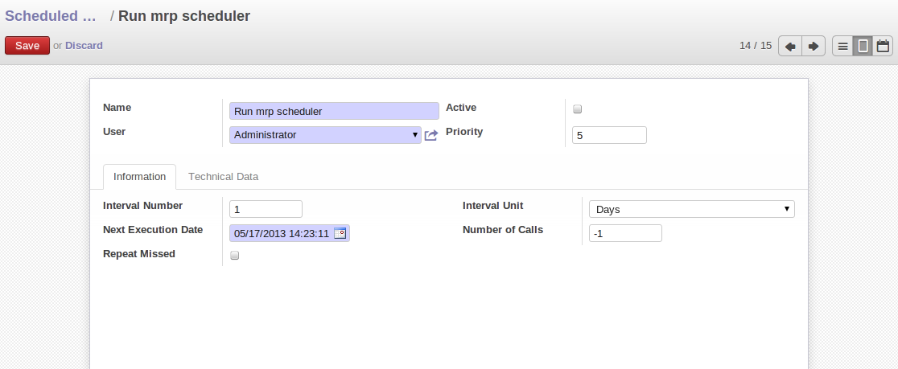

Management of Production
========================

Production Orders describe the operations that need to be carried out and the raw materials usage
for each stage of production. You use specifications (bills of materials)
to work out the raw material requirements
and the manufacturing orders needed for the finished products.

Manufacturing has the following results:

* Stock reduction: consumption of raw materials,

* Stock increase: production of finished goods,

* Analytic costs: manufacturing operations,

* Added accounting value of stock: by the creation of value following the transformation of
  products.

.. index:: BoM
.. index:: bill of materials

Bills of Materials
==================

Use of Bills of Materials
-------------------------

Bills of Materials are documents that describe the list of raw materials used to make a finished
product. To illustrate the concept of specification, you are going to work on a cabinet where the
manufacturing plan is given by the figure :ref:`fig-mrparm`.

.. _fig-mrparm:

   *Plan of construction of a cabinet*

The cabinet is assembled from raw materials and intermediate assemblies:

.. table:: Product Definitions before defining Bills of Materials

   ========== ================= =========================
   Image Code Product Reference Description
   ========== ================= =========================
   ARM100     SHE100            Cabinet
   PANLAT     SIDEPAN           Side Panel
   PANA100    RPAN100           Rear Panel SHE100
   PROFIL     PROFIL            Assembly Section
   ETA100     RCK100            Rack 100cm
   BOIS002    WOOD002           Wood 2mm
   TAQ000     METC000           Metal Cleats
   LIN40      LIN40             Wood Lintel 4m
   ========== ================= =========================

.. table:: New Products to be created before defining Bill of Materials

   ========== ================= =========================
   Image Code Product Reference Description
   ========== ================= =========================
   PLET100    SPAN100           Shelf Panel
   BOIS010    WOOD010           Wood 10mm
   ========== ================= =========================

.. tip:: To create the above products, duplicate existing ones, such as Side Panel and Wood 2mm.

To describe how to assemble this cabinet, you define a bill of materials for each intermediate
product and for the final cabinet assembly. These are given by the table below. You can start from the demo data and complete them according to the specifications below.

.. table:: Bill of Materials for 1 SHE100 Unit

   ============  ========  ===============
   Product Ref.  Quantity  Unit of Measure
   ============  ========  ===============
   SIDEPAN       2         Unit
   RPAN100       1         Unit
   PROFIL        4         Unit
   RCK100        3         Unit
   ============  ========  ===============

.. table:: Bill of Materials for 1 RCK100 Unit

   ============  ========  ===============
   Product Code  Quantity  Unit of Measure
   ============  ========  ===============
   SPAN100       1         Unit
   METC000       4         Unit
   ============  ========  ===============

.. table:: Bill of Materials for 1 SPAN100 Unit

   ============  ========  ===============
   Product Code  Quantity  Unit of Measure
   ============  ========  ===============
   WOOD010       0.083     m2
   ============  ========  ===============

.. table:: Bill of Materials for 1 PROFIL Unit

   ============  ========  ===============
   Product Code  Quantity  Unit of Measure
   ============  ========  ===============
   LIN40         0.25      m
   ============  ========  ===============

.. table:: Bill of Materials for 1 RPAN100 Unit

   ============  ========  ===============
   Product Code  Quantity  Unit of Measure
   ============  ========  ===============
   WOOD002       0.25      m2
   ============  ========  ===============

.. table:: Bill of Materials for 1 SIDEPAN Unit

   ============  ========  ===============
   Product Code  Quantity  Unit of Measure
   ============  ========  ===============
   WOOD002       0.083     m2
   ============  ========  ===============

The bills of materials are then used by the software to calculate the raw material needs based on the
requirements of the finished products. Then if you want to manufacture 10 cabinets, the system can
calculate what will be consumed:

.. table:: Total Quantities

   ============  ========================  ===============
   Product Code  Quantity                  Unit of Measure
   ============  ========================  ===============
   WOOD002       0.416 (2 * 0.083 + 0.25)   m2
   LIN40         1 (4 * 0.25)               m
   WOOD010       0.249 (0.083 * 3)          m2
   METC000       12 (3 * 4)                 Unit
   ============  ========================  ===============

.. tip:: Bill of Materials

   To see the bill of materials in tree view, use the menu :menuselection:`Manufacturing -->
   Master Data --> Bill of Materials` then select the product and click on action `Bill of Materials Structures`.

.. figure:: images/mrp_bom_tree.png
   :scale: 65
   :align: center

   *Bill of Materials structure*

Use the menu :menuselection:`Manufacturing --> Master Data --> Bill of Materials`
and click on `New` button to define a new bill of materials.

.. tip::The Different Views

    To change the view in the bill of materials you can:

    * From the list, select a bill of materials name and then click :guilabel:`Other View`,

    * From a product form, use the menu :guilabel:`Product BoM Structure` to the right.

   *Screen defining a Bill of Materials*

In the area below the bill of materials, you should set the finished product, which will be
manufactured or assembled. Once the product has been selected, OpenERP automatically completes the
name of the bill of materials and the default Unit of Measure for this product.

The type of BoM (:guilabel:`BoM Type` : ``Phantom`` or ``Normal``) and
the :guilabel:`Routing` field will be described in
more detail later in the chapter.

After this, you can select the raw materials that are used in the manufacture of the finished
product. The quantities are set out in a report based on the quantities of finished product and
the quantities needed to produce them from the bill of materials.

.. index::
   single: BoM; revisions

The second tab, :guilabel:`Revisions`, is used to set down all the changes made to the
bill of materials. After each
change you can specify a revision number and some notes on the modifications you carried out.

.. note:: Simplified View

   The `Revisions` tab is only visible if the user works in the ``Extended`` view mode
   (which means that the user must belong to the group ``Useability / Extended View`` .

.. figure:: images/mrp_bom_revision.png
   :scale: 75
   :align: center

   *Revisions of a Bill of Materials*

In the third tab, :guilabel:`Properties`, you can put a free text reference to a plan,
a sequence number that is
used to determine the priorities between bills of materials, dates between which a bill of materials
is valid, and values for rounding and product efficiency.

:guilabel:`Rounding` is used to set the smallest :guilabel:`Unit of Measure`
for expressing the quantities of the selected
product. So if you set the rounding to 1.00 you will not be able to manufacture half a piece. The
:guilabel:`Efficiency` of the product lets you indicate the percentage you lose during manufacture. This loss
can be set for the finished product or for each raw materials line. The impact of this efficiency
figure is to reserve more raw materials for manufacture than you would otherwise use just from the Bill
of Materials calculations.

The final part of the third tab lets you set some properties for the product's manufacturing
processes. These will be detailed further on in the chapter in the section on configurable products.

.. index::
   single: BoM; multi-level
   single: multi-level BoM

Multi-level Bills of Materials
==============================

In OpenERP, each line of a bill of materials may itself be a bill of materials. So you can
define BoMs with several levels. Instead of defining several BoMs for the cabinet in the figure
:ref:`fig-mrparm` you could define the single bill of materials below:

.. table:: Single Bill of Materials for 1 SHE100 Unit

   ============  ========  ===============
   Product Ref.  Quantity  Unit of Measure
   ============  ========  ===============
   SHE100        1         Unit
   SIDEPAN       2         Unit
   WOOD002       0.166     m2
   RPAN100       1         Unit
   WOOD002       0.25      m2
   PROFIL        4         Unit
   LIN40         1         m
   RCK100        3         Unit
   SPAN100       3         Unit
   WOOD010       0.249     m2
   METC000       12        Unit
   ============  ========  ===============

OpenERP behaves differently depending on whether the bill of materials is defined in several small
BoMs each on a single level or in one BoM tree-structured on several levels.

So if you select a BoM using intermediate products that automatically generates production orders
based on calculated requirements, OpenERP will propose manufacturing an intermediate product. To
manufacture a cabinet, you would create 6 production orders:

.. table:: Production Order

   ============  ========  ===============
   Product Ref.  Quantity  Unit of Measure
   ============  ========  ===============
   SPAN100       3         Unit
   WOOD010       0.249     m2
   ============  ========  ===============

.. table:: Production Order

   ============  ========  ===============
   Product Ref.  Quantity  Unit of Measure
   ============  ========  ===============
   RCK100        3         Unit
   SPAN100       3         Unit
   METC000       12        Unit
   ============  ========  ===============

.. table:: Production Order

   ============  ========  ===============
   Product Ref.  Quantity  Unit of Measure
   ============  ========  ===============
   PROFIL        4         Unit
   LIN40         1         m
   ============  ========  ===============

.. table:: Production Order

   ============  ========  ===============
   Product Ref.  Quantity  Unit of Measure
   ============  ========  ===============
   RPAN100       1         Unit
   WOOD002       0.25      m2
   ============  ========  ===============

.. table:: Production Order

   ============  ========  ===============
   Product Ref.  Quantity  Unit of Measure
   ============  ========  ===============
   PANLAT        2         Unit
   WOOD002       0.17      m2
   ============  ========  ===============

.. table:: Production Order

   ============  ========  ===============
   Product Ref.  Quantity  Unit of Measure
   ============  ========  ===============
   SHE100        1         Unit
   SIDEPAN       2         Unit
   RPAN100       1         Unit
   PROFIL        4         Unit
   RCK100        3         Unit
   ============  ========  ===============

In the case where a single bill of materials is defined in multiple levels, a single manufacturing
order will be generated for each cabinet, including all of the sub-BoMs. You would then get the
following production order:

.. table:: Single manufacture from a tree-structured BoM

   ============  ========  ===============
   Product Ref.  Quantity  Unit of Measure
   ============  ========  ===============
   SHE100        1         Unit
   WOOD002       0.17      m2
   WOOD002       0.25      m2
   LIN40         1         m
   WOOD010       0.249     m2
   METC000       12        Unit
   ============  ========  ===============

.. index::
   pair: phantom; bill of materials

Phantom Bills of Materials
--------------------------

If a finished product is defined using intermediate products that are themselves defined using other
BoMs, OpenERP will then propose the manufacture of each intermediate product. This will give
several production orders. If you only want a single production order you can define a single BoM with
several levels.

Sometimes, however, it is useful to define the intermediate product separately and not as part of a
multi-level assembly even if you do not want separate production orders for intermediate
products.

In the example, the intermediate product ``RCK100`` is used in the manufacturing of several different
cabinets. So you would want to define a unique BoM for it even if you did not want any
instances of this product to be built, nor wanted to re-write these elements in a series of
different multi-level BoMs.

If you only want a single production order for the complete cabinet, and not one for the BoM itself, you
can define the BoM line corresponding to product ``RCK100`` in the cabinet's BoM as type :guilabel:`Phantom`. Then
it will automatically put ``RCK100``'s BoM contents into the cabinet's production order even though
it is been defined as multi-level.

This way of representing the assembly is very useful because it allows you to define reusable
elements of the assembly and keep them isolated.

If you define the BoM for the ``SHE100`` cabinet in the way shown by the table below,
you will get two production orders when the order is confirmed, as shown in the tables below that.

.. table:: Definition and use of Phantom BoMs

   ============  ========  ===============  ===========
   Product Ref.  Quantity  Unit of Measure  Type of BoM
   ============  ========  ===============  ===========
   SHE100        1         Unit             normal
   SIDEPAN       2         Unit             normal
   RPAN100       1         Unit             phantom
   PROFIL        4         Unit             phantom
   RCK100        3         Unit             phantom
   ============  ========  ===============  ===========

.. table:: Production Order from Phantom BoMs

   ============  ========  ===============
   Product Ref.  Quantity  Unit of Measure
   ============  ========  ===============
   SHE100        1         Unit
   SIDEPAN       2         Unit
   WOOD002       0.25      m2
   LIN40         1         m
   WOOD010       0.249     m2
   METC000       12        Unit
   ============  ========  ===============

.. table:: Production Order from Normal BoM

   ============  ========  ===============
   Product Ref.  Quantity  Unit of Measure
   ============  ========  ===============
   SIDEPAN       2         Unit
   WOOD002       0.17      m2
   ============  ========  ===============

Bills of Materials for Kits/Sets
--------------------------------

.. note:: Sales Bills of Materials

    In other software, this is sometimes named a Sales Bill of Materials.
    In OpenERP, the term assembly is used because the effect of the bill of materials is visible not
    only in sales but also elsewhere, for example, in the intermediate manufactured products.

Kits/Sets bills of materials enable you to define assemblies that will be sold directly. These
could also be used in deliveries and stock management rather than just sold in isolation.
For example if you deliver the cabinet in pieces for self-assembly, set the ``SHE100`` BoM to type
``Sets / Phantom`` .

When a salesperson creates an order for a ``SHE100`` product, OpenERP automatically changes the ``SHE100``
from a set of components into an identifiable package for sending to a customer.
Then it asks the storesperson to pack 2 ``SIDEPAN``, 1 ``RPAN100``, 4 ``PROFIL``, 3 ``RCK100``.
This is described as a ``SHE100``, not just the individual delivered products.

Example: Large Distributor
^^^^^^^^^^^^^^^^^^^^^^^^^^

As an example of using these assemblies, take the case of a supermarket. In a supermarket, you can
buy bottles of cola individually or in a pack of 6 bottles. The pack and the bottles are two
different products and the barcodes used are also different.

But customers have the right to open a pack and extract some bottles to take them
individually to the checkout. The supermarket cannot track its stock in packs and bottles any more, but
only individually in bottles.

So you can define a bill of materials for sale which defines a pack as an assembly of 6 bottles.
Then when you have sold a pack, you can find a pack on the invoice or bill of sales but the associated
stock operation will still be 6 bottles.

In the case of this assembly, this is not a production order to transform the product. The
transformation is done directly between the order and the set.

.. note:: Assemblies and Purchases

   The use of assemblies for selling to customers has been described here, but this functionality
   works just as well for purchases from suppliers.

   So in the example of a supermarket, you can buy cola in packs and the storesperson will see a
   number of bottles at goods in reception.

Configurable Bills of Materials
-------------------------------

In OpenERP, you can define several bills of materials for the same product. In fact, you can have
several manufacturing methods or several approved raw materials for a given product. You will see in
the following section that the manufacturing procedure (the routing) is attached to the Bill of
Materials, so the choice of bill of materials implicitly includes the operations to make it.

Once several bills of materials have been defined for a particular product, you need to have a
system to enable OpenERP to select one of them for use. By default, the bill of materials with the
lowest sequence number is selected by the system.

To gain more control over the process during the sale or procurement, you can use **properties**.
The menu :menuselection:`Manufacturing --> Configuration --> Master Bill of Materials --> Properties` enables you to
define properties, which can be defined arbitrarily to help you select a
bill of materials when you have a choice of BoMs.

.. note:: Properties

   Properties is a concept that enables the selection of a method for manufacturing a product.
   Properties define a common language between salespeople and technical people,
   letting the salespeople to have an influence on the manufacture of the products using
   non-technical language and the choices decided on by the technicians who define Bills
   of Materials.

For example, you can define the properties and the following groups:

.. table:: Properties

   =====================  ============
   Property Group         Property
   =====================  ============
   Warranty               3 years
   Warranty               1 year
   Method of Manufacture  Serial
   Method of Manufacture  Batch
   =====================  ============

Once the bills of materials have been defined, you could associate the corresponding properties to them. Then
when the salesperson goes to encode a product line he can attach the properties there. If the
product must be manufactured, OpenERP will automatically choose the bill of materials that matches
the defined properties in the order most closely.

Note that the properties are only visible in the Bills of Materials and Sales Management if you are
working in the ``Extended`` view mode. If you cannot see it on your screen, add the group ``Useability /
Extended View`` to your user.

.. figure:: images/sale_line_property.png
   :scale: 75
   :align: center

   *Properties on a customer order line*

Example: Manufacturing in a Batch or on a Production Line

As an example, take the manufacture of the cabinet presented above. You can imagine that the company
has two methods of manufacturing this cabinet:

* Manually: staff assemble the cabinets one by one and cut the wood plank by plank. This approach is
  usually used to assemble prototypes. It gets you very rapid production, but at a high cost and
  only in small quantities.

* On a production line: staff use machines that are capable of cutting wood by bandsaw. This method
  is used for production runs of at least 50 items because the lead times using this method are quite
  lengthy. The delay of the start of production is much longer, yet the cost per unit is much lower
  in this volume.

You define two bills of materials for the same cabinet. To distinguish between them, you will define
two properties in the same group: ``manual assembly`` and ``production line assembly`` . On the quotation, the
salesperson can set the method of manufacture he wants on each order line,
depending on the quantities and the lead time requested by the customer.

.. index::
   single: BoM, substitute products

.. note:: Bills of Materials and Substitute Products

    In some software, you use the term ``substitute`` for this principle of configurable properties in
    a bill of materials.

By putting a bill of materials on its own line, you can also implement substitute products. You set
the bill of materials to type ``Assembly`` to make the substitution transparent and to prevent OpenERP
from proposing an intermediate production order.

Manufacturing
=============

Once the bills of materials have been defined, OpenERP becomes capable of automatically deciding on
the manufacturing route depending on the needs of the company.

Production orders can be proposed automatically by the system depending on several criteria
described in the preceding chapter:

* Using the ``Make to Order`` rules,

* Using the ``Order Point`` rules,

* Using the Production plan.

Clearly, it is also possible to start production manually. To do this you can use the menu
:menuselection:`Manufacturing --> Manufacturing --> Manufacturing Orders`.

   *Manufacturing Order*

.. index::
   single: module; mrp_jit

If you have not installed the Just-In-Time planning module :mod:`mrp_jit`, you should start
using OpenERP to schedule the Production Orders automatically using the
various system rules. To do this, use the menu :menuselection:`Warehouse --> Schedulers --> Compute Schedulers`.

Workflow for Complete Production
================================

To understand the usefulness and the functioning of the system, you should test a complete workflow
on the new database installed with the demonstration data. In the order you can see:

* The creation of a customer order,

* The manufacturing workflow for an intermediate product,

* The manufacture of an ordered product,

* The delivery of products to a customer,

* Invoicing at the end of the month,

* Traceability for after-sales service.

.. tip:: Demonstration Data

    To follow the workflow shown below exactly, you should keep the same quantities as in the
    example and start from a new database. Then you will not run into exceptions that would result
    from a lack of stock.

This more advanced case of handling problems in procurement, will be sorted out later in the
chapter.

The Customer Order
------------------

.. index:: quotation

Begin by encoding a customer order. To do this, use the menu :menuselection:`Sales -->
Sales --> Sales Order`. Enter the following information:

* :guilabel:`Customer` : ``Agrolait``,

* :guilabel:`Shipping Policy` : ``Invoice from the Picking`` (second tab),

* :guilabel:`Order Line` :

  * :guilabel:`Product` : ``PC2 – Basic PC (assemble on demand)``,

  * :guilabel:`Quantity (UoM)` : ``1``,

  * :guilabel:`Product UoM` : ``PCE``,

  * :guilabel:`Procurement method` : ``On Order``.

Once the quotation has been entered, you can confirm it immediately by clicking the button
:guilabel:`Confirm Order` at the bottom to the right. The manufacturing order is then automatically generated.

   *Automatically generated manufacturing orders from sale order*

Keep note of the order reference because it will be used throughout the process.
Usually, in a new database, this will be ``SO007`` . At this stage
you can look at the process linked to your order using the :guilabel:`Process` button above and to the right
of the form.

   *Process for handling Sales Order SO007*

Start the requirements calculation using the menu :menuselection:`Warehouse --> Schedulers --> Compute Schedulers`.

.. index::
   single: semi-finished product

Producing an Intermediate Product
---------------------------------

To understand the implications of requirements calculation, you must know the configuration of the
sold product. To do this, go to the form for product PC2 and click on the link :guilabel:`Bill of
Materials` to the right. You get the scheme shown in :ref:`fig-mrpbomtree` which is the composition
of the selected product.

.. _fig-mrpbomtree:

   *Structure of BoM for product PC2*

Manufacturing the PC2 computer must be done in two steps:

1: Manufacture of the intermediate product: CPU_GEN

2: Manufacture of the finished product using that intermediate products: PC2

The manufacturing supervisor can then consult the manufacturing orders using the menu
:menuselection:`Manufacturing --> Manufacturing --> Manufacturing Orders`. You then get a
list of orders to start and the estimated start date to meet the ordered customer delivery date.

   *List of manufacturing orders*

You will see the production order for PC2 (MO/00034) and also CPU_GEN (MO/00034) because PC2 depends on an
intermediate product CPU_GEN. Return to the production order for CPU_GEN. If there are
several of them, select the one corresponding to your order using the reference that contains your
order number (in this example ``SO007:MO/00034`` ).

   *The detail of a manufacturing order for product CPU_GEN*

The system shows you that you must manufacture product CPU_GEN using the components: CPU1, MB1, FAN,
RAM. You can then confirm the production twice:

Start of production: consumption of raw materials,

End of production: manufacture of finished product.

At this stage, you should click to edit the line for the product MB1 to enter a lot number for it.
The lot number is usually shown in the parent chart, so you should just copy that over. To do that, put
the cursor in the field :guilabel:`Production Lot` and press :kbd:`<F1>` to create a new lot. Set a lot
reference, for example: ``MO:PL/0000001`` . The system may then show you a warning because this lot is not in
stock, but you can ignore this message.

The production order must be in the closed state as shown in the figure :ref:`fig-mrpprdfrm`.

.. _fig-mrpprdfrm:

   *Production order after the different stages*

Manufacturing a Finished Product
--------------------------------

Having manufactured the intermediate product CPU_GEN, OpenERP automatically proposes the
manufacturing of the computer PC2 using the order created earlier. So return to the menu for
production orders to start :menuselection:`Manufacturing --> Manufacturing --> Manufacturing Orders`.

You will find computer PC2 which has been sold to the customer,
as shown in the figure :ref:`fig-mrpprdlis`.

.. _fig-mrpprdlis:

.. figure:: images/mrp_production_list_end.png
   :scale: 75
   :align: center

   *Complete the production of PC2*

Just as for product CPU_GEN, confirm the production order between two dates: start of production and end
of production.

.. todo:: Between two dates? What does that mean?

The product sold to the customer has now been manufactured and the raw materials have been
consumed and taken out of stock.

.. tip:: Automatic Actions

    As well as managing the use of materials and the production of stocks,
    manufacturing can have the following automatic effects which are detailed further on in the
    chapter:

    * adding value to stock,

    * generating operations for assembly staff,

    * automatically creating analytical accounting entries.

Delivery of Product to the Customer
-----------------------------------

.. index::
   single: picking
   single: packing

When the products have been manufactured, the storesperson automatically finds the order in his
list of items to do. To see the items awaiting picking, use the menu :menuselection:`Warehouse --> Warehouse Management --> Delivery Orders`.
You will find lists of pickings to be done, as shown in the figure :ref:`fig-mrppacko`.

.. _fig-mrppacko:

   *List of picking operations to be done*

The picking orders are presented in priority order of despatch
so the storesperson must begin with the orders
at the top of the list. Confirm that your picking list has been created by looking for the customer
name ( ``Agrolait`` ) or by its reference ( ``SO007`` ).

.. tip:: Picking and Delivery

    Depending on whether you work in the ``Simplified`` or ``Extended`` mode you may need a further
    step to make a delivery to your customer, so you would have to carry out the two steps:

    * picking list,

    * delivery order.

.. index::
   single: invoicing; at delivery

Invoicing at Delivery
---------------------

Periodically the administrator or an accountant can send invoices based on the deliveries that have
been carried out. To do that, you can use the menu :menuselection:`Warehouse --> Warehouse Management --> Outgoing Deliveries`.
You then get a list of all the deliveries that have been made but
have not yet been invoiced.

So select some or all of the deliveries. Click the action :guilabel:`Create Invoice`. OpenERP asks
if you want to group the deliveries from the same partner into a single invoice or if you would prefer to
invoice each delivery individually.

   *Invoicing of deliveries*

Invoices are generated automatically in the ``Draft`` state by OpenERP.
You can modify invoices before finally approving them.

   *List of invoices generated by the system based on deliveries*

Once you have reviewed the different invoices that were generated, you can confirm them one by one
or all at once by using the available actions. Then print the invoices using the multiple print
option and send them to your customers by post.

Traceability
------------

Now suppose that the customer phones you to tell you about a production fault in a delivered
product. You can consult the traceability through the whole manufacturing chain using the
serial number indicated on the product MB1. To look through the detailed history, use the menu
:menuselection:`Warehouse --> Traceability --> Production Lots`.

Find the product corresponding to the product or lot number. Once it is been found you can use
traceability as described in the section :ref:`sect-lotmgt` in the :ref:`ch-stocks` chapter.

.. index::
   single: manufacturing order
   single: production order
   single: order; manufacturing
   single: order; production

Production Order in Detail
==========================

To open a Production Order, use the menu
:menuselection:`Manufacturing --> Manufacturing --> Manufacturing Orders` and click on `New` button.
You get a blank form for entering a new production order as shown in the figure :ref:`fig-mrpprdnew`.

.. _fig-mrpprdnew:

.. figure:: images/mrp_production_new.png
   :scale: 75
   :align: center

   *New production order*

The production order follows the process given by the figure :ref:`fig-mrpprdproc`.

.. _fig-mrpprdproc:

.. figure:: images/mrp_production_processus.png
   :scale: 75
   :align: center

   *Process for handling a production order*

The `Scheduled date` , `Product Qty` and `Reference`, are automatically completed when the form is first opened.
Enter the product that you want to produce, and the quantity required. The :guilabel:`Product UOM` by
default is completed automatically by OpenERP when the product is first selected.

You then have to set two locations:

The location from which the required raw materials should be found, and

The location for depositing the finished products.

For simplicity, put the ``Stock`` location in both places. The field :guilabel:`Bill of Materials` will
automatically be completed by OpenERP when you select the product.  You
can then overwrite it with another BoM to specify something else to use for this specific
manufacture, then click the button :guilabel:`Compute Data`.

The tabs :guilabel:`Scheduled Products` and :guilabel:`Work Orders` are also completed automatically when you click
:guilabel:`Compute Data`. You will find the raw materials there that are required for
the production and the operations needed by the assembly staff.

If you want to start production, click the button :guilabel:`Confirm Production`, and OpenERP then
automatically completes the :guilabel:`Products to Consume` field in the :guilabel:`Consumed Products` tab and
:guilabel:`Products to Finish` field in :guilabel:`Finished Products` tab.

The information in the :guilabel:`Consumed Products` tab can be changed if:

* you want to enter a serial number for raw materials,

* you want to change the quantities consumed (lost during production).

For traceability, you can set lot numbers on the raw materials used, or on the finished
products.
Note the :guilabel:`Production Lot` and :guilabel:`Pack` numbers.

Once the order is confirmed, you should force the reservation of materials
using the :guilabel:`Force Reservation` button. This means that you do not have
to wait for the scheduler to assign and reserve the raw materials from your stock for this
production run. This shortens the procurement process.

If you do not want to change the priorities, just
leave the production order in this state and the scheduler will create a plan based on the priority
and your planned date.

.. todo:: Report that State is not shown on a Production Order

To start the production of products, click :guilabel:`Start Production`. The raw materials are then
consumed automatically from stock, which means that the draft ( ``Waiting`` ) movements become ``Done`` .

Once the production is complete, click :guilabel:`Produce`. The finished products are
then moved into stock.

.. index::
   single: scheduler
   single: requirements planning

Scheduling
==========

The requirements scheduler is the calculation engine which plans and prioritises production
and purchasing automatically from the rules defined on these products. It is started once
per day. You can also start it manually using the menu :menuselection:`Warehouse --> Schedulers --> Compute Schedulers`.
This uses all the relevant parameters defined in the products, the suppliers and the company
to determine the priorities between the different production orders, deliveries and supplier
purchases.

You can set the starting time by modifying the corresponding action in the menu
:menuselection:`Administration --> Configuration --> Scheduler --> Scheduled Actions`. Modify the
``Run mrp Scheduler`` configuration document.

   *Configuring the start time for calculating requirements*

.. tip::  Calculating Requirements / Scheduling

    Scheduling only validates procurements that are confirmed but not yet started. These procurement reservations
    will themselves start production, tasks or purchases depending on the configuration of the
    requested product.

You take account of the priority of operations in starting reservations and procurements.
The urgent requests, or those with a date in the past, or those with a date earlier than the others will be
started first so that if there are not enough products in stock to satisfy all the requests, the
most urgent will be produced first.

.. Copyright © Open Object Press. All rights reserved.

.. You may take electronic copy of this publication and distribute it if you don't
.. change the content. You can also print a copy to be read by yourself only.

.. We have contracts with different publishers in different countries to sell and
.. distribute paper or electronic based versions of this book (translated or not)
.. in bookstores. This helps to distribute and promote the OpenERP product. It
.. also helps us to create incentives to pay contributors and authors using author
.. rights of these sales.

.. Due to this, grants to translate, modify or sell this book are strictly
.. forbidden, unless Tiny SPRL (representing Open Object Press) gives you a
.. written authorisation for this.

.. Many of the designations used by manufacturers and suppliers to distinguish their
.. products are claimed as trademarks. Where those designations appear in this book,
.. and Open Object Press was aware of a trademark claim, the designations have been
.. printed in initial capitals.

.. While every precaution has been taken in the preparation of this book, the publisher
.. and the authors assume no responsibility for errors or omissions, or for damages
.. resulting from the use of the information contained herein.

.. Published by Open Object Press, Grand Rosière, Belgium
