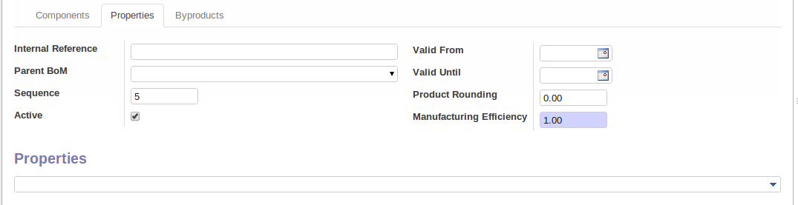
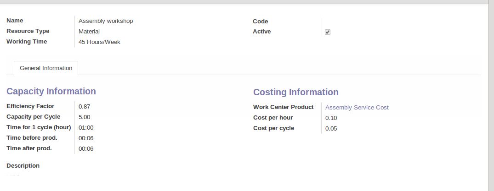

Master Data
===========

Bill Of Materials and Components
++++++++++++++++++++++++++++++++

Use of Bills of Materials
-------------------------

Bills of Materials are documents that describe the list of raw materials used to make a finished
product. To illustrate the concept of specification, you are going to work on a cabinet where the
manufacturing plan is given by the figure :ref:`fig-mrparm2`.

.. _fig-mrparm2:

.. figure:: images/mrp_armoire.png
   :scale: 75
   :align: center

   *Plan of Construction of a Cabinet*

The cabinet is assembled from raw materials and intermediate assemblies. The Image Code refers to the picture, the Product Reference is the corresponding code in OpenERP.

.. table:: Product Definitions before defining Bills of Materials (already defined)

   ========== ================= =========================
   Image Code Product Reference Description
   ========== ================= =========================
   ARM100     SHE100            Cabinet
   PANLAT     SIDEPAN           Side Panel
   PANA100    RPAN100           Rear Panel SHE100
   PROFIL     PROFIL            Assembly Section
   ETA100     RCK100            Rack 100cm
   BOIS002    WOOD002           Wood 2mm
   TAQ000     METC000           Metal Cleats
   LIN40      LIN40             Wood Lintel 4m
   ========== ================= =========================

.. table:: New Products to be created before defining Bill of Materials

   ========== ================= =========================
   Image Code Product Reference Description
   ========== ================= =========================
   PLET100    SPAN100           Shelf Panel
   BOIS010    WOOD010           Wood 10mm
   ========== ================= =========================

.. tip:: Copy

        To create the above products, duplicate existing ones, such as Side Panel and Wood 2mm.

To describe how to assemble this cabinet, you define a bill of materials for each intermediate
product and for the final cabinet assembly. These are given by the table below. You can start from the demo data and complete them according to the specifications below.

.. table:: Bill of Materials for 1 SHE100 Unit (already defined)

   ============  ========  ===============
   Product Ref.  Quantity  Unit of Measure
   ============  ========  ===============
   SIDEPAN       2         Unit
   RPAN100       1         Unit
   PROFIL        4         Unit
   RCK100        3         Unit
   ============  ========  ===============

.. table:: Bill of Materials for 1 RCK100 Unit

   ============  ========  ===============
   Product Code  Quantity  Unit of Measure
   ============  ========  ===============
   SPAN100       1         Unit
   METC000       4         Unit
   ============  ========  ===============

.. table:: Bill of Materials for 1 SPAN100 Unit

   ============  ========  ===============
   Product Code  Quantity  Unit of Measure
   ============  ========  ===============
   WOOD010       0.083     m2
   ============  ========  ===============

.. table:: Bill of Materials for 1 PROFIL Unit

   ============  ========  ===============
   Product Code  Quantity  Unit of Measure
   ============  ========  ===============
   LIN40         0.25      m
   ============  ========  ===============

.. table:: Bill of Materials for 1 RPAN100 Unit

   ============  ========  ===============
   Product Code  Quantity  Unit of Measure
   ============  ========  ===============
   WOOD002       0.25      m2
   ============  ========  ===============

.. table:: Bill of Materials for 1 SIDEPAN Unit

   ============  ========  ===============
   Product Code  Quantity  Unit of Measure
   ============  ========  ===============
   WOOD002       0.083     m2
   ============  ========  ===============

The bills of materials are then used by the software to calculate the raw material needs based on the
requirements of the finished products. Then if you want to manufacture 10 cabinets, the system can
calculate what will be consumed:

.. table:: Total Quantities per cabinet

   ============  ========================  ===============
   Product Code  Quantity                  Unit of Measure
   ============  ========================  ===============
   WOOD002       0.416 (2 * 0.083 + 0.25)   m2
   LIN40         1 (4 * 0.25)               m
   WOOD010       0.249 (0.083 * 3)          m2
   METC000       12 (3 * 4)                 Unit
   ============  ========================  ===============

.. tip:: Bill of Materials

   To see the bill of materials in tree view, use the menu :menuselection:`Manufacturing -->
   Master Data --> Bill of Materials` then select the product and click on action `Bill of Materials Structures`.

   *Bill of Materials structure*

Use the menu :menuselection:`Manufacturing --> Master Data --> Bill of Materials`
and click on `New` button to define a new bill of materials.

.. tip::The Different Views

    To change the view in the bill of materials you can:

    * From the list, select a bill of materials name and then click :guilabel:`Other View`,

    * From a product form, use the menu :guilabel:`Product BoM Structure` to the right.

.. figure:: images/mrp_bom.png
   :scale: 75
   :align: center

   *Screen defining a Bill of Materials (Simplified view)*

In the area below the bill of materials, you should set the finished product, which will be
manufactured or assembled. Once the product has been selected, OpenERP automatically completes the
name of the bill of materials and the default Unit of Measure for this product.

The type of BoM (:guilabel:`BoM Type` : ``Phantom`` or ``Normal``) and
the :guilabel:`Routing` field will be described in
more detail later in the chapter.

After this, you can select the raw materials that are used in the manufacture of the finished
product. The quantities are set out in a report based on the quantities of finished product and
the quantities needed to produce them from the bill of materials.

.. index::
   single: BoM; revisions

The second tab, :guilabel:`Revisions`, is used to set down all the changes made to the
bill of materials. After each
change you can specify a revision number and some notes on the modifications you carried out.

.. note:: Simplified View

   The `Revisions` tab is only visible if the user works in the ``Extended`` view mode
   (which means that the user must belong to the group ``Useability / Extended View`` .

   *Revisions of a Bill of Materials (Extended view)*

In the third tab, :guilabel:`Properties`, you can put a free text reference to a plan,
a sequence number that is
used to determine the priorities between bills of materials, dates between which a bill of materials
is valid, and values for rounding and product efficiency.

   *Properties of a Bill of Materials*

:guilabel:`Rounding` is used to set the smallest :guilabel:`Unit of Measure`
for expressing the quantities of the selected
product. So if you set the rounding to 1.00 you will not be able to manufacture half a piece. The
:guilabel:`Efficiency` of the product lets you indicate the percentage you lose during manufacture. This loss
can be set for the finished product or for each raw materials line. The impact of this efficiency
figure is to reserve more raw materials for manufacture than you would otherwise use just from the Bill
of Materials calculations.

The final part of the third tab lets you set some properties for the product's manufacturing
processes. These will be detailed further on in the chapter in the section on configurable products.

.. index::
   single: BoM; multi-level
   single: multi-level BoM

Multi-level Bills of Materials
------------------------------

In OpenERP, each line of a bill of materials may itself be a bill of materials. So you can
define BoMs with several levels. Instead of defining several BoMs for the cabinet in the figure
:ref:`fig-mrparm2` you could define the single bill of materials below:

.. table:: Single Bill of Materials for 1 SHE100 Unit

   ============  ========  ===============
   Product Ref.  Quantity  Unit of Measure
   ============  ========  ===============
   SHE100        1         Unit
   SIDEPAN       2         Unit
   WOOD002       0.166     m2
   RPAN100       1         Unit
   WOOD002       0.25      m2
   PROFIL        4         Unit
   LIN40         1         m
   RCK100        3         Unit
   SPAN100       3         Unit
   WOOD010       0.249     m2
   METC000       12        Unit
   ============  ========  ===============

OpenERP behaves differently depending on whether the bill of materials is defined in several small
BoMs each on a single level or in one BoM tree-structured on several levels.

So if you select a BoM using intermediate products that automatically generates production orders
based on calculated requirements, OpenERP will propose manufacturing an intermediate product. To
manufacture a cabinet, you would create 6 production orders:

.. table:: Production Order

   ============  ========  ===============
   Product Ref.  Quantity  Unit of Measure
   ============  ========  ===============
   SPAN100       3         Unit
   WOOD010       0.249     m2
   ============  ========  ===============

.. table:: Production Order

   ============  ========  ===============
   Product Ref.  Quantity  Unit of Measure
   ============  ========  ===============
   RCK100        3         Unit
   SPAN100       3         Unit
   METC000       12        Unit
   ============  ========  ===============

.. table:: Production Order

   ============  ========  ===============
   Product Ref.  Quantity  Unit of Measure
   ============  ========  ===============
   PROFIL        4         Unit
   LIN40         1         m
   ============  ========  ===============

.. table:: Production Order

   ============  ========  ===============
   Product Ref.  Quantity  Unit of Measure
   ============  ========  ===============
   RPAN100       1         Unit
   WOOD002       0.25      m2
   ============  ========  ===============

.. table:: Production Order

   ============  ========  ===============
   Product Ref.  Quantity  Unit of Measure
   ============  ========  ===============
   PANLAT        2         Unit
   WOOD002       0.17      m2
   ============  ========  ===============

.. table:: Production Order

   ============  ========  ===============
   Product Ref.  Quantity  Unit of Measure
   ============  ========  ===============
   SHE100        1         Unit
   SIDEPAN       2         Unit
   RPAN100       1         Unit
   PROFIL        4         Unit
   RCK100        3         Unit
   ============  ========  ===============

In the case where a single bill of materials is defined in multiple levels, a single manufacturing
order will be generated for each cabinet, including all of the sub-BoMs. You would then get the
following production order:

.. table:: Single manufacture from a tree-structured BoM

   ============  ========  ===============
   Product Ref.  Quantity  Unit of Measure
   ============  ========  ===============
   SHE100        1         Unit
   WOOD002       0.17      m2
   WOOD002       0.25      m2
   LIN40         1         m
   WOOD010       0.249     m2
   METC000       12        Unit
   ============  ========  ===============

.. index::
   pair: phantom; bill of materials

Phantom Bills of Materials
--------------------------

If a finished product is defined using intermediate products that are themselves defined using other
BoMs, OpenERP will then propose the manufacture of each intermediate product. This will give
several production orders. If you only want a single production order you can define a single BoM with
several levels.

Sometimes, however, it is useful to define the intermediate product separately and not as part of a
multi-level assembly even if you do not want separate production orders for intermediate
products.

In the example, the intermediate product ``RCK100`` is used in the manufacturing of several different
cabinets. So you would want to define a unique BoM for it even if you did not want any
instances of this product to be built, nor wanted to re-write these elements in a series of
different multi-level BoMs.

If you only want a single production order for the complete cabinet, and not one for the BoM itself, you
can define the BoM line corresponding to product ``RCK100`` in the cabinet's BoM as type :guilabel:`Phantom`. Then
it will automatically put ``RCK100``'s BoM contents into the cabinet's production order even though
it is been defined as multi-level.

This way of representing the assembly is very useful because it allows you to define reusable
elements of the assembly and keep them isolated.

If you define the BoM for the ``SHE100`` cabinet in the way shown by the table below,
you will get two production orders when the order is confirmed, as shown in the tables below that.

.. table:: Definition and use of Phantom BoMs

   ============  ========  ===============  ===========
   Product Ref.  Quantity  Unit of Measure  Type of BoM
   ============  ========  ===============  ===========
   SHE100        1         Unit             normal
   SIDEPAN       2         Unit             normal
   RPAN100       1         Unit             phantom
   PROFIL        4         Unit             phantom
   RCK100        3         Unit             phantom
   ============  ========  ===============  ===========

.. table:: Production Order from Phantom BoMs

   ============  ========  ===============
   Product Ref.  Quantity  Unit of Measure
   ============  ========  ===============
   SHE100        1         Unit
   SIDEPAN       2         Unit
   WOOD002       0.25      m2
   LIN40         1         m
   WOOD010       0.249     m2
   METC000       12        Unit
   ============  ========  ===============

.. table:: Production Order from Normal BoM

   ============  ========  ===============
   Product Ref.  Quantity  Unit of Measure
   ============  ========  ===============
   SIDEPAN       2         Unit
   WOOD002       0.17      m2
   ============  ========  ===============

Bills of Materials for Kits/Sets
--------------------------------

.. note:: Sales Bills of Materials

    In other software, this is sometimes named a Sales Bill of Materials.
    In OpenERP, the term assembly is used because the effect of the bill of materials is visible not
    only in sales but also elsewhere, for example, in the intermediate manufactured products.

Kits/Sets bills of materials enable you to define assemblies that will be sold directly. These
could also be used in deliveries and stock management rather than just sold in isolation.
For example if you deliver the cabinet in pieces for self-assembly, set the ``SHE100`` BoM to type
``Sets / Phantom`` .

When a salesperson creates an order for a ``SHE100`` product, OpenERP automatically changes the ``SHE100``
from a set of components into an identifiable package for sending to a customer.
Then it asks the storesperson to pack 2 ``SIDEPAN``, 1 ``RPAN100``, 4 ``PROFIL``, 3 ``RCK100``.
This is described as a ``SHE100``, not just the individual delivered products.

Workcenters
+++++++++++

Workcenters represent units of product, capable of doing material transformation operations. You can
distinguish two types of workcenters: machines and human resources.

.. note:: Workcenter

    Workcenters are units of manufacture consisting of one or several people and/or machines
    that can be considered as a unit for the purposes of forecasting capacity and planning.

Use the menu :menuselection:`Manufacturing --> Configuration --> Resources --> Work Centers` to define a new
workcenter. You get a form as shown in the figure :ref:`fig-mrpwkc2`.

.. _fig-mrpwkc2:

   *Definition of a workcenter*
   
.. tip:: Missing fields
	
	If some fields such as :guilabel:`Analytic Journal, General Account` in the view are missing, you have
	to install the module `analytic_account`

A workcenter must have a name. You then assign a type: machine, human resource, tool, a code and
a description of operating hours or functionality. The figure :ref:`fig-mrpwkc2` represents the hours from Monday
to Friday, from 08:00 to 18:00 with a break of an hour from 12:00.

You should show a description of the workcenter and its operations.

Once the database is encoded you should enter data about the production capacity of the workcenter.
Depending on whether you have a machine or a person, a workcenter will be defined in cycles or
hours. If it represents a set of machines and people you can use both cycles and hours at the same
time.

.. index::
   single: workcenter, cycle

.. note:: A Cycle

    A cycle corresponds to the time required to carry out an assembly operation.
    The user is free to determine which is the reference operation for a given workcenter.
    It must be represented by the cost and elapsed time of manufacture.

    For example, for a printing workcenter, a cycle will be the printing of 1 page or of 1000 pages
    depending on the printer.

To define the capacity properly it is necessary to know, for each workcenter, what will be the
reference operation which determines the cycle. You can then define the data relative
to the capacity.

`Capacity per Cycle` (CA) : determine the number of operations that can be done in parallel during a
cycle. Generally, the number defines the number of identical machines or people defined by the
workcenter.

`Time for 1 cycle (hour)` (TC) : give the duration in hours for that or the operations defined by a cycle.

`Time before production` (TS) : give the wait in hours to initialize production operations. Generally,
this represents the machine setup time.

`Time after production` (TN) : give the delay in hours after the end of a production operation.
Generally, this represents the cleaning time necessary after an operation.

`Efficiency factor`  (ET) : is a factor that is applied to the three times above to determine the real
production time. This factor enables you to readjust the different times progressively and as a
measure of machine utilization. You cannot readjust the other times because generally they are taken
from the machine's data sheet.

The total time for carrying out X operations is then given by the following formula:

((C / CA) * TC + TS + TN ) * ET

In this formula the result of the division is rounded upwards. Then, if the
capacity per cycle is 6, it takes 3 cycles to realize 15 operations.

.. tip:: Multi-level Routing

   It is possible to define routing on several levels to support multi-level bills of materials.
   You can select the routing on each level of a bill of materials.
   The levels are then linked to hierarchies of bills of materials.

The `Hour Account` and `Cycle Account` lets you define the links to analytical account to report the
costs of the workcenter operations. If you leave the different fields empty, it will not have any
effect on the analytic accounts.

Routings
++++++++

Routings define the assembly operations to be done in workcenters for manufacturing a certain
product. They are usually attached to bills of materials which will define the assembly of products
required for manufacture or for finished products.

A routing can be defined directly in a bill of materials or through the menu
:menuselection:`Manufacturing --> Configuration --> Master Bill of Materials --> Routings`. A routing has a name, a code and a
description. Later in this chapter you will see that a routing can also be associated with a stock
location. That enables you to indicate where assembly takes place.

.. figure:: images/mrp_routing.png
   :scale: 75
   :align: center

   *Definition of a routing with three operations*

.. note:: Subcontracting Assembly

    You will see further on in this chapter that it is possible to link a routing and a stock location
    for the customer or the supplier.
    You do this after you have subcontracted the assembly of a product to a supplier, for example.

In the routing you must show the list of operations that must be done. Each operation must be done
at a workcenter and possess a number of hours and/or cycles be done.

