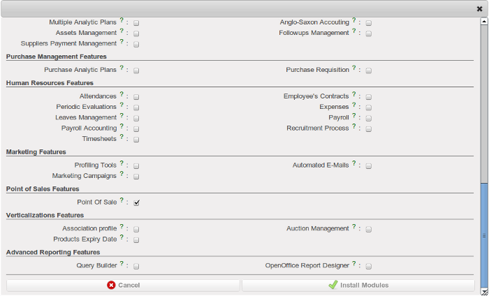
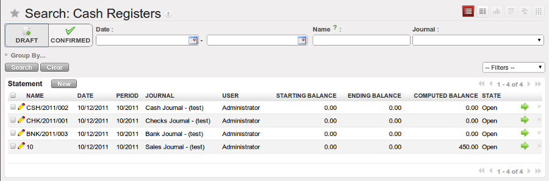
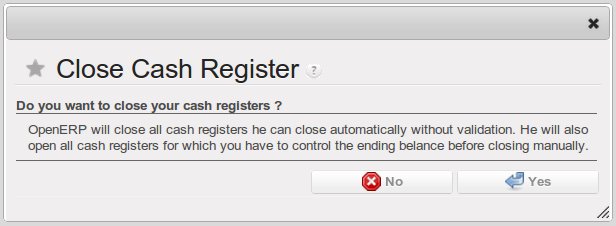
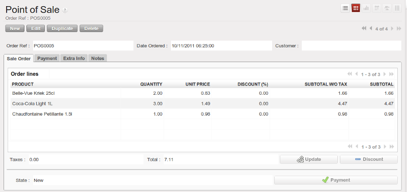
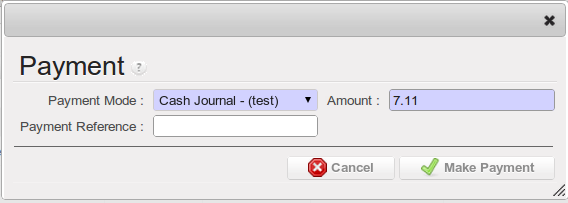
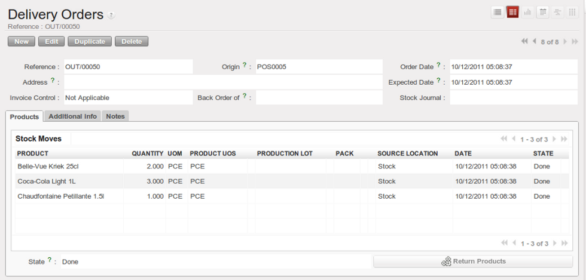
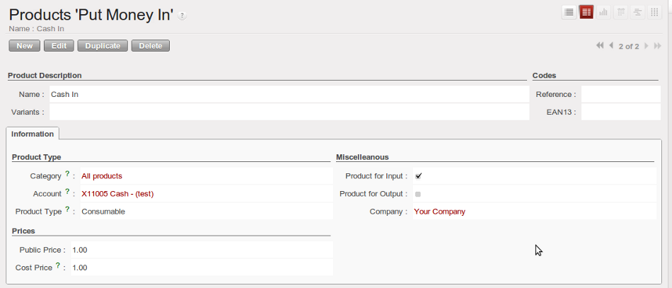
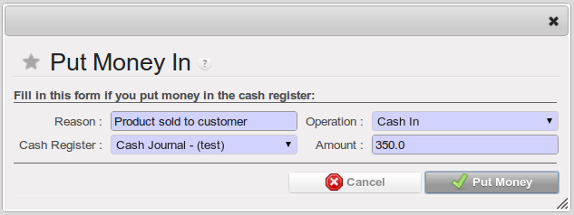

Point of Sale
=============

You can manage your daily sales and account transactions using point_of_sale module. 

  *This module provides fast and easy way to manage sales orders. You can end your orders in a faster way. There are different ways of making payments and to split them between different payment modes. Computation of amount of money and creation and confirmation of the pickings are done automatically. Invoices are being generated automatically. Allows to refund old sales orders.*

The configuration wizard to install this module is shown below:

   *Configuration wizard to install point_of_sale module*

Daily sales of products, picking and delivery of the products and invoicing are the main features that is provided by this module. In and out of the cash is being maintained using Cash Registers. Each cash register is created based on the Cash / Bank Journals so it will make easier to create journal entries and thus we can keep track of all accounting entries in appropriate accounts.

Opening and Closing of Cash Registers
-------------------------------------

Using the menu *Point of Sale ‣ Cash Register Management ‣ Open Cash Registers*, we can open the cash registers for daily sales.

.. figure:: images/2_open_cash_registers.png
   :scale: 75
   :align: center

   *Wizard to open cash registers*

To see all opened cash registers you can browse to *Point of Sale ‣ Cash Register Management ‣ List of Cash Registers*.

   *List of open cash registers*

Cash registers are used at the time of making payment from a sale order. Amount of money is being transferred to the particular journal and accounts through the cash registers.

When all the transactions are over at the end of the day we close these registers using the wizard from *Point of Sale ‣ Cash Register Management ‣ Close Cash Register*. It checks the starting and ending balance of the register and if they are equal it will close it.

   *Wizard to close cash registers*

You will get the list of closed cash registers at the end of the wizard.

Making sale orders
------------------

To make a sale order you can go to *Point of Sale ‣ Daily Operations ‣ New Sale Order*. It will open a form view and there you can fill up the sale order information. Following is the form view of sale order.

   *POS order form view*

You can fill up the following information on your sale order:
 - **Order Ref** : Reference of sale order generated using sequence
 - **Order lines** : Fill up the necessary information for product, quantity and discount
  
There are other extra information which you would like to fill up then you can go to Extra Info tab and configure the appropriate values.

.. figure:: images/7_pos_extra_info_tab.png
   :scale: 75
   :align: center

   *POS order form to fill up extra info*

You can configure the following information here:
 - **Shop** : Name of shop from where the products are being sold
 - **Connected Salesman** : The person who is making the sale order
 - **Pricelist** : Pricelist to be applied on the sale order
 - **Journal** : A journal to record the accounting transactions, preferrebly Sales Journal
 - **Picking** : A delivery order automatically gets attached once the payment is done

Making payment
--------------

Now after filling up all the necessary information you can save your sale order. Then you can click on the ``Payment`` button. It will open a wizard, there you can select the particular journal and payment amount. You can see it as following:

   *Payment wizard*

After the wizard finishes you will get a payment receipt in a printed form which consists of the pos order and payment mode information.

This wizard will also generate a picking and a journal entry for the sale order. You can see that the delivery order is in ``Done`` state as following:

   *Delivery order after making payment of sale order*

There are two ways to generate journal entries for the sale order. One is you can use the button ``Post Entries`` on the ``Extra Info`` tab on Sale Order form view. And second way is to use the wizard on *Point of Sale ‣ Cash Register Management ‣ Post Journal Entries*. To use this functionality you have to first close all cash registers.

Put money in / Take money out
-----------------------------

It is possible that you need to transfer only some cash into cash register without making a sale order. For that first you need to define such products which can be used for the money transaction purpose only. You can browse to *Point of Sale ‣ Configuration ‣ Products 'Put Money In'* and *Point of Sale ‣ Configuration ‣ Products 'Take Money Out'* for recording the income and expense respectively.

You can create a product for direct cash transactions by selecting it as an Input product as depicted in the following figure:

   *Product form for making it as an input product*

You must select the check box ``Product for Input`` on this form. Other information are same as the normal product. To make the product for expenses using *Point of Sale ‣ Configuration ‣ Products 'Take Money Out'* you can create a product and there you must select the other check box ``Product for Output``.

Now you can use this products for making the cash transactions. For this use the menu *Point of Sale ‣ Daily Operations ‣ Put Money In*. You will get the following wizard shown in the figure.

   *Put Money In wizard*

You can fill up the following information:
 - **Reason** : A reason to put the money into cash register
 - **Operation** : Select a value which is basically your product for input
 - **Cash Register** : A cash register to make money transaction
 - **Amount** : Amount to be put into the register

When you need to take money from a cash register you can go to *Point of Sale ‣ Daily Operations ‣Take Money Out*, you will get the same wizard as above you can fill up the information and then the entry will be made in the selected cash register with negative amount which depicts that you have taken the money.

Cash register entries
---------------------

You can view your cash registers from the menu *Point of Sale ‣ Cash Register Management ‣ List of Cash Register*. Following figure shows the form view of a cash register with some transaction entries.

.. figure:: images/8_cash_register.png
   :scale: 75
   :align: center

   *Cash register form view*

All the transaction entries of a sale order after making payment or using the Put money in and Take money out wizards can be seen on the cash register on Statement lines.

.. Copyright © Open Object Press. All rights reserved.

.. You may take electronic copy of this publication and distribute it if you don't
.. change the content. You can also print a copy to be read by yourself only.

.. We have contracts with different publishers in different countries to sell and
.. distribute paper or electronic based versions of this book (translated or not)
.. in bookstores. This helps to distribute and promote the OpenERP product. It
.. also helps us to create incentives to pay contributors and authors using author
.. rights of these sales.

.. Due to this, grants to translate, modify or sell this book are strictly
.. forbidden, unless Tiny SPRL (representing Open Object Press) gives you a
.. written authorisation for this.

.. Many of the designations used by manufacturers and suppliers to distinguish their
.. products are claimed as trademarks. Where those designations appear in this book,
.. and Open Object Press was aware of a trademark claim, the designations have been
.. printed in initial capitals.

.. While every precaution has been taken in the preparation of this book, the publisher
.. and the authors assume no responsibility for errors or omissions, or for damages
.. resulting from the use of the information contained herein.

.. Published by Open Object Press, Grand Rosière, Belgium
