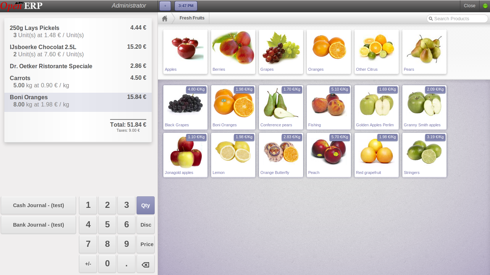
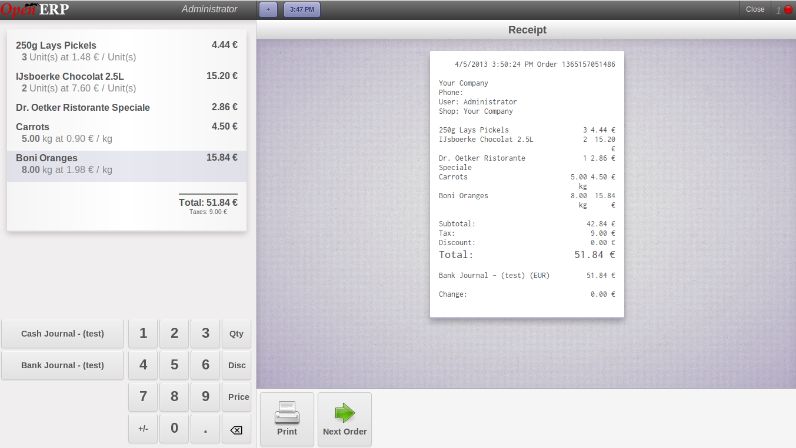

Point of Sale
=============

You can manage your retail business and its account transactions using point_of_sale module. 

  *This module provides fast and easy way to manage sales orders. It allows you to manage your shop sales very easily with a fully web based touchscreen interface. The primary function of point-of-sale is to make transactions easy to manage without sacrificing quick, efficient service or customer data. There are different ways of making payments and to split them between different payment modes. Computation of amount of money and creation and confirmation of the pickings are done automatically.*

You can click on *Install* button given below the Point of Sales on the home page to install this module:

   *Home page to install point_of_sale module*

The point of sale provides maximum efficiency, with all retail transactions conducted. Since the point-of-sale application is parameter-driven, you determine what, if any, information, you must enter to begin an order. For most businesses with a point-of-sale operation, a cash sale is the most common type of transaction. Depending on the way you set up your parameters, the Cash Sale Customer will be displayed and the paycode will default to cash.

Daily sales of products, picking and delivery of the products and invoicing are the main features that is provided by this module. In and out of the cash is being maintained using Cash Registers. Each cash register is created based on the Cash / Bank Journals so it will make easier to create journal entries and thus we can keep track of all accounting entries in appropriate accounts.

Generate Sale Orders
--------------------

For any retail business, the process flow of point of sale starts by making the sales orders. To start point of sale touchscreen application you can click on *Point of Sale ‣ Daily Operations ‣ Your Session*. And click button **New Session**.
It will open the following screen:

   *POS order view*

There are three steps to make a complete sale order:
  - Select products, quantity, discount, etc.
  - Make payment with or without selecting cash registers.
  - Print receipt of the payment.

There are thumbnails of Products on the right side of the screen. You can click on the product you are selling and that product will be added in your list which you can see on the up left corner of the screen.

You can use the combinations of numbers with Qty, Disc and Price. If you want to add quantity then first you need to click on **Qty** button and press the numbers to enter the quantity. Same goes with **Disc** and **Price** buttons. You can see it in the following screen:

   *Making a sale order by selecting products*

Making Payment
--------------

You need to make payment to complete a sale order. In OpenERP we provide you certain payment modes using which you can pay for your sale order.

After finishing your order you can click on any of the Cash registers listed on the left side. This will open a new screen which will display the total amount to be paid and selected register name. You can see it in the following figure:

   *Payment of sale order*

There will be a **Validate** button on the screen. When you click on it a new screen will appear which consists of a payment receipt of the sale order. 

Payment Receipt
---------------

After you validate your sale order you will get a payment receipt and two button will appear **Next Order** and **Print**, You can see it in the following screen:

   *Payment receipt*
   
If you click on print , you will find printed receipt as following figure, 

   *Printed Payment receipt*   

.. Copyright © Open Object Press. All rights reserved.

.. You may take electronic copy of this publication and distribute it if you don't
.. change the content. You can also print a copy to be read by yourself only.

.. We have contracts with different publishers in different countries to sell and
.. distribute paper or electronic based versions of this book (translated or not)
.. in bookstores. This helps to distribute and promote the OpenERP product. It
.. also helps us to create incentives to pay contributors and authors using author
.. rights of these sales.

.. Due to this, grants to translate, modify or sell this book are strictly
.. forbidden, unless Tiny SPRL (representing Open Object Press) gives you a
.. written authorisation for this.

.. Many of the designations used by manufacturers and suppliers to distinguish their
.. products are claimed as trademarks. Where those designations appear in this book,
.. and Open Object Press was aware of a trademark claim, the designations have been
.. printed in initial capitals.

.. While every precaution has been taken in the preparation of this book, the publisher
.. and the authors assume no responsibility for errors or omissions, or for damages
.. resulting from the use of the information contained herein.

.. Published by Open Object Press, Grand Rosière, Belgium
