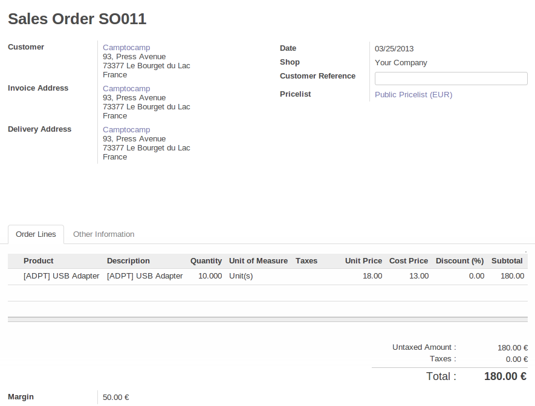
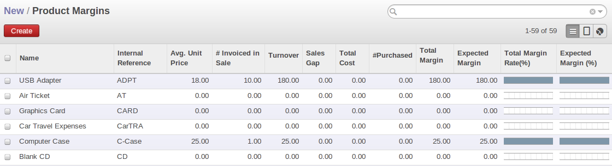
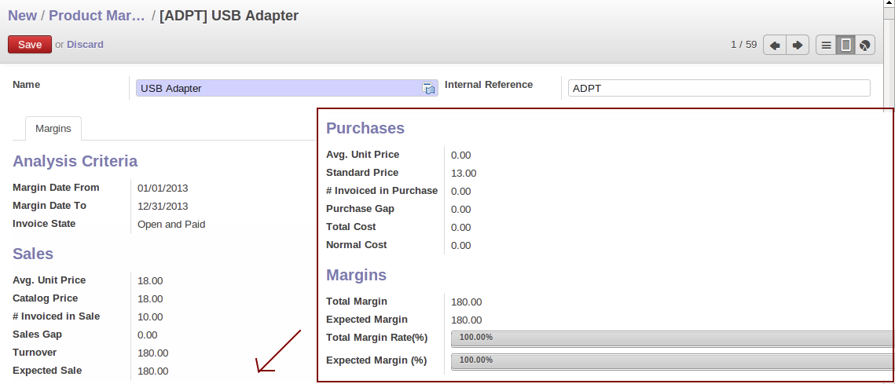

Keep Track of your Margins
==========================

It is important to keep good control of margins in every company. Even if you have a good level of
sales, it will not guarantee company profitability if margins are not high enough. OpenERP provides a
number of systems for monitoring margins. The main ones are:

* Margins on a sales order,

* Margins by product,

* Margins by project,

* Using pricelists.

Margins on Sales Orders
-----------------------

.. index::
   single: module; sale_margin

If you want to check your margins on sales orders, you can install the :mod:`sale_margin` module
by selecting :guilabel:`Margins in Sales Orders` for installation in the :guilabel:`Reconfigure` wizard.
This will add margins calculated on each order line and on the order total.

   *An order with the module sale_margin*

The margin on each line is defined as the quantity sold multiplied by the sale price for the
customer less the cost price of the products. By default, products are managed using standard price
in OpenERP (cost price fixed manually and reviewed once per year). You can change that to
``Average Price``, meaning that the product cost fluctuates with purchases from
suppliers. After product receipt you can add fixed costs, such as delivery costs, in the cost of
each product.

.. index::
   single: module; product_extended

OpenERP supports a third method of updating the cost price of products.
This is through the button :guilabel:`Update` on the product form which lets you
automatically recalculate the cost price for the selected product. 
The cost price is calculated from the raw materials and the operations carried out 
(if the products have been manufactured internally, so that you have set their costs).

Margins by Product
------------------

.. index::
   single: module; product_margin

To track margins by product, install the module :mod:`product_margin`. Once the module
is installed you can see the margins by product by using the menu :menuselection:`Sales --> Products
--> Product Margins`.

When you have clicked on the menu, OpenERP asks for an analysis period and the state of invoices. If
no period is given, OpenERP will calculate margins on all of the operations without restriction. By
default, however, OpenERP proposes a period of the last 12 months for analysis.

You can also filter the analysis on certain types of invoice:

* All invoices, including draft invoices not yet validated,

* All open and/or paid invoices,

* Paid invoices only.

   *Screen showing product margins*

You then get a margin analysis table. The following fields are given by product for sales:

* :guilabel:`Avg. Unit Price` : the average unit sale price,

* :guilabel:`Catalog Price` : the list price based on this product,

* :guilabel:`# Invoiced` : the number of sold products that have been invoiced,

* :guilabel:`Sales Gap` : the difference between the revenue calculated from list price and volume, and the actual sales,

* :guilabel:`Turnover` : the actual sales revenue for the product selected,

* :guilabel:`Expected Sale` : the number of products sold multiplied by the list price.

   *Detail of margins for a given product*

The following fields are given by product for purchases:

* :guilabel:`Avg. Unit price` : the average unit purchase price,

* :guilabel:`Standard price` : the standard cost price of the product for the company,

* :guilabel:`# Invoiced` : the number of purchased products,

* :guilabel:`Purchase gap` : the difference between the total actual cost and the standard cost
  multiplied by the number of units purchased,

* :guilabel:`Total cost` : the total cost of purchases for the product under consideration,

* :guilabel:`Normal cost` : the number of products sold multiplied by the standard cost price.

The following fields are given by product for margins:

* :guilabel:`Total Margin`,

* :guilabel:`Expected Margin`,

* :guilabel:`Total Margin in percent`,

* :guilabel:`Expected Margin in percent`.

Margins by Project
------------------

To manage margins by project, you must install the analytical accounts with management by task. Use
of these accounts is described in :ref:`ch-accts`.

.. index::
   single: module; account_analytic_analysis

Install the module :mod:`account_analytic_analysis` and all of its dependencies. 
This module adds a tab on the analytic account form to handle the different margins in an analytic account 
representing a project or a case, and several new reports on those accounts.

.. figure:: images/account_analytic_analysis_form.png
   :scale: 75
   :align: center

   *Detail of margins for a case*

Start by opening a project's analytic account through
:menuselection:`Project --> Billing --> Overpassed Accounts`
and selecting one of them.
In the form's :guilabel:`Analysis summary` tab you will find the following information:

* The total costs for the analytic account,

* The total amount of invoiced sales,

* The number of hours worked,

* The number of hours remaining to be worked,

* The remaining income,

* The theoretical income (hours worked multiplied by their sale price),

* The number of hours invoiced,

* The real income per hour,

* The real margin,

* The theoretical margin taking into account everything yet to be invoiced,

* The real margin rate in percent,

* The last invoicing date,

* The last worked hours,

* The number of hours remaining to be invoiced,

* The amount remaining to be invoiced.

For detailed information on the analytic account you can use any of the several reports available in
the toolbar to the right.

.. Copyright © Open Object Press. All rights reserved.

.. You may take electronic copy of this publication and distribute it if you don't
.. change the content. You can also print a copy to be read by yourself only.

.. We have contracts with different publishers in different countries to sell and
.. distribute paper or electronic based versions of this book (translated or not)
.. in bookstores. This helps to distribute and promote the Open ERP product. It
.. also helps us to create incentives to pay contributors and authors using author
.. rights of these sales.

.. Due to this, grants to translate, modify or sell this book are strictly
.. forbidden, unless Tiny SPRL (representing Open Object Press) gives you a
.. written authorisation for this.

.. Many of the designations used by manufacturers and suppliers to distinguish their
.. products are claimed as trademarks. Where those designations appear in this book,
.. and Open Object Press was aware of a trademark claim, the designations have been
.. printed in initial capitals.

.. While every precaution has been taken in the preparation of this book, the publisher
.. and the authors assume no responsibility for errors or omissions, or for damages
.. resulting from the use of the information contained herein.

.. Published by Open Object Press, Grand Rosière, Belgium
